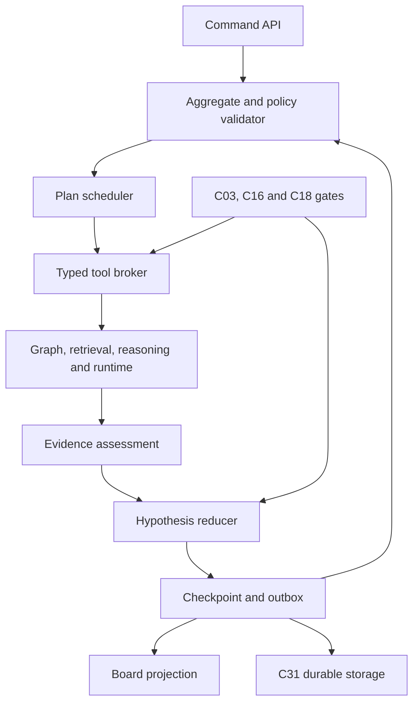
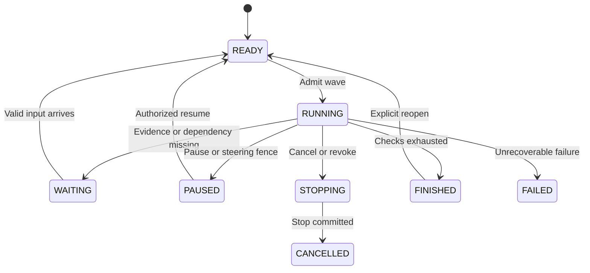

# C22 — Hypothesis and Agentic Investigation Engine

Detailed component design · v1.0 · 3 October 2026

**Status: proposed implementation design; not implemented or acceptance-verified.** This specification refines C22 in Code_Intelligence_Component_API_Contracts.md v1.1. It preserves the five existing APIs and shared entities through a compatibility projection, and proposes versioned extensions for implementation. It does not silently change the shared contract. Source requirements and their review statuses remain authoritative.

## 1 Outcome and component boundary

C22 maintains a durable investigation into a question such as “Why does checkout time out?” It records competing explanations, their assumptions, supporting and opposing evidence, unanswered questions and the next useful checks. It executes bounded read-only investigation steps, receives runtime evidence, supports steering and interruption, and produces an honest summary with remaining gaps.

Its central output is an **investigation state with an evidence trail**, not a free-text assertion of root cause. A supported mechanism is not automatically the cause of the observed incident. Several mechanisms can contribute simultaneously. A finished plan may leave the incident unresolved.

| C22 owns | Other component owns |
|---|---|
| Hypothesis identities, versions, relations and operational evaluation state | C18 claim truth/verdict history and provenance ledger |
| Investigation scope, DAG, next-step choice, leases and execution generations | C03 authority and egress; C14 provider calls and cost accounting |
| Discrimination questions and proposed experiment descriptions | C27 separately authorized isolated experiment execution |
| Evidence-to-hypothesis assessment records and coverage gaps | C09 facts; C10 retrieval; C24 runtime ingestion and attribution |
| Durable investigation events, checkpoints and completion assessment | C31 transaction/persistence; C13 workspace history and visual memory |
| Structured board data and change notifications | C19 representation compilation; C20 layout/rendering; C21 gestures |
| Candidate explanation/request validation | C15 grounded reasoning; C16 five display gates; C17 calibration |

C22 runs in the TypeScript core. Rust C05/C09 supply analysis and graph results through their existing core facade. C22 has no Rust code executor, arbitrary shell, repository write method or production fault-injection capability.

## 2 Operating modes

| Mode | What C22 may do | Completion meaning |
|---|---|---|
| Guided | Propose checks and explain evidence; user chooses next step | Summary of authorized reviewed material |
| Bounded automatic | Run allowlisted read tools within declared scope and budgets | Bounded investigation completed, with coverage and gaps |
| Live refinement | Incorporate new attributed runtime evidence in a fixed or versioned incident window | Hypotheses remain revisable; closure is explicit |

Mode, tool policy, maximum steps, budget, stop conditions, repository revisions and runtime scope are visible before automatic advancement. Automatic investigation never expands repository access from a user’s natural-language instruction. New scope is validated by C03 and committed as a versioned change.

### Invariants

1. Every assessment references a hypothesis version, evidence version and investigation snapshot.
2. Model output can propose explanations and evidence interpretations, but cannot issue authority grants, tool IDs, verified verdicts or publication receipts.
3. Evidence absence is not contradiction without an explicit coverage/completeness certificate.
4. Repeated descriptions of one source are not independent confirmations.
5. Contradictory evidence is preserved; a preferred hypothesis does not hide alternatives.
6. Evidence introduced by a hypothesis cannot then serve as independent evidence for that same hypothesis.
7. C16 decides hypothesis display eligibility. C18 decides recorded verdict meaning. C22 neither bypasses either component nor relabels inferred edges as observed.
8. All dispatched work is revision-bound, permission-bound, deadline-bound and generation-bound.
9. Cancellation/steering/revocation fences publication, even if an unavoidable read/provider request finishes later.
10. Durable commit precedes board publication; views preserve user camera and selection.
11. Finished execution and resolved question are separate statuses.
12. A closed investigation cannot resume from a late event; explicit reopen creates a new generation.

## 3 Internal architecture



| Module | Inputs → outputs | Principal responsibility |
|---|---|---|
| InvestigationService | Commands → receipts/read models | Trusted context, schema validation, version conflicts |
| ScopeManager | Goal, revisions, capability → scope snapshot | Explicit bounds and scope amendments |
| SeedBuilder | Symptom, facts, observations → candidate drafts | Diverse candidate explanations with discriminating predictions |
| HypothesisRegistry | Candidate drafts → versioned hypothesis identities | Duplicate review, refinement, supersession and relations |
| EvidenceAssessor | Evidence + hypothesis version → assessment proposals | Relevance, independence, contradiction and missing coverage |
| HypothesisReducer | Committed assessments/verdicts → evaluation state | Deterministic state projection with reason codes |
| DiscriminationPlanner | Alternatives + gaps → read-check DAG | Checks that can distinguish alternatives |
| ToolBroker | Registered tool request → scoped result descriptor | Allowlist, schema, resource budget and authority |
| ExecutionController | Ready steps → durable attempts | Leases, cancellation, retries and restart reconciliation |
| RuntimeRefiner | Attributed batches → reassessment commands | Window/deployment validation and event coalescing |
| CompletionEvaluator | Snapshot + stopping rule → report | Coverage, resolved/unresolved and concrete next actions |
| BoardProjector | Committed state → board snapshot/delta | Evidence links and stable visual identities |
| PersistenceAdapter | Typed mutations → receipt/outbox | C31 transaction boundary |

## 4 Domain model and shared-type compatibility

Existing shared types remain imports: Id, Hash, Timestamp, RevisionRef, EntityRef, EvidenceRef, Budget, TaskFrame, Finding, ClaimDraft, Verdict, GateReport, AnalysisBatch, InvestigationPlan, Hypothesis, Job, ApiResult and CallContext. They retain their existing meanings. New DTOs below use a registered `c22.v2` schema family; all field names are camelCase on the wire.

Ids below are branded aliases of Id (InvestigationId, HypothesisId, StepId, AttemptId, CheckId, ObservationId, AssessmentId, ExperimentId, CapabilityId and PolicyId). Versions/sequences are nonnegative safe JSON integers. Scores are finite numbers; timestamps are UTC. Free text is bounded and treated as untrusted data. Lists have policy limits.

```typescript
InvestigationSnapshot {
  id: InvestigationId; workspaceId: Id; version: Int; generation: Int;
  eventSequence: Int; goal: TaskFrame; mode: InvestigationMode;
  scope: InvestigationScope; execution: ExecutionState;
  closure: InvestigationClosure;
  disposition: QuestionDisposition; hypothesisIds: List<HypothesisId>;
  stepIds: List<StepId>; budget: InvestigationBudget;
  policy: InvestigationPolicy; coverage: CoverageReport;
  lastCheckpointId: Id; createdAt: Timestamp; updatedAt: Timestamp;
}
InvestigationScope {
  revision: RevisionRef; roots: List<EntityRef>;
  permittedRepositories: List<Id>; // v2 initial implementation: exactly one
  deploymentIds: List<Id>; incidentWindow: Option<TimeWindow>;
  allowedTools: List<ToolId>; allowedSourceKinds: List<SourceKind>;
  maxGraphDepth: Int; maxGraphNodes: Int; authorityEpoch: Int;
  capabilityId: CapabilityId; scopeHash: Hash;
}
InvestigationBudget {
  limit: Budget; consumed: Usage; reserved: Usage;
  maxReadBytes: Int; readBytesUsed: Int; maxRuntimeRows: Int;
  runtimeRowsUsed: Int; maxConcurrentSteps: Int;
}
Usage { tokens: Int; cost: Decimal; toolSteps: Int }
InvestigationPolicy {
  id: PolicyId; version: Int; evaluationRuleVersion: Int;
  maxActiveHypotheses: Int; maxPlanSteps: Int; maxAssessmentsPerBatch: Int;
  maxRetriesPerStep: Int; readTimeoutMs: Int; leaseDurationMs: Int;
  maximumModelCalls: Int; allowAutomaticAdvance: Bool;
  completionRule: CompletionRule; dedupRuleVersion: Int;
}
HypothesisRecord {
  id: HypothesisId; investigationId: InvestigationId; version: Int;
  claimId: Id; statement: String; mechanism: List<MechanismLink>;
  scopeHash: Hash; origin: HypothesisOrigin; assumptions: List<Assumption>;
  predictions: List<Prediction>; alternativeRelations: List<HypothesisRelation>;
  lifecycle: HypothesisLifecycle; evaluation: HypothesisEvaluation;
  assessmentIds: List<AssessmentId>; experimentIds: List<ExperimentId>;
  parentVersion: Option<Int>; supersedesId: Option<HypothesisId>;
  createdAt: Timestamp; updatedAt: Timestamp;
}
MechanismLink {
  from: MechanismEndpoint; to: MechanismEndpoint;
  relation: MechanismRelation; claimId: Id; evidenceIds: List<Id>;
}
MechanismEndpoint = EntityEndpoint { ref: EntityRef }
                  | ObservationEndpoint { observationId: ObservationId }
                  | HypothesisEndpoint { hypothesisId: HypothesisId }
Assumption {
  id: Id; statement: String; entityRefs: List<EntityRef>;
  verification: AssumptionStatus; evidenceIds: List<Id>;
}
Prediction {
  id: Id; description: String; checkId: CheckId;
  outcomeIfTrue: List<OutcomeTag>; outcomeIfFalse: List<OutcomeTag>;
  distinguishingHypothesisIds: List<HypothesisId>;
  essentialForHypothesis: Bool;
}
HypothesisRelation {
  otherId: HypothesisId; kind: HypothesisRelationKind;
  basisClaimId: Id; // mutual exclusion is a supported assertion, never assumed
}
HypothesisEvaluation {
  state: EvaluationState; freshness: Freshness;
  supportingAssessmentIds: List<AssessmentId>;
  contradictingAssessmentIds: List<AssessmentId>;
  unresolvedGapIds: List<Id>; gateReportId: Option<Id>;
  verdictIds: List<Id>; reasonCodes: List<EvaluationReason>;
  calibration: CalibrationLabel; rank: PriorityBreakdown;
}
CalibrationLabel = Uncalibrated { reason: String }
                 | Calibrated { evaluationId: Id; classId: Id;
                     probability: Float; lower: Float; upper: Float }
PriorityBreakdown {
  investigationPriority: Float; impact: Float; relevance: Float;
  discriminability: Float; evidenceQuality: Float; reasons: List<String>;
}
Observation {
  id: ObservationId; investigationId: InvestigationId;
  evidenceRefs: List<EvidenceRef>; kind: ObservationKind;
  description: String; revision: Option<RevisionRef>;
  deploymentId: Option<Id>; window: Option<TimeWindow>;
  sourceEventIds: List<Id>; correlationGroupId: Id;
  attributionId: Option<Id>; quality: EvidenceQuality;
}
EvidenceQuality {
  completeness: Completeness; sampling: SamplingStatus;
  clockUncertaintyMs: Option<Int>; collectionErrors: List<String>;
  certificateId: Option<Id>;
}
EvidenceAssessment {
  id: AssessmentId; hypothesisId: HypothesisId; hypothesisVersion: Int;
  observationId: ObservationId; relation: EvidenceRelation;
  predictionId: Option<Id>; claimId: Id; gateReportId: Id;
  correlationGroupId: Id; snapshotHash: Hash; scopeHash: Hash;
  accepted: Bool; reasonCodes: List<String>; createdAt: Timestamp;
}
CoverageCertificate {
  id: Id; sourceId: Id; revision: Option<RevisionRef>;
  deploymentId: Option<Id>; window: Option<TimeWindow>;
  queryHash: Hash; exhaustiveForPredicate: Bool;
  predicateSchemaId: Id; sampling: SamplingStatus;
  exclusions: List<String>; issuerAdapterId: Id; adapterVersion: String;
}
DiscriminatingCheck {
  id: CheckId; description: String; hypothesisIds: List<HypothesisId>;
  toolId: ToolId; request: RegisteredToolRequest;
  outcomes: List<CheckOutcomeRule>; requiredCoverage: CoverageRequirement;
  expectedCost: Usage; dependencies: List<CheckId>;
  value: CheckValue; executionClass: ExecutionClass;
}
CheckOutcomeRule {
  outcome: OutcomeTag; description: String;
  supports: List<HypothesisId>; contradicts: List<HypothesisId>;
  requiredPredictionIds: List<Id>; ruleSchemaId: Id;
}
CoverageRequirement {
  requiresExhaustivePredicate: Bool; minimumObservationCount: Int;
  requiredRevision: RevisionRef; requiredDeploymentIds: List<Id>;
}
CheckValue {
  partitionQuality: Float; gapReduction: Float; incidentRelevance: Float;
  estimatedLatencyMs: Int; estimatedReadBytes: Int; score: Float;
  method: CheckSelectionMethod;
}
StepRecord {
  id: StepId; investigationId: InvestigationId; version: Int;
  checkId: Option<CheckId>; toolId: ToolId;
  request: RegisteredToolRequest; dependsOn: List<StepId>;
  state: StepState; generation: Int; attemptIds: List<AttemptId>;
  resultHandle: Option<Id>; resultHash: Option<Hash>;
  unavailableReason: Option<String>;
}
RegisteredToolRequest { schemaId: Id; version: Int; payload: JsonValue }
// Every schemaId is bound to a specific tool; arbitrary JSON is never executed.
StepAttempt {
  id: AttemptId; stepId: StepId; generation: Int; attemptNumber: Int;
  state: AttemptState; leaseOwner: Id; leaseExpiresAt: Timestamp;
  dispatchId: Id; requestHash: Hash; scopeHash: Hash;
  budgetReservationId: Id; startedAt: Timestamp;
  finishedAt: Option<Timestamp>; resultHandle: Option<Id>;
  error: Option<InvestigationError>;
}
ExperimentProposal {
  id: ExperimentId; investigationId: InvestigationId;
  hypothesisIds: List<HypothesisId>; description: String;
  predictedOutcomes: List<CheckOutcomeRule>;
  requiredEnvironment: String; requiredPermissions: List<String>;
  executionClass: ExecutionClass; state: ExperimentState;
  scenarioId: Option<Id>; evidenceIds: List<Id>;
}
EvidenceGap {
  id: Id; description: String; hypothesisIds: List<HypothesisId>;
  material: Bool; reason: GapReason; suggestedCheckIds: List<CheckId>;
}
CoverageReport {
  inspectedEntityIds: List<Id>; excludedEntityIds: List<Id>;
  attemptedCheckIds: List<CheckId>; missing: List<EvidenceGap>;
  completeness: Completeness; scopeHash: Hash;
}
CompletionReport {
  investigationId: InvestigationId; version: Int;
  execution: ExecutionState; disposition: QuestionDisposition;
  supportedHypothesisIds: List<HypothesisId>;
  refutedHypothesisIds: List<HypothesisId>;
  unresolvedHypothesisIds: List<HypothesisId>;
  findings: List<Finding>; coverage: CoverageReport;
  stopReason: StopReason; nextActions: List<DiscriminatingCheck>;
  conclusionClaimIds: List<Id>; generatedAt: Timestamp;
}
```

### Closed enums

```typescript
InvestigationClosure = OPEN | FINALIZED
InvestigationMode = GUIDED | BOUNDED_AUTOMATIC | LIVE_REFINEMENT
ExecutionState = CREATED | READY | RUNNING | WAITING | PAUSED | STOPPING
               | CANCELLED | FINISHED | FAILED
QuestionDisposition = UNASSESSED | EXPLAINED_WITH_LIMITS | UNRESOLVED
                    | USER_CLOSED | STALE
HypothesisOrigin = USER | MODEL | RULE | IMPORTED
HypothesisLifecycle = ACTIVE | SUPERSEDED | RETIRED
EvaluationState = OPEN | SUPPORTED | REFUTED | CONTESTED | UNRESOLVED
Freshness = CURRENT | STALE | ACCESS_RESTRICTED
AssumptionStatus = UNCHECKED | EVIDENCED | CONTRADICTED | UNKNOWN
EvidenceRelation = SUPPORTS | CONTRADICTS | NEUTRAL | INCONCLUSIVE
HypothesisRelationKind = COMPETES_WITH | CAN_COEXIST | REFINES
                       | MUTUALLY_EXCLUSIVE | DEPENDS_ON
MechanismRelation = CALLS | WAITS_FOR | PRECEDES | CONTRIBUTES_TO | CAUSES_CANDIDATE
ObservationKind = SOURCE_FACT | RUNTIME_SIGNAL | TEST_RESULT | USER_REPORT
SamplingStatus = NONE | SAMPLED | UNKNOWN
StepState = PENDING | READY | RUNNING | SUCCEEDED | FAILED | BLOCKED
          | CANCELLED | SUPERSEDED
AttemptState = RESERVED | DISPATCHED | SUCCEEDED | FAILED | ABANDONED | CANCELLED
ExecutionClass = READ_ONLY | ISOLATED_EXPERIMENT_PROPOSAL | PROHIBITED
ExperimentState = PROPOSED | REQUESTED | RUNNING_EXTERNAL | EVIDENCE_RECEIVED
                | REJECTED | CANCELLED
SourceKind = CODE | CONFIG | DOCUMENT | RUNTIME | TEST | HISTORY
CheckSelectionMethod = DETERMINISTIC_HEURISTIC | CALIBRATED_EXPECTED_GAIN
EvaluationReason = GROUNDED_SUPPORT | ESSENTIAL_PREDICTION_CONTRADICTED
                 | MIXED_EVIDENCE | INCOMPLETE_COVERAGE | CORRELATED_SOURCES
                 | UNVERIFIED_ASSUMPTION | HUMAN_VERDICT | STALE_SNAPSHOT
GapReason = NOT_INDEXED | NO_ACCESS | NO_TELEMETRY | INCOMPLETE_SAMPLING
          | UNRESOLVED_SYMBOL | ADAPTER_UNAVAILABLE | BUDGET_LIMIT | AMBIGUOUS_SCOPE
OutcomeTag = PRESENT | ABSENT_WITH_COVERAGE | NOT_OBSERVED | UNKNOWN
           | MATCH | MISMATCH | ERROR
StopReason = CHECKS_COMPLETED | NO_READY_CHECK | BUDGET_EXHAUSTED | DEADLINE
           | USER_STOP | ACCESS_REVOKED | POLICY_FAILURE
CompletionRule = EXHAUST_READY_CHECKS | EXPLAIN_SYMPTOM_WITH_COVERAGE | USER_REVIEW
```

`TimeWindow`, `Completeness`, `JsonValue`, `Decimal`, ToolId and existing enums are imported shared types. InvestigationError contains shared ErrorCode, message: String, retryable: Bool, safeDiagnostics: List<Diagnostic>, currentVersion: Option<Int> and retryAfterMs: Option<Int>; the latter two are optional. Unknown enums/schema versions fail validation rather than default to a safe-looking status.

### Compatibility projection

| Existing shared object | v2 projection |
|---|---|
| Hypothesis.id/workspaceId/claimId | Stable identity, parent workspace and C18 claim reference |
| Hypothesis.state | CONTESTED → UNRESOLVED; freshness shown separately in v2; other matching states map directly |
| discriminatingEvidenceIds | Evidence IDs from accepted assessments, not assessment IDs |
| proposedExperimentIds | ExperimentProposal IDs |
| InvestigationPlan.scope/maxSteps/remainingBudget | Scope roots, policy ceiling and remaining unreserved allowance |
| InvestigationPlan.steps | PlanStep DTOs projected from StepRecord with legacy state mapping |
| PlanState | CREATED/READY → READY; WAITING/PAUSED/STOPPING → BLOCKED; FAILED → BLOCKED with diagnostics; FINISHED/CANCELLED map directly |

Compatibility projections lose information. New clients must request v2 read models for contested, stale, paused and failed distinctions. Claiming the old enum fully represents these states would be incorrect. Changes to hypothesis statement or essential prediction create a new version and invalidate prior assessments until reassessed.

## 5 Public APIs and command semantics

Every operation uses `CallContext` and `ApiResult<T>`. The trusted dispatcher supplies identity, tenant, trace, deadline, cancellation and idempotency context. Mutations compare expected aggregate version and append events through C31. Reads return authorized filtered state; a client cannot recover restricted history via events or a previous checkpoint.

### Existing five APIs, preserved

```typescript
start(ctx, { workspaceId: Id; goal: TaskFrame }): ApiResult<InvestigationPlan>
advance(ctx, { planId: Id; expectedVersion: Int }): ApiResult<Job<InvestigationPlan>>
steer(ctx, { planId: Id; instruction: String; expectedVersion: Int }): ApiResult<InvestigationPlan>
interrupt(ctx, { planId: Id; expectedVersion: Int }): ApiResult<CommitReceipt>
conclude(ctx, { planId: Id }): ApiResult<List<Finding>>
```

`start` creates a durable READY plan and seed step; it does not synchronously finish model seeding. `advance` schedules at most one bounded execution wave per accepted command. `interrupt` stops dispatch, persists a generation fence and returns the receipt; unavoidable in-flight reads may still terminate privately. Legacy `conclude` is a summary read: it does not silently close or finalize the investigation. Legacy `steer` stores the instruction and a clarification/replanning step; it cannot apply an ambiguous scope change without a validated typed steering action.

### Proposed v2 API catalogue

All return types are wrapped in Promise<ApiResult<T>> in the implementation. `Expected` below means `{ investigationId: Id; expectedVersion: Int }`.

| API | Typed request | Result value | Effect |
|---|---|---|---|
| create | workspaceId, goal: TaskFrame, mode, policyId | InvestigationSnapshot | Create scoped durable aggregate; no model call required |
| get | investigationId | InvestigationSnapshot | Authorized current snapshot |
| list | workspaceId, cursor: Option<Id>, limit: Int | InvestigationPage | Bounded authorized list |
| seed | Expected, evidenceIds: List<Id> | Job<InvestigationSnapshot> | Schedule grounded candidate generation |
| proposeHypothesis | Expected, draft: HypothesisDraft | HypothesisRecord | Validate and register a user/rule/model candidate |
| reviseHypothesis | Expected, hypothesisId, expectedHypothesisVersion, draft | HypothesisRecord | New version, explicit reassessment |
| retireHypothesis | Expected, hypothesisId, reason: String | CommandReceipt | Remove from active competition; preserve history |
| proposeChecks | Expected, hypothesisIds: List<Id> | Job<List<DiscriminatingCheck>> | Generate/validate bounded discriminating checks |
| advanceV2 | Expected, maximumStepsThisWave: Int | Job<InvestigationSnapshot> | Admit and execute bounded ready steps |
| attachEvidence | Expected, observation: ObservationInput | EvidenceReceipt | Authorize C18 evidence IDs; persist then schedule assessment |
| applyRuntimeBatch | Expected, batch: RuntimeEvidenceBatch | EvidenceReceipt | Privileged attributed runtime batch intake |
| reassess | Expected, hypothesisIds: List<Id> | Job<InvestigationSnapshot> | Reevaluate affected evidence/scope only |
| steerV2 | Expected, action: SteeringAction | SteeringResult | Fence affected attempts, validate and amend plan |
| pause | Expected, reason: String | CommandReceipt | Pause and fence dispatch; resumable |
| resume | Expected | InvestigationSnapshot | Fresh authorization and new generation |
| cancel | Expected, reason: String | CommandReceipt | Durable terminal cancellation |
| getCompletion | investigationId | CompletionReport | Honest snapshot-specific assessment; no mutation |
| finalize | Expected, completionReportVersion: Int | CompletionReport | Stop future work, commit report; may conclude unresolved |
| reopen | Expected, goalAmendment: Option<TaskFrame> | InvestigationSnapshot | New generation, explicit reassessment |
| proposeExperiment | Expected, proposal: ExperimentDraft | ExperimentProposal | Persist proposal only; no runner dispatch |
| requestExperiment | Expected, experimentId, authorizationGrantId | Job<ExperimentProposal> | Optional later privileged C27 dispatch, separately authorized |
| getBoard | investigationId, knownVersion: Option<Int> | BoardReply | Full snapshot or compatible delta |
| readEvents | investigationId, afterSequence: Int, limit: Int | EventPage | Scoped durable replay; sanitized by current authority |

```typescript
HypothesisDraft {
  statement: String; mechanism: List<MechanismLink>;
  assumptions: List<Assumption>; predictions: List<Prediction>;
  basisEvidenceIds: List<Id>; alternativeRelations: List<HypothesisRelation>;
}
ObservationInput {
  evidenceIds: List<Id>; description: String;
  predictionId: Option<Id>; sourceEventId: Id;
}
RuntimeEvidenceBatch {
  envelopeIds: List<Id>; attributionIds: List<Id>;
  sourceEventIds: List<Id>; sourceWatermark: Id;
}
SteeringAction = Prioritize { hypothesisId: Id }
               | AddScope { refs: List<EntityRef> }
               | NarrowScope { refs: List<EntityRef> }
               | ChangeWindow { window: TimeWindow }
               | ChangeGoal { goal: TaskFrame }
               | ExcludeCheck { checkId: Id; reason: String }
               | SetMode { mode: InvestigationMode }
SteeringResult {
  snapshot: InvestigationSnapshot; invalidatedAttemptIds: List<Id>;
  clarification: Option<String>;
}
CommandReceipt { commit: CommitReceipt; investigationVersion: Int; eventSequence: Int }
EvidenceReceipt {
  receipt: CommandReceipt; observationIds: List<Id>;
  scheduledAssessmentStepIds: List<Id>; rejectedEvidenceIds: List<Id>;
}
InvestigationPage { items: List<InvestigationSnapshot>; nextCursor: Option<Id> }
EventPage { items: List<InvestigationEvent>; nextSequence: Int; replayRequired: Bool }
ExperimentDraft {
  description: String; hypothesisIds: List<Id>;
  predictedOutcomes: List<CheckOutcomeRule>; requiredEnvironment: String;
  requiredPermissions: List<String>; scenarioId: Option<Id>;
}
```

`attachEvidence` returns committed intake, not a claim that assessment already completed. Denied evidence is reported only with safe caller-known references; response must not disclose newly discovered denied IDs. Runtime intake is internal-only. `requestExperiment` is absent from the initial allowlist; a visible proposal is never sufficient authorization to execute it.

## 6 Hypothesis evaluation and ranking

### Hypothesis construction

Each candidate must contain an explainable statement, a mechanism connecting the symptom to authorized entities, explicit assumptions, at least one checkable prediction or an explicit “not yet testable” gap, supporting basis and an alternative explanation. Validate every entity/evidence ID against the current scope. New explanations may be semantically similar; dedup proposes a merge/refinement, preserving distinct predictions and provenance until reviewed.

A user can propose an unevidenced hypothesis, but it must reference the permitted symptom/context that motivated it and be rendered only as a clearly labeled hypothesis if C16 permits that contract. It cannot appear as a factual assertion. Repository comments and retrieved documents are untrusted evidence, never instructions to the scheduler.

### Deterministic evaluation rules

| Evidence condition | Evaluation result | Guard |
|---|---|---|
| No accepted evidence | OPEN | Record missing evidence and testability gaps |
| Grounded supporting evidence with no material contradiction | SUPPORTED | Required assumptions checked; gate eligibility recorded; scope-specific support only |
| Essential prediction contradicted by valid evidence | REFUTED | Valid coverage, same context and no unresolved interpretation dispute |
| Both material support and contradiction remain valid | CONTESTED | Preserve both; investigate context differences or composite explanation |
| Checks exhausted, inconclusive or coverage missing | UNRESOLVED | Explicit gap reasons; not a synonym for refuted |
| Revision/source/authority changes | Keep history, mark STALE/ACCESS_RESTRICTED | Block current conclusions until reauthorization/reassessment |

No universal “two sources means confirmed” rule applies to hypotheses. Specific alarm-policy obligations in C16 remain separate. A human verdict is recorded through C18 with attribution; it does not convert observed correlation into scientific proof. It can close the user’s investigation while the evidence remains disputed. Unproven assumptions cannot be filled by confident prose.

Priority ordering is for investigation scheduling, not a root-cause probability. Default proposal:

`priority = 0.30×incident relevance + 0.25×impact + 0.25×discriminability + 0.20×evidence quality`.

All factors are bounded [0,1], versioned and explained. Essential contradictions and freshness are policy filters, not score penalties that strong relevance can offset. Users can pin an explanation without changing its truth status. Numerical probability requires an applicable C17 calibration artifact; no softmax over LLM scores is presented as a probability.

### Independence and contradiction handling

Cluster evidence by source event, trace lineage, content hash, collector and correlated incident context. Ten summaries of the same trace remain one evidence group. Two model outputs over the same source are interpretation variants, not independent evidence. Independence uncertainty is shown explicitly.

An absent log line contradicts a prediction only if the collection adapter can attest exhaustive predicate coverage for that exact revision/deployment/window with no relevant sampling/drop/filter gaps. Otherwise it is NOT_OBSERVED, an inconclusive outcome. Time precedence with uncertain clocks is not definite order. Deployment mismatch or branch mismatch makes evidence incomparable unless an explicit, verified mapping exists.

## 7 Discrimination planning

A useful check divides competing explanations. Example: query whether lock-wait spans dominate a checkout timeout window. Long lock waits may support a lock mechanism; short waits with complete coverage may contradict it; no spans with sampled coverage remain inconclusive.

Planning steps:

1. Extract predictions and unknown assumptions for active hypothesis versions.
2. Enumerate checks from registered graph/runtime/retrieval adapters.
3. Bind authorized parameters and coverage conditions; reject executable model strings.
4. Build outcome partitions across alternatives, including UNKNOWN and ERROR.
5. Prefer checks that separate alternatives or remove material gaps within budget.
6. Add dependency steps for missing source attribution/index coverage.
7. Validate DAG acyclicity, maximum nodes and read-only execution class.
8. Reserve resources before dispatch; record selected check and reason.

Default heuristic check value uses partition quality, expected gap reduction and incident relevance, divided by estimated normalized latency/read cost. If no trustworthy outcome probabilities exist, label the result heuristic, not information gain. A future calibrated selector may estimate expected entropy reduction only with validated distributions. Composite hypotheses do not require mutually exclusive probabilities summing to one.

If no safe discriminating check exists, C22 records an actionable gap or experiment proposal. It does not run an invented command to “finish” the investigation.

## 8 Execution state machine and scheduler



Closure is separate from execution: checks may finish while closure remains OPEN; finalize sets FINALIZED, and reopen sets OPEN with a new generation. A live event can schedule authorized refinement only for OPEN investigations.

`WAITING` records the awaited event/check/source and a deadline. It cannot become an indefinite hidden spinner. `FINISHED` does not imply EXPLAINED_WITH_LIMITS; completion evaluator decides question disposition. Pause/cancel may originate from READY/WAITING as well; the compact diagram shows central paths.

Only one writer may advance a given aggregate version. Workers lease individual steps, using compare-and-swap transitions and bounded lease expiry. A late attempt cannot replace the result of a retried successful attempt. Default maximum concurrency is two independent read steps, one model step per investigation. These are proposed configurable ceilings; parent budgets also cap concurrency across investigations.

A wave runs up to the admitted maximum steps, including retries under the global dispatch ceiling. The wave job succeeds with a committed updated snapshot even if execution is now WAITING or the question unresolved. Infrastructure failure makes the job fail with safe diagnostics. Budget exhaustion yields an explicit stopped/blocked investigation outcome, not a fabricated successful answer.

### Pseudocode: one execution wave

```typescript
async function advanceWave(ctx, command) {
  admitted = await atomicAdmitWave(ctx, command); // version CAS + budget reservation
  for (slot of admitted.allowedDispatchSlots) {
    snapshot = await loadAuthorizedSnapshot(ctx, admitted.investigationId);
    assertGenerationDeadlineScopeAndBudget(snapshot, admitted.generation);
    step = selectDependencyReadyStep(snapshot);
    if (!step) break;
    attempt = await reserveAttemptAndLease(snapshot, step);
    try {
      result = await toolBroker.invoke(ctx, attempt);
      validated = validateResultSchemaScopeAndRevision(result, attempt);
      // Execution result is persisted even if generation changed; quarantined, not published.
      recorded = await persistAttemptResultHandle(attempt, validated);
      current = await reloadAuthorizedSnapshot(ctx, snapshot.id);
      if (!isPublishableGeneration(current, attempt)) {
        await markAttemptAbandonedAndReconcileUsage(attempt);
        continue;
      }
      assessments = await buildAndVerifyAssessments(ctx, current, recorded);
      next = reduceHypotheses(current, assessments);
      await commitStepAssessmentsCheckpointAndOutbox(ctx, current, next, attempt);
    } catch (err) {
      await recordFailureReconcileBudgetAndSelectRetry(attempt, sanitize(err));
    }
  }
  return await finishWaveJobWithCommittedSnapshot(admitted);
}
```

The illustrative loop dispatches serially; the production executor may use the bounded two-slot concurrency model. Neither version may hold database locks across provider/network calls. Budget reservations cannot be released prematurely for an outstanding provider call; estimated unknown charges stay reserved until reconciled conservatively.

## 9 High-level function inventory

These are implementation-level module functions, not extra public endpoints.

| Function | Typed input → output | Responsibility |
|---|---|---|
| validateGoal | TaskFrame → ValidatedGoal | Bounded goal, supported roots and incident context |
| resolveScope | ValidatedGoal, Authority → InvestigationScope | Pin revision and capability; reject unauthorized roots |
| declareBudgets | Budget, Policy → InvestigationBudget | Validate ceilings and exact currency arithmetic |
| buildSeedContext | Snapshot, EvidenceBundle → SeedContext | Separate symptom observations from interpretations |
| generateCandidates | SeedContext → CandidateBatch | C15/C14 structured generation |
| validateCandidateReferences | HypothesisDraft, Scope → ValidatedDraft | Check permitted entity/evidence identifiers |
| derivePredictions | ValidatedDraft → List<Prediction> | Require testable outcomes and alternatives |
| detectCandidateDuplicates | Drafts, ActiveHypotheses → DuplicateProposal | Preserve distinct mechanisms and predictions |
| registerHypothesisVersion | ValidatedDraft, Aggregate → HypothesisRecord | Stable identity, new version and C18 claim link |
| normalizeObservation | EvidenceRefs, Attribution → Observation | Bind scope/window and source lineage |
| verifyObservationAccess | Observation, Authority → AuthorizedObservation | Current permission and source state |
| clusterCorrelatedEvidence | Observations → CorrelationGroups | Deduplicate correlated source lineage |
| assessPrediction | Prediction, Observation → AssessmentProposal | Support/contradiction/inconclusive with conditions |
| verifyAssessment | AssessmentProposal → EvidenceAssessment | C16 gates; C18 assessment claim identity |
| checkNegativeEvidenceCoverage | Prediction, Certificate → CoverageDecision | Guard absence-based refutation |
| reduceHypothesisState | Records, Assessments, Verdicts → HypothesisEvaluation | Deterministic versioned rule reducer |
| scoreInvestigationPriority | HypothesisEvaluation, Context → PriorityBreakdown | Inspectable scheduling relevance |
| enumerateDiscriminatingChecks | Hypotheses, Gaps → List<DiscriminatingCheck> | Only registered tool constructions |
| scoreCheckValue | Check, Budget → CheckValue | Explain heuristic or calibrated selection |
| validatePlanDag | Steps, Policy → ValidatedDag | Acyclic, bounded, dependency-safe |
| selectReadyStep | Snapshot → Option<StepRecord> | Dependencies complete, permitted and budgeted |
| reserveAttemptAndLease | Step, Snapshot → StepAttempt | Atomic dispatch admission |
| invokeReadOnlyTool | Attempt, Context → ToolResult | Reauthorize, invoke typed facade, deadline |
| validateToolResult | ToolResult, Attempt → ValidatedToolResult | Schema, scope, revision and evidence integrity |
| reconcileAttemptUsage | Attempt, UsageReceipt → BudgetUpdate | Reserved/actual cost, retries and uncertainty |
| selectRetry | Failure, Policy, Attempt → RetryDecision | No retry for forbidden/schema/context errors |
| fenceExecution | Snapshot, Reason → FenceReceipt | Increment generation and prevent new dispatch |
| reconcileSteering | Snapshot, SteeringAction → SteeringResult | Retain valid evidence; invalidate affected work |
| coalesceRuntimeEvents | EventBatch, Scope → RuntimeEvidenceBatch | Dedup and bind windows/deployments |
| findAffectedHypotheses | DependencyImpact → List<HypothesisId> | Targeted reassessment |
| checkpointBeforePublish | MutationSet → CommandReceipt | C31 atomic commit/outbox |
| projectBoard | AuthorizedSnapshot → BoardSnapshot | Stable IDs and provenance-bearing state |
| evaluateCompletion | Snapshot, Rule → CompletionReport | Explicit coverage and stop reason |
| promoteVisualMemory | CompletionReport → WorkspaceReceipt | C13 history with evidence, scope and limitations |
| recoverExpiredAttempts | Checkpoint, Leases → RecoveryPlan | Reconcile dispatch/result before retry |
| replayInvestigationEvents | Events, ReducerVersion → Snapshot | Deterministic replay or migration failure |

Module DTOs above are internal records: ValidatedGoal wraps TaskFrame+validated roots; Authority is C03’s verified scope; SeedContext includes Snapshot+EvidenceBundle+observations; CandidateBatch contains bounded drafts+diagnostics; AssessmentProposal contains the assessment fields before gate/claim IDs are assigned; ValidatedDraft/AuthorizedObservation/ValidatedToolResult are branded checked forms. ToolResult contains registered result schema/payload handle, scope/revision, evidence refs and UsageReceipt. Decision/receipt records contain decision enum, reasons, relevant IDs and snapshot version; they are not unrestricted execution payloads. Their concrete schemas must be frozen before implementation integration.

## 10 Tool broker and component calls

| Tool class | Dependency APIs | Permission and result constraints |
|---|---|---|
| Read graph/path | C09.query/findPath/dependents | Fixed authorized revision; node/depth bound; unknowns retained |
| Retrieve evidence | C10.retrieve | Token/read limits; authorized scope and evidence IDs |
| Read source/entity | C08.getEntity; C18.resolveEvidence | Content handles; source visibility; no arbitrary filesystem path |
| Query runtime | C24.queryWindow/attribute | Deployment/window constrained; attribution and sampling metadata |
| Draft/challenge | C15.draftClaims; C14.generate; C16.verify | Egress approval and provider budget; structured output only |
| Read history | C23.compare/archaeology | Available only in later history-enabled policy |
| Reproduction proposal | C26.designReproduction | Proposal-only; validate nested C22 calls to avoid recursive scheduling |
| Experiment execution | C27.runIsolatedExperiment | Later explicitly granted isolated runner, outside default read allowlist |

C22 must not invoke C15.answer to execute a hidden second investigation recursively. For legacy compatibility it may invoke a restricted one-shot answer adapter that disables agent tools and returns bounded claim/evidence results. Reproduction planning in C26 can call C22.start; C22 therefore consumes C26 proposal records rather than invoking that orchestration method while holding an active step lease that could cause a synchronous cycle.

C22 calls C19 only with a committed hypothesis board and verified claims. C19 compiles visual representation; C20 preserves camera; C21 maps user actions into C22 commands. Runtime events arrive through C24, not raw external payload ingestion by C22.

## 11 RPC, transport and event contracts

C22 is a TypeScript module, not a Rust RPC service. Browser/extension commands use the existing allowlisted core gateway. Proposed v2 route: `/api/v2/components/C22/{operation}`. Reads/commands are versioned; actor and capabilities come from trusted transport. Privileged runtime intake and experiment dispatch are excluded from generic browser routing. Rust calls are the existing `c09.query`, `c09.findPath`, `c09.dependents` and `c08.getEntity` behind the core facade.

```typescript
InvestigationEvent {
  id: Id; investigationId: Id; sequence: Int; aggregateVersion: Int;
  generation: Int; type: InvestigationEventType;
  schemaId: Id; payloadHandle: Id; scopeHash: Hash;
  causedByCommandId: Id; createdAt: Timestamp;
}
InvestigationEventType = CREATED | HYPOTHESIS_REGISTERED | HYPOTHESIS_REVISED
  | EVIDENCE_ATTACHED | ASSESSMENT_COMMITTED | PLAN_CHANGED | STEP_RESERVED
  | STEP_COMPLETED | STEP_FAILED | EXECUTION_FENCED | STATE_CHANGED
  | COVERAGE_CHANGED | COMPLETION_RECORDED | SOURCE_INVALIDATED
BoardSnapshot {
  investigationId: Id; investigationVersion: Int; sequence: Int;
  generation: Int; scopeHash: Hash; hypothesisIds: List<Id>;
  claimIds: List<Id>; evidenceIds: List<Id>; checkIds: List<Id>;
  unknownGapIds: List<Id>; execution: ExecutionState;
  disposition: QuestionDisposition;
}
BoardDelta {
  investigationId: Id; baseVersion: Int; newVersion: Int;
  fromSequence: Int; toSequence: Int; generation: Int;
  changedHypothesisIds: List<Id>; removedHypothesisIds: List<Id>;
  changedClaimIds: List<Id>; addedEvidenceIds: List<Id>;
  requiresRecompile: Bool;
}
BoardReply = FullBoard { snapshot: BoardSnapshot }
           | ChangedBoard { delta: BoardDelta }
           | UnchangedBoard { version: Int; sequence: Int }
```

Domain event payloads use one registered schema per event type, carrying affected IDs and before/after versions; no raw code/prompts. On event replay, current permissions filter historic content. An unauthorized event may become a redacted sequence placeholder so clients retain monotonic sequence without learning its private payload. Sequence gaps require replay/full snapshot. Server publication and browser patches are deduplicated independently; event delivery is at least once, not exactly once.

## 12 Persistence, concurrency and restart

C22 persists through C31 in the shared local database. Team storage may use the same logical schema with tenant-scoped transactional semantics. Default table names below are proposals.

| Store | Key/index | Persistent contents |
|---|---|---|
| investigations | tenant + investigationId; workspace, state | Current aggregate/version/generation/scope/budgets |
| hypothesis_versions | tenant + hypothesisId + version | Draft, claim ID, predictions, assumptions and lifecycle |
| hypothesis_evaluations | hypothesis version + evaluation version | Evidence state, freshness, gate IDs and reasons |
| observations | tenant + observationId; source event unique | Scoped source refs, attribution and quality |
| evidence_assessments | hypothesis/version + observation + rule version | Accepted/rejected assessments and correlation groups |
| discrimination_checks | tenant + checkId | Typed tool/predicted-outcome definitions |
| investigation_steps | tenant + stepId; state/dependencies | DAG and immutable versioned request |
| step_attempts | step + attempt number; dispatchId unique | Leases, reservations, result receipts and errors |
| investigation_events | investigation + sequence | Append-only event refs and audit-minimized history |
| investigation_checkpoints | investigation + version | Snapshot hash, reducer version and replay sequence |
| experiment_proposals | tenant + experimentId | Proposal, authorization link and external job refs |

### Atomic boundaries

- Create: aggregate + seed step + event + command idempotency record.
- Dispatch: expected-version check + lease + attempt + budget reservation + event.
- Result: attempt receipt + assessment references + hypothesis state + coverage + checkpoint + outbox.
- Steering/pause/cancel: scope/state change + generation fence + affected step states + checkpoint + outbox.
- Finalize: terminal state + versioned completion report + visual-memory outbox.

C16/C18 may need durable linked records before the C22 transaction. Use idempotent staged claim/assessment IDs; C22 only links committed gate/verdict records. A crash may leave an unlinked claim artifact, but not a displayed C22 state without its evidence/gate. Reconcile orphan artifacts through C31 retention policy. Do not imply a distributed transaction around model calls and all components.

After restart, load checkpoint and verify reducer/schema versions; replay subsequent events; expire leases; query known provider/tool result receipts; retry only eligible immutable reads using the same dispatch identity. If a provider call may already have incurred cost but no result exists, preserve its unknown usage reservation and mark ambiguous failure. Avoid silently issuing a duplicate costly request. The user may authorize a fresh retry within remaining budget.

No event-sourcing claim overrides deletion requirements. Remove governed payloads and replace permitted history with minimized tombstones; replay of a deleted investigation yields a deleted-state projection rather than reconstructing private source content. Permission revocation invalidates active capabilities and cached board snapshots immediately through the authority epoch; in-flight attempts cannot publish.

## 13 Steering and live evidence

Steering priority alone changes queue order; it does not increase support. Narrowing scope cancels now-ineligible work and marks out-of-scope conclusions unavailable. Enlarging scope requires fresh authority and budget. Revision/window changes create a new scope version; old observations remain historical but need explicit comparability assessment before reuse. Do not restart an entire investigation if unaffected hypothesis versions remain valid.

Live runtime refinement subscribes to C24-attributed events for allowed deployment/window/signatures. Deduplicate source event IDs, coalesce bursts, record a source watermark and reassess only dependent hypotheses. Late events inside the incident window can update the board; an update after closure records pending/new evidence and offers reopen. Samples without reliable code attribution become unknown-context evidence, not a code-node causal edge.

A source event correction or retraction invalidates its observations, assessments and derived claims through the dependency index. Event arrival order is not event-time order; watermark and clock uncertainty remain visible. Updated evidence never moves the user’s camera automatically or silently changes the incident window.

## 14 Hypothesis board behavior

The board displays competing mechanisms, supporting/contradicting observations, assumption badges, discriminating checks and material gaps. Every edge has provenance and uncertainty styling. Proposed causal edges are visually distinct from observed calls/time order. Unknown coverage is an explicit region, not an empty canvas.

| Action | C22 result | Visual responsibility |
|---|---|---|
| Add explanation | Register hypothesis version and schedule evidence checks | C19 adds stable hypothesis card |
| Pin explanation | Persist priority preference, truth status unchanged | C20 keeps card visible |
| Ask “why supported?” | Return assessments, gate reasons and evidence | C18/C19 provenance panel |
| Refute/confirm | C18 attributed verdict then C22 reevaluation | History stays inspectable |
| Choose next check | Versioned plan command | Progress/status visible |
| Pause/steer | Generation fence and updated scope | Active read may show stopping |
| Evidence arrives | Committed reassessment and board delta | C20 preserves selection/camera |
| Finish | Coverage report, supported/refuted/unresolved lists | Investigation memory with limitations |

The renderer cap is inherited from C12/C20; C22's active-hypothesis limit is separate. A foreground card can represent multiple hidden observations, with counts/explanations authorized by current scope. Keyboard equivalents and text summaries must expose evidence class, current/stale status, conflicts and next checks without relying on color.

## 15 Worked example: checkout timeouts

Assume a synthetic fixture, not a finding about a real system. Incident window W contains observed checkout timeouts in deployment D linked to revision R.

| Candidate | Mechanism | Discriminating prediction |
|---|---|---|
| H1 Lock contention | Checkout waits on inventory lock | Waiting duration precedes and accounts for timeout latency |
| H2 Slow payment dependency | Payment request stalls | Payment spans account for critical-path duration |
| H3 Connection starvation | Request cannot obtain database connection | Acquisition wait dominates duration before query starts |

1. C22 creates scope R/D/W and records timeout observations. C15 proposes H1–H3; source/runtime IDs are validated.
2. C22 queries C09 for checkout dependencies and C24 for scoped attributed timing evidence.
3. Sampled traces show a long inventory wait in some requests. H1 gains conditional support; sampling prevents refuting H2/H3 from missing spans.
4. A complete authorized connection-acquisition dataset shows short acquisition waits for affected requests. H3’s essential prediction is contradicted within the sampled incident population covered by that certificate. Do not generalize to all incidents or deployments.
5. Payment and lock delays appear in different affected request cohorts. H1/H2 can coexist; introduce cohort-specific or composite explanations rather than force a single winner.
6. User narrows to cohort A. C22 fences old scope work, reuses comparable evidence and proposes a safe external reproduction; no production change is applied.
7. Final report: lock delay supported for cohort A; broader causality remains limited by missing control/reproduction evidence; H2 unresolved for cohort B; H3 refuted only for the certified predicate/scope. Execution can finish while question disposition remains unresolved.

The output is more useful than “lock contention, 92% confidence”: it explains the covered population, competing mechanisms and evidence still needed.

## 16 Completion criteria and visual memory

CompletionEvaluator checks required scope coverage, material assumptions, contradictions, dependency freshness and configured stopping rule. It distinguishes operational stop from evidential conclusion.

| Situation | Execution | Question disposition |
|---|---|---|
| Steps completed with bounded supported explanation and stated residual limits | FINISHED | EXPLAINED_WITH_LIMITS |
| Budget exhausted with material gaps | FINISHED or WAITING per configured policy | UNRESOLVED |
| User accepts conclusion despite remaining dispute | FINISHED | USER_CLOSED |
| Revoked authority | CANCELLED | UNRESOLVED; restricted evidence redacted |
| Code/evidence changed after previous report | Existing finished history | STALE; reopen offered |

“Find every way balance can become inconsistent” requires a declared finite analysis scope and coverage report. Without a sound exhaustive analysis/formal method it cannot conclude universal absence of defects. C22 can report inspected paths, candidate failure mechanisms and exclusions. Neither LLM confidence nor a completed tool checklist is a proof of exhaustive correctness.

C13 stores the committed completion report, hypothesis/evidence links, board version, scope/revision and remaining gaps. Later resurfacing matches authorized entity/revision lineage, labels historical applicability and never presents a prior conclusion as current without revalidation.

## 17 Limits, observability and security

Proposed initial policy defaults: eight active hypotheses, 32 planned steps, 64 evidence assessments per committed batch, two concurrent reads, one concurrent model invocation, one retry for transient read failures, 10-second read timeout and 30-second renewable lease. Every default is adjustable within server ceilings and must be validated on named fixtures. No unlimited plan growth or retry loop.

Store large evidence externally by handles. Track graph/runtime/read quotas separately from tokens/cost. Use decimal currency accounting and atomically reserve before concurrent calls. The backend maintains tenant-wide and investigation-specific quotas; per-plan budgets alone do not prevent resource exhaustion by many plans.

Metrics: active/waiting investigations, step queue/lease age, cancel-to-fence time, retry/ambiguous-result counts, supporting/contradicting evidence groups, stale assessments, checkpoint/outbox lag, retrieval/provider/verification durations, reserved/actual spend and board update delay. Ordinary logs include IDs, safe error codes and timings, excluding raw code, prompts, private evidence text and hidden reasoning. Explanations exposed to users are concise rationale summaries.

Capability checks apply before retrieval, egress, dispatch, result linking and read-model serving. Prompt injection cannot change tool allowlists or grants. Content handles and event cursors are scoped. Reports/board counts are permission-filtered. Access revocation may require removing a previously shown client view; the system cannot revoke a copy already exported, which must be stated in export policy.

## 18 Acceptance and failure-injection suite

| ID | Test | Required result |
|---|---|---|
| H01 | Seed three competing candidates | Valid distinct predictions and authorized basis, no factual causal promotion |
| H02 | Duplicate descriptions of one trace | One correlation group; no multiplied confirmation |
| H03 | No logs under sampling | INCONCLUSIVE, never refuted from absence |
| H04 | Complete predicate coverage contradicts essential prediction | Scope-specific refutation with certificate |
| H05 | Valid support and contradiction | CONTESTED; both evidence sets visible |
| H06 | Two contributing mechanisms | Coexist/composite relation, no forced winner |
| H07 | Unsupported model evidence/entity ID | Reject candidate/assessment reference; safe diagnostic |
| H08 | Malicious text asks to run shell/edit repo | No executable tool dispatch or write |
| H09 | Concurrent advance same version | One admission; other version conflict or idempotent replay |
| H10 | Pause/cancel during provider read | Fence prevents late publication; cost reconciled |
| H11 | Steer window/scope mid-flight | New generation; invalid results quarantined |
| H12 | Crash at dispatch/result/checkpoint/outbox boundaries | Durable recovery; no duplicate authoritative result |
| H13 | Late lease result after successful retry | Cannot replace accepted result |
| H14 | Authority revoked during run | No further dispatch/result serving; board sanitized |
| H15 | Revision changed | Mark dependent assessment stale; revalidation required |
| H16 | Budget concurrently exhausted | Reservation prevents overspend beyond approved call bounds; unresolved stop |
| H17 | Runtime event duplicated/reordered/retracted | Dedup, event-time awareness and dependency invalidation |
| H18 | Unattributed runtime event | Unknown context; no invented code link |
| H19 | Plan completes with material gaps | Unresolved report; no “root cause found” claim |
| H20 | Human confirmation disagrees with evidence | Attributed verdict with dispute retained |
| H21 | Event replay gap | Authorized replay/full snapshot; no silent lost board state |
| H22 | Deleted payload/history | No private reconstruction from checkpoints/events |
| H23 | User changes camera while update compiles | Stable view; old patch cannot reset new camera |
| H24 | Proposed experiment visible, no grant | Zero runner dispatch |
| H25 | Unknown calibration | Explicit uncalibrated; no invented probability |
| H26 | Universal invariant-hunt goal | Bounded coverage/exclusions; no proof claim |
| H27 | Recursive C15/C26 orchestration | Reject cyclic execution path; no nested unbounded investigation |
| H28 | Finalized plan receives new event | Does not autonomously reopen |

Tests use independently annotated synthetic and real authorized fixtures; recordings validate orchestration, not model correctness. Measure hypothesis discrimination and abstention separately from fluent explanation quality. Exact dispatch/commit and provider-cost outcomes must be inspected, not inferred from UI messages.

## 19 Requirement-level traceability

| Requirement/checkpoint | Design responsibility | APIs/modules | Acceptance |
|---|---|---|---|
| S6/FR-501 | Seed explanations, discrimination, live refine, visual memory | create/seed/proposeChecks/applyRuntimeBatch/finalize; C24/C13 | H01–H06, H17–H19, H28 |
| S6/FR-505 | Declared scope, interruptible plan, live board, no writes, honest completion | advanceV2/steerV2/pause/cancel/getCompletion; scheduler/broker | H08–H16, H19, H23/H26/H27 |
| S5/FR-9, S5/CE-6 | Existing hypothesis workflow checkpoints; full original wording retained | Legacy start and v2 lifecycle | H01–H06/H19; clause review remains required |
| S5/FR-14 | Existing agent investigation checkpoint | advance/advanceV2 and broker | H08–H16/H26/H27 |
| S6/FR-202/203/207 | Claim lifecycle, evidence rationale and revalidation | C18/C16 integration; reassess | H05/H15/H20/H25 |
| S6/FR-108/406 | Attributed refutation and dependent propagation | C18 verdict events; reducer/outbox | H20/H17 |
| S6/FR-601/602 | Provenance styling and five display gates | C16 + BoardProjector + C19 | H01/H07/H25 |
| S6/FR-603/604/605 | Authority, minimized source and model egress | ScopeManager/ToolBroker with C03/C14 | H07/H08/H14 |
| S6/NFR-04/05/07/08 | Recovery, cost bounds, deletion, evidence audit | C31/C13/C14/C18 integration | H10/H12/H16/H21/H22 |
| S6/UX-04/06/07/08/11/12 | Stable board, provenance, keyboard/accessibility, bounded foreground, trust labels | C19/C20/C21/C12 contract | H23 plus renderer accessibility tests |

The following annex preserves all 31 C22-primary rows from the current component contract. Explicit, proposed use-case and candidate-source statuses are retained. C22 support for cross-cutting requirements above does not imply the component alone satisfies them.

| Original ID | Preserved source summary | Original C22 API | Mapping status |
|---|---|---|---|
| S6/FR-501 | FR-501 — Hypothesis debugging: seed, hypothesize with discrimination evidence, live refine from runtime signals, resolve to visual memory | `C22.start` | Explicit requirement contract |
| S6/FR-505 | FR-505 — Agentic investigation with declared scope, live canvas, interruptible plan, no-write guarantee, honest completion criteria | `C22.advance` | Explicit requirement contract |
| S5/FR-9 | FR-9 | `C22.start` | Explicit requirement contract |
| S5/FR-14 | FR-14 | `C22.advance` | Explicit requirement contract |
| S5/CE-6 | CE-6 | `C22.start` | Explicit requirement contract |
| S1/UC-A02 | Failure causal chain | `C22.start` | Proposed workflow contract |
| S1/UC-A16 | Agentic “find every way balance can become inconsistent” | `C22.advance` | Proposed workflow contract |
| S2/UC-02 | Causal Failure Analysis | `C22.start` | Proposed workflow contract |
| S2/UC-05 | Visual Hypothesis Debugging | `C22.start` | Proposed workflow contract |
| S2/UC-11 | Agentic Balance Consistency Investigation | `C22.advance` | Proposed workflow contract |
| S5/UC-02 | Failure Causal Map | `C22.start` | Proposed workflow contract |
| S5/UC-09 | Hypothesis Workspace (Living Investigation) | `C22.start` | Proposed workflow contract |
| S5/UC-34 | Agentic Investigation with Mid-Flight Steering | `C22.advance` | Proposed workflow contract |
| S6/UC-02 | Failure-Space Map | `C22.start` | Proposed workflow contract |
| S6/UC-03 | Invariant Hunt (Balance Correctness) | `C22.start` | Proposed workflow contract |
| S6/UC-21 | Living Hypothesis Board | `C22.start` | Proposed workflow contract |
| S6/UC-23 | Agentic Root-Cause Investigation | `C22.advance` | Proposed workflow contract |
| S1/BLOCK-015 | 14. Debugging Workflows | `C22.start` | Candidate source block contract |
| S1/BLOCK-023 | 22. Agentic Investigation | `C22.advance` | Candidate source block contract |
| S2/BLOCK-063 | 19. Debugging Workflows | `C22.start` | Candidate source block contract |
| S2/BLOCK-071 | 27. Agentic Investigation | `C22.advance` | Candidate source block contract |
| S3/BLOCK-095 | 9. Debugging as Visual Hypothesis Exploration | `C22.start` | Candidate source block contract |
| S3/BLOCK-103 | 17. Agentic Investigation | `C22.advance` | Candidate source block contract |
| S5/BLOCK-141 | 14. Debugging as Visual Hypothesis Exploration (UC-09) | `C22.start` | Candidate source block contract |
| S5/BLOCK-149 | 22. Agentic Investigation (UC-34) | `C22.advance` | Candidate source block contract |
| S6/BLOCK-192 | 19 Debugging as Visual Hypothesis Exploration | `C22.start` | Candidate source block contract |
| S6/BLOCK-199 | 26 Agentic Investigation | `C22.advance` | Candidate source block contract |
| S6/BLOCK-212 | 40 Group E — Debugging and Investigation | `C22.start` | Candidate source block contract |
| S6/BLOCK-243 | 19 Debugging as Visual Hypothesis Exploration | `C22.start` | Candidate source block contract |
| S6/BLOCK-250 | 26 Agentic Investigation | `C22.advance` | Candidate source block contract |
| S6/BLOCK-263 | 40 Group E — Debugging and Investigation | `C22.start` | Candidate source block contract |


## 20 Implementation sequence and design closure

1. Freeze c22.v2 schema family, compatibility projections and the shared C18 gate/verdict adapter. Define event payload schemas and every typed tool request/result.
2. Implement deterministic hypothesis/event reducers, typed read tool broker, scope/cancellation fences and C31 aggregate transactions. Use fixtures before real models.
3. Add seed/propose/check generation through C15/C14 with bounded structured output and candidate reference validation.
4. Add assessment verification and provenance linking through C16/C18, correlated evidence groups and negative-evidence certificates.
5. Add scheduler recovery, quotas, steering and honest completion; prove behavior with H08–H16 failure injection.
6. Integrate board through C19/C20/C21 and C13 memory. Verify camera/accessibility and replay.
7. Add attributed live refinement through C24 only after revision/deployment mapping is acceptance-verified.
8. Add isolated experiment request only as a separately authorized later capability.

Before development integration, settle: actual registered prediction predicate schemas; how adapters issue trustworthy coverage certificates; completion policies per investigation class; source-independent evidence clustering rules; current C17 calibration interface; exact C18 staging/commit behavior; provider timeout/cost reconciliation; event retention/deletion; and implementation framework/version choice. LangGraph.js can orchestrate long-running steps later, but the C31 domain ledger remains authoritative; framework checkpoints must not become a conflicting second source of truth.

No production implementation is supplied by this specification. All API extensions, weights, quotas and implementation defaults are proposals requiring contract/schema review and measured validation. Existing product scope conflicts and source acceptance targets remain tracked in the Development Readiness Pack.
