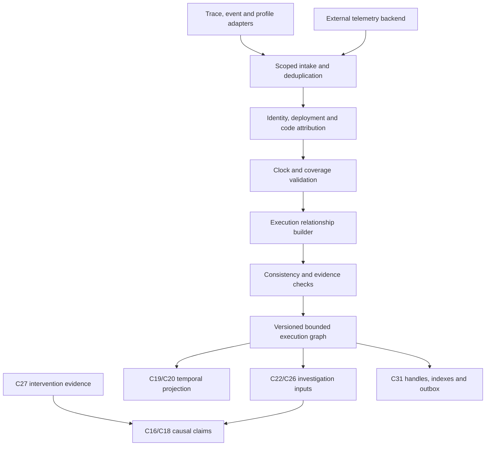

# C24 — Runtime Causality, Attribution and Execution Reconstruction

Detailed component design · Version 1.0 · 4 October 2026

## 1 Purpose and status

Runtime causality reconstructs execution relationships from authorized traces, events, profiles, synchronization records, deployment markers and tests. It connects runtime behavior to versioned code, then supplies evidence to investigations about failures and bottlenecks.

**Status: proposed design; not implemented or empirically verified.** This document extends C24 inside the existing 32-component architecture. It complements C22_Hypothesis_Engine_Detailed_Design.md, C27_Reliable_Counterfactual_Simulation_Design.md and Code_Intelligence_Defect_Performance_and_PR_Design.md. New DTOs and APIs require a registered versioned contract extension. Original source requirements remain authoritative.

The first objective is defensible execution reconstruction, not an automatic universal root-cause oracle. A parent span, an earlier timestamp or a correlated CPU spike does not alone establish why a failure occurred. Missing evidence stays visible.

## 2 Three meanings that must remain separate

| Layer | Example | Evidence required | What it does not establish |
|---|---|---|---|
| Execution relationship | Operation A sent message consumed by B | Trusted propagation/message identity and adapter semantics | A caused B’s defect |
| Mechanism explanation | A lock holder delayed a request that timed out | Owner/wait events, task identity, deadline and relevant execution path | Removing the lock necessarily resolves all incidents |
| Intervention effect | Changing lock scope reduces timeouts under workload W | Comparable isolated experiment and C27 validity gates | Universal improvement in production |

Correlation is another separately labeled relationship. It can suggest a hypothesis but is not inserted into an execution-order DAG as a proven causal edge.

“Happens-before” denotes an execution partial order under declared semantics. A logical-clock order alone does not prove a causal path: if A happens before B, its Lamport timestamp is smaller, but smaller timestamps do not imply A happens before B. No path in an incomplete graph means UNKNOWN, not necessarily CONCURRENT.

## 3 Component ownership

| Component | Responsibility |
|---|---|
| C24 causality submodule | Normalize event identity, construct evidence-backed execution edges, track time/coverage quality, attribute code and build bounded graph slices |
| C09 | Static/revision graph and joins to resolved code facts |
| C05/C06/C08 | Semantic/configuration facts, symbols, deployment/build/source mapping |
| C26 | Interpret waits, critical paths and concurrency mechanisms as findings |
| C22 | Competing cause hypotheses, discriminating checks, steering and completion |
| C27 | Controlled interventions and scoped counterfactual validation |
| C16/C17/C18 | Claim display gates, evaluated confidence and provenance/verdict records |
| C19/C20/C21 | Execution timeline, flow/uncertainty views, interactive time selection |
| C03/C31/C32 | Authority, bounded persistence, retention, backpressure and observability |

No C33 is introduced. C24 owns relation reconstruction; it does not independently declare a hypothesis confirmed or run experiments. Runtime “replay” in existing C24 APIs is evidence/timeline playback. Executable deterministic replay belongs to the relevant C27 adapter and must have its own coverage manifest.

## 4 Architecture



| Internal module | Input → output | Function |
|---|---|---|
| RuntimeAdapterRegistry | Source/capability → adapter | Declare instrumented semantics and omissions |
| EventNormalizer | Runtime records → normalized events | Scoped identities, schema, content minimization |
| DeploymentResolver | Build/deployment markers → attribution | Exact, candidate or unknown code join |
| ClockQualityManager | Clock records → time interval/ordering evidence | Never silently repair chronology |
| CoverageTracker | Sampling/drop/source summaries → certificate/gaps | Define what absence can and cannot mean |
| RelationshipBuilder | Events + rules → candidate/accepted edges | Trigger/message/sync/data relationships |
| ConsistencyChecker | Proposed graph → accepted/quarantined graph | Identity collisions, impossible edges and cycles |
| ExecutionGraphStore | Validated mutations → snapshot | Durable versions, adjacency and source lineage |
| SliceQueryEngine | Scope/window/roots → bounded graph | Authorized critical-path/investigation projections |
| InvalidationManager | Source correction/revocation → invalidations | Propagate stale edges/claims/views |
| TemporalProjector | Snapshot + cursor → view data | Time uncertainty and late updates |

## 5 Sources and instrumentation contract

| Source | Useful signals | Required limits |
|---|---|---|
| OpenTelemetry spans/events/links | RPC operations, contexts, async associations, exceptions | Parent/link semantics, sampling and dropped attributes/events |
| Message broker adapter | Send, enqueue, delivery, ack, attempt and partition position | Broker/consumer group identity, retries, batches and ID reuse |
| Scheduler/task adapter | Spawn, runnable, await/join, resume, completion | Task identity, process epoch, supported runtime boundaries |
| Lock/monitor adapter | Acquire/release, ownership, wait and wake | Actual lock generation, reentrancy, try-lock and drop quality |
| Database adapter | Transaction/query/commit, wait resources, change/version identities | Isolation and visibility semantics; driver span alone insufficient |
| Deployment/build adapter | Image/build/source hashes, source maps, JIT mapping | Rolling deployments and exact artifact availability |
| CPU/off-CPU/allocation profiler | Sampled stacks, blocking intervals and allocation | Sampling categories; stack location is not a causal event sequence |
| Logs/metrics | Errors, queue size, pool waits and load context | Weak identity, aggregation granularity and temporal uncertainty |
| C27 experiment manifest | Fixed inputs, schedule decisions, assertion/metric effects | Simulated versus native evidence class and applicable scope |

OpenTelemetry context/links carry useful associations, but adapter semantics determine which relationships can be accepted. A span link is not assumed to mean waiting, data dependence or a particular trigger. Client-provided trace IDs are not identity/authorization tokens. Tenant/repository/deployment scope comes from authenticated collection and C03 policies.

Instrumentation tiers are explicit: T0 spans/deployment metadata; T1 messaging/database contextual records; T2 scheduler/lock instrumentation; T3 controlled experiment/replay records. A T0 collector cannot honestly reconstruct every memory access or lock handoff. Higher tiers must be authorized and have measured overhead; production rollout is separate from design authoring.

## 6 Event identity, edge taxonomy and graph semantics

Events use tenant + source namespace + process/collector epoch + source sequence/record ID. Process epoch prevents PID/task/lock reuse from merging unrelated executions. Trace/span IDs may be additional lookup keys, not the sole global event identity. Retries have distinct attempt identities tied to one logical operation.

| Edge kind | Evidence and precise meaning | Gate |
|---|---|---|
| PROGRAM_ORDER | Adapter-certified order of modeled events on one execution strand | A strand may be a task, not merely an OS thread |
| SPAWN | Explicit parent spawn event to child task start | No guess from nearby timestamps |
| SEND_RECEIVE | Authenticated send/delivery matching | Destination, broker, message/attempt/context agree |
| COMPLETE_JOIN | Child completion to successful join continuation | Completion observed, timeout/cancel distinguished |
| RELEASE_ACQUIRE | Synchronization handoff under adapter semantics | Same resource generation and synchronization contract |
| READS_FROM | Specific data/version read from a producing write/commit | Version/transaction provenance; no time-only guess |
| REQUEST_RESPONSE | Correlated operation response to receiving event | Attempt identity and recorded success/failure |
| CONTEXT_ASSOCIATION | Trace parenting/link without stronger instrumented semantics | Kept outside strict ordering closure unless justified |
| WAITS_FOR | Task waiting on resource/owner | Snapshot/liveness relation; not a time-order edge |
| CORRELATES_WITH | Statistical/temporal association | Separate noncausal relation layer |
| CAUSE_CANDIDATE | C22/C26 proposed failure mechanism | C18 claim and C16 hypothesis display gates |
| INTERVENTION_SUPPORTS | C27 result supports scoped causal effect | Validity/behavioral/comparison gates |

The event occurrence-order graph is directed and acyclic when identities/semantics are correct. Static service graphs can be cyclic; retries create distinct event instances, not a runtime cycle from reusing one span. Wait-for graphs may legitimately contain cycles and are analyzed separately for deadlock/liveness. Contradictory ordering edges are quarantined with provenance, never silently dropped to make the graph look valid.

Transitive reachability yields known order only through accepted ordering edges. Derived edges retain the supporting path and rule version. Incomparable events may be genuinely concurrent only when the backend provides a complete relevant logical-clock/ordering certificate; otherwise no inferred concurrency assertion is made.

## 7 Time, asynchronous execution and missing data

Represent observed wall time plus uncertainty bounds and a clock domain/epoch. Durations from a monotonic clock within a trustworthy domain can be used separately from uncertain cross-host timestamps. A restart resets sequence/clock epoch; NTP shifts can invalidate chronology. If uncertainty bounds are unknown, cross-host temporal comparison is UNKNOWN.

If A’s latest possible time is earlier than B’s earliest possible time, temporal precedence is supported. That is still not an execution causal edge. If a trusted send→receive relation conflicts with wall-clock timestamps, retain the relationship and flag the clock contradiction rather than declare messages traveled backward. A timeline may display corrected estimates only alongside the original bounds and explicit correction method.

Logical clocks are used only when instrumentation carries trustworthy semantics; one cannot reconstruct missing vector-clock entries from arbitrary span timestamps. HLC/logical total order helps storage and presentation but must not create fictitious event dependencies.

### Async/message cases

- Fan-out: one trigger can lead to multiple tasks; sequential ordering is not invented between siblings.
- Fan-in: continuation depends on the completions actually awaited, not all child spans.
- Queues: enqueue, broker residency, dispatch, consumer wait and processing are separate intervals when evidence supports them.
- Batching: use many-to-one links with per-message attempt lineage; one batch span cannot establish all per-message ordering.
- Redelivery/retry: keep logical operation and attempt separate, including timeouts and duplicate side effects.
- Cancellation: requesting cancellation does not prove the child stopped or rolled back its effect.
- Fire-and-forget: related work may outlive the request; it need not belong on response latency’s critical path.

Missing parents, sampled-out siblings, dropped lock events and uninstrumented services are GapNodes. Negative evidence requires an adapter-issued certificate scoped to exact predicate, namespace/window, query, retention and sampling. Missing samples never prove “this service was not involved.”

## 8 Code and deployment attribution

Resolve event→deployment→build artifact→source revision→entity/span. Exact mapping requires an authoritative artifact/source-map/symbol record. Route-name, stack-name or filename similarity yields candidate attribution, never exact.

Store source map/debug-symbol/JIT mapping versions with the build. Inlined/optimized frames may map to multiple source locations; retain alternatives. Rolling deployments can contain several revisions in the same incident window. Query an explicit deployment revision set rather than force all spans onto the currently checked-out revision. Unmapped third-party/native/runtime work remains visible as external/unknown nodes.

C24 graph snapshots can span multiple repositories/revisions; use the existing MultiRevisionRef pattern and per-node revision attribution. Authorize each repository and cross-link; a shared trace context does not grant source access. The first implementation restricts to one authorized application repository, but still models external/unknown services and differing deployment builds accurately.

## 9 Causal investigation and critical-path analysis

C24 returns evidence paths, waits, uncertainties and alternative relationships. C26 identifies mechanism candidates; C22 asks discriminating questions.

1. Bind symptom and affected population: operation, deployment, window, error/latency condition.
2. Reconstruct authorized execution ancestors and synchronization/data edges with coverage gaps.
3. Separate time spent executing, runnable-but-unscheduled, waiting on locks/pools, downstream responses and unexplained time.
4. Identify mechanisms consistent with the evidence; retain competing/common-cause hypotheses.
5. Query comparison/control populations where appropriate, acknowledging sampling/workload differences.
6. Request C27 experiment if stronger intervention evidence is needed.
7. Record claim scope, evidence class, exclusions and freshness through C16/C18.

A common upstream cause can produce both high CPU and timeouts; correlation alone does not decide which caused which. Partial spans can overrepresent slow requests under tail sampling. Absence of errors in a control cohort is not automatically evidence of an equivalent environment or intervention effect.

Critical-path reconstruction uses event-level completion dependencies, not just the span tree. Nested/overlapping durations are not summed. Blocking intervals from missing downstream events remain unexplained rather than assigned to a known service. Parent spans can include time outside instrumented children; exclusive time is unattributed wall time until stronger CPU/wait evidence identifies it. CPU samples are CPU attribution, not elapsed-time measurements.

Output measured bounds or partial-path coverage where justified. Do not call an arbitrary longest path a precise latency decomposition if clock intervals, queue boundaries or fan-in semantics are unknown. Aggregated populations need request-class/cohort-specific paths, not a single stitched trace assembled from unrelated requests.

## 10 From mechanism to causal effect

A useful runtime explanation might be: “This request timed out while waiting for a connection held across a payment call.” That statement needs ownership/wait and call evidence. The claim “moving the payment call outside the transaction will remove the timeout” is a counterfactual requiring correctness and performance validation in C27.

C27 evidence must match the target mechanism, cohort, deployment semantics and intervention. Experiment labels include: simulated model prediction, native measured experiment or bounded schedule property. Randomized/interleaved comparisons and independent invariants strengthen claims; confounded before/after release comparisons remain observational unless a defensible identification design is provided.

Do not assume an intervention on one request is independent of other requests: queues, locks, shared caches and databases create interference. Experiments may need whole-instance/block allocation and washout/reset policy rather than request-level randomization. State/history contamination and load differences are recorded. Report the tested population and spillover scope instead of claiming a universal root cause.

## 11 Typed entities

Shared types retain existing meanings: Id, Hash, Timestamp, Int, Float, Decimal, Option, List, RevisionRef, MultiRevisionRef, EntityRef, EvidenceRef, RuntimeEnvelope, RuntimeAttribution, ContextSnapshot, ViewSpec, ViewPatch, Budget, GateReport, CommitReceipt, ApiResult, Job, CallContext, TimeWindow, Completeness and JsonValue. New DTOs use registered `c24.causality.v2` schemas. Integers are bounded safe JSON integers; high-resolution ticks use registered decimal strings when necessary. Free text is minimized and bounded.

```typescript
RuntimeEvent {
  id: Id; version: Int; tenantId: Id; sourceId: Id; sourceEpoch: Id;
  sourceSequence: Option<String>; processEpoch: Option<Id>;
  taskId: Option<Id>; threadId: Option<Id>; operationId: Option<Id>;
  attemptId: Option<Id>; traceId: Option<Id>; spanId: Option<Id>;
  kind: EventKind; time: EventTime; deploymentId: Option<Id>;
  buildId: Option<Id>; attributes: RegisteredAttributes;
  evidenceRefs: List<EvidenceRef>; quality: EventQuality;
}
RegisteredAttributes { schemaId: Id; version: Int; values: JsonValue }
EventTime {
  observedWallTime: Option<Timestamp>; earliestWallTime: Option<Timestamp>;
  latestWallTime: Option<Timestamp>; clockDomainId: Id; clockEpoch: Id;
  monotonicTicks: Option<String>; tickUnit: Option<String>;
  logicalClock: Option<LogicalClockRef>; quality: TimeQuality;
}
LogicalClockRef { schemaId: Id; valueHandle: Id; semanticsCertificateId: Id }
EventQuality {
  sourceTrust: SourceTrust; sampling: SamplingState;
  droppedEventCount: Option<Int>; completeness: Completeness;
  ingestionTime: Timestamp; correctionOfEventId: Option<Id>;
}
RuntimeEdge {
  id: Id; version: Int; fromEventId: Id; toEventId: Id;
  kind: EdgeKind; layer: GraphLayer; state: EdgeState;
  ruleId: Id; ruleVersion: Int; evidenceIds: List<Id>;
  relationCertificateId: Option<Id>; scopeHash: Hash;
  claimId: Option<Id>; limitations: List<String>;
}
RelationCertificate {
  id: Id; adapterId: Id; adapterVersion: String; kind: EdgeKind;
  sourceNamespace: Id; matchedIdentityHash: Hash;
  semanticsSchemaId: Id; coverageCertificateIds: List<Id>;
  validationEvidenceIds: List<Id>; state: CertificateState;
}
CodeAttribution {
  eventId: Id; deploymentId: Option<Id>; buildHash: Option<Hash>;
  revision: Option<RevisionRef>; entityCandidates: List<EntityRef>;
  mappingArtifactId: Option<Id>; exact: Bool;
  reasonCodes: List<String>; evidenceIds: List<Id>;
}
CoverageCertificate {
  id: Id; sourceId: Id; sourceEpoch: Id; window: TimeWindow;
  predicateSchemaId: Id; queryHash: Hash; retentionPolicyVersion: Int;
  exhaustiveForPredicate: Bool; sampling: SamplingState;
  adapterId: Id; adapterVersion: String; exclusions: List<String>;
}
GapNode {
  id: Id; kind: GapKind; scopeHash: Hash; adjacentEventIds: List<Id>;
  missingPredicate: String; material: Bool; safeExplanation: String;
}
ExecutionGraphSnapshot {
  id: Id; version: Int; generation: Int; scope: CausalityScope;
  eventIds: List<Id>; edgeIds: List<Id>; gapIds: List<Id>;
  sourceWatermarks: List<SourceWatermark>; coverageIds: List<Id>;
  consistency: GraphConsistency; evidenceSequence: Int;
}
CausalityScope {
  tenantId: Id; revisionSet: MultiRevisionRef;
  deploymentIds: List<Id>; operationIds: List<Id>;
  incidentWindow: TimeWindow; accessScopeId: Id;
  policyEpoch: Int; scopeHash: Hash;
}
SourceWatermark {
  sourceId: Id; sourceEpoch: Id; acceptedSequence: Option<String>;
  eventTimeWatermark: Option<Timestamp>; allowedLatenessMs: Int;
  finalForWindow: Bool;
}
OrderingDecision {
  fromEventId: Id; toEventId: Id; relation: OrderRelation;
  supportingEdgeIds: List<Id>; coverageIds: List<Id>;
  timeContradictions: List<String>; limitations: List<String>;
}
MechanismEvidence {
  id: Id; snapshotId: Id; snapshotVersion: Int;
  symptomEventIds: List<Id>; mechanismKind: MechanismKind;
  executionEdgeIds: List<Id>; waitEdgeIds: List<Id>;
  candidateClaimIds: List<Id>; counterEvidenceIds: List<Id>;
  materialGapIds: List<Id>; investigationId: Option<Id>;
}
CriticalPathReport {
  id: Id; snapshotId: Id; operationId: Id;
  segments: List<PathSegment>; observedDurationMs: Option<Float>;
  coveredDurationMs: Option<Float>; unresolvedDurationMs: Option<Float>;
  gateReportId: Id; limitations: List<String>;
}
PathSegment {
  eventIds: List<Id>; kind: SegmentKind;
  lowerDurationMs: Option<Float>; upperDurationMs: Option<Float>;
  evidenceIds: List<Id>;
}
CausalClaimReference {
  claimId: Id; snapshotId: Id; snapshotVersion: Int;
  level: CausalClaimLevel; populationSchemaId: Id;
  mechanismEvidenceIds: List<Id>; experimentReportIds: List<Id>;
  gateReportId: Id; state: ClaimFreshness;
}
```

```typescript
EventKind = OP_START | OP_END | SEND | RECEIVE | ENQUEUE | DEQUEUE
          | SPAWN | JOIN | TASK_RESUME | TASK_SUSPEND | TASK_COMPLETE
          | LOCK_ACQUIRE | LOCK_RELEASE | LOCK_WAIT | READ_VERSION
          | WRITE_VERSION | TX_COMMIT | EXCEPTION | DEADLINE | CANCEL_REQUEST
          | SAMPLE | DEPLOYMENT_MARKER
EdgeKind = PROGRAM_ORDER | SPAWN | SEND_RECEIVE | COMPLETE_JOIN
         | RELEASE_ACQUIRE | READS_FROM | REQUEST_RESPONSE | CONTEXT_ASSOCIATION
         | WAITS_FOR | CORRELATES_WITH | CAUSE_CANDIDATE | INTERVENTION_SUPPORTS
GraphLayer = EXECUTION_ORDER | CONTEXT | WAIT | ASSOCIATION | EXPLANATION
EdgeState = ACCEPTED | CANDIDATE | QUARANTINED | INVALIDATED
TimeQuality = BOUNDED | LOCAL_MONOTONIC_ONLY | UNKNOWN | CONTRADICTORY
SourceTrust = AUTHENTICATED_ADAPTER | IMPORTED_UNVERIFIED | UNTRUSTED_CONTEXT
SamplingState = NONE | HEAD | TAIL | MIXED | UNKNOWN
GapKind = MISSING_EVENT | SAMPLED_REGION | UNATTRIBUTED_CODE | CLOCK_UNKNOWN
        | ACCESS_RESTRICTED | ADAPTER_UNSUPPORTED | RETENTION_EXPIRED
CertificateState = ACTIVE | INVALIDATED | REJECTED
GraphConsistency = CONSISTENT | PARTIAL | CONTRADICTORY
OrderRelation = HAPPENS_BEFORE | HAPPENS_AFTER | CONCURRENT_CERTIFIED | UNKNOWN
MechanismKind = LOCK_WAIT | POOL_WAIT | DOWNSTREAM_WAIT | QUEUE_DELAY
              | DATA_DEPENDENCY | RETRY_AMPLIFICATION | SCHEDULER_DELAY | UNKNOWN
SegmentKind = EXECUTING | WAITING | RUNNABLE | DOWNSTREAM | UNEXPLAINED
CausalClaimLevel = EXECUTION_RELATION | MECHANISM_CANDIDATE | MECHANISM_SUPPORTED
                | INTERVENTION_SUPPORTED
ClaimFreshness = CURRENT | STALE | RESTRICTED
```

The two endpoint RuntimeEvent references in RuntimeEdge apply to execution/context/association records. WAIT-layer relations use a distinct typed record rather than pretending that a resource is a runtime event:

```typescript
WaitRelation {
  id: Id; snapshotId: Id; taskId: Id; processEpoch: Id;
  resourceId: Id; resourceEpoch: Id; ownerTaskIds: List<Id>;
  observationEventIds: List<Id>; evidenceIds: List<Id>;
  escapeConditions: List<String>; completeness: Completeness;
}
```

 EXPLANATION-layer relations use a distinct ExplanationRelation schema with claim/evidence references; do not encode a C27 experiment or a hypothesis as a fake runtime event. A causal claim reference is a C18-owned claim, not an alternative truth ledger in C24.

## 12 API contracts and compatibility

Preserve existing C24 ingest/attribute/queryWindow/replay/notifyRelevantContext APIs. They remain coarse runtime-envelope/attribution contracts. `attribute` never upgrades an uncertain code join merely because relation reconstruction succeeds. C24 replay remains temporal projection.

Proposed extension APIs take trusted CallContext, return Promise<ApiResult<T>> and require scoped bounded queries. Mutations use idempotency and expected aggregate version. The public gateway excludes raw privileged collector intake and certificate issuance.

| API | Typed request | Result value |
|---|---|---|
| registerAdapter | adapterCapability: RegisteredAttributes, authorityGrantId | AdapterRegistration |
| ingestEvents | batch: List<RuntimeEvent>, sourceWatermark, expectedSourceVersion | CommitReceipt |
| resolveAttribution | eventIds, scope: CausalityScope | List<CodeAttribution> |
| reconstruct | scope, rootEventIds, maxEvents, maxEdges, budget | Job<ExecutionGraphSnapshot> |
| querySlice | snapshotId, knownVersion, roots, layers, depth, limits | GraphSlice |
| explainRelation | snapshotId, edgeId | RelationExplanation |
| checkOrder | snapshotId, fromEventId, toEventId | OrderingDecision |
| traceAncestors | snapshotId, eventId, maxDepth, maxEvents | GraphSlice |
| criticalPath | snapshotId, operationId, analysisPolicyId | CriticalPathReport |
| getCoverage | snapshotId | CoverageReport |
| buildMechanismEvidence | snapshotId, symptomEventIds, mechanismKinds | List<MechanismEvidence> |
| linkInterventionEvidence | claimId, expectedClaimVersion, experimentReportId | CausalClaimReference |
| applyCorrection | sourceEventId, expectedVersion, correctionHandle | CommitReceipt |
| invalidateSource | sourceId, expectedVersion, reason, authorityGrantId | CommitReceipt |
| getSnapshot | snapshotId | ExecutionGraphSnapshot |
| readUpdates | snapshotId, afterSequence, limit | CausalityUpdatePage |

GraphSlice contains snapshot/version, authorized event/edge/attribution/gap DTOs, truncated flag and continuation handle. RelationExplanation contains edge, supporting certificates/evidence, derivation path and limitations. CoverageReport contains certificate refs, sampling/drop summaries and gaps, never an invented global coverage percentage. AdapterRegistration contains ID/version, capability/schema digest and trusted issuer scope. CausalityUpdatePage carries scoped updates, nextSequence and replayRequired.

`linkInterventionEvidence` delegates claim change/gates to C18/C16 and verifies matching scope; it cannot declare any experimental result causal unconditionally. `buildMechanismEvidence` assembles paths for C26/C22, not automatic accepted root-cause findings. All generic attribute payloads are registered bounded schemas, not unrestricted expressions.

## 13 Relationship construction pseudocode

```typescript
async function reconstruct(ctx, req) {
  scope = await authorizeAndPinScope(ctx, req.scope);
  records = await queryBoundedAuthorizedTelemetry(scope, req.limits);
  normalized = normalizeDeduplicateAndValidate(records);
  attributed = await resolveBuildAndCodeMappings(normalized, scope);
  quality = evaluateTimeCoverageAndSourceTrust(normalized);
  proposals = buildRegisteredRelationshipProposals(normalized, quality);
  accepted = [];
  quarantined = [];
  for (edge of proposals) {
    if (!referencesAuthorizedIdentity(edge, scope)) continue;
    if (!passesAdapterSemanticsAndIdentityChecks(edge)) {
      quarantined.push(withReason(edge)); continue;
    }
    if (isOrderingEdge(edge) && introducesOrderingCycle(edge, accepted)) {
      quarantined.push(withContradictionEvidence(edge)); continue;
    }
    accepted.push(edge);
  }
  // Recheck scope/policy epoch and source versions before publication.
  snapshot = assembleVersionedGraphWithGaps(attributed, accepted, quality);
  receipt = await commitGraphAndLineageWithOutbox(ctx, snapshot, quarantined);
  return committedSnapshot(receipt);
}
```

Cycle detection order must not arbitrarily decide which contradictory source is “truth.” On contradiction, quarantine the affected proposed component/relationship set and retain all competing edge provenance for deterministic reconciliation; the simplified loop expresses validation, not a first-edge-wins policy. Bounded queries outside the view window may fetch authorized boundary ancestors under declared limits; otherwise mark the parent unknown.

## 14 High-level function inventory

| Function | Purpose |
|---|---|
| validateAdapterCapability | Freeze supported semantics, schemas, trust and omissions |
| normalizeRuntimeRecord | Registered source record to Event/Attribution DTO |
| deduplicateSourceEvent | Scoped source ID/hash check; collision diagnostics |
| pinDeploymentRevisionSet | Resolve deployment/build hashes without guessing |
| mapOptimizedFrames | Symbol/source-map/JIT mapping with alternatives |
| calculateTimeBounds | Apply certified clock quality; unknown stays unknown |
| validateLogicalClockSemantics | Ensure partial-order certificate applies |
| trackSamplingAndRetention | Scope-specific coverage and late-data quality |
| correlateMessageAttempts | Send/delivery/ack identities including retries/batches |
| extractTaskJoinEdges | Actual awaited completion and continuation linkage |
| matchSynchronizationHandoff | Ownership/version/lock semantics and coverage |
| reconstructReadVersionLineage | Producing write/commit and consuming read |
| buildProgramOrderEdges | Certified execution strand ordering only |
| quarantineContradictoryComponent | Retain conflicting edges without choosing by ingest order |
| materializeGapNodes | Missing evidence without fabricated causal links |
| computePartialOrderReachability | Known paths with bounded closure/query |
| assembleCriticalPathEvidence | Overlap-aware dependencies and uncovered intervals |
| extractWaitSnapshot | Versioned wait/owner projection for C26 |
| buildMechanismEvidenceBundle | Candidate mechanism, counter-evidence and gaps |
| verifyInterventionScope | C27 report applicability and independent oracle |
| propagateSourceCorrection | Invalidate derived edges, claims and views |
| redactAuthorizedProjection | Prevent private IDs/counts/history leakage |
| checkpointAndEmitDelta | C31 atomic projection/lineage/outbox commit |
| replayTemporalView | Evidence playback with camera/time anchors |
| reconcileLateEvents | New snapshot version; invalidate affected results |

Functions operate on the typed records above. Concrete adapter formats, ordering algorithms, certificates and database indexes must be finalized before integration; naming the functions does not implement the capability.

## 15 Storage, scaling and recovery

Raw spans/logs/profiles stay in external telemetry backends. C24 stores bounded normalized slices, handles, source identities, adjacency indexes, deployment/code mappings, certificate refs and dependency lineage. Do not copy an annual billion-span stream into the local database.

| Store | Key/index | Purpose |
|---|---|---|
| runtime_sources | tenant/source/epoch | Adapter/schema/trust/watermark |
| runtime_event_refs | scoped event ID/version; trace/operation/attempt | Minimized identity/time/backend handles |
| runtime_edge_versions | edge/version; from/to/layer | Evidence/rule/certificate and state |
| runtime_attribution | event/build/artifact version | Entity candidates and exactness |
| runtime_coverage | source/window/predicate/query | Source-certified completeness and omissions |
| execution_snapshots | scope hash/version | Member refs, source versions and quality |
| runtime_derivations | source/event→edge/report/claim | Correction/deletion/revocation invalidation |
| causality_updates | snapshot/sequence | Durable outbox/replay |

Partition by tenant/source/time where supported; cache by scope, permission epoch, revision set and source versions. Avoid materializing all-pairs transitive closure. Use bounded adjacency search and optional summarized segments with their evidence paths. Summaries cannot erase meaningful gaps or imply unauthenticated cross-service visibility.

Proposed initial per-slice limits: 10k events, 30k relations, depth 64, 10-second external query deadline. These are configurable engineering defaults requiring measured validation. Large slices return explicit truncation, continuation handles or server-side summaries. Foreground UI remains governed by C12/C20 budgets.

Out-of-order input updates a snapshot version with affected-edge/claim deltas. Watermarks define bounded finality assumptions; “window finalized” is not proof that no collector ever lost an event. Beyond-watermark corrections remain possible and produce invalidation. On crash, reconcile accepted source cursors and outbox checkpoints; dedup and payload hashes prevent duplicate authoritative events.

Persist source correction/retraction and invalidation watermark atomically with the affected projection. Readers enforce freshness before asynchronous downstream refresh. No locks span external telemetry/model calls. Governance deletes raw/derived payload handles and minimizes history; a supposedly append-only causality ledger must not retain deleted private telemetry through replayable checkpoints.

## 16 Security, trust and observability

Collection identity and source certificates are authenticated; incoming trace headers remain untrusted context. Reject malformed/oversized context and bounded baggage; scrub secret/PII attributes before persisted derivations/model egress. Permit cross-service correlation only under authorized scopes. Names, counts, edges and guessed missing nodes can leak private topology, so redaction must cover all of them.

Deep lock/task profiling can expose sensitive state and require elevated system permissions. Use explicit collection profiles, instrumentation grants, network/data minimization and overhead measurements. This design authorizes no production deployment or fault injection.

Metrics: ingest/query lag, dropped records, unmatched send/receive, attribution exact/candidate/unknown counts, contradictory order components, sampling-gap counts, source watermark lag, bounded-slice truncation, critical-path uncovered time, correction propagation lag and stale-result rejection. Log IDs/rule versions/reasons, excluding raw code, private payloads and model prompts. No numeric “causality confidence” without evaluated support.

## 17 User-facing behavior

A user selecting a timeout can inspect: triggered operations, waited resources/owners, data-version lineage, mapped code, missing regions and candidate explanations. Each relation has an “explain edge” action showing evidence and exact semantics.

| View | Required disclosure |
|---|---|
| Execution DAG | Accepted versus candidate/context edges and gaps |
| Task/message swimlane | Attempt IDs, uncertainty bands, joins and late events |
| Wait-for graph | Snapshot time, resource ownership and escape conditions |
| Critical-path waterfall | Covered/unexplained portions and overlap limits |
| Cause hypothesis board | Candidate mechanisms, counter-evidence and next checks |
| Intervention comparison | C27 evidence class/domain, correctness and measured effect |

“Replay” label distinguishes telemetry playback from executable replay. Time scrubbing changes the viewed window/cursor, not source revision silently. Late evidence updates indicators without camera jumps. If a source expires/revokes access, old views show restricted/unavailable evidence rather than stale trusted conclusions.

## 18 Worked example: request timeout and connection ownership

Synthetic fixture: checkout request R times out. A DB connection is held by task T while it calls a payment service; task U waits for a connection.

1. T0 spans show checkout/payment/query timing but do not prove connection ownership. Initial explanation remains candidate.
2. T1 connection-pool instrumentation links acquisition/hold/release to T and waiting attempt to U. C24 reconstructs ownership/wait paths with coverage certificates.
3. Clock skew puts a remote payment timestamp before local send; trusted matching shows send→receive while the timeline records clock contradiction.
4. C26 identifies holding the connection across remote work as a supported blocking mechanism for the captured requests. C22 keeps database slowdown/load burst as competing explanations for the broader incident.
5. C27 tests a patch shortening connection lifetime with a version/state oracle. Paired experiments compare latency/timeouts/database load.
6. C18 records an intervention-supported claim only for the validated environment/cohort, with unresolved production applicability. No trace parent alone is declared root cause.

Missing pool ownership data would leave step 2 unresolved. A faster isolated patch supports its tested effect, not proof that every timeout in production had the same cause.

## 19 Acceptance and checker-mutation suite

| ID | Fixture/test | Required result |
|---|---|---|
| RC01 | Exact RPC send/receive with skewed clocks | Trusted relation retained; time contradiction disclosed |
| RC02 | Earlier timestamp without relation evidence | Temporal order only; no causal execution edge |
| RC03 | Smaller Lamport stamp without path | No happens-before assertion from scalar order alone |
| RC04 | Missing path under sampled trace | UNKNOWN, not certified concurrent |
| RC05 | Fan-out and actual partial join | No sibling sequence or fictitious await |
| RC06 | Message retry/redelivery/batch | Attempt-aware many-to-one lineage; no false exactly-once |
| RC07 | Context link without semantics | Context association only |
| RC08 | PID/task/lock/trace ID reuse | Scoped epochs prevent merges |
| RC09 | Rolling deployment and wrong source map | Correct revision alternatives/fog |
| RC10 | Clock uncertainty unknown | No precise cross-host latency claim |
| RC11 | Ordering cycle with contradictory sources | Quarantine and deterministic conflict report |
| RC12 | Legitimate wait-for cycle | Separate wait layer; deadlock analysis includes escape conditions |
| RC13 | Sampled CPU stacks | CPU attribution, no fabricated task ordering |
| RC14 | Missing spans/retention/drop | Material gap; absence-based exoneration blocked |
| RC15 | Nested/overlapping operations | No duration double-counting |
| RC16 | Tail-sampled failures versus control | Selection bias disclosed; no automatic causal effect |
| RC17 | Source event correction/retraction | Dependent graph/claim/view stale before refresh |
| RC18 | Cancellation requested but child completes | No assertion that effect rolled back |
| RC19 | Shared dependency interference | Experiment/claim population limits retained |
| RC20 | Unauthorized forged trace context | No authority grant or private topology disclosure |
| RC21 | Oversized ingestion/query slice | Backpressure/truncation; no unbounded local persistence |
| RC22 | Crash between source cursor/projection/outbox | Dedup and durable replay; no mixed snapshot |
| RC23 | Revoked source/deleted raw handle | Redacted/incomplete report; no historic payload recovery |
| RC24 | Late event after finalized watermark | Versioned correction, not silently ignored |
| RC25 | Telemetry replay requested | Playback label; no executable-replay promise |
| RC26 | LLM proposes unsupported root cause | Hypothesis-only/gate rejection |
| RC27 | Intervention mismatched workload/revision | Scope gate prevents causal promotion |
| RC28 | Confounded before/after deployment | Observational association, not confirmed intervention effect |

Checker mutations remove clock/coverage/identity/authority/semantic/generation gates one at a time. The corresponding tests must fail. Fixtures need independently reviewed event graphs, not only adapter self-consistency. Measure exact relation precision/recall, attribution accuracy, false causal promotion, unknown coverage, reconstruction latency and instrumentation overhead separately.

## 20 Requirement traceability and implementation order

| Original checkpoint | Design responsibility | Acceptance |
|---|---|---|
| S5/CE-5 | Quality-aware runtime intake | RC08/RC14/RC20–RC24 |
| S6/FR-106 | Relevant runtime context updates | Scoped mechanism deltas through C12; RC17/RC24 |
| S6/FR-507; S5/FR-13 | Attribution/fog and temporal replay | RC09/RC14/RC25 |
| S6/FR-501/505 | Living hypotheses and bounded investigation | RC04/RC16/RC26–RC28; C22 suite |
| S6/FR-508 | Runtime evidence for scoped counterfactual validation | RC19/RC27/RC28; C27 suite |
| S6/FR-601/602 | Provenance and display gates | RC07/RC26/RC27 |
| S6/FR-603/604/606 | Authority, minimization and evidence/audit | RC20/RC23 |
| S6/NFR-04/07/08 | Recovery, retention and provenance continuity | RC17/RC22/RC23 |
| C24 existing acceptance suite | Missing markers, time, sampling, order, revision and backpressure | RC01/RC08–RC14/RC21/RC24 |

Mappings are supporting design checkpoints, not source requirement acceptance certification. Existing full requirement/use-case/source-block registers remain authoritative.

First implementation slice: authenticated OTel/deployment intake; exact build/source mapping; RPC/message context association with accepted ordering only where semantics are certified; explicit gap/time-quality projection; bounded graph/edge explanation; correction/freshness; C22/C26 consumption. Add pool/lock/task/data-version adapters incrementally with their golden fixtures. Full low-level causality cannot be promised from basic traces.

Before integration, freeze event/edge/certificate schemas; trusted adapter registry; dataset/fixtures; clock-bound policy; source retention; task/message identity contracts; partial-order algorithms; multi-revision redaction; statistics/experiment scope and C18 staged claim behavior. No arbitrary root-cause ML model is required for the first reliable execution-reconstruction slice.

## 21 Primary references and design limits

- [OpenTelemetry tracing API](https://opentelemetry.io/docs/specs/otel/trace/api/): span context, links and span-kind semantics.
- [OpenTelemetry overview](https://opentelemetry.io/docs/specs/otel/overview/): trace relationships and propagation concepts.
- [W3C Trace Context](https://www.w3.org/TR/trace-context/): interoperable context plus privacy/security considerations.
- [Lamport: Time, Clocks, and the Ordering of Events in a Distributed System](https://www.microsoft.com/en-us/research/publication/time-clocks-ordering-events-distributed-system/): execution partial ordering.

These sources describe foundations. They do not establish our implementation’s correctness, telemetry completeness, model accuracy or ability to identify every cause. Adapter certificates, graph policies, schemas, gates and limits in this document are proposed product design requiring implementation and independent validation.
