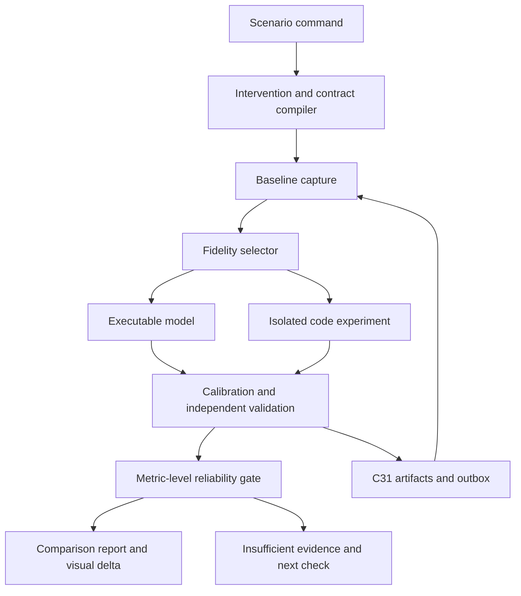

# C27 — Reliable Counterfactual Simulation

Detailed design · Version 1.0 · 4 October 2026

## 1 Purpose and evidence boundary

C27 answers bounded questions about interventions: “What happens if we shorten this critical section?”, “What if we double arrival rate?”, “Would batching remove this bottleneck?”, or “What fails if this dependency disappears?” It evaluates an explicit changed system against an immutable baseline, with defined inputs, properties and environment.

**Status: proposed implementation specification.** No simulator, measured baseline, validated predictive model or production experiment has been delivered by this document. This design refines Code_Intelligence_Component_API_Contracts.md v1.1 and Code_Intelligence_Defect_Performance_and_PR_Design.md; new schemas/APIs are versioned proposals. C22’s investigation design governs hypotheses and honest completion.

Reliable means a result has evidence for its stated scope, metric and fidelity—not that a simulator is universally accurate. Repeatability is necessary for debugging but does not establish realism. An accurate baseline fit alone does not establish accurate intervention effects.

| Result class | Meaning | Allowed conclusion |
|---|---|---|
| NARRATIVE | LLM-derived explanation without executable evidence | Plausible consequence; unmeasured |
| MODEL_PREDICTION | Executable model output, validation absent or outside its domain | Predicted under listed assumptions |
| VALIDATED_MODEL_PREDICTION | Model validated for relevant baseline and intervention class | Prediction within stated tested domain, with uncertainty and exclusions |
| MEASURED_EXPERIMENT | Real executable code/configuration compared in an isolated environment | Observed effect under that test environment/workload |
| BOUNDED_CORRECTNESS_RESULT | Property checked over declared model/search bounds | Property result within bounds and adapter semantics |

No model prediction can be relabeled a production measurement. No bounded correctness result becomes a universal safety guarantee. Evidence labels apply per metric/property: one scenario can have measured correctness and only modeled latency.

## 2 First delivery boundary

Implement a narrow vertical slice first: one repository/revision, one local service, a fixed workload fixture, a scoped code/config intervention, paired baseline/candidate execution, correctness checks and latency/resource comparison. Initial simulation inputs are explicit fixtures and measurements; automatic extraction of a realistic whole-system model is later research/engineering work.

Support three initial questions:

1. Does a synchronization change remove the known failing schedule without violating the declared invariant?
2. Does a loop/critical-section change improve the measured hot-path workload?
3. Under a calibrated queue/resource model, how does a bounded change in load or capacity affect waiting and throughput?

Defer arbitrary monolith splitting, full hardware digital twins, autonomous causal discovery and predictions far beyond observed regimes. Preserve their original product obligations rather than calling them solved by this slice.

## 3 Architecture and ownership



| Component | Owns |
|---|---|
| C27 | Scenario versions, intervention binding, executable backend selection, run orchestration, comparisons and applicability decisions |
| C26 | Mechanism/resource analysis, candidate bottlenecks, safety obligations and workload relevance |
| C22 | Competing explanations, discriminating checks and unresolved investigation context |
| C05/C06/C09 | Semantic/configuration facts and immutable graph projections; unknown effects remain unknown |
| C24 | Attributed baseline traces/profiles, source quality, deployment/revision and observed workload |
| C28 | Concrete candidate patch/config artifacts; no silent edit through canvas |
| C03 | Authority, isolated execution grants, egress and export policy |
| C16/C17/C18 | Evidence/display gates, evaluation/calibration records and claim/provenance ledger |
| C19/C20 | Level-locked current/candidate views and metric visualizations |
| C31/C32 | Durable state, artifacts, jobs, supervision and quota enforcement |

The logical C27 engine stays TypeScript. Backend executors are adapters; existing Rust worker remains semantic/graph infrastructure. A Rust discrete-event backend can be considered after profiling, but no new Rust module or RPC is implied by this design. A model engine is not permitted to embed model-generated executable code without an isolated, registered compilation/execution path.

## 4 Fidelity ladder and backend selection

| Backend | Suitable questions | Cannot establish alone |
|---|---|---|
| Structural graph reasoning | Reachability, dependency removal, affected paths | Latency, throughput, actual race freedom |
| Discrete-event resource simulation | Queues, service times, resource capacity, retries and contention models | Actual memory races or CPU instruction behavior |
| Controlled schedule/model-check adapter | Interleavings, synchronization invariants, bounded liveness | Representative throughput/latency |
| Native isolated paired experiment | Concrete code/config effects under real test workload | Universal production effect |
| System-level deterministic/fault environment | Reproducible network/node/scheduling failures | Automatic validation of all hardware and workload assumptions |
| Machine emulation/replay | Specific emulated platform and replay scope | Production timing accuracy or complete schedule coverage |

Use the least costly backend capable of supplying the required evidence. Unsupported requested fidelity yields a typed refusal or lower-fidelity report clearly labeled as such. A cheap graph prediction must not substitute for a requested measured benchmark.

Potential integrations: SimPy for an early discrete-event prototype; Loom/Lincheck/Coyote for supported concurrency harnesses; native detector adapters for exercised memory races; Antithesis as optional system-level backend; QEMU for applicable machine replay. These technologies do not share a universal execution model. Capability manifests name supported languages, platforms, synchronization semantics, replay control and blind spots.

FoundationDB’s documented deterministic simulation is useful precedent for controlling external interfaces and faults, not a reusable drop-in simulator for arbitrary code. Its broader testing approach also includes live performance and hardware-based failure testing. Our design adopts the separation between simulation evidence and real environment validation.

## 5 Counterfactual contract

A scenario must specify:

- **Question/estimand:** the exact difference to estimate, for example p95 latency at a fixed open-loop arrival process, with timeouts included.
- **Baseline:** source/build/config/dependency/data-state hashes and graph revision.
- **Intervention:** a typed, executable change; “make it faster” is not an intervention.
- **Workload:** arrival process, operation mix, payload distribution, key skew, dependency responses and duration.
- **Environment:** capacity, resource sharing, storage/network behavior, runtime/compiler, cache state and warmup.
- **Oracle:** independent behavioral invariants and permitted output differences.
- **Metrics:** units, population/denominator, timeout/error treatment, aggregation and decision thresholds.
- **Held inputs:** inputs/random streams fixed for comparison, and endogenous behavior allowed to change.
- **Validity domain:** supported intervention class and workload/environment bounds.
- **Stop/abstention conditions:** budgets, fidelity failures and material unknowns.

### Intervention semantics

| Intervention | Concrete binding | Common mistake |
|---|---|---|
| Shorten critical section | Candidate patch plus protected-state obligations | Reduce a lock-delay parameter without verifying new semantics |
| Increase pool capacity | Actual config change or explicit modeled resource capacity | Assume the downstream database has unlimited spare capacity |
| Batch operations | Batch size/timeout, executable implementation or model rules | Ignore waiting-to-fill, failure/retry semantics and memory |
| Remove dependency | Replacement/error behavior, data consistency and call routing | Delete a graph edge while retaining original outputs |
| Change async execution | Queue policy, ordering, cancellation and max concurrency | Assume concurrency changes only timing |
| Raise load | Specified exogenous arrival process | Multiply observed latency without modeling queue buildup |
| Split service | Executable deployments or explicit network/transaction model | Assign arbitrary network delay and claim architectural equivalence |

Freeze exogenous inputs where meaningful; recompute downstream effects. Replaying baseline responses blindly after an intervention can conceal new queries, different request counts or altered state. Each recorded-response adapter declares matching keys and behavior for unmatched/changed requests. Missing responses yield a gap, not automatic success.

Schedules diverge after code changes. The same seed does not guarantee equivalent random choices when random calls are consumed in different orders. Use named independent streams or event-keyed draws. Reuse schedule constraints only when a checked mapping preserves event identities; otherwise replay the failing schedule as a constraint where valid and expand candidate search separately.

## 6 Executable discrete-event model

Model a system with task arrivals, state transitions, finite resources and timed events. Each event carries deterministic ordering keys, causal parent, request identity and payload schema. Simulated time is distinct from wall-clock executor time. Equal-time event ordering is explicit and versioned.

| Entity | Minimum semantics |
|---|---|
| Request | Arrival, operation/input, deadline, state and result |
| Task | Dependencies, runnable/blocked state, cancellation and completion |
| Resource | Capacity, queue policy, ownership, acquire/release and wait limits |
| Service stage | Resource demands, service-time conditional distribution, branch/outcome |
| Lock | Identity, reentrancy policy, blocking/try semantics and critical section |
| External dependency | Request-conditioned behavior, latency, errors and state effects |
| Cache | Keys, capacity/eviction, TTL, hit/miss behavior and mutation validity |
| Fault | Time/condition, affected component, duration/recovery and scope |

Do not sample total stage latency including queue wait as “service time” and then add another modeled queue wait. Calibration must separate demand from waiting or explicitly use an end-to-end black-box model with restricted intervention applicability. Preserve correlations such as request size, key skew and dependency degradation; independent marginal distributions can erase the behavior that creates tail latency.

Resource contention is recomputed. A faster critical section may shift saturation to CPU, a pool or storage. More parallelism can increase service times through contention; constant service-time models need an explicit domain where that approximation holds. Memory effects, GC and throttling must be modeled or disclosed as exclusions.

### Kernel invariants

Monotonic simulated time; deterministic tie ordering; no negative capacities; ownership-consistent release; each acquisition accounted for; cancellation releases only owned resources; events from invalid generations cannot publish; deadlines and retries counted in outcomes; bounded queue/events/runtime; manifest pinning of RNG algorithm and event comparator.

A finite event budget must not be mistaken for a finite model search proving liveness. A deadlock verdict requires backend-specific evidence; “no event currently queued” may also represent missing external input.

## 7 Baseline calibration and independent validation

Reliability gates operate in this order:

| Gate | Required evidence | Failure outcome |
|---|---|---|
| G0 Definition | Intervention, oracle, metrics and authority concrete | INVALID_SCENARIO |
| G1 Baseline identity | Complete pinned source/build/config/workload and environment scope | BASELINE_INCOMPLETE |
| G2 Baseline reproduction | Repeated isolated baseline or model match under declared conditions | BASELINE_MISMATCH |
| G3 Holdout validation | Independent unfit workload slices/load points and measurement quality | MODEL_UNVALIDATED |
| G4 Intervention validation | Known real changes in the relevant intervention class compared with predictions | INTERVENTION_UNVALIDATED |
| G5 Applicability | Requested workload/change inside validated domain; material assumptions checked | OUT_OF_DOMAIN or INSUFFICIENT_EVIDENCE |
| G6 Correctness | Behavioral oracle and relevant safety obligations | CORRECTNESS_FAILURE |
| G7 Comparison precision | Comparable runs, uncertainty and materiality test | INCONCLUSIVE |
| G8 Display/export | C16/C18 evidence and authorized results | WITHHELD/REDACTED |

Calibration fits parameters using training data. Holdout validation uses independently collected data not selected for a convenient match. Version any refit; data used to choose/revise the model cannot remain its untouched holdout. Record the complete model-selection history, not only the winning model.

Baseline targets include throughput, error/timeout rates, latency distribution, queue waits, utilization, branch/cache mix and resource occupancy. Matching mean latency can hide tail and saturation errors. Proposed initial acceptance policy: throughput relative error ≤10%; p95 error ≤15%; saturation onset within one predefined load interval; error-rate absolute tolerance chosen by fixture prevalence. These are engineering hypotheses for review, not measured accuracy or universal standards. Near-zero quantities require absolute-error policies.

Most importantly validate **predicted change**, not only predicted baseline. For known interventions, compare predicted versus observed delta, direction, magnitude and adverse tradeoffs. A certificate applies only to the metric/intervention/domain actually tested. Model agreement among independently configured simulators is diagnostic evidence, not an independent physical truth oracle.

## 8 Controlled baseline/candidate experiment

1. Freeze source/config/data/workload/environment manifests and independent oracle.
2. Prepare separate isolated baseline/candidate instances; reset governed state and define warm/cold cache policy.
3. Randomize or interleave run order to reduce time-dependent drift; pair comparable input streams where valid.
4. Execute correctness and race instrumentation separately from representative performance runs.
5. Collect all outcomes, including cancellations, timeouts, failed requests and incomplete runs.
6. Reject incomparable run pairs by predeclared conditions, retaining their reason and raw evidence.
7. Compute metric differences and uncertainty with dependence-aware sampling.
8. Report tradeoffs, applicability and whether correctness/precision gates passed.

Do not silently omit failures from latency statistics. Record successful latency separately if useful, alongside complete failure/censoring outcomes. Use an arrival model appropriate to the question; closed-loop clients reduce offered load when responses slow, potentially hiding overload. Load-generator saturation and coordinated omission are explicit checks.

For paired runs, difference metrics are computed on corresponding run aggregates; request-level dependence/cluster effects are respected. Tail quantiles need sufficient independent request/block coverage, not just many correlated samples. Confidence intervals describe sampling uncertainty under the chosen method; they do not cover unspecified model error or every production workload.

If the candidate suppresses work or drops more requests, an apparently faster latency is not automatically an improvement. Verify completed-work rate and business outputs. Example promotion policy: all mandatory invariants pass, predeclared performance improvement exceeds practical threshold with adequate uncertainty support, and no unacceptable tail/error/resource regression.

## 9 Uncertainty and abstention

| Uncertainty source | Required treatment |
|---|---|
| Run-to-run variability | Repeated comparable trials, raw samples and statistical method |
| Parameter uncertainty | Sample/interval parameters from supported estimates; propagate appropriately |
| Structural model uncertainty | Alternate plausible structures and intervention sensitivity; explicit exclusions |
| Unobserved dependencies | Material evidence gap; abstain from affected claims |
| Unsupported new regime | Out-of-domain label; recommend experiment/measurement |
| Behavioral mismatch | Correctness failure; no performance-success claim |
| Partial search/traces | Coverage limitation, not proof of absence |

Do not collapse these sources into a single invented confidence number. Report prediction interval/calibration separately from benchmark confidence interval. Some gaps cannot be quantified honestly and remain explicit unknowns. Sensitivity analysis varies material assumptions (key skew, service-time tails, resource limits, retry behavior) and identifies result sign reversals. A robust conclusion survives the declared range; a fragile one states the conditions under which it changes.

Budget exhaustion returns a partial report with the last committed results and unrun cells. It cannot mark unresolved cells as passing. Confidence labels from C17 require an applicable evaluation artifact; otherwise display UNCALIBRATED.

## 10 Typed entities

Shared imports: Id, Hash, Timestamp, Int, Float, Decimal, JsonValue, RevisionRef, Budget, EvidenceRef, Scenario, ScenarioChange, ViewSpec, GateReport, CommitReceipt, ApiResult, Job, CallContext. All new schemas use `c27.counterfactual.v2`. Integers are nonnegative safe JSON integers, floats finite, lists bounded and currency exact. Schema-tagged JSON is allowed only for registered declarative adapter inputs.

```typescript
CounterfactualSpec {
  id: Id; version: Int; question: String; baseline: BaselineManifest;
  intervention: Intervention; workload: WorkloadSpec;
  environment: EnvironmentSpec; oracle: OracleSpec;
  metrics: List<MetricSpec>; comparison: ComparisonPolicy;
  requestedEvidence: ResultClass; budget: Budget; scopeHash: Hash;
}
BaselineManifest {
  revision: RevisionRef; sourceHash: Hash; buildHash: Hash;
  configHash: Hash; dependencyLockHash: Hash; dataSnapshotHash: Hash;
  evidenceIds: List<Id>; captureWindow: Option<TimeWindow>;
  artifactHandles: List<Id>;
}
Intervention {
  id: Id; kind: InterventionKind; targetEntityIds: List<Id>;
  patchHandle: Option<Id>; patchHash: Option<Hash>;
  parameters: RegisteredInput; assumptions: List<ModelAssumption>;
  heldExogenousInputIds: List<Id>; allowedBehaviorChanges: List<String>;
}
RegisteredInput { schemaId: Id; version: Int; payload: JsonValue }
ModelAssumption {
  id: Id; statement: String; state: AssumptionState;
  evidenceIds: List<Id>; material: Bool; sensitivityRange: Option<RegisteredInput>;
}
WorkloadSpec {
  id: Id; hash: Hash; arrivalModel: ArrivalModel;
  operationMix: RegisteredInput; inputDistribution: RegisteredInput;
  keyDistribution: RegisteredInput; durationMs: Int; warmupMs: Int;
  dependencyBehavior: RegisteredInput; fixtureHandles: List<Id>;
}
EnvironmentSpec {
  id: Id; hash: Hash; platform: String; runtimeVersion: String;
  resourceLimits: RegisteredInput; isolationProfileId: Id;
  clockModel: RegisteredInput; cachePolicy: RegisteredInput;
  permittedNetworkTargets: List<Id>; resetPolicyId: Id;
}
OracleSpec {
  id: Id; hash: Hash; predicateSchemaIds: List<Id>;
  behavioralTestHandles: List<Id>; mandatoryObligationIds: List<Id>;
  reviewerId: Id; permittedDifferences: List<String>;
}
MetricSpec {
  id: Id; name: String; unit: String; aggregation: RegisteredInput;
  population: RegisteredInput; failureTreatment: RegisteredInput;
  direction: MetricDirection; practicalThreshold: Float;
}
ComparisonPolicy {
  id: Id; version: Int; plannedReplications: Int;
  maximumReplications: Int; runOrder: RunOrder;
  pairingSchemaId: Id; uncertaintyMethodId: Id;
  confidenceLevel: Float; exclusionRuleIds: List<Id>;
  stoppingRuleId: Id; primaryMetricIds: List<Id>;
}
ModelArtifact {
  id: Id; version: Int; adapterId: Id; adapterVersion: String;
  executableHandle: Id; modelHash: Hash; inputSchemaId: Id;
  parameterHash: Hash; trainingDatasetIds: List<Id>;
  exclusions: List<String>; deterministicContract: DeterminismContract;
}
DeterminismContract {
  rngAlgorithm: String; streamMappingSchemaId: Id;
  eventOrderVersion: Int; controlledInputs: List<String>;
  uncontrolledInputs: List<String>; replayEvidenceIds: List<Id>;
}
ValidationCertificate {
  id: Id; modelHash: Hash; parameterHash: Hash;
  metricIds: List<Id>; interventionKinds: List<InterventionKind>;
  applicability: ApplicabilityDomain; holdoutDatasetIds: List<Id>;
  baselineEvaluationIds: List<Id>; deltaEvaluationIds: List<Id>;
  tolerancePolicyId: Id; gateReportId: Id;
  state: CertificateState; invalidatedByEvidenceIds: List<Id>;
}
ApplicabilityDomain {
  workloadRanges: RegisteredInput; environmentConstraints: RegisteredInput;
  topologyHash: Hash; supportedTargetKinds: List<String>;
  requiredAssumptionIds: List<Id>; unsupportedRegimes: List<String>;
}
RunPlan {
  id: Id; scenarioId: Id; scenarioVersion: Int; generation: Int;
  modelId: Option<Id>; adapterId: Id; cellIds: List<Id>;
  seedStreamMap: RegisteredInput; executionGrantId: Id;
  expectedManifestHash: Hash;
}
RunCell {
  id: Id; planId: Id; arm: RunArm; replicate: Int;
  parameterSet: RegisteredInput; state: RunState;
  runManifestHandle: Option<Id>; resultHandle: Option<Id>;
}
MetricResult {
  metricId: Id; baseline: Float; candidate: Float;
  absoluteDelta: Float; relativeDelta: Option<Float>;
  uncertainty: Option<Interval>; sampleCount: Int;
  evidenceClass: ResultClass; certificateId: Option<Id>;
  verdict: MetricVerdict; limitations: List<String>;
}
Interval {
  lower: Float; upper: Float; kind: IntervalKind;
  methodId: Id; level: Float;
}
CounterfactualReport {
  id: Id; scenarioId: Id; scenarioVersion: Int; manifestHash: Hash;
  runPlanId: Id; results: List<MetricResult>; correctness: CorrectnessVerdict;
  applicability: ApplicabilityVerdict; gateIds: List<Id>;
  evidenceIds: List<Id>; unresolved: List<String>;
  recommendation: Recommendation; nextExperiments: List<RegisteredInput>;
}
```

```typescript
ResultClass = NARRATIVE | MODEL_PREDICTION | VALIDATED_MODEL_PREDICTION
            | MEASURED_EXPERIMENT | BOUNDED_CORRECTNESS_RESULT
InterventionKind = CODE_PATCH | CONFIG_CHANGE | RESOURCE_CAPACITY
                 | LOAD_CHANGE | DEPENDENCY_CHANGE | TOPOLOGY_CHANGE | FAULT_POLICY
AssumptionState = UNCHECKED | EVIDENCED | CONTRADICTED | UNKNOWN
ArrivalModel = OPEN_LOOP | CLOSED_LOOP | RECORDED_EXOGENOUS
MetricDirection = LOWER_BETTER | HIGHER_BETTER | TARGET_RANGE
RunOrder = RANDOMIZED_BLOCK | ALTERNATING_PAIRED | REGISTERED_SPECIAL
CertificateState = ACTIVE | INVALIDATED | OUTDATED | REJECTED
RunArm = BASELINE | CANDIDATE | CONTROL
RunState = PLANNED | RESERVED | RUNNING | COMPLETED | FAILED | CANCELLED | INCOMPLETE
IntervalKind = SAMPLING_CONFIDENCE | PREDICTIVE | SENSITIVITY_RANGE
MetricVerdict = IMPROVED | REGRESSED | EQUIVALENT_WITHIN_MARGIN | INCONCLUSIVE
             | OUT_OF_DOMAIN | INSUFFICIENT_EVIDENCE
CorrectnessVerdict = PASS_DEFINED_PROPERTIES | FAIL | INCOMPLETE
ApplicabilityVerdict = IN_DOMAIN | OUT_OF_DOMAIN | UNKNOWN
Recommendation = REVIEWABLE | NEEDS_REAL_EXPERIMENT | NEEDS_MODEL_VALIDATION
               | UNSAFE_CHANGE | INCONCLUSIVE
```

TimeWindow and primitive shared types retain existing definitions. Missing values are not encoded as zero, NaN or misleading empty evidence. Failed/incomplete metric results use a distinct unavailable-result schema with reason; the numeric MetricResult above is produced only when values actually exist. Equivalence requires a predeclared margin and appropriate test, not simply a nonsignificant difference.

## 11 API contracts and compatibility

Existing four APIs remain available. `createScenario` registers a logical scenario; `evaluateScenario` defaults to NARRATIVE unless an executable backend supplies a stronger evidence class. `runIsolatedExperiment` validates its registered experimentSchema and grants; `compare` only compiles already-evaluated authorized results. It cannot trigger another simulation recursively.

Proposed v2 APIs all take CallContext and return Promise<ApiResult<T>>. Mutation requests require expected resource version/idempotency context. Authorization checks apply before admission, execution, evidence publication and reads.

| Operation | Request | Result value |
|---|---|---|
| define | spec: CounterfactualSpec | CounterfactualSpec |
| captureBaseline | scenarioId, expectedVersion, captureSpec: RegisteredInput | Job<BaselineManifest> |
| selectBackend | scenarioId, requiredEvidence: ResultClass | BackendDecision |
| buildModel | scenarioId, expectedVersion, adapterId, modelInputs | Job<ModelArtifact> |
| calibrate | modelId, trainingDatasetIds, policyId | Job<ModelArtifact> |
| validateModel | modelId, holdoutDatasetIds, interventionEvidenceIds, tolerancePolicyId | Job<ValidationCertificate> |
| checkApplicability | scenarioId, certificateId | ApplicabilityDecision |
| prepareRuns | scenarioId, expectedVersion, executionGrantId | RunPlan |
| executeRuns | planId, expectedGeneration | Job<CounterfactualReport> |
| replayRun | runCellId, expectedManifestHash | Job<RunCell> |
| compareResults | planId, comparisonPolicyId | CounterfactualReport |
| sensitivity | scenarioId, assumptionRanges, executionGrantId | Job<CounterfactualReport> |
| getReport | reportId | CounterfactualReport |
| invalidate | scenarioId, expectedVersion, evidenceIds, reason | CommitReceipt |
| cancel | planId, expectedGeneration | CommitReceipt |
| compileComparison | reportId, currentView: ViewSpec | ViewSpec |

BackendDecision contains adapterId (optional), supported evidence class, reasons and missing prerequisites. ApplicabilityDecision contains verdict, violated ranges/assumptions and certificate ID. Adapter inputs are RegisteredInput values with allowlisted schemas; no arbitrary executable expression string.

C27 uses the TypeScript module boundary; client operations follow the allowlisted versioned core gateway. Executor IPC carries versioned spec/run/result handles with manifest hashes, deadline, grant and cancellation generation. No direct browser executor access. A particular backend chooses its own transport only behind the registered adapter; do not reuse Rust graph IPC as a generic arbitrary-code runner.

## 12 High-level function inventory

| Function | Typed responsibility |
|---|---|
| validateCounterfactualContract | Spec → validated intervention/oracle/metric binding |
| pinBaselineArtifacts | Baseline inputs → immutable hash manifest |
| identifyEndogenousDependencies | Graph + intervention → affected mechanisms and held-input limits |
| selectFidelityBackend | Spec + capability registry → BackendDecision |
| compileExecutableModel | Registered model inputs → ModelArtifact |
| fitParameters | Training data + model → new parameterized model version |
| reproduceBaseline | Pinned baseline + plan → baseline runs and discrepancies |
| evaluateHoldout | Model + untouched observations → metric-specific error report |
| validateInterventionEffects | Predicted/measured change pairs → delta error report |
| issueValidationCertificate | Gate reports + domain → scoped ValidationCertificate |
| checkApplicabilityDomain | Spec + certificate → ApplicabilityDecision |
| generateIndependentStreams | Workload/replicates → versioned event-keyed RNG map |
| preparePairedInstances | Baseline/candidate artifacts → isolated comparable environments |
| reserveRunResources | Cell + quotas → durable admission/lease |
| executeAdapterRun | Manifest + grant → typed run result |
| checkBehavioralOracle | Run + oracle → correctness evidence |
| collectAllOutcomes | Run events → success/error/timeout/partial populations |
| compareDependentSamples | Comparable paired runs + policy → deltas and intervals |
| propagateParameterUncertainty | Supported parameter samples → metric prediction distribution |
| evaluateStructuralSensitivity | Plausible models/ranges → robust/fragile conclusion |
| applyReliabilityGates | All scoped evidence → per-metric class/verdict |
| checkpointAndPublish | Report mutation → C31 receipt/outbox |
| compileLevelLockedView | Committed report + ViewSpec → C19 comparison |
| invalidateDependentResults | Changed source/model/policy → stale certificates/reports |
| recoverInterruptedRuns | Durable leases/manifests → safe replay/retry plan |

These functions express implementation responsibilities. Language IR schemas, simulator equations, statistical methods and adapter-specific manifest formats must be concrete and independently reviewed before integration; function names are not implementations.

## 13 Execution, cancellation and durability

State flow: DEFINED → BASELINE_READY → MODEL_READY (when needed) → VALIDATING → READY_TO_RUN → RUNNING → EVALUATING → REPORT_READY. Failures produce typed blocked/failed states; cancelled is terminal for that generation. Changing scenario/model/parameters creates a new version and invalidates dependent plans.

C31 stores specs, artifact hashes, datasets, model-selection history, certificates, run plans/cells/attempts, leases, reservations, raw-result handles, reports and outbox events. Every model/certificate/report is immutable with new-version replacements. A certificate hash binds exact model parameters, scope, tolerance and evaluation data; a model change cannot retain the old certificate implicitly.

Commit dispatch reservation before execution; commit run receipt before publication. On restart, reconcile adapter job IDs and result handles before retrying. Deterministic replay identity includes source/build, backend version, initial state, workload, stream mapping, scheduler ordering and uncontrolled-input list—not seed alone. Incomplete replay fidelity returns a limitation, not a bit-for-bit claim.

Cancellation invalidates generation before new dispatch and fences publication. A cost-incurring in-flight job may finish privately; resource/cost reservations stay until reconciled. Original baseline graphs remain immutable. Candidate state lives in scoped artifacts/isolated checkouts. Network/production side effects require specific grants and are absent from the default policy.

## 14 Comparison views and PR integration

Show current/candidate graphs at the same supported abstraction with stable lineage. Annotate measured, modeled, narrative and unknown effects separately. Charts show workload/environment scope, units, raw sample count, interval kind, metric failures and validation domain. Missing baseline/candidate values are “unavailable,” not zero. User camera/selection fences older layouts.

A PR-ready proposal links exact candidate hash, report, correctness oracle and defined acceptance gates. A model prediction can motivate a draft proposal but cannot be described as measured improvement. The publication flow remains the separately authorized C28/C30 path from the defect/PR design. Counterfactual simulation does not automatically push, merge or deploy.

## 15 Worked scenarios

### A. Shortening a lock-held section

Baseline R holds lock L while making a remote call. C26 supplies observed lock waits and blocking effects. Candidate moves the call outside the section but adds a version check before applying the result. Oracle checks protected-state consistency and stale-response handling. Controlled schedules examine interleavings; representative paired runs measure latency and contention separately. A reproduced contention reduction does not authorize dropping the version check. If new retries increase remote load, report that tradeoff.

### B. Doubling a database connection pool

Baseline workload has pool waits. A resource model includes database capacity and service demands; pool enlargement may reduce acquisition wait but saturate the database. Validate against independent load points and prior comparable capacity changes. If database behavior beyond observed load is unknown, return an out-of-domain prediction and recommend an isolated real experiment. Never predict twice the throughput from twice the connections.

### C. Externalizing an if condition

C05 proves/records the condition’s invariance and effect obligations for candidate loop unswitching. C27 runs independent output/exception/empty-loop tests and baseline/candidate builds. A compiler may already optimize the baseline; measured delta can be no material change. A predictable branch can cost little. The report can be correctness-passing but performance-inconclusive.

### D. Splitting a service

The graph identifies the proposed boundary; C27 records network serialization, timeout/retry, data ownership and transaction changes. Without executable services or validated demand/network/state semantics, the result remains narrative or unvalidated model prediction. Architectural drawings do not establish transaction equivalence or p99 latency.

## 16 Acceptance and mutation tests

| ID | Test | Pass condition |
|---|---|---|
| CF01 | Same pinned manifest replays | Backend’s declared deterministic equality holds; uncontrolled inputs disclosed |
| CF02 | Same seed, changed random consumption | Stable stream mapping or explicit non-comparable replay |
| CF03 | Baseline graph/code changed | Old plan/result not presented as current |
| CF04 | Model fits training mean but misses holdout tails | Validation fails affected metrics |
| CF05 | Baseline fit good, intervention delta wrong | Intervention certificate withheld |
| CF06 | Requested load beyond certified domain | Out-of-domain/abstention |
| CF07 | Recorded dependency requests change | Unmatched behavior explicit; no silent reuse of old responses |
| CF08 | Service-time data includes waiting | Double-counting detected/rejected or restricted black-box model |
| CF09 | Candidate drops slow requests | Completed-work/error checks prevent false speedup |
| CF10 | Paired runs with cache/order drift | Reject/repeat or account for drift; raw samples retained |
| CF11 | Tail samples inadequate | Inconclusive interval/result |
| CF12 | Candidate fails invariant but faster | Unsafe-change recommendation |
| CF13 | Model assumption sensitivity flips sign | Fragile conclusion with conditions |
| CF14 | Scheduler/clock/memory semantics unsupported | Cannot claim covered correctness |
| CF15 | LLM invents parameter or improvement | Unchecked assumption; no measured/passed label |
| CF16 | Run crash/cancel/late lease result | No false complete report or stale publication |
| CF17 | Changed parameters retain old certificate | Certificate invalidated |
| CF18 | Public result contains restricted evidence | Scope/egress gate redacts or withholds |
| CF19 | Zero denominator / missing run | Relative change unavailable; no divide-by-zero or fake zero |
| CF20 | Bounded schedule budget exhausted | Partial coverage, no universal safety statement |
| CF21 | Adverse pool/CPU/resource tradeoff | Regression retained in report and PR gate |
| CF22 | “Not significant” treated as equivalent | Reject unless registered equivalence margin/test succeeds |
| CF23 | Refit on holdout after poor result | Holdout relabeled training; new independent validation required |
| CF24 | Compare triggers recursive evaluate | Compile-only boundary enforced |

Checker mutation tests deliberately remove freshness, oracle, holdout, intervention, failure-population and applicability checks. The corresponding acceptance tests must detect each mutation; otherwise a beautiful certificate workflow could exist without enforcing reliability.

## 17 Requirement traceability and first implementation backlog

| Requirement checkpoint | Responsibility | Acceptance |
|---|---|---|
| S6/FR-508 | Scale counterfactual joining measured bottlenecks and inferred consequences | CF04–CF13/CF21 |
| S6/FR-309; S5/FR-11 | Level-locked baseline/candidate rendering | CF03/CF19/CF24 plus C19/C20 continuity suite |
| S6/FR-205 | Narrative simulation projection remains distinguishable | CF15/CF20 |
| S6/FR-505 | Bounded interruptible investigations and honest completion | CF16/CF20; C22 suite |
| S6/FR-601/602/603 | Evidence classes, display gates and authority | CF14/CF15/CF18 |
| S6/NFR-04/05/07/08 | Recovery/budgets/retention/provenance | CF03/CF16/CF17/CF18 plus governed deletion checks |
| C27 acceptance contract | Assumptions, invalid scenarios, measured-vs-inferred capacity, sandbox limits | CF03/CF06/CF12/CF14/CF16 |

These are supporting design mappings; source-clause review and original acceptance targets remain required. No broad requirement is marked verified by this specification.

First tasks: freeze v2 spec/manifests and per-metric result schemas; build independent queue/lock/loop fixtures and oracles; implement native paired experiment adapter and durable cells; implement baseline/candidate correctness and complete-outcome comparison; add a small calibrated resource model; validate holdout and known intervention deltas; implement domain gate/abstention and checker mutations; integrate committed reports with C19 and C28.

Initial technical decision: prototype one queue/resource model using an established discrete-event framework behind a registered adapter. Measure development effort and resource use before choosing a permanent runtime. Native experiments remain the confirmation path for concrete code changes. A whole-system simulator is not the first milestone.

## 18 Primary technical references

These sources ground the capabilities of simulation/testing approaches. Our fidelity policies, gates and API schemas are proposed product design, not claims established by those sources.

- [SimPy overview](https://simpy.readthedocs.io/en/latest/index.html): process-based discrete-event simulation and shared-resource primitives.
- [FoundationDB simulation and testing](https://apple.github.io/foundationdb/testing.html): deterministic, system-specific simulation.
- [FoundationDB technical overview](https://apple.github.io/foundationdb/technical-overview.html): simulation alongside live performance and hardware-based failure testing.
- [Antithesis deterministic simulation testing](https://antithesis.com/docs/resources/deterministic_simulation_testing/): approaches, strengths and limits.
- Existing defect/PR document retains official Loom, Lincheck, Coyote, ThreadSanitizer, profiling and QEMU references; backend integration must verify current compatibility and versions.

## 19 Decisions to settle before implementation integration

Assign a concrete first fixture repository/workload and target hardware; select the independent behavioral oracle; specify which metric/intervention domain is being validated; approve tolerance and practical-change policies; define adapter isolation/grants; freeze safe dataset scrubbing; choose statistical methods and stopping/multiple-comparison policy; define certificate freshness/deletion; and assign reviewers for model assumptions and fixture truth.

There is no existing repository target in this thread, so this deliverable is a design and implementation baseline. It does not claim a production simulator, empirical accuracy, benchmark results or a raised PR.
