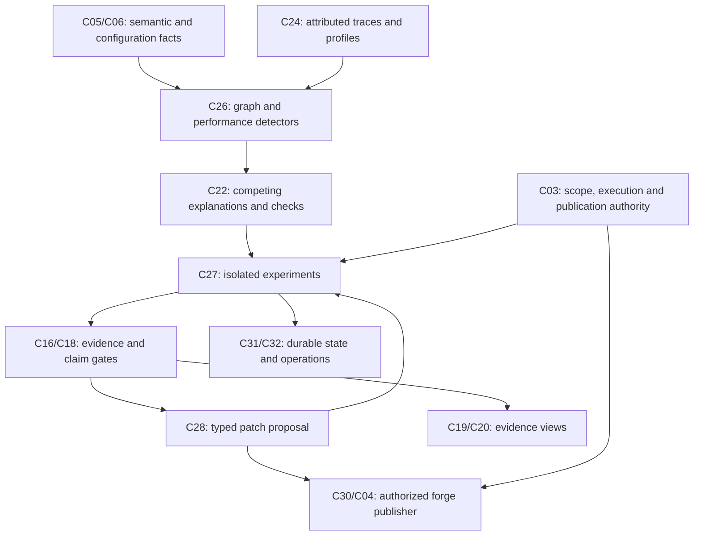

# Deadlock, Race and Performance Detection — Evidence-Backed PR Design

Version 1.0 · 3 October 2026

## 1 Purpose and status

This specification combines graph-based code analysis, runtime profiling, controlled concurrency testing, isolated experiments and code-change proposals into one workflow. The product identifies a suspected defect or bottleneck, gathers evidence, constructs a bounded reproduction, proposes a patch, validates the patch and opens a traceable draft pull request when authorized.

**Status: proposed design, not an implemented detection system.** No tests, benchmarks or repository changes have been performed by writing this document. It extends the existing C26/C27/C28 contracts and uses C22_Hypothesis_Engine_Detailed_Design.md for investigation semantics. New API/schema extensions below require coordinated versioning; they are not already present in the shared component contract.

An actual pull request also requires a target repository and base branch. None is identified for this document. The PR-ready deliverable is this specification; a documentation PR and an implementation/fix PR are different outcomes.

## 2 Detection outcomes and evidence levels

| Outcome | Required evidence | Permitted wording |
|---|---|---|
| Static candidate | Resolved or explicitly partial graph facts and detector rule | “Potential lock-order inversion” or “candidate invariant branch” |
| Dynamic detector report | Instrumented execution report, tool scope and known exclusions | “ThreadSanitizer reported conflicting accesses in this execution” |
| Reproduced failure | Executable harness, inputs, schedule/seed and violated property | “Failure reproduced under environment E” |
| Measured bottleneck | Workload-specific latency/resource/queue evidence | “Connection wait limits this workload at concurrency N” |
| Validated patch | Baseline failure plus candidate checks and regression evidence | “Candidate passes the recorded reproduction and tests” |
| Measured improvement | Comparable repeated baseline/candidate benchmarks | “p95 improved on workload W; limits recorded” |
| Bounded exhaustive result | Tool-certified completed search in a declared finite model | “No violating execution within bounds B and model M” |

“No finding” is not “race-free,” “deadlock-free” or “optimal.” Detector confidence and severity are separate. A test passing is not a formal proof. A generated test must encode an independently reviewable intended property, rather than simply accepting the proposed patch’s behavior.

## 3 Architecture and component responsibility



| Component | Responsibility in this feature |
|---|---|
| C05 | Language-specific control flow, symbols, access paths, aliases and effects; Rust hosts analysis adapters |
| C06 | Build/runtime/database configuration and declared resource relationships |
| C09 | Revision-bound graph traversal and detector input projections |
| C24 | Traces/profiles/waits attributed to build/revision/deployment; quality and sampling metadata |
| C26 | Deadlock/race/performance candidates, safety obligations, workload relevance |
| C22 | Hypothesis lifecycle, alternatives, discriminating plan, interruption and honest completion |
| C27 | Isolated test/model-check/replay/benchmark adapters and resource limits |
| C28 | Patch design, source diff, correctness obligations and validation request |
| C16/C17/C18 | Display verification, calibration/evaluation and immutable evidence/verdict links |
| C19/C20/C21 | Lock cycles, failing schedules, flame graphs, waterfalls, source navigation and user commands |
| C04/C30 | Forge adapter and evidence-faithful PR publication/export, proposed privileged extension |
| C03/C31/C32 | Authorization, durable transactions, retention, supervision and safe telemetry |

Visualization stays read-only. Patch edits happen only in an isolated candidate checkout. Publication is a separate privileged service; it cannot merge, deploy or modify the production checkout. User authorization to create a specific PR covers that operation; no redundant confirmation is required for the same reviewed action. Broad autonomous future publication requires a configured explicit policy.

## 4 Technology adapters and applicability

Use a capability registry, not every tool on every project. Availability, versions, licenses and platform support must be checked when installing the adapter. The entries below identify integration candidates, not selected production dependencies.

| Adapter | Purpose | Integration requirement | Limit |
|---|---|---|---|
| Rust Loom | Explore supported concurrent executions | Harness using Loom primitives and explicit assertions | Bounded supported model; not arbitrary whole-process testing |
| JVM Lincheck | Explore interleavings, check concurrent properties, reproduce trace | Supported JVM test/harness and oracle | Model scope and supported operations apply |
| .NET Coyote | Controlled concurrency and reproducible failure | Supported instrumentation/test harness | Uncontrolled external nondeterminism must be modeled or recorded |
| Native ThreadSanitizer | Report exercised memory data races | Supported instrumented compiler/runtime build | Reports accesses in executed paths; no complete schedule search |
| Valgrind Helgrind/DRD | Pthread synchronization/race checks; lock-order reports | Supported native application/platform | Tool semantics, synchronization models and overhead apply |
| JVM jcstress | Stress memory-model/concurrent outcomes | Annotated allowed/forbidden outcomes | Probabilistic observation; distinguish from exhaustive search |
| Antithesis | System-level controlled environment and fault testing | Workload, assertions, environment setup and applicable instrumentation | External-service scope/cost/privacy decisions required |
| QEMU record/replay | Machine execution replay | Supported emulated environment and replay configuration | Replay alone is not race detection; no default timing-fidelity claim |
| OpenTelemetry | Trace/span linkage for request paths | Instrumented services and collection backend | Missing/sampled spans limit attribution/coverage |
| Linux perf / flame graphs | Sample CPU stacks and visualize hotspots | Supported system permissions, symbols and stack capture | CPU samples do not measure all waiting time |
| JVM async-profiler | CPU/allocation/lock-related profiling where supported | Compatible JVM/platform and event configuration | Separate event semantics and profiling overhead |
| Node performance APIs/profiling | Event-loop utilization/delay and application timings | Node instrumentation plus profiles/traces | Async logical races need separate harnesses; not TSan coverage |
| LLVM analysis/pass concepts | Loop/data-flow analysis and optimization reference | Actual language IR/semantic analysis | We cannot assume all target languages compile through LLVM |

Virtual hardware is optional. For application-level bugs, controlling scheduling/inputs/time/network is usually more direct than emulating a CPU. Hardware weak-memory behavior, language memory models and network operation ordering are separate phenomena; an adapter reports which it models. For performance, use representative native environments for validation; sanitizer/model-checker/emulator timing is not ordinary production timing.

## 5 Graph model and analysis facts

Required graph families: control-flow graph (CFG), def-use/data dependency graph, interprocedural call/effect graph, alias/access-path graph, synchronization/happens-before graph, lock-order graph, wait-for graph and runtime-weighted execution graph.

| Fact | Required metadata |
|---|---|
| Memory access | Entity, access path/allocation abstraction, READ/WRITE, atomic kind, source span, call context |
| Lock operation | Lock identity/alias candidates, acquire/release/try/reentrant kind, held-lock set, source path conditions |
| Async operation | Task/continuation identity, await/yield boundary, external operation and order constraints |
| Effects | Reads/writes, may-block, may-throw, I/O, purity status, unresolved callees |
| Loop | Header/backedges, dominating blocks, trip-count information, exits and nesting |
| Runtime cost | Build ID, event/sample count, exclusive/inclusive duration, wait category, source quality |

Parsed facts, semantic resolution, observed events and inferred relationships remain distinct. Unknown alias/effect facts propagate uncertainty. Dynamic dispatch, reflection, native code and uninstrumented libraries are explicit coverage gaps. C05 needs new registered schemas and language adapters for these deeper facts; the existing import/call graph is insufficient on its own.

## 6 Deadlock detection

### Static lock ordering

1. Resolve lock identities conservatively; retain alias uncertainty.
2. Walk feasible paths and call effects while tracking held locks.
3. Add edge A→B when B may be acquired while A remains held.
4. Compute strongly connected components and extract cycles.
5. Check feasibility constraints: concurrent entry points, path conditions, reentrancy, try-lock behavior and global guards.
6. Emit candidate with two or more acquisition paths and source spans; label unresolved feasibility.

An aggregate order cycle is a potential deadlock, not proof that one execution can realize it. A single reentrant lock or a try-lock recovery path must not be treated as an unconditional blocking cycle.

### Runtime wait analysis

Create task→resource waiting edges and resource→owner edges at a consistent capture point. A stable cycle can support a deadlock diagnosis under the adapter’s ownership/blocking assumptions. Multiple-instance resources require richer analysis than simple cycle detection. Timeouts, cancellation, leases and external progress can break waits; record them before calling a cycle permanent. Distinguish deadlock from long waits, starvation and livelock.

Reproduction: two workers execute conflicting paths with barriers around acquisition; verify the expected liveness property within a declared timeout. A timeout alone is insufficient: capture blocking stacks, wait edges and competing explanations. Patch possibilities include consistent lock order, narrowing scope, eliminating nested acquisition or choosing a different synchronization design. Validate protected-state invariants after every proposed change.

## 7 Race-condition detection

### Memory races

Generate candidate pairs of accesses that may alias, occur concurrently, include a write and lack recognized synchronization. Respect atomic operations and the language memory model; a happens-before gap in an incomplete trace is a candidate, not a guaranteed race. Use instrumented detector reports and schedule-exploration harnesses for supporting evidence.

### Logical races

Detect check-then-act, read-modify-write, stale-cache decisions, cancellation/completion conflicts, duplicate message effects and concurrent transaction invariants. An atomic memory primitive can be race-free while a multi-operation business workflow is incorrect. Async TypeScript races can exist across await boundaries without shared-memory thread races.

Properties must be explicit: one effect per idempotency key; no negative balance; sum conservation; cancellation cannot publish; version compare-and-swap must reject stale updates. Database experiments must use real isolation/locking semantics or label the mocked model as limited. A mocked database schedule does not prove the real database behaves that way.

C27 explores scheduling boundaries through a registered harness. Record build, inputs, scheduling decisions/seed, resource model, adapter/version, invariant failure and replay instructions. Repeat reproduction before patching. After patching, replay the original schedule plus broader schedules and stress runs. Do not edit the property to make the fix pass.

## 8 Performance and graph-driven optimization

| Candidate | Detection evidence | Safety obligations |
|---|---|---|
| I/O inside critical section | Blocking effects under held locks; measured waits | Required atomicity, stale-input checks and protected invariants |
| Lock per iteration | Loop plus acquire/release pattern | Coarsening can increase contention; semantics and fairness |
| Long shared lock | Protected-state dependency graph; hold-time profile | Splitting introduces ordering/consistency risks |
| Invariant loop condition | CFG/data flow/alias effects | Invariance, evaluation side effects, exceptions, empty-loop behavior |
| Repeated pure computation | Def-use/effect facts and measured frequency | Memo/cache identity, lifetime and mutation validity |
| Repeated database/network calls | Call graph, loop cardinality and traces | Query equivalence, ordering, error semantics and memory cost |
| Serial independent work | Dependency graph and critical path | Side effects, bounded parallelism, downstream capacity and cancellation |
| CPU/allocation hotspot | Source-bound samples/allocation profile | Sampling limitations and workload representativeness |
| Pool/queue saturation | Arrival/completion rates, utilization and waits | More capacity may simply move bottleneck downstream |

Loop unswitching moves an invariant branch outside a loop; loop-invariant code motion moves safe invariant computations. Refactor only after validating alias/call effects and concurrent changes, getters/volatile reads, exception timing, empty loops and per-iteration evaluation semantics. The compiler may already perform the optimization. Benchmark the actual build rather than promise improvement from fewer source branches.

Request-path analysis must account for overlapping child operations and self/exclusive time. Do not sum nested span durations or treat the largest inclusive span as the root cause. Reconstruct a bounded event/dependency DAG, retain missing/clock-uncertain regions, then evaluate critical paths and queue/resource constraints. CPU flame graphs aggregate samples; their horizontal axis is not a timeline.

## 9 Investigation and execution protocol

Pipeline: detect → investigate → design reproduction → authorize isolated run → capture evidence → propose patch → validate correctness → compare performance → verify claims → publish draft PR.

| Stage | Durable artifact | Failure disposition |
|---|---|---|
| Detect | Versioned finding with rule and graph evidence | Partial analysis and unresolved symbols retained |
| Investigate | C22 plan, alternatives, scope and gaps | Budget stop yields unresolved conclusion |
| Reproduce | Run manifest, logs, counterexample/coverage | Cannot reproduce ≠ false positive |
| Propose patch | C28 proposal and source diff | Ambiguous behavior requires clarification |
| Validate | Independent tests, replay and regression report | Fail means no validated-fix claim |
| Benchmark | Raw samples, paired comparison and tradeoffs | Inconclusive/negative result retained |
| Publish | PR receipt linking exact validated head | Head drift or revoked grant blocks publication |

Original checkout is immutable. C27 creates an isolated workspace, caps CPU/memory/time/processes/read bytes, restricts network and exposes only approved inputs. Repository build scripts are untrusted executable code and run inside this boundary. Credentials are scoped; production endpoints/data are excluded unless specifically authorized. Containerization alone is not assumed sufficient for arbitrary untrusted native code; backend isolation capability is declared.

## 10 New typed entities and APIs

Shared contracts remain imports. New records below use `defect.v1` registered schemas. Id/Hash/Timestamp/RevisionRef/SourceSpan/EvidenceRef/Budget/Finding/CommitReceipt/Job/ApiResult have existing meanings. Integers are bounded safe JSON integers; costs exact decimal strings. List/Option notation is pseudocode.

```typescript
DetectorFinding {
  id: Id; version: Int; kind: DefectKind; revision: RevisionRef;
  entityIds: List<Id>; spans: List<SourceSpan>; ruleId: Id;
  ruleVersion: Int; evidenceIds: List<Id>; coverageGaps: List<String>;
  severity: Severity; evidenceLevel: EvidenceLevel;
  safetyObligations: List<SafetyObligation>; hypothesisPlanId: Option<Id>;
}
SafetyObligation {
  id: Id; description: String; predicateSchemaId: Id;
  state: ObligationState; evidenceIds: List<Id>;
}
AdapterCapability {
  id: Id; version: String; languageIds: List<Id>; platformIds: List<Id>;
  classes: List<ExperimentKind>; schemas: List<Id>;
  supportsReplay: Bool; modelsWeakMemory: Bool;
  maximumBounds: RegisteredValue; knownExclusions: List<String>;
}
RegisteredValue { schemaId: Id; schemaVersion: Int; value: JsonValue }
ExperimentSpec {
  id: Id; findingId: Id; baselineRevision: RevisionRef;
  candidateHead: Option<Hash>; adapterId: Id; adapterVersion: String;
  kind: ExperimentKind; harnessHandle: Id; harnessHash: Hash;
  oracleSchemaId: Id; fixtureHandles: List<Id>; fixtureHashes: List<Hash>;
  inputs: RegisteredValue; bounds: RegisteredValue;
  budget: Budget; environmentProfileId: Id; executionGrantId: Id;
}
RunManifest {
  id: Id; specId: Id; specHash: Hash; sourceHash: Hash; buildHash: Hash;
  adapterVersion: String; environmentHash: Hash; oracleHash: Hash;
  fixtureHashes: List<Hash>; seed: Option<String>; scheduleHandle: Option<Id>;
  startedAt: Timestamp; finishedAt: Timestamp;
  status: RunStatus; evidenceIds: List<Id>; omissions: List<String>;
}
BenchmarkComparison {
  id: Id; baselineRunIds: List<Id>; candidateRunIds: List<Id>;
  workloadHash: Hash; environmentHash: Hash; primaryMetric: String;
  rawSampleHandle: Id; effectEstimate: Float;
  uncertaintyInterval: Option<NumericInterval>;
  verdict: ComparisonVerdict; regressions: List<String>; limitations: List<String>;
}
NumericInterval { lower: Float; upper: Float; method: String; confidenceLevel: Float }
PatchValidation {
  id: Id; proposalId: Id; baseHash: Hash; headHash: Hash; diffHash: Hash;
  harnessHash: Hash; oracleHash: Hash; runManifestIds: List<Id>;
  benchmarkComparisonIds: List<Id>; obligationIds: List<Id>;
  state: ValidationState; unresolved: List<String>;
}
PrPublication {
  id: Id; repository: String; baseBranch: String; baseHash: Hash;
  headBranch: String; headHash: Hash; proposalId: Id;
  validationId: Id; authorizationId: Id; status: PublicationState;
  prNumber: Option<Int>; prUrl: Option<String>;
}
DefectKind = DEADLOCK_CANDIDATE | MEMORY_RACE | LOGICAL_RACE | STARVATION
           | CONTENTION | CPU_HOTSPOT | ALLOCATION_HOTSPOT | IO_BOTTLENECK
           | QUEUE_SATURATION | LOOP_OPTIMIZATION | REPEATED_EXTERNAL_CALL
Severity = LOW | MEDIUM | HIGH | CRITICAL
EvidenceLevel = STATIC_CANDIDATE | DETECTOR_REPORT | REPRODUCED | MEASURED
              | BOUNDED_EXHAUSTIVE
ObligationState = PENDING | EVIDENCED | FAILED | UNRESOLVED
ExperimentKind = SCHEDULE_SEARCH | RACE_INSTRUMENTATION | STRESS
               | REPLAY | PROFILE | BENCHMARK | SYSTEM_FAULT_TEST
RunStatus = SUCCEEDED | PROPERTY_FAILED | INCONCLUSIVE | INFRA_FAILED
          | CANCELLED | BUDGET_STOPPED
ComparisonVerdict = IMPROVED | REGRESSED | NO_MATERIAL_CHANGE | INCONCLUSIVE
ValidationState = PENDING | FAILED | REVIEWABLE_WITH_LIMITS | PASSED_DEFINED_GATES
PublicationState = PREPARED | PUBLISHING | PUBLISHED | FAILED | CONFLICT
```

All operations take trusted CallContext and return Promise<ApiResult<T>>. Mutations carry idempotency keys and expected resource versions through context/request. These are proposed extensions rather than replacements for current generic operations.

| Component/API | Request | Value returned |
|---|---|---|
| C26.detect | revision, detectorIds, entityIds, runtimeIds, budget | Job<List<DetectorFinding>> |
| C26.explainFinding | findingId, version | DetectorFinding |
| C26.defineObligations | findingId, proposedChangeSchema | List<SafetyObligation> |
| C27.listCapabilities | languageId, platformId | List<AdapterCapability> |
| C27.prepareExperiment | spec: ExperimentSpec | ExperimentSpec |
| C27.runExperiment | specId, expectedVersion | Job<RunManifest> |
| C27.replayExperiment | manifestId, expectedSourceHash | Job<RunManifest> |
| C27.compareBenchmarks | baselineRunIds, candidateRunIds, comparisonPolicyId | BenchmarkComparison |
| C28.proposeFix | findingId, obligationIds, baseHash | Job<PatchProposal> |
| C28.validateFix | proposalId, expectedHeadHash, experimentSpecIds | Job<PatchValidation> |
| C30.preparePullRequest | proposalId, validationId, repository, baseBranch | PrPublication |
| C30.publishPullRequest | publicationId, expectedHeadHash, authorizationId | PrPublication |
| C30.reconcilePublication | publicationId | PrPublication |

PatchProposal is the existing shared proposal entity extended via a registered fix schema, containing candidate diff/source handles and obligation links. Core route allowlists exclude execution/publication until policy enables them. Rust methods retain existing C09 graph/C05 analysis facade; deeper semantic-analysis DTOs require new schema versions. Do not give the browser direct Rust IPC or forge credentials.

## 11 High-level internal function inventory

| Module | Functions |
|---|---|
| Semantic graph builder | extractCfg, resolveAccessPaths, computeDominators, identifyNaturalLoops, summarizeCallEffects, inferMayAlias, extractSyncEdges, retainUnknownEffects |
| Deadlock detector | buildLockOrderGraph, findStronglyConnectedComponents, extractCycleWitness, checkCycleFeasibility, constructWaitForSnapshot, assessLivenessEscape |
| Race detector | enumerateConflictingAccessPairs, analyzeConcurrencyReachability, checkHappensBefore, detectCheckThenAct, deriveInvariantOracle, retainMemoryModelLimits |
| Performance analyzer | attributeProfileSamples, computeExclusiveCosts, reconstructCriticalPath, classifyWaits, detectQueueSaturation, checkLoopInvariance, assessTransformationSafety |
| Harness planner | chooseCapableAdapter, bindReproductionInputs, validateIndependentOracle, selectScheduleBounds, hashManifestInputs |
| Runner | verifyExecutionGrant, createIsolatedCheckout, constrainResourcesAndNetwork, dispatchAdapter, captureRunEvidence, quarantineLateResult, reconcileRunState |
| Patch planner | generateMinimalCandidateDiff, preserveIntendedSemantics, mapChangedEntities, identifyRegressionScope, rejectUnresolvedMandatoryObligations |
| Validator | reproduceBaseline, replayCandidate, broadenScheduleCoverage, runRegressionSuite, compareBenchmarkSamples, detectPropertyWeakening |
| PR publisher | resolveRepositoryAndBase, verifyAuthorizedHead, prepareEvidenceBody, deduplicatePublication, pushScopedBranch, createDraftPr, reconcileAmbiguousForgeResult |

Each function receives the relevant typed records above and returns a checked record or typed failure. Adapter request schemas and language-specific internal IR schemas must be concrete before integration; these function names alone do not implement analyses.

## 12 PR generation and publication gates

1. Resolve the user-specified repository/base branch and authorized scope; read repository instructions and PR template.
2. Create an isolated branch/worktree from an exact base commit. Never overwrite unrelated changes.
3. Link a finding to a minimal diff; retain an independently reviewed correctness property and baseline reproduction.
4. Validate exact candidate source/build hashes, correctness checks and declared performance thresholds.
5. Produce PR title/body and an evidence manifest. Failed gates yield a reviewable proposal/report, not a falsely validated fix.
6. Recheck base/head and authorization before push and PR creation. If base drift makes findings/tests stale, rebase/revalidate or explicitly block.
7. Open a **draft PR**, with no auto-merge/deploy. Store forge receipt; retries reconcile existing branch/PR before creating duplicates.

The C30 publication grant binds repository, base branch, candidate diff/head hash and operation. A changed diff needs revalidation and renewed applicable authority. Browser canvas operations cannot invoke the publisher implicitly. Cancellation fences undispatched publication; if the external PR was already created, reconcile and report that fact instead of claiming it was rolled back.

### PR description template

```markdown
## Problem and behavior
<Concrete trigger, affected paths and observed failure or measured bottleneck.>

## Change
<What changed and why it preserves the intended behavior.>

## Evidence
- Finding ID and source/build revision:
- Baseline reproduction and violated property:
- Candidate replay/schedule coverage:
- Regression checks:
- Benchmark workload/environment/raw report, where applicable:

## Limits
<Unsupported paths, bounded search, unresolved risks and workload limitations.>
```

For a documentation PR, state explicitly that it adds a design and no detectors have been implemented. Benchmark evidence is omitted when irrelevant, rather than fabricated. Sensitive code/traces/prompts are not embedded in public PR attachments; export only authorized sanitized summaries and permitted report locations.

## 13 Benchmark protocol and performance gates

Freeze workload, correctness oracle, dataset, environment, build settings, provider dependencies and metric definitions before comparing patches. Perform warmup, then paired/interleaved baseline-candidate trials to reduce drift. Record all samples and predeclare exclusions. Use separate runs for correctness instrumentation and representative performance.

At minimum report throughput, error rate, p50/p95/p99 latency, CPU, peak memory, allocation/GC where relevant, queue/pool waits and downstream saturation. A faster mean with worse p99 or errors can be a regression. Distinguish load-generator limits and coordinated omission; use an appropriate arrival model and sufficient completed requests to support tail estimates. Thirty process runs alone do not establish a reliable p99.

Acceptance thresholds are workload-specific product decisions. Example policy, not measured outcome: require ≥5% primary-metric improvement with the declared uncertainty method, no correctness failure, and no unacceptable tail/memory/error regression. A result within noise is INCONCLUSIVE or NO_MATERIAL_CHANGE. Rank hotspots by frequency/cost and impact, not only graph centrality. No universal speedup is inferred from one benchmark or simulated hardware.

## 14 Durable state and error recovery

C31 persists findings, detector versions, experiments, attempts, source/build hashes, immutable manifests, proposal versions, validation evidence and publication receipts. Commit state plus outbox atomically. No database lock spans a compiler, profiler, provider or forge network call.

At-least-once job/event delivery uses payload-hash idempotency. Lease expiry fences late attempts. Cancelled or stale-generation results may be kept as quarantined audit evidence but never overwrite current verified findings. Model/framework checkpoints do not override the domain ledger. Runner crashes produce INFRA_FAILED, not a passing test; truncated profiles are marked incomplete.

Publication is an external side effect: persist intent, perform scoped forge action, persist receipt. After timeout, query the unique publication/branch identity before retrying. Do not claim distributed exactly-once publication. Retention/deletion traverses source→experiment→finding→proposal→report dependencies, respecting minimized audit and already-exported artifact limitations.

## 15 Visualization outputs

C19 selects a registered form and C20 uses specialized renderers for lock-order cycles, task/resource waits, schedule swimlanes, source-linked state changes, critical-path waterfalls, CPU/allocation flame graphs, latency distributions and concurrency/throughput curves. Structural ReactFlow alone is not the implementation of all these forms.

Every view includes revision/environment/workload scope, evidence class, source links and coverage gaps. Cause candidates are separate from observed waits. Baseline/candidate views share comparable axes and level; user camera/selection wins over older updates. Numeric charts display units and sample counts; flame graphs are labeled as sample aggregation rather than elapsed-time sequence.

## 16 Acceptance fixtures and tests

| ID | Fixture/test | Pass condition |
|---|---|---|
| DP01 | Realizable two-lock inversion and infeasible-cycle control | Candidate paths retained; no observed-deadlock claim without runtime/reproduction evidence |
| DP02 | Reentrant/try-lock and timeout controls | Correct semantic distinctions; recovery paths not erased |
| DP03 | Lost update, synchronized fixed variant, atomic logical-race variant | Separate memory safety from business invariant failure |
| DP04 | Async await check-then-act | Controlled interleaving reproduces invariant violation |
| DP05 | Loom/Lincheck/Coyote capability exclusions | Unsupported paths reported; no universal safety claim |
| DP06 | Race-detector report under instrumented native build | Source/build/revision matches and detector exclusions recorded |
| DP07 | Sampled/missing traces and duplicate spans | No absence-based exoneration; no duplicate evidence multiplication |
| DP08 | Invariant loop versus mutation/getter/empty-loop controls | Unsafe transforms rejected; safe candidate requires benchmark |
| DP09 | Lock narrowing/coarsening | Protected-state invariants and contention regressions checked |
| DP10 | N+1 and CPU/connection-wait fixtures | Appropriate evidence category and workload-bound ranking |
| DP11 | Parallel trace overlap and clock gaps | No nested-duration double counting; uncertainty explicit |
| DP12 | Baseline failing/candidate passing reproduction | Original property preserved; failing schedule replayed |
| DP13 | Benchmark noise, tail/error/memory regression | Inconclusive/regressed classification; no selective samples |
| DP14 | Malicious build script/network access | Isolated capability limits enforced |
| DP15 | Runner crash/cancel/expired lease | No false success or late publication |
| DP16 | Candidate/base drift after validation | Publication rejected or revalidated |
| DP17 | Forge timeout after successful creation | Reconcile existing draft; no duplicate PR |
| DP18 | Unauthorized repository/egress/export | Zero prohibited action; safe diagnostics |
| DP19 | Documentation-only PR | No implementation or benchmark claims |
| DP20 | Missing calibration or exhausted schedule search | Bounded/inconclusive status preserved |

Acceptance evidence includes raw reports, hashes, environment, tool version, rule version, coverage and reviewer. Genuine positives and negative controls must be independently curated. Detector precision/recall and false-positive burden are measured by detector class; one successful demonstration is not a production accuracy claim.

## 17 Requirement traceability and phased delivery

| Existing requirement checkpoint | Delivery responsibility | Tests |
|---|---|---|
| S6/FR-501/505 | C22 bounded evidence-driven investigations and honest completion | DP05/07/15/20 plus C22 suite |
| S6/FR-508/309 | C27 measured isolated experiments versus inferred counterfactuals | DP12/13/20 |
| S6/FR-402/403 | C28 typed intent/consequence/change proposal pipeline | DP08/09/12/16 |
| S6/FR-404 | No silent code-write path in visualization | DP14/18; separate publisher capability |
| S6/FR-601/602 | Provenance and display gates | DP05/06/07/20 |
| S6/FR-603/604/605/606 | Authorization, minimization, egress and audit/export | DP14/17/18 |
| S6/NFR-04/05/07/08 | Recovery, budget, lifecycle and evidence traceability | DP15/17/18; domain lifecycle checks |
| C26 known lock/race/N+1 acceptance fixtures | Concurrency and workload analysis | DP01–DP13 |

New publication, deep semantic IR, detector adapters and benchmark comparison capabilities extend current contracts. Their complete source-clause mapping must be reviewed; this table is a supporting design mapping, not proof that broad requirements are fulfilled.

**Phase A:** deterministic graph detectors with explicit unknowns; TS async logical-race fixtures; local profiles/traces; report-only findings.

**Phase B:** Loom adapter for Rust, native detector adapter where applicable, isolated run manifests and replay; baseline/candidate regression pipeline.

**Phase C:** JVM/.NET adapters as language scope expands; database/system-level test integration; source-correlated profiles.

**Phase D:** validated patch proposals and authorized draft PR publisher; privacy-safe evidence export and forge recovery.

Antithesis and machine replay adapters are optional later backends rather than prerequisites for local detection. Each adapter requires a supported-platform matrix, schema and oracle contract, isolation assessment, resource budgets and golden positive/negative tests before release.

## 18 Official technology references

Reviewed source references are supplied for design grounding; versions must be pinned after integration checks. These sources describe their own technology and do not establish our product’s implementation or accuracy.

- [Loom](https://github.com/tokio-rs/loom)
- [Lincheck](https://github.com/JetBrains/lincheck)
- [Microsoft Coyote](https://github.com/microsoft/coyote)
- [LLVM ThreadSanitizer](https://clang.llvm.org/docs/ThreadSanitizer.html)
- [Helgrind manual](https://valgrind.org/docs/manual/hg-manual.html)
- [Valgrind DRD manual](https://valgrind.org/docs/manual/drd-manual.html)
- [OpenJDK jcstress](https://github.com/openjdk/jcstress)
- [Antithesis fault controls](https://antithesis.com/docs/product/writing_tests/controlling_faults/)
- [QEMU record/replay](https://www.qemu.org/docs/master/system/replay.html)
- [OpenTelemetry traces](https://opentelemetry.io/docs/concepts/signals/traces/)
- [CPU flame graphs and perf examples](https://www.brendangregg.com/FlameGraphs/cpuflamegraphs.html)
- [async-profiler](https://github.com/async-profiler/async-profiler)
- [Node performance APIs](https://nodejs.org/api/perf_hooks.html)
- [LLVM analysis and transformation passes](https://llvm.org/docs/Passes.html)
