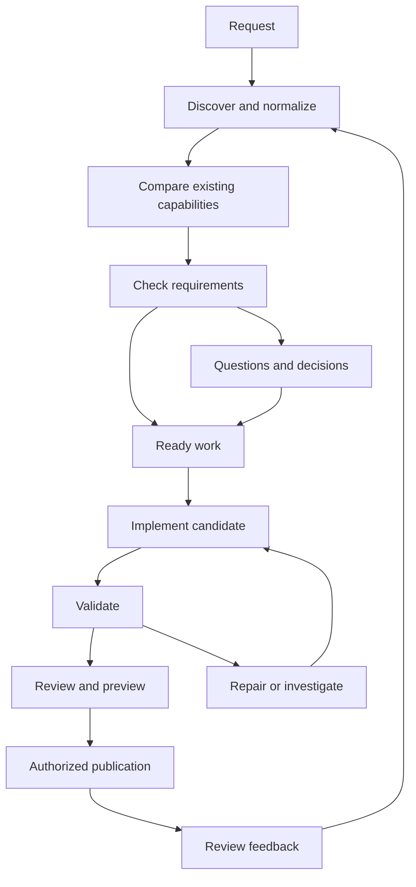

# Prompt-to-feature: detailed product and implementation specification

Version: 1.3 — consolidated development handoff baseline  
Date: 5 October 2026  
Status: proposed specification; implementation and repository conformance not audited  
Capability: add or modify application functionality through natural-language requests  
Architecture: existing C01–C32 component model

Revision 1.3 incorporates implementation-size constraints, canonical identity, discovery coverage, progressive performance profiles, mandatory generated-code security, operational readiness, rollout/revert planning, iterative review, model provenance and GitHub issue lineage, plus evidence-backed capability reuse, concurrent requests and lifecycle completeness, dedicated wizard, validation UI and patch delivery. Sections 28–48 are normative extensions; where they narrow earlier general guidance, these explicit rules apply.

## 1. Purpose and scope

The product shall accept a short feature prompt, a feature brief, a detailed PRD or supporting examples and produce a traceable, reviewable software change. It shall discover existing conventions, clarify material unknowns, detect requirement conflicts, implement in isolation, validate correctness and performance, and explain completion per acceptance criterion.

This document consolidates the discussion about prompt-driven feature addition: flexible inputs, discovery, RBAC, feature contracts, autonomy, scope changes, migrations, integrations, independent validation, previews, completion reporting, low-resource operation, requirement conflict detection and performance impact. It adds proposed implementation schemas, APIs, component assignments and conformance scenarios to make those decisions actionable.

The document is a capability-specific specification. Requirement IDs PF-001 onward are new IDs for this capability, not original master-PRD IDs. It does not claim to replace all product requirements. Existing architecture contracts must be checked in the actual repository before extending them. Pseudocode is an implementation contract proposal, not executable code.

The desired path is: prompt → explicit feature contract → resolved obligations → exact candidate change → independent evidence → reviewable result. A large PRD is optional; sufficient clarity for the affected work is mandatory.

## 2. Goals and boundaries

### 2.1 Goals

- Let a user describe an outcome without knowing framework, schema or component names.
- Reuse existing application patterns and policies rather than impose a new architecture.
- Detect missing requirements, contradictions, ambiguous terms and incompatible contracts before dependent implementation.
- Preserve permissions, tenant/resource scope, data integrity and existing behaviour unless an authorized change explicitly supersedes them.
- Bind validation to exact requirements, code, workloads and environments.
- Assess performance of both the generated feature and the feature-building system.
- Provide inspectable plans, previews, diffs, evidence and publication receipts.
- Continue independent work while a material question blocks only dependent tasks.
- Recover from cancellation, crashes, stale revisions and partial external publication.

### 2.2 Boundaries

The initial release targets bounded changes in an existing runnable application. It does not guarantee arbitrary feature generation, absence of all defects, complete race exploration, correct interpretation of every PRD or performance outside measured domains. Model agreement is not independent proof. Compilation and generated tests alone do not establish business correctness.

Plan, isolated implementation, PR publication, merge, deployment and production migration are distinct operations with distinct authorization. The system may proceed through already authorized reversible work; it shall not invent additional authority from the phrase “add a feature.”

## 3. Actors and authority

| Actor | Responsibilities | Authority boundary |
|---|---|---|
| Feature requester | Describe desired outcome and answer business questions | May lack policy, deployment or data-access change authority |
| Product owner | Resolve business interpretation and scope | Cannot override mandatory project constraints without applicable authority |
| Policy/security owner | Resolve access and security policy changes | Decisions scoped to policy and resource domain |
| Developer/reviewer | Review technical change and validation | Review approval is not automatically deployment authorization |
| Operator | Configure execution environments and deployment actions | Cannot silently redefine feature acceptance |
| Execution service | Implement and validate within granted capabilities | No independent business or publication authority |

Projects shall configure authority through explicit policy bindings and authorized decision roles. The model cannot declare who has authority based on job titles alone. Applicable authority is scope-dependent; a policy for one tenant/workflow does not automatically override an unrelated requirement.

## 4. Inputs and intake

### 4.1 Supported input styles

| Style | Example | Expected discovery |
|---|---|---|
| Core prompt | “Add CSV export to transactions.” | Inspect implementation; clarify access, data scope and material behaviour |
| Feature brief | Actors, behaviour, constraints and a few examples | Resolve omissions and confirm compatibility |
| Detailed PRD | Workflows, RBAC, NFRs and acceptance criteria | Extract atomic statements; detect inconsistencies and gaps |
| Supporting artifact | Screenshot, sample CSV, API example, existing screen | Record which aspects are intended references; do not assume every detail is required |
| Modification request | “Keep the export, but make it asynchronous.” | Create a new contract version and invalidate affected work |

Users may combine styles. Preserve source text and artifact references. Screenshots are evidence of appearance, not automatically permission, persistence or error-handling requirements. Repository/document content is untrusted input for instruction purposes: embedded instructions must not expand tool authority or override the user task.

### 4.2 Intake fields

Required: request text or artifact, target project/repository selection, desired outcome mode. Resolve target from active workspace where unambiguous; otherwise ask before modifying code.

Optional: actors, example inputs/outputs, acceptance criteria, existing issue, target revision, permission expectations, workload, constraints, deadline, execution budget and publication intent. The system shall not demand optional fields when repository discovery can resolve them.

Outcome modes: PLAN, BUILD_PREVIEW, CREATE_DRAFT_PR. Changes to publication intent are recorded. Missing execution prerequisites are reported with concrete remedies, without pretending that a plan is implemented.

### 4.3 Request lifecycle



A request can have ready and blocked work simultaneously. A single global lifecycle must not hide this distinction.

## 5. Repository discovery

Inspect before asking questions that the repository can answer. Discover supported languages, build commands, test suites, app startup, UI components, API/error conventions, existing permissions, tenancy model, data access patterns, background workers, migrations, integrations and observability.

Record extraction coverage. A missing permission registry may mean unsupported discovery, not no authorization. Compiler-resolved relationships and heuristic text matches remain distinct. Tests and code reveal observed behaviour; they do not automatically supersede approved requirements.

Retrieve progressively: locate relevant modules, inspect affected symbols/contracts, expand dependency scope where justified. Avoid sending full repositories to a model by default. Respect authorization before retrieval and before presentation/egress.

Deliverable: RepositoryAssessment with snapshot, conventions, relevant entities, applicable policies, execution prerequisites, existing defects relevant to the request and uncovered areas.

## 6. Requirement normalization and feature contract

### 6.1 Atomic requirement structure

Every normalized statement shall include stable ID, source locator, exact source/version reference, normalized text, actor/action/resource where relevant, applicability conditions, requirement type, authority binding, priority and dependencies. Preserve the original statement even if split into multiple requirements.

Requirement types: FUNCTIONAL, ACCESS, INVARIANT, DATA, INTEGRATION, NONFUNCTIONAL, UX, COMPATIBILITY, OPERATIONAL. Origins: USER, APPROVED_POLICY, APPROVED_REQUIREMENT, REPOSITORY_CONVENTION, OBSERVED_BEHAVIOUR, PROPOSED_ASSUMPTION.

A proposed assumption is never automatically promoted to an approved requirement. A detailed PRD may contain conflicts and omissions; length does not establish quality.

### 6.2 Feature contract sections

| Section | Required content |
|---|---|
| Outcome | Desired user/business result |
| Scope | Included changes, prerequisites and explicit exclusions |
| Actors/access | Actions, resource scopes, field access and conditions |
| Behaviour | Main flow, alternatives, state transitions and errors |
| Data | Reads/writes, historical records, retention and migration |
| Integrations | Contracts, real/mock status, authentication and failure handling |
| NFRs | Relevant workload, latency, memory, throughput, accessibility and costs |
| Acceptance | Observable criteria and independent expected results |
| Assumptions | Origin, reversibility, affected work and expiry/revisit trigger |
| Open obligations | Questions, conflicts, dependencies and blockers |
| Traceability | Requirements → tasks → edits → tests → evidence → decisions |
| Operations | Instrumentation, abuse controls, owner and runbook according to applicability |
| Release/recovery | Rollout, monitoring and revert strategy; deployment authorization is separate |
| Provenance | Request issue, file mutation inventory and model invocation references |
| Existing capabilities | Behaviour overlap, reuse strategy, availability and regressions |
| Lifecycle compatibility | Concurrent requests, consumers and retirement obligations |

Scale the contract to the risk and scope. A copy change does not need a complete distributed-systems design; an authorization-sensitive financial workflow does.

### 6.3 Testability and examples

Transform vague terms into proposed measurable criteria: “fast,” “secure,” “large” and “all” require scope. Do not silently choose business thresholds. Provide examples covering ordinary, boundary and denied behaviour. For calculations, capture independently established expected outputs. For UI, include interactions and accessibility, not only appearance.

## 7. Clarification strategy

### 7.1 Ask versus infer

| Situation | Action |
|---|---|
| Different plausible meanings change business behaviour | Ask |
| New access rights are not settled by policy | Ask an authorized owner |
| Established error/UI/build convention | Inspect and reuse |
| Routine reversible technical choice | Decide and record rationale where material |
| Low-impact preference | Use visible assumption, allow correction |
| Contradictory policy/requirement | Show conflict and seek scoped resolution |
| External contract unavailable | Obtain evidence or mark dependent work blocked |

Questions shall be focused, explain impact and offer concrete choices when useful. Prefer two or three related questions per batch. Do not repeatedly ask answered questions unless applicability changed. Time elapsed without an answer is not approval for a material policy or business decision.

### 7.2 Dependency-aware progress

Each question links to affected requirement/task IDs. Independent tasks may proceed. Permission enforcement cannot be completed against an unresolved permission rule, but existing screen analysis or build setup can continue. UI must show precisely what is blocked and what is progressing.

Answers create versioned DecisionRecords with actor, authority, rationale, affected IDs and source. Concurrent decisions use optimistic version checks; conflicting answers become a new issue rather than last-write-wins.

## 8. Requirement quality and conflicts

### 8.1 Checks

| Type | Example | Finding treatment |
|---|---|---|
| Direct contradiction | All rows versus filtered rows | Witness demonstrating incompatible obligations |
| Access conflict | Support role receives prohibited global data | Block affected access implementation |
| Scope ambiguity | Tenant-wide versus system-wide “all” | Clarification |
| Workflow conflict | Cancel after irreversible settlement | Clarify cancellation/reversal semantics |
| Contract conflict | Remove a field required by consumers | Compatibility analysis |
| Invariant violation | Debit allows negative balance | Blocking invariant finding |
| NFR tension | Arbitrary-size immediate export with bounded resources | Feasibility tradeoff, not automatically logical contradiction |
| Missing requirement | No permission rule for sensitive export | Gap/obligation |
| Unverifiable requirement | “Always fast” | Measurable criterion proposal |
| Dependency gap | Missing provider contract | Block integration; permit independent work |
| Implementation mismatch | Policy denies access but code permits | Possible existing defect |
| Duplicate/overlap | Two partly equivalent stories | Link, reconcile differences; preserve sources |
| Terminology mismatch | Customer versus wallet owner | Resolve domain meaning |
| Change-impact gap | Requirement changed but tests still assert old behaviour | Invalidate affected artifacts |

Potential contradiction, confirmed contradiction, ambiguity, gap and tradeoff are separate classifications. A model-generated concern shall not be presented as a confirmed conflict without supporting evidence.

### 8.2 Detection pipeline

1. Extract statements and normalize scope, actors and conditions.
2. Resolve terminology against project glossary and actual entities; record uncertainty.
3. Retrieve related policies, contracts and prior requirements using authorized scope.
4. Run deterministic checks on explicit constraints, access and state transitions.
5. Use model-assisted reasoning to propose semantic findings.
6. Verify applicability: two statements about different populations/time periods may be compatible.
7. Attach a minimal conflicting set where possible and a witness scenario for contradictions.
8. Rank by material impact and certainty; show evidence rather than an unexplained score.
9. Resolve through authorized decisions; update contract and affected tasks.

Formal constraint solvers are optional for precisely encoded predicates. A solver result is scoped to the encoding, assumptions and solver version; it does not resolve undefined business vocabulary. Failure to find a conflict is not proof of global consistency.

### 8.3 Conflict resolution

Resolution choices include clarify scope, amend the new request, revise an existing requirement through authorized change, add compatibility support, defer part of the feature, or dismiss a false finding with rationale. Preserve superseded statements and decision lineage.

Never assume the newest prompt overrides policy. Authority ordering is configured and scoped. Code and conventions cannot authorize broader data access. Resolution shall update acceptance criteria and tests, not just close a dialogue entry.

## 9. RBAC, resource scope and data protection

For each action model actor/role, permission, resource population, tenant/ownership relationship, fields, conditional attributes, approval and audit. Support RBAC and existing ABAC/ownership constraints; do not force every application into a role-only model.

Example export matrix:

| Dimension | Example obligation |
|---|---|
| Actor | Authorized finance operator |
| Action | Create and retrieve transaction export |
| Resource | Transactions in permitted tenant/account scope |
| Fields | Sensitive account fields masked according to policy |
| Conditions | Permitted date range and session state |
| Lifecycle | Recheck applicable authority at job execution/download |
| Audit | Actor, request scope, outcome and export artifact reference |

Enforce server-side access at APIs, worker boundaries and download retrieval. Do not serialize unauthorized fields and rely on frontend hiding. Preserve row-level restrictions in aggregation/export. Define revocation behaviour for queued/running jobs and already generated artifacts; default implementation follows approved retention/revocation policy rather than inventing one.

Test direct requests, guessed artifact IDs, cross-tenant scope, field masking, changed permissions and background execution. User input and retrieved documents must not inject new privileges into agent execution.

## 10. Scope, planning and change management

Plan tasks against contract requirements. Classify work as requested behaviour, necessary prerequisite, existing defect affecting acceptance or optional improvement. Optional refactoring does not silently enter the feature scope.

For each task define owner component, dependencies, expected edits, acceptance obligations, execution capabilities, budget and completion evidence. Estimates are estimates; do not present model-generated duration as measured delivery certainty.

A user change creates a new immutable contract version. Recompute impact and mark dependent plans, candidate validations and certificates stale. Reuse unaffected artifacts only when their complete dependency binding remains valid. If an apparently independent result depends on shared configuration or policy, invalidate it too.

Base repository changes also trigger impact analysis. Rebase/conflict resolution changes the candidate; validate the resulting exact content. Do not carry a certificate from a different patch.

## 11. Implementation and execution

C28 owns candidate changes. Use isolated worktrees/checkouts and exact edits. Preserve user's working changes. Record base commit/content hashes, candidate content root and diff hash. Follow existing structure and supported toolchain.

Execution capabilities specify allowed commands/tools, filesystem roots, network destinations, secret references, CPU/memory/time limits and publication scopes. Restricted process spawning is not by itself proof of full isolation; audit actual isolation guarantees before reusing the existing defect runner.

Generate code, tests, configuration, migrations and operational instructions as required by the contract. Never silently remove original assertions. Legitimate test expectation changes require a linked requirement/property-change decision. Review both originalOracleHash and candidateOracleHash; automatic diff checks detect some weakening but do not solve general semantic equivalence.

Stop repair loops at budget/attempt limits and return concrete unresolved diagnostics. Do not turn a repeated failure into success by dropping a mandatory check.

## 12. Data migrations and integrations

### 12.1 Migrations

Specify schema compatibility, deployment sequence, historical-data behaviour, backfill, locking/resource impact, retry/idempotency, recovery and rollback limitations. Expand/contract migrations may be appropriate, but are not universally required. Destructive actions require applicable authorization. Local migration success does not demonstrate production-scale safety.

### 12.2 External services

Bind versioned request/response schemas, authentication, rate limits, timeout/retry policy and duplicate-effect prevention. Distinguish contract fixture tests, provider sandbox tests and real provider observations. Missing credentials/contracts produce blocked or unvalidated status, not invented successful integration.

### 12.3 Background jobs

Record job identity, authorization context, immutable workload, progress, cancellation and outcomes. Recheck policy where required at execution and artifact retrieval. Specify partial artifact handling, retention and audit. No blind retry for non-idempotent external effects.

## 13. Independent correctness validation

Validation sources include user acceptance examples, existing regressions, approved policies/invariants, independent fixtures/reference calculations, browser execution and negative tests. Generated tests are useful but may share the same misunderstanding as generated code.

Every validation result binds contract version, candidate content, harness, fixture, toolchain, environment and oracle. Different validation kinds remain separate: compile, static check, unit, integration, browser, security, migration, performance and real-provider tests.

Capture all outcomes, including skipped tests, failures, timeouts and infrastructure errors. A test infrastructure failure is not necessarily a product defect, but cannot satisfy mandatory validation. Preserve original failing reproduction and compare candidate results against it.

Browser validation must drive actual user interactions, inspect access behaviour and use representative viewport/role/data configurations. A screenshot alone is not functional evidence. Automated accessibility checks complement, rather than guarantee, full accessibility.

## 14. Performance requirements and risk analysis

### 14.1 Two performance domains

A. Target application: latency, throughput, memory, queues, locks, database, external services, network and operating cost. B. Builder: indexing, model calls, layout, storage writes and experiment resources. Resource contention between builder and target benchmarks must be controlled or disclosed.

### 14.2 Performance discovery

Capture expected workload populations, dataset cardinality/distribution, concurrency, arrival pattern, burstiness, payload sizes, cold/warm state, external latency and deployment resources. Reuse approved budgets where applicable; ask for material unknowns. Do not assign one universal allowable regression percentage.

A budget identifies metric, unit, aggregation, workload domain, absolute limit, allowed delta where relevant, correctness/error constraints, measurement method and authority. “Fast” cannot be validated without a defined workload and criterion.

### 14.3 Static risk assessment

Inspect changed query plans/access patterns, scans, N+1 calls, loops, serialization, allocations, locks, transactions, retries, queues and cache invalidation. C05/C09 provide structure, C23 determines affected surfaces and C26 proposes mechanisms. Static findings are risk hypotheses unless a deterministic property establishes the claim; they do not measure regression size.

Do not optimize by weakening security or semantics. Streaming reduces memory but may hold connections longer. Caching can create stale access decisions. Asynchronous work changes progress/error/cancellation behaviour. Moving a condition outside a loop requires invariance and side-effect checks. Removing a lock requires a correctness argument and validation.

## 15. Paired performance experiments

### 15.1 Required comparisons

The first mandatory performance profile for performance-applicable features contains four cases: baseline ordinary traffic; candidate ordinary traffic with feature idle; candidate ordinary traffic with the feature active; and one representative large-data case. Section 30 defines equivalence, budgets and escalation. Concurrent feature load, slow clients, cancellation and provider/database degradation are progressive cases, becoming mandatory when risk or requirements demand them. Ordinary traffic continues during feature-active cases to assess interference. No reduced profile establishes untested production capacity.

### 15.2 Experiment design

- Bind exact baseline/candidate code and build/toolchain identity.
- Use equivalent fixtures, workload/environment and configuration; disclose any intentional difference.
- Repeat runs when variability matters; predeclare warmup, ordering/randomization and stopping rules.
- Keep successful requests, errors, timeouts and cancellations in the population.
- Report latency distribution, throughput, error rate and resource use together.
- Retain raw/aggregate artifacts sufficient to inspect the calculation.
- Record sampling gaps, measurement overhead and confidence/uncertainty method.
- Separate observed deltas from causal attribution; an isolated controlled intervention supports a scoped conclusion, not universal proof.

Performance result states: WITHIN_BUDGET, REGRESSION, INCONCLUSIVE, UNVALIDATED, NOT_APPLICABLE. NOT_APPLICABLE requires a rationale. No representative environment means unvalidated, not “no regression.” Statistical significance and practical budget compliance are different checks.

### 15.3 Performance publication gate

Mandatory performance criteria block verified completion when failed or incomplete. Nonmandatory exploratory measurements are disclosed. Baseline already violating a budget cannot automatically justify further regression. An intentional tradeoff needs a scoped authorized decision and revised criterion, not an erased result.

Production telemetry, when separately authorized, can confirm or challenge pre-release results. Deployment and rollback remain separate operations. Simulation is optional future evidence and requires calibrated domain certificates; do not substitute unvalidated models for native measurement.

## 16. Builder efficiency and low-resource operation

Use incremental extraction, content-addressed artifacts, cached exact-bound evidence and progressive retrieval. Deterministic tools handle parsing and known checks; models handle interpretation/planning where useful. Record local/external provider configuration and egress consent. Availability of a local model does not establish quality.

C07 schedules interactive work and invalidation ahead of bulk analysis/experiments. Cap concurrent runners and model calls, bound graph traversal and layout, expose budgets and cancellation. Expensive verification is cached only on complete identity/authority bindings; render-time checks verify freshness and artifact identity without rerunning model reasoning per frame.

Benchmark on declared hardware profiles, including a low-resource laptop profile selected by the project. Numerical latency/RAM targets must be established and measured rather than invented. Builder telemetry records wall time, queue time, peak memory, model tokens/cost, cache reuse and validation resource consumption.

## 17. Preview, reporting and publication

Preview shows runnable feature flows, relevant roles, representative data, failure paths, changed behaviour, mock labels and limitations. Backend-only work uses executable API examples/results. Include architectural impact and exact diff for reviewers.

Completion has two axes: implementation (NOT_STARTED, IN_PROGRESS, IMPLEMENTED, BLOCKED, OUT_OF_SCOPE) and validation (NOT_RUN, PASS, FAIL, INCOMPLETE, STALE, NOT_APPLICABLE). Each criterion links to code/tasks and evidence. A whole-feature summary derives from mandatory criteria; implemented but unvalidated cannot become verified complete.

C16 issues a purpose-bound publication decision against contract, candidate and evidence. C19 binds wording/caveats to presentation items; C20 cannot strengthen claim class. C30 checks freshness again before forge publication. Draft PR, merge and deployment are distinct. Idempotent receipts and reconciliation handle ambiguous network failures.

## 18. Core entities

```typescript
type Id = string; type Hash = string; type Timestamp = string;
type SourceRef = {artifactId:Id; version: string; locator:string; contentHash:Hash};
type Context = {actorId:Id; projectId:Id; authorizationScopeHash:Hash;
  purpose:string; correlationId:Id; deadline:Timestamp; cancellationId:Id};
type Snapshot = {repositoryId:Id; commitHash:Hash; contentRootHash:Hash;
  indexGeneration:number; toolchainHash:Hash};
type Requirement = {id:Id; source:SourceRef; text:string; origin:string;
  type:string; actorIds:Id[]; action?:string; resourceScope?:string;
  conditions:string[]; authorityBindingId?:Id; dependsOn:Id[];
  acceptanceIds:Id[]; status:'ACTIVE'|'SUPERSEDED'|'PROPOSED'};
type AcceptanceCriterion = {id:Id; requirementIds:Id[]; scenario:string;
  expectedOutcome:string; mandatory:boolean; oracleSourceRefs:SourceRef[];
  validationKinds:string[]; performanceBudgetId?:Id};
type FeatureContract = {id:Id; version:number; hash:Hash; requestId:Id;
  snapshot:Snapshot; requirements:Requirement[]; acceptance:AcceptanceCriterion[];
  assumptions:Assumption[]; obligationIds:Id[]; authorityPolicyHash:Hash};
type Assumption = {id:Id; text:string; rationale:string; sourceRefs:SourceRef[];
  reversible:boolean; affectedIds:Id[]; state:'PROPOSED'|'ACCEPTED'|'REJECTED';
  revisitTrigger:string};
type RequirementFinding = {id:Id; kind:string; requirementIds:Id[];
  sourceRefs:SourceRef[]; scope:string; explanation:string; witness?:string;
  status:'POTENTIAL'|'CONFIRMED'|'RESOLVED'|'DISMISSED';
  blockingTaskIds:Id[]; options:ResolutionOption[]; decisionId?:Id};
type ResolutionOption = {id:Id; description:string; impacts:string[];
  requiredAuthority:string};
type DecisionRecord = {id:Id; actorId:Id; authorityBindingId:Id;
  contractVersion:number; affectedIds:Id[]; decision:string; rationale:string;
  createdAt:Timestamp; supersedesId?:Id};
type FeatureTask = {id:Id; componentId:string; requirementIds:Id[];
  dependencyTaskIds:Id[]; obligationIds:Id[]; plannedEdits:string[];
  capabilityIds:Id[]; state:string; evidenceIds:Id[]};
type PatchBinding = {repositoryId:Id; baseCommitHash:Hash; baseContentHash:Hash;
  candidateContentHash:Hash; diffHash:Hash; contractHash:Hash;
  originalOracleHash:Hash; candidateOracleHash:Hash;
  propertyChangeReviewId?:Id; runManifestIds:Id[]};
type RunManifest = {id:Id; contractHash:Hash; contentHash:Hash; buildHash:Hash;
  harnessHash:Hash; fixtureHash:Hash; workloadHash:Hash; environmentHash:Hash;
  toolchainHash:Hash; oracleHash:Hash; outcomesArtifactHash:Hash;
  generationProvenanceHash:Hash; modelIdentityHashes:Hash[];
  startedAt:Timestamp; completedAt?:Timestamp; exitStatus:string};
type ValidationResult = {id:Id; acceptanceId:Id; kind:string; runManifestId:Id;
  status:'PASS'|'FAIL'|'INCOMPLETE'|'STALE'; evidenceIds:Id[]; gaps:string[]};
type PerformanceBudget = {id:Id; metric:string; units:string; aggregation:string;
  workloadDomainHash:Hash; absoluteLimit?:number; allowedDelta?:number;
  errorConstraints:string[]; measurementPlanHash:Hash; authorityBindingId:Id};
type PairedExperiment = {id:Id; baselineManifestIds:Id[]; candidateManifestIds:Id[];
  populationHash:Hash; budgetIds:Id[]; analysisPolicyHash:Hash;
  state:'WITHIN_BUDGET'|'REGRESSION'|'INCONCLUSIVE'|'UNVALIDATED'};
type TraceLink = {fromId:Id; toId:Id; relation:string; sourceRefs:SourceRef[]};
type PublicationDecision = {id:Id; purpose:string; contractHash:Hash;
  patchBindingHash:Hash; evidenceSetHash:Hash; authorityScopeHash:Hash;
  manifestHash:Hash; status:'ALLOW'|'BLOCK'|'INCOMPLETE'|'STALE'; reasons:string[]};
type Outcome<T> = {status:'COMPLETE'|'PARTIAL'|'FAILED'|'CANCELLED'|'STALE';
  value?:T; evidenceIds:Id[]; diagnostics:string[]};
```

These entities must be schema-versioned. Hash canonical serialized inputs with a documented algorithm; specify ordering and exclusions. Hashes establish identity, not truth or authorization. Store sensitive source payloads under access/retention controls; audit records need not duplicate private content indefinitely.

## 19. Public component contracts

All operations receive Context. Long operations return a durable job ID and eventually Outcome<T>. Mutations require idempotency keys and expected versions where applicable. Empty results include coverage; errors remain typed in implementation.

```typescript
C02.submitFeature(ctx, {inputRefs, text, repositoryId, mode, budget, idempotencyKey})
  -> FeatureRequest
C10.discoverFeatureContext(ctx, {requestId, snapshot, retrievalBudget})
  -> Outcome<RepositoryAssessment>
C15.normalizeRequirements(ctx, {requestId, sourceRefs, assessmentId})
  -> Outcome<FeatureContractDraft>
C15.detectSemanticConflicts(ctx, {contractHash, relatedSourceRefs})
  -> Outcome<RequirementFinding[]>
C25.checkRequirementConstraints(ctx, {contractHash, policyHashes, invariantIds})
  -> Outcome<RequirementFinding[]>
C23.assessFeatureImpact(ctx, {contractHash, snapshot}) -> Outcome<ImpactAssessment>
C22.planClarifications(ctx, {contractHash, findingIds, obligationIds})
  -> Outcome<QuestionBatch>
C02.recordDecision(ctx, {contractId, expectedVersion, questionId, answer,
  authorityBindingId, idempotencyKey}) -> DecisionRecord
C15.reviseContract(ctx, {contractId, expectedVersion, decisionIds})
  -> Outcome<FeatureContract>
C28.planFeatureChange(ctx, {contractHash, impactAssessmentId, capabilities})
  -> Outcome<FeaturePlan>
C28.materializeCandidate(ctx, {planId, snapshot, idempotencyKey})
  -> Job<Outcome<PatchBinding>>
C26.assessPerformanceRisk(ctx, {contractHash, patchBindingHash, runtimeEvidenceIds})
  -> Outcome<PerformanceRiskAssessment>
C27.runValidation(ctx, {patchBindingHash, validationPlanHash, budget})
  -> Job<Outcome<ValidationResult[]>>
C27.runPairedBenchmark(ctx, {baselineSnapshot, patchBindingHash,
  workloadHash, environmentHash, measurementPlanHash, budget})
  -> Job<Outcome<PairedExperiment>>
C26.evaluatePerformance(ctx, {pairedExperimentId, budgetIds, analysisPolicyHash})
  -> Outcome<PerformanceAssessment>
C16.verifyFeature(ctx, {contractHash, patchBindingHash, validationIds,
  performanceAssessmentIds, unresolvedFindingIds, purpose})
  -> PublicationDecision
C19.compileFeatureReview(ctx, {requestId, contractHash, decisionId})
  -> Outcome<{viewSpec, presentationManifest}>
C30.publishFeaturePR(ctx, {proposalId, decisionId, expectedHeadHash,
  destination, idempotencyKey}) -> PublicationReceipt
C07.cancelFeature(ctx, {requestId, reason}) -> CancellationReceipt
```

Existing C16 verify/revalidate/verifyView and C27 scenario APIs remain supported through adapters or explicit versioned extensions. Do not add an arbitrary executor to canvas handlers. C21 converts gestures to typed intents; execution remains C28/C27-owned.

## 20. Rust and RPC boundary

C05–C09 Rust services perform deterministic extraction/identity/graph work where that architecture is used. Node/TypeScript components own feature orchestration, clarification, provider adapters and forge publication. Do not duplicate compiler semantics in model reasoning.

Proposed RPC request envelope: schemaVersion, requestId, correlationId, snapshot, authorizationScopeHash, operation, deadline, cancellationId and typed payload. Response: same request/snapshot, status, typed result, evidence artifact references, coverage and diagnostics. Carry bounded pagination/chunking for large outputs. Reject schema mismatch explicitly.

Candidate RPC operations: ExtractAffectedSymbols, ResolveDefinitions, QueryReferences, ExtractChangedDependencies, AnalyzeControlFlow, QueryBoundedGraph. Rust services return facts and extraction gaps; C25/C26 interpret rule/performance obligations and C16 verifies presentation authority. CancelJob and GetJobStatus are control operations. RPC retry deduplicates by request ID and exact payload identity; a reused ID with changed payload is rejected.

## 21. Component implementation assignments

| Component | Required responsibilities and high-level functions |
|---|---|
| C01 Shell/IDE | Intake, role preview, questions, criterion status, source/diff navigation; showFeature, showBlockers, launchPreview |
| C02 Journal/commands | Versioned request/answer/intent journal; submitFeature, recordDecision, resumeRequest |
| C03 Auth/egress | Task capabilities, policy decision authority, private-source egress and publication checks; authorizeOperation, filterSources |
| C04 Connectors | Repository, issue, contract and forge adapters; fetchSnapshot, fetchPR, reconcilePublication |
| C05 Language/Rust | Precise changed-symbol and query/call structure; extractSymbols, resolveCalls, analyzeChangedCode |
| C06 Artifacts | Immutable source, fixture, build and result artifacts; ingestArtifact, resolveContentHash |
| C07 Scheduler | Jobs, priorities, budgets, cancellation and generation fences; enqueue, coalesce, cancel, rejectLateResult |
| C08 Registry | Requirement/entity/source revision identity; bindEntity, resolveRevision |
| C09 Graph | Typed dependencies and bounded impact traversal; queryImpact, linkRequirementImplementation |
| C10 Retrieval | Authorized policies/conventions/contracts/source context; retrieveApplicableSources, discloseCoverage |
| C11 Concepts/memory | Approved glossary and decisions with source/expiry; resolveTerm, retrievePriorDecision |
| C12 Context | Maintain bounded relevant task context; selectContext, updateTaskFocus |
| C13 Workspaces | Preview/review state and stable selected artifacts; saveReviewState, restoreBoundState |
| C14 Model gateway | Provider, local/external configuration, budgets/egress; invokeModel, accountUsage |
| C15 Reasoning | Normalize requirements, propose conflicts, plans and grounded edits; normalize, detectSemanticConflict, reviseContract |
| C16 Verification | Requirement/finding/evidence validation and purpose-bound gate; verifyFinding, verifyFeature, invalidateDecision |
| C17 Evaluation | Independent oracle/fixture and browser conformance; evaluateConflictDetector, runConformanceSuite |
| C18 Ledger | Requirements, assumptions, conflicts, decisions and evidence lineage; recordFinding, recordResolution, linkEvidence |
| C19 Compiler | Review/impact/status representation and manifest/template bindings; compileReview, bindPresentationItems |
| C20 Renderer | Faithful preview/report/chart display, readable labels and caveats; renderReview, renderMetrics |
| C21 Interactions | Prompt/gesture referents and typed action intent; resolveReferent, submitAction |
| C22 Investigation | Clarification/experiment planning and bounded unknown resolution; planQuestions, investigateObligation |
| C23 History/PR | Existing/new requirement and compatibility impact; compareContracts, assessImpact, analyzeDiff |
| C24 Runtime | Trace/profile baseline and measured attribution; queryBaseline, attributeSamples |
| C25 Security/invariants | Access rules, invariant/constraint and scanner checks; checkAccessMatrix, checkConstraints |
| C26 Performance | Static risks, budgets, populations and regression interpretation; assessRisk, defineMeasurementPlan, evaluateDelta |
| C27 Experiments | Isolated correctness/browser/paired performance execution; runValidation, runPairedExperiment |
| C28 Proposals | Exact edits, candidate identity, original-oracle preservation and repair; planChange, buildCandidate, compareOracles |
| C29 Collaboration | Authorized owner/reviewer assignment and resolution discussions; assignDecisionOwner, requestReview |
| C30 Publication | Bound export/draft PR and receipts; publishDraftPR, updateCheck, reconcileReceipt |
| C31 Storage | Immutable versions, traceability index, job/outbox transaction and retention; commitVersion, queryLineage |
| C32 Operations | Lag/latency/cost/resource/coverage visibility; recordRunMetrics, monitorQueues |

Supporting components are reused, not newly rebuilt for each feature. Not every task needs all 32 components to execute. Component assignments describe ownership, not a requirement to create one service per component.

## 22. State, persistence and recovery

Request states: RECEIVED, DISCOVERING, CONTRACTING, IMPLEMENTING, VALIDATING, REVIEW_READY, PUBLISHED, CANCELLED, FAILED. Separate readiness flags indicate blocked obligations and available independent tasks. Tasks track READY, RUNNING, BLOCKED, COMPLETE, FAILED, CANCELLED, STALE.

Persist immutable contract versions, decision records, patch bindings, manifests and evidence. Maintain mutable pointers through compare-and-swap updates. Job receipt, generation change and outbox events are atomic where needed. At-least-once delivery requires consumer deduplication; no exactly-once claim across external forge boundaries.

On crash, reconcile in-flight runner/forge state before retry. On cancellation, stop runner work where possible, fence late results and disclose external effects already completed. On authorization revocation, immediately block new reads/execution/publication and apply policy to retained artifacts. On base or requirement change, calculate affected closure and mark dependent decisions stale before background recomputation.

Event examples: FeatureSubmitted, ContractVersionCreated, RequirementFindingRaised, DecisionRecorded, TaskBlocked, CandidateCreated, ValidationCompleted, PerformanceAssessed, VerificationInvalidated, PublicationRequested, PublicationReconciled. Events carry IDs/hashes and minimal metadata, not unrestricted private payloads.

## 23. Requirement-to-component matrix

| ID | Mandatory requirement | Primary owner | Supporting components |
|---|---|---|---|
| PF-001 | Accept core prompt, brief, PRD and references | C02 | C01,C06 |
| PF-002 | Resolve target and outcome mode | C02 | C01,C03,C04 |
| PF-003 | Preserve source/version provenance | C18 | C06,C08,C31 |
| PF-004 | Discover conventions before avoidable questions | C10 | C04–C09,C12 |
| PF-005 | Extract atomic scoped requirements | C15 | C11,C18 |
| PF-006 | Build versioned feature contract | C15 | C18,C31 |
| PF-007 | Separate assumptions from approved obligations | C18 | C15,C16 |
| PF-008 | Ask material focused questions | C22 | C01,C02,C15 |
| PF-009 | Continue independent work | C07 | C22,C28 |
| PF-010 | Check direct and semantic contradictions | C15 | C25,C16,C10 |
| PF-011 | Distinguish ambiguity/gap/tradeoff/conflict | C16 | C15,C18 |
| PF-012 | Check configured scoped authority | C03 | C25,C18 |
| PF-013 | Explain witness and resolution options | C15 | C22,C01 |
| PF-014 | Record authorized resolution and propagate it | C18 | C02,C23,C28 |
| PF-015 | Check completeness/testability/feasibility | C22 | C15,C25,C26 |
| PF-016 | Enforce action/row/field access | C25 | C03,C28,C27 |
| PF-017 | Preserve tenancy and background/download policy | C25 | C03,C28,C27 |
| PF-018 | Separate scope/prerequisites/follow-ups | C28 | C23,C15 |
| PF-019 | Invalidate affected artifacts on requirement change | C23 | C07,C16,C31 |
| PF-020 | Isolated exact candidate implementation | C28 | C27,C03,C06 |
| PF-021 | Preserve original oracle and review property changes | C28 | C16,C17,C18 |
| PF-022 | Specify migration/history/compatibility | C23 | C28,C25,C27 |
| PF-023 | Bind integrations and label mocks | C04 | C28,C27,C16 |
| PF-024 | Validate independently per criterion | C27 | C17,C16,C18 |
| PF-025 | Execute actual browser checks for UI | C27 | C17,C01 |
| PF-026 | Capture full outcome populations | C27 | C26,C16 |
| PF-027 | Discover performance workload and budgets | C26 | C24,C22 |
| PF-028 | Identify static performance risks | C26 | C05,C09,C23 |
| PF-029 | Run paired equivalent experiments | C27 | C26,C24 |
| PF-030 | Measure shared-resource interference | C26 | C27,C24 |
| PF-031 | Report uncertainty/unvalidated performance | C16 | C26,C19,C20 |
| PF-032 | Bound builder cost and resource contention | C07 | C14,C31,C32 |
| PF-033 | Provide usable role-aware preview | C01 | C19,C20,C27 |
| PF-034 | Separate implementation/validation status | C18 | C16,C19,C20 |
| PF-035 | Bind publication to exact contract/patch/evidence | C16 | C28,C30 |
| PF-036 | Separate PR/merge/deploy authority | C03 | C30,C02 |
| PF-037 | Recover idempotently from crash/partial publication | C07 | C30,C31 |
| PF-038 | Cancel and fence late work | C07 | C27,C28,C31 |
| PF-039 | Retain traceability and decision history | C18 | C08,C31 |
| PF-040 | Prevent retrieved instructions expanding authority | C03 | C10,C14,C15 |

## 24. Acceptance and negative-control suite

| Test | Scenario | Required outcome | Requirements |
|---|---|---|---|
| AT-01 | Short CSV-export prompt | Relevant discovery and focused gaps, no forced full PRD | PF-001,004,008 |
| AT-02 | Detailed internally inconsistent PRD | Exact conflicting sources/witness shown | PF-005,010,013 |
| AT-03 | Similar statements for different tenants | Not falsely confirmed contradictory | PF-011,012 |
| AT-04 | “All records” unspecified scope | Material scope clarified before access implementation | PF-008,016 |
| AT-05 | Low-impact filename unspecified | Visible reversible assumption; progress continues | PF-007,009 |
| AT-06 | Support export contradicts policy | Affected work blocked; independent work continues | PF-009,010,012 |
| AT-07 | Unauthorized actor resolves policy conflict | Decision rejected; no permission expansion | PF-012,014 |
| AT-08 | Existing code violates approved policy | Report implementation mismatch, not policy override | PF-010,012 |
| AT-09 | Change requirement midway | Affected code/test/gate stale; unaffected reuse justified | PF-019,039 |
| AT-10 | Cross-tenant direct API and artifact ID access | Denied without protected-data leakage | PF-016,017 |
| AT-11 | Permission revoked before background download | Approved revocation semantics enforced | PF-017,036 |
| AT-12 | New code/test share wrong calculation | Independent oracle exposes mismatch | PF-021,024 |
| AT-13 | Remove original failing assertion | Verified-fix blocked absent legitimate review | PF-021 |
| AT-14 | UI screenshot looks correct but action fails | Actual browser test fails criterion | PF-025,033 |
| AT-15 | Provider mock passes, real provider unavailable | Real integration unvalidated/blocked | PF-023,034 |
| AT-16 | Migration fails on historical records | Affected acceptance fails with recovery guidance | PF-022,024 |
| AT-17 | Export improves but ordinary requests slow | Interference regression reported | PF-029,030 |
| AT-18 | Candidate drops errors from benchmark | Population check rejects comparison | PF-026,031 |
| AT-19 | No representative performance environment | UNVALIDATED, no no-regression claim | PF-027,031 |
| AT-20 | High-variance experiment | INCONCLUSIVE when criterion cannot be supported | PF-029,031 |
| AT-21 | Change workload/environment after measurement | Bound assessment stale | PF-029,035 |
| AT-22 | Change candidate after validation | Publication decision invalidated | PF-020,035 |
| AT-23 | Forge timeout after successful PR creation | Reconcile receipt, do not create duplicate PR | PF-037 |
| AT-24 | Cancel during validation | Runner stopped/fenced; late result cannot publish | PF-038 |
| AT-25 | Model/runner budget exhausted | Concrete incomplete result, no dropped mandatory check | PF-024,032 |
| AT-26 | Repository document requests secret upload | Embedded instruction ignored; scope remains fixed | PF-040 |
| AT-27 | Conflicting answers submitted concurrently | Version conflict handled, no silent overwrite | PF-014,039 |
| AT-28 | Wording upgrades uncertain result to verified | Manifest/presentation gate blocks it | PF-031,034,035 |
| AT-29 | New optional refactor expands patch | Separate follow-up or explicit scope decision | PF-018 |
| AT-30 | User requests draft PR only | Draft published; no merge/deploy performed | PF-036 |

Evaluate the conflict detector on positive and compatible negative examples, including scope, temporal conditions, exceptions and terminology. Record precision/recall by conflict type when a labelled corpus exists; raw test counts are not accuracy. Fixtures should include independent review, not only examples invented by the implementing model.

## 25. Worked feature: permission-aware CSV export

Prompt: “Add CSV export to transactions.”

Discovery finds transaction screen/filter DTO, existing tenant scope, finance permission model, audit adapter and build/test commands. Clarifications resolve export population (active filters versus selected rows), permitted roles/fields and large-export behaviour. Existing error formats and button components are reused without asking.

Example contract: finance operators may export filtered transactions within their scope; fields follow existing masking policy; each request/outcome is audited; large exports use an agreed bounded/asynchronous approach; generated files follow retention and download policy. These are illustrative requirements and need project-specific authority, not universal defaults.

Conflict witness: support user tries to export an unassigned customer's record. If the request permits it and policy denies it, block that access scope. Resolution may restrict support exports rather than change policy.

Implementation tasks: add UI action/progress; reuse filter contract; implement scoped export service and worker if required; protect artifact retrieval; add audit events; update configuration/migration only if needed; preserve existing transaction endpoint semantics.

Validation: known dataset and independent expected rows; direct unauthorized/cross-tenant requests; masked fields; audit success/failure; slow client; cancellation; historical records; expired artifacts; ordinary traffic with concurrent exports. Paired performance report includes export time, memory, database connection waits and ordinary endpoint latency/errors.

Criterion report links each requirement to source, task, edits and run manifests. If production-size testing is unavailable, that criterion remains unvalidated. Review preview includes finance and denied-role behaviour, exact diff, mock labels and performance limitations. Authorized draft publication uses the verified exact candidate.

## 26. Delivery phases and implementation reality

Reported existing substrate: C28 typed intents/exact edits/isolated compile-test/approvals/patch export; defect pipeline run, workload, harness and oracle identities. Reported gaps: C19 presentation manifests/templates/charts; C27 paired execution/model certificates; C28 certificate-bound patch/original-candidate oracle/population semantics. These are maintainer reports, not audited code claims.

| Phase | Scope | Exit evidence |
|---|---|---|
| 0 | Audit actual symbols/tests and execution isolation | Existing/reuse/extend/new classification, one runnable baseline |
| 1 | Core intake, contract, direct conflicts/access gaps, decisions | Short and detailed inputs reach resolved bounded contracts |
| 2 | One exact vertical feature and original-oracle validation | Independent acceptance and actual browser evidence |
| 3 | Paired native performance plus shared-resource checks | Equivalent manifests, complete outcomes, regression gate |
| 4 | Presentation binding, review preview and draft PR | Exact contract/patch/evidence publication and stale controls |
| 5 | Wider languages/migrations/integrations and semantic conflict breadth | Explicit supported domains and measured conformance |
| Later | Multi-repository campaigns and calibrated twin predictions | Separate validated certificates and compatibility evidence |

HARD CONSTRAINT: Phases 0–2 shall implement only the minimal slice schema in section 28 and reuse existing records/adapters. A generic framework or all section-18 entity types shall not be a prerequisite. Required exact-binding and security checks remain mandatory; representation can be compact. Additional schema families require a demonstrated slice need.  Prompt support should start with an existing application, UI/API changes, permission-aware actions, bounded workflows and compatible small data changes. Complex cross-service redesigns and production migrations need additional scope and evidence.

## 27. Definition of done

A capability release requires: supported input modes work; material questions and conflicts propagate into code/tests; exact isolation and authority are enforced; independent acceptance passes; applicable performance criteria are satisfied or explicitly incomplete; preview and report preserve caveats; publication binds exact artifacts; cancellation/recovery/negative controls pass; and documentation states unsupported coverage.

A generated feature is verified complete only within its declared contract, tested revision, workload and environment. Every mandatory criterion must have current evidence or an authorized, visible scope change. Unresolved mandatory obligations prevent verified-complete status. Compilation, model confidence, attractive previews and passing self-generated tests cannot substitute for this rule.

## 28. Minimal first-slice schema and audited readiness

### 28.1 Hard implementation constraint

Phase 0–2 shall deliver one real feature with five persisted record families, preferably through existing stores:

1. **FeatureRecord:** request ID, protected prompt reference, GitHub issue binding/sync state, source revision, contract version/reference, requirements/criteria and explicit blockers.
2. **DecisionRecord:** question/finding, answer, actor, authority binding and affected IDs. Reuse existing decision/audit records where available.
3. **CandidateRecord:** base/candidate/diff identity, contract hash, original/candidate oracle bindings, file mutations and generation provenance reference.
4. **EvidenceRecord:** validation kind, exact candidate binding, inputs/tool versions, full outcome reference, coverage and gaps. Security and ordinary native runs fit this family; a general simulation framework is unnecessary.
5. **EventRecord:** request-scoped action history, actor/producer, event ID/sequence, before/after references, rationale and sync receipts.

Overlap assessments and reuse mappings may be compact payloads in FeatureRecord. A compact verification decision and publication receipt may be embedded immutable payloads in these records. Do not require separate generalized services for every conceptual entity. Relations may be indexed foreign keys rather than a newly built graph platform. Keep explicit schema versions and a migration path.

Minimal does not mean unbound: contract/candidate/evidence/oracle/authority identity, protected source provenance and stale-result fencing are essential. Additional performance-run fields enter when that slice executes measurements. Record missing measurement coverage explicitly.

### 28.2 Repository audit and readiness register

Phase 0 output is an ImplementationReadiness register with one row per applicable PF requirement: proposed symbol, actual file/symbol, implementation status, test evidence, isolation guarantees, reuse/extend/new classification and gap. Status: UNASSESSED, REPORTED_PARTIAL, AUDITED_PRESENT, AUDITED_GAP, IMPLEMENTED_UNVALIDATED, VALIDATED. An audit can establish current absence/presence, not completion by itself.

Do not mark PF-001–PF-040 implemented from this document or maintainer summaries. Reported binding/invalidation gaps affect PF-019/020/021/035/037; correctness gaps affect PF-024/025/026; performance gaps affect PF-027–031; review/presentation gaps affect PF-031/033/034. This is a risk register to audit, not a newly established repository finding.

## 29. Canonical serialization and artifact identity

### 29.1 Protocol `pf-canon-v1`

Implement a narrowly defined cross-runtime algorithm rather than runtime-default JSON serialization. Protocol is a proposed project standard. Node and Rust implementations must pass identical vectors before exact-bound publication is enabled.

1. Validate the payload against its named, versioned schema; reject unknown fields, duplicate keys, invalid UTF-8 and unpaired Unicode surrogates.
2. Project only the schema's explicit identity fields. Schema metadata lists included fields, not a broad accidental exclusion rule. Object keys are ASCII schema field names; dynamic maps become sorted key/value arrays.
3. Preserve explicit null. Omitted optional fields remain omitted and are distinct from null. Defaults are materialized only when the schema requires them, before hashing.
4. Preserve string code points exactly: no trimming, case folding, newline conversion or Unicode normalization in canonical serialization. Therefore composed/decomposed strings may have different identity. Normalize business search text separately and retain original-source identity. This avoids changing code, paths or prompts while claiming byte identity.
5. Allow booleans, null, strings, arrays, objects and signed safe integers only (range ±9,007,199,254,740,991). Reject floating numbers, NaN/infinity and negative zero. Metrics/decimals use schema-defined canonical decimal strings; arbitrary precision integers use canonical integer strings. Decimal grammar: optional minus, integer without leading zeros, optional fractional digits without trailing zeros; zero is `0`, no exponent, no plus sign. Value precision policy is separate and explicit.
6. Sort object keys lexicographically by their ASCII bytes. Preserve array order. A schema-designated set must be sorted by canonical element bytes and reject duplicate canonical elements before serialization; ordinary arrays must not be reordered.
7. Serialize without whitespace. Escape double quote and backslash; escape every control character U+0000–U+001F as lowercase `\u00xx`; encode all other code points directly in UTF-8. Slash and non-ASCII characters are not escaped. Integers use base-10 digits without leading zeros.
8. Compute SHA-256 over: UTF-8 bytes of `pf-canon-v1`, NUL, schema name, NUL, schema version, NUL, canonical payload. Return a lowercase hexadecimal digest with a protocol/schema prefix in its stored binding.

`schemaVersion` is in the domain separator and may also be a required payload field. Self-hash fields are excluded from their own identity projection. Timestamps affecting authority/expiry are included. UI labels, mutable sync receipts, retry counters and display formatting are excluded only by an explicit schema projection and cannot influence decisions without becoming bound inputs. No blanket exclusion of all timestamps or model metadata.

### 29.2 Raw artifacts and file inventories

Raw files are hashed over exact bytes, including newline/encoding differences. Do not apply `pf-canon-v1` to code bytes. Candidate content root is the canonical hash of a sorted tracked-entry manifest: relative path, entry kind, file mode, raw content hash or symlink target. Reject traversal paths and nonportable/colliding names under the declared repository path policy; do not silently normalize filenames. Include added/deleted/renamed files and required untracked generated inputs before validation. Define submodule commit bindings explicitly. Exclusions such as build caches must be declared and cannot omit validation-relevant source/configuration.

Keep diff artifact raw hash and structured mutation inventory hash distinct. Define base commit and base tree identity. A rename inventory includes old/new paths and before/after hashes; similarity heuristics are not provenance proof.

### 29.3 Conformance vectors

Required vectors: reordered object keys → same identity; array reorder → different unless declared set; null versus omission → different; changed newline in raw code → different; equivalent decimal inputs normalized at schema boundary → same; composed/decomposed strings → different; duplicate keys/unsafe numbers → reject; changed schema/domain → different; excluded display field → same; changed included expiry/authority/model reference → different. Store expected canonical bytes and digest, independently review them, and compare Node/Rust outputs. A protocol upgrade creates new identities; do not silently relabel old hashes.

## 30. Coverage, progress UX and bounded performance profile

### 30.1 Discovery coverage record

For each discovery domain record snapshot, searched roots/modules, excluded roots and reasons, tools/queries used, discovered artifacts, unsupported constructs, unresolved references and completion state. States: COMPLETE_WITHIN_SCOPE, PARTIAL, UNSUPPORTED, NOT_SEARCHED, FAILED. Findings may be FOUND or NOT_FOUND_WITHIN_SEARCHED_SCOPE; NOT_FOUND is never interpreted as globally absent.

Permission registry not discovered must show: “Authorization discovery incomplete: searched X; Y unsupported/not searched.” It must not show “no authorization required.” Coverage changes may invalidate dependent contract decisions.

### 30.2 Progress UI

Always show separate **Running**, **Ready**, **Blocked**, **Failed** and **Needs your answer** groups. Each blocked task exposes requirement IDs, exact blocker, owner/question, next action and independent tasks still progressing. Do not show indefinite generic “thinking.” Display available previews even when unrelated obligations remain blocked, with clear scope labels. Distinguish waiting for user, waiting for provider and queued computation. Silence on material decisions does not permit affected work.

Status presentation uses text/icon and accessible descriptions, not color alone. At preview/report header and criterion level show `IMPLEMENTED — VALIDATION INCOMPLETE` and `PERFORMANCE UNVALIDATED` where applicable. Mocks have a persistent label. No green aggregate completion badge while mandatory criteria are incomplete.

### 30.3 Minimal performance profile `pf-perf-core-v1`

| Case | Workload | Required measurements |
|---|---|---|
| P0 | Baseline ordinary traffic | Latency, throughput, complete error/timeout population and resource usage |
| P1 | Candidate ordinary traffic; new feature idle | Same metrics/population; isolate idle overhead |
| P2 | Candidate ordinary traffic plus one specified feature-active load | Feature outcome/time and ordinary-path interference |
| P3 | One agreed representative large-data case | Completion/errors, peak resource use and applicable ordinary-path interference |

Dataset, arrival rate, concurrency, duration, warmup and repetition policy are declared before running. Where a baseline analogue exists, compare P2/P3 against it; otherwise record new-feature absolute measurements and ordinary-traffic baseline comparisons separately. Do not invent baseline completion time for a feature that did not exist.

Explicit risk triggers promote progressive cases to mandatory: resource sharing/concurrency, long-held database connections, unbounded output, client backpressure, cancellation requirements, retries/external degradation and migration scale. Cost limits constrain execution, not truth: exhausted budget yields INCOMPLETE/UNVALIDATED. A low-impact feature may have a reviewed NOT_APPLICABLE rationale; performance-sensitive changes cannot bypass P0–P3 simply to meet a deadline. Extended production claims require extended evidence.

## 31. Generated-code security, dependencies and licence governance

### 31.1 Mandatory security gate

SECURITY is a mandatory validation family for generated executable/configuration changes. Section 13 already lists security; this section supplies enforceable subchecks. Run applicable SAST and secret scanning on the exact candidate, plus dependency-diff review for every patch (including explicit no-dependency-change outcome). Whole-repository historical secrets are tracked separately from introduced exposures. Scanner scope, rule/feed versions, exclusions and failures bind to evidence. Unsupported mandatory analysis is INCOMPLETE, never PASS.

Security policy determines blocking findings, justified suppressions and required reviewers. A scanner result is scoped tool evidence, not proof that the code is secure. Do not paste discovered secrets into issues, logs or review previews; retain redacted locations and protected evidence references.

### 31.2 New dependency gate

Inventory direct/transitive additions, removals, version changes, lockfile and registry/source changes. Record package coordinates, resolved versions/digests/integrity, registry, install scripts, advisories/feed age, licence obligations and necessity. Inspect name/source ambiguity and suspicious packages; automated typosquatting heuristics cannot certify legitimacy. Packages with unavailable provenance or policy-disallowed scripts/licences are blocked or routed to scoped review.

Prefer existing dependencies; adding a package is an implementation decision with policy implications. Lockfile-only changes remain reviewable. Resolve/install in isolated execution with restricted network/secrets; do not evaluate arbitrary install scripts with privileged credentials. Supply-chain analysis can integrate existing providers rather than rebuild intelligence feeds.

### 31.3 Generated content and IP

Track known copied/reference material with source, licence and attribution obligations. Where substantial external code is knowingly incorporated, record provenance and required notices. Unknown model training provenance cannot establish licence clearance; mark it unknown, apply project review policy and use supported matching tools as limited evidence. Do not promise exhaustive plagiarism/IP detection or legal certainty. C16 publication requires satisfied applicable provenance/licence obligations, or an authorized visible disposition.

## 32. Operational readiness, rollout and recovery

### 32.1 Minimum operational acceptance

Every non-trivial feature requires an applicability assessment and operational criterion covering relevant metrics, structured redacted logs, correlation/traces, errors, abuse/rate limits, health signals and ownership. Reuse existing instrumentation; do not force a new dashboard or alert for every trivial change. New endpoints need explicit abuse/rate-limit consideration. Async jobs need queue age/depth, outcomes and cancellation signals. Alerts need actionable thresholds, routing and a runbook; unsupported observation remains a release gap.

Validate emitted metrics/events and redaction, not just that instrumentation calls exist. Audit logs and debugging logs have different retention/security requirements. Resource/latency errors should be distinguishable from business denials.

### 32.2 Release and revert plan

FeatureContract gains ReleasePlan with applicability, flag/cohort strategy, deployment/migration order, observation window, promotion/stop criteria, authorized operator, kill switch where meaningful, revert runbook and data recovery limitations. Plans may be NOT_APPLICABLE for documentation-only work. Deployment remains separately authorized; specifying a plan does not execute it.

Flags must not bypass permission checks. Record behaviour in both flag states and ensure cleanup/ownership. Kill switches may stop new effects but cannot undo completed external transactions. A code revert is a new exact candidate requiring compatible-schema and validation checks. Irreversible data effects require explicit compensating/recovery operations rather than a false “rollback guaranteed” claim.

### 32.3 Post-deployment evidence

Bind deployment receipt/build, configuration/flag state, observed workload and telemetry windows. ProductionAnomalyObserved links to original request/issue, requirements and prior evidence. A conflicting observation marks applicable completion/prediction claims CHALLENGED or invalidates their current applicability; it does not erase a historical passing test. C22 investigates, C26 interprets performance, C16 scopes authority changes. Monitoring outage marks current observation coverage unknown, not healthy. New incident/revert PRs retain links to the original feature issue.

## 33. Human review and same-PR iteration

Ingest reviewer comments, review state and suggestions with external event IDs, actor, head commit and file/line anchors. C29 organizes discussion; C02 records feedback; C23 maps it to requirement, implementation correction, optional preference or security/policy issue. Comments are not automatically instructions from an authorized policy owner. Ask only when the requested change introduces a material unresolved decision.

ReviewFeedbackReceived → classified feedback → optional contract revision → candidate amendment → scoped validation → update the same PR. Maintain previous candidate evidence/history. Do not create a new feature request for every comment or automatically close the issue after initial publication.

Revalidation rules: any candidate change invalidates its exact publication decision. Reuse granular evidence only when its actual content/transitive dependencies, oracle, fixture, environment, policy and configuration identities remain unchanged. Changed shared auth/configuration/build rules require broader checks. Unknown dependency coverage defaults to broader revalidation. Always create a new aggregate gate for the current candidate, even when reusing individual results. Reviewer approval tied to an old head is not current approval.

Review state is distinct from validation: reviewers can approve an unvalidated feature, but the product must still disclose missing validation and follow gate policy. Publication/update uses expected head and idempotent receipts; out-of-order webhooks cannot overwrite newer state.

## 34. Model provenance and provider resilience

### 34.1 Identity and invocation records

For model-generated plans, edits, findings and summaries capture provider, model name, requested/resolved revision when exposed, local model weight/tokenizer digest where available, parameters, tool schema versions, prompt-template hash, input artifact references/hashes and output hash. Protect raw prompts/context under access controls. Record seed if supported, without promising reproducibility.

ModelInvocation identities feed generationProvenanceHash. RunManifest includes modelIdentityHashes for generation provenance; pure deterministic runner identity must not falsely claim it ran an LLM. Provenance binds upstream invocations separately from executable/test toolchain identity. Several models may contribute to one feature.

Providers may hide versions or silently update behaviour. Record resolvedVersion UNKNOWN when unavailable; do not fabricate model hash certainty. Requested name plus timestamp is provenance, not exact weight identity. External model runs may be nondeterministic even when parameters/IDs match.

### 34.2 Model changes and regression checks

ModelIdentityChanged/ProviderBehaviourDriftDetected triggers impact analysis on active model-derived artifacts and C17 builder-quality conformance. Recheck pending interpretations/conflict proposals/edits as needed. Historical deterministic test evidence for unchanged code remains valid; a model upgrade alone does not rewrite its result or automatically invalidate all code. Publication decisions bound to model-based judgment may require re-verification according to policy. Run the builder suite across short/long input, compatible/conflicting requirements, permissions, oracle preservation, tool misuse and unsupported-context cases.

### 34.3 Provider outages

Persist before model calls and record interrupted invocations. Retry within bounds. Fall back only to an allowed provider/model with compatible egress policy and capability; record the identity change and reassess dependent quality. Never silently send private code from a local-only session to a cloud provider. Degraded mode can inspect deterministic artifacts, run tests and continue independent tasks; unresolved generation/interpretation stays blocked. Do not claim certainty because a smaller fallback returned an answer.

## 35. GitHub issue trail for prompt-caused mutations

### 35.1 Product behaviour

Each prompt-driven mutation request shall create or bind **one root GitHub issue** in the authorized target repository. It is the human-readable causal record connecting prompt, decisions, actions, files, runs and PRs. A materially new independent feature gets a linked issue; clarifications and review iterations remain on the root issue. PLAN-only requests may opt out of external issue creation under project policy.

Before mutation, persist the internal request and issue-create intent. In mandatory GitHub tracking mode, issue creation/binding must succeed before file mutation begins. If access/availability fails, show TRACKING_BLOCKED and allow read-only planning. An explicitly configured offline workflow can persist internally and later sync, but must disclose UNSYNCED and cannot claim a GitHub trail already exists. Public issue creation requires the destination/privacy scope to be settled. This specification does not itself create a live issue.

GitHub is a readable projection, not the sole authoritative immutable ledger. Issues/comments can be edited/deleted; retain event identities and protected evidence internally. Hash linkage improves auditability but is not tamper proof without additional trust controls.

### 35.2 Issue contents

| Area | Required content |
|---|---|
| Identity | Feature/request ID, creator, timestamp, target base revision |
| Prompt | Authorized original prompt or clearly labelled redacted representation; protected original reference |
| Contract | Current version and requirements/acceptance criteria |
| Decisions | Questions, answers, authority, assumptions and conflict resolutions |
| Progress | Ready/running/blocked tasks and concrete blockers |
| Actions | Planned versus executed actions, component/tool, result and linked event |
| Mutation inventory | Added/modified/deleted/renamed files, reason and requirement/task IDs |
| Evidence | Validation/performance/security summaries, artifact references and exact candidate |
| Relationships | Branch, commit, PR, review cycle, deployment/incident/revert links |
| Limits | Mocks, unvalidated scope, unknown coverage and stale decisions |

Do not publish credentials, full private model context, PII, exploit payloads or protected source merely because the requester asked for tracking. Redact before external projection, preserve redaction reason and protected-source identity. Destination access must match source publication policy; do not suggest a public hash reveals the redacted content.

### 35.3 Action and mutation lineage

Record externally meaningful milestones, not every token or read. Event: eventId, requestId, sequence, actor/component, action type, requirement/decision IDs, before/after artifact references, result, timestamp and reason. Action types include CONTRACT_REVISED, FILE_ADDED, FILE_MODIFIED, FILE_DELETED, FILE_RENAMED, VALIDATION_RUN, DEPENDENCY_CHANGED, REVIEW_APPLIED, PR_UPDATED, DEPLOYED and REVERTED.

FileMutation: oldPath/newPath, change kind, beforeHash/afterHash, candidate/commit, requirement/task IDs, originating action IDs and attribution completeness. Regenerated/formatter files remain recorded as supporting changes. Unattributed mutations block verified publication until explained or removed. A prompt may cause several commits and PRs; a file may have many originating requests. Preserve many-to-many history rather than attach only the latest prompt.

Issue body is the current summary; append milestone comments for history. Use a project-approved repo-local machine-readable request/mutation manifest when appropriate, with protected references rather than secrets. Commit/PR descriptions carry stable request/issue IDs; commit hashes and actual diffs are reconciled against inventory. Merge conflict resolutions can introduce new mutations and require renewed attribution/validation.

### 35.4 Sync and closure

C31 commits the event/outbox; C30 syncs via C04. Use request ID and event ID markers to reconcile creates/comments after timeouts. Do not assume the remote API provides exactly-once delivery. Store remote issue/node/comment IDs, last synced sequence and projection revision; deduplicate webhooks and reconcile ambiguous writes before retry.

Keep bot-managed summary sections separate from human text; if edits conflict, preserve user content and surface reconciliation. Record detected external edits/deletion; do not silently recreate deleted issues indefinitely. Request issue closure policy is explicit: draft PR publication is not completion, merge is not deployment, and deployment is not verified operational acceptance. Labels convey states without conflating them. Examples: feature-request, blocked, validation-incomplete, in-review, merged, deployed. Actual labels/templates reuse repository conventions discovered in Phase 0.

### 35.5 Example issue excerpt

```markdown
# Feature request: transaction CSV export
Request: PFREQ-104 | Base: <commit> | Contract: v3
Original prompt: "Add CSV export to transactions."

## Decisions
- D4: finance role; existing tenant scope and masking preserved.
- D7: asynchronous large export; provider integration remains mocked.

## Progress
- Running: export fixture validation.
- Blocked: production-scale performance environment unavailable.

## Files changed
| File | Change | Cause |
|---|---|---|
| src/export/service.ts | Added | R4 scoped export, task T9 |
| src/routes/transactions.ts | Modified | R2 authorized API, task T6 |
| tests/export.spec.ts | Added | AC3 independent dataset oracle |

## Evidence
Candidate: <hash> | Security: <run> | Browser: <run>
Implementation: implemented | Performance: UNVALIDATED
PR: <link> | Deployment: not performed
```

Paths/IDs above are illustrative, not claims about the current repository.

## 36. Extension APIs, requirements and conformance

### 36.1 APIs

```typescript
C25.reviewDependencyDiff(ctx,{patchBindingHash,inventoryHashes,policyHash})
  -> Outcome<DependencyReview>
C27.runSecurityValidation(ctx,{patchBindingHash,scannerPlanHash,budget})
  -> Job<Outcome<SecurityAssessment>>
C32.assessOperationalReadiness(ctx,{contractHash,patchBindingHash,planHash})
  -> Outcome<OperationalAssessment>
C29.ingestReviewFeedback(ctx,{requestId,pullRequestId,externalEventId,headHash})
  -> Outcome<ReviewFeedback>
C23.scopeRevalidation(ctx,{oldBinding,newBinding,feedbackIds,coverage})
  -> Outcome<RevalidationPlan>
C14.recordModelInvocation(ctx,{modelIdentity,inputRefs,parameters,outputHash})
  -> ModelInvocation
C17.evaluateBuilderVersion(ctx,{modelIdentityHash,suiteHash,budget})
  -> Job<Outcome<BuilderEvaluation>>
C30.bindRequestIssue(ctx,{requestId,repositoryId,existingIssueId?,projectionHash,
  expectedVersion,idempotencyKey}) -> IssueBindingReceipt
C30.syncRequestMilestones(ctx,{requestId,throughSequence,projectionPolicyHash})
  -> IssueSyncReceipt
C23.getMutationOrigins(ctx,{repositoryId,path,revision})
  -> Outcome<MutationLineage>
C22.investigateProductionAnomaly(ctx,{requestId,deploymentId,evidenceIds})
  -> Outcome<InvestigationPlan>
```

C18/C31 own durable lineage; C02 owns request action history; C28 produces actual mutation inventory; C23 reconciles commits/files and review impact; C04 provides forge reads; C30 performs authorized writes; C03 gates/redacts; C29 assigns reviewers; C01/C19/C20 show coverage/status; C14/C17 own model provenance/evaluation; C24/C26/C32 own operational observation/interpretation. Deployment orchestration uses an explicitly configured adapter and execution authority, not an invented default service.

### 36.2 Additional requirements with declared applicability

| ID | Requirement | Primary owner |
|---|---|---|
| PF-041 | Enforce minimal Phase 0–2 schema and audit register | C28 |
| PF-042 | Version canonical identity and cross-runtime vectors | C06 |
| PF-043 | Explicit discovery coverage and blocked/progress visibility | C10 / C01 |
| PF-044 | Minimum performance profile and risk-driven escalation | C26 / C27 |
| PF-045 | Mandatory applicable SAST/secret scanning | C25 / C27 |
| PF-046 | Dependency diff, provenance and licence review gate | C25 |
| PF-047 | Generated-content provenance and known attribution obligations | C18 / C25 |
| PF-048 | Operational applicability and instrumentation acceptance | C32 |
| PF-049 | Release/flag/revert plan and scoped deployment authority | C28 / C03 |
| PF-050 | Production anomaly links and evidence applicability updates | C24 / C16 |
| PF-051 | Iterative same-PR review and scoped revalidation | C29 / C23 |
| PF-052 | Model invocation identity and builder regression evaluation | C14 / C17 |
| PF-053 | Provider failure recovery without unauthorized egress | C14 / C03 |
| PF-054 | Root GitHub issue binding for mutation requests | C30 |
| PF-055 | Prompt/action/file provenance and unattributed-change gate | C18 / C28 |
| PF-056 | Redacted idempotent issue sync and truthful closure state | C30 / C03 |

### 36.3 Additional tests

| Test | Scenario | Required result |
|---|---|---|
| AT-31 | Slice depends on general simulation framework | Reject delivery plan; retain compact exact-bound records |
| AT-32 | Same payload canonicalized in Node/Rust | Identical bytes/digest across all accepted vectors |
| AT-33 | Missing/unsupported auth discovery | Coverage gap visible, no inferred permission exemption |
| AT-34 | Performance budget cannot execute expanded suite | Required core/risk cases remain incomplete, no invented pass |
| AT-35 | Generated code contains a secret | Gate blocks, public projection redacts value |
| AT-36 | Suspicious/new licence-incompatible dependency | Policy review blocks or records authorized disposition |
| AT-37 | Feature lacks applicable metrics/abuse controls | Operational criterion incomplete |
| AT-38 | Flag off/on, kill switch and irreversible effect | Behaviour validated; completed effects not falsely undone |
| AT-39 | Production contradicts prior claim | Scoped claim challenged; historical test retained |
| AT-40 | Reviewer changes current head | New aggregate decision; same PR updated; affected evidence stale |
| AT-41 | Model revision unavailable/provider changes | Unknown identity disclosed and relevant builder check triggered |
| AT-42 | Local-only provider fails | No silent cloud egress; independent deterministic work continues |
| AT-43 | Issue creation times out after success | Reconciliation returns existing issue, no duplicate |
| AT-44 | Prompt contains private data | Issue projection redacted; original protected |
| AT-45 | Added/renamed/generated file has no cause | Unattributed inventory blocks verified publication |
| AT-46 | Human edits/deletes bot issue comments | Audit detects divergence; human content preserved |
| AT-47 | PR published but not merged/deployed | Issue/report never labels deployed or verified-operational |
| AT-48 | Crash between file change and issue sync | Durable event recovered; accurate mutation milestones synced |

Revision 1.1 definition of done extends section 27 with applicable PF-041–056 and AT-31–48. Requirements remain proposed until audited and validated. Mandatory issue tracking governs prompt-caused mutations in the configured workflow; it does not authorize arbitrary public disclosure or imply that this document revision created a GitHub issue.

## 37. Existing-capability overlap and reuse

### 37.1 Mandatory checkpoint

After repository discovery and before implementation planning, compare each requested behaviour with authorized existing capabilities. Feature names, screenshots, embeddings and similar code are retrieval signals, not equivalence evidence. Compare behaviour at requirement/action level rather than deduplicating whole feature names.

Example: A provides X; B requests X + Y. Default investigation asks whether X is already suitable, whether Y can compose with it, and whether introducing Y changes the obligations of X. Do not create a parallel implementation of X without a justified reason. Do not force reuse of a poor or incompatible abstraction solely to reduce changed lines.

### 37.2 Comparison dimensions

| Dimension | Questions |
|---|---|
| Inputs/outputs | Same schemas, units, format, defaults and validation? |
| Actors/access | Same permissions, tenant/owner scope and field visibility? |
| Business semantics | Same eligibility, calculations, ordering and limits? |
| State/effects | Same transitions, persistence, external effects and idempotency? |
| Failure semantics | Same retry, timeout, partial result and cancellation behaviour? |
| UX | Same discoverability, accessibility and interaction expectations? |
| NFRs | Same workload, latency, concurrency and resource budget? |
| Compatibility | Are old APIs/consumers and historical data preserved? |
| Availability | Implemented, reachable, enabled, authorized and healthy? |
| Evidence | Current tests/runtime observations, revision and discovery coverage? |

A capability can exist in source but be hidden behind a feature flag, package edition, permission, tenant configuration or undeployed migration. Distinguish IMPLEMENTED, AVAILABLE_TO_ACTOR, CONFIGURED and VALIDATED. A missing UI entry point may call for exposing existing functionality rather than new business logic.

### 37.3 Relationship and implementation choice

| Relationship | Action |
|---|---|
| EQUIVALENT | Show existing entry point/evidence; clarify any perceived difference |
| REQUEST_EXTENDS_EXISTING | Reuse compatible X, implement Y and preserve X regressions |
| EXISTING_SUPERSET | Configure/expose an existing subset if policy permits |
| CONFIGURATION_ONLY | Apply reviewed configuration rather than duplicate code |
| PARTIAL_OVERLAP | Share compatible internals; retain distinct workflows/contracts |
| RELATED_INCOMPATIBLE | Keep separate semantics, explain why reuse is unsafe |
| EXISTING_DEFECT | Separate repair of X from addition of Y |
| UNCERTAIN | Investigate gaps; no asserted equivalence |
| NO_MATCH_WITHIN_SCOPE | Proceed with bounded discovery statement, not global absence |

Implementation strategy is separate: NO_CHANGE, CONFIGURE, EXTEND, COMPOSE, REFACTOR_AND_REUSE, SEPARATE or REPLACE. Record alternatives, compatibility effects, security/performance implications and why selected. Refactoring is permitted only within agreed scope or as a justified prerequisite. Routine safe internal reuse need not interrupt the user; semantic/access/contract changes do.

### 37.4 Evidence-backed pipeline

1. Normalize requested behaviours and domain aliases from the contract.
2. Retrieve candidates from requirements, source, UI/routes, tests, configuration and history; enforce scope before ranking/counts.
3. Resolve candidate implementations and identify their usable public/internal contracts.
4. Compare dimensions above and record current coverage and differences.
5. Use deterministic fixture/API inspection where possible; run bounded behavioural probes when authorized.
6. Verify the proposed overlap classification and select strategy.
7. Map every criterion to REUSED, MODIFIED, NEW or BLOCKED implementation responsibility.
8. Include regression obligations for reused behaviour and affected consumers.
9. Record decision and GitHub relation; reevaluate on source/configuration changes.

A similarity score cannot be a publication gate or establish equivalence. No universal score threshold is specified. Candidate retrieval evaluation should measure missed matches and false merges using independently labelled examples. Restrict discovery to authorized capabilities; do not disclose inaccessible feature names or counts.

### 37.5 User-visible overlap report

Show requested behaviour, existing capability/location, evidence status, semantic differences and proposed change. For CSV export plus email: reuse filter/export logic if compatible; add delivery; clarify recipient/field policy; decide attachment versus scoped link; reuse job framework only if its retries/cancellation fit. Download authorization is not email disclosure authorization. Avoid introducing a second full export service by default.

If equivalent, offer “open existing feature,” “report discrepancy” or “change its behaviour.” If no mutation is needed, issue may close as ALREADY_SUPPORTED with rationale; never claim files were changed. If replacement is proposed, show migration/deprecation and consumers before implementation.

## 38. Concurrent requests, product consistency and feature retirement

### 38.1 Concurrent prompt work

Several requests may independently propose X, or modify shared permissions/schema. Compare active authorized requests as well as merged source. Mark prospective overlap distinctly: an unmerged branch is not a shipped capability. Link DUPLICATES, DEPENDS_ON, EXTENDS or CONFLICTS_WITH only with evidence and disclosure permission.

C07 reserves conflicting mutation surfaces using bounded leases or optimistic version checks; avoid blocking all unrelated repository work. C23 reassesses base/dependencies before candidate integration. Textually clean merge does not establish semantic compatibility. Conflicting migrations, permission IDs, routes, feature flags and configuration require explicit reconciliation. Compare same-request retries through request IDs, not text similarity; different users can legitimately submit identical text.

Combined candidate verification binds the final integrated content. Independent branch certificates do not automatically certify their merge. Keep each request's requirement/file lineage. Leases expire safely; fencing tokens prevent abandoned workers from publishing late changes.

### 38.2 UX, accessibility and documentation

Existing-feature extension must preserve coherent navigation, naming, loading, error and empty states. Assess keyboard/focus, assistive labels, responsive behaviour and localization where applicable. Reuse the application design system. Inspect language/timezone/currency conventions when these affect behaviour; do not introduce inconsistent defaults.

Deliver changed API/user/configuration documentation and examples needed to operate the feature. Update discoverability metadata so later requests can find the capability. Assess documentation freshness with source references, not an additional heavy catalog service requirement.

### 38.3 Replacement and retirement

REPLACE requires a consumer inventory, compatibility/deprecation plan, retained-data policy and authorization. Include scheduled jobs, dashboards, external consumers and flags, not just direct code callers. Define transition window and evidence for removing old paths. Unknown consumers remain a gap; do not assert safe removal because search found no references.

Feature flags/configuration require owners and revisit dates; expire or retire them through reviewed changes. Remove dead routes/code only when justified by the contract. Preserve provenance of retired features and replacement relationships; do not delete history merely because functionality is superseded.

## 39. Remaining cross-cutting safeguards and tradeoffs

### 39.1 Requirement applicability and exception handling

Every mandatory gate in this specification has a declared applicability predicate. Small wording/documentation changes may legitimately skip executable/browser/performance checks with an explicit NOT_APPLICABLE rationale. New executable/access/data effects cannot use that exception. Missing tools yield INCOMPLETE rather than NOT_APPLICABLE.

Exceptions bind owner, exact criteria/scope, rationale, expiry and residual risk. A waiver allows an authorized action under policy but does not transform failed or unvalidated evidence into PASS. Emergency changes still retain issue, exact patch and known limitations; bypasses must be explicit policy decisions, never model improvisation.

### 39.2 Environment fidelity and baseline health

Before treating regressions as caused by the feature, classify baseline failures, flaky tests, missing dependencies and environment mismatch. Record build/runtime config, migration state, dependency availability and test data shape. Do not quietly edit an unstable baseline until it passes. Preexisting defects remain separate findings; isolate necessary repairs in the plan.

Test data must be synthetic or authorized/redacted. Realistic shape can be generated without copying production PII. Fixture-generation identity and seed are recorded. Test cleanup cannot erase external evidence or business effects outside the isolated scope.

### 39.3 External action safety

Before an effectful tool call, validate actual capability scope and destination, not just model text. C03/C28 enforce workspace boundaries, symlink/path handling, command policy and secret access. C27 validates output/resource limits. Configuring a sandbox differs from auditing that its restrictions work; include escape/misconfiguration negative tests applicable to the chosen runner.

Long external operations use explicit retry/reconciliation semantics. A timeout can mean unknown effect, not failed effect. Payment/email/notification retries need their own duplicate-effect policy. GitHub receipt recovery does not imply equivalent semantics for every external provider.

### 39.4 Explainable autonomy and bounded quality

The user sees selected strategy, assumptions, blockers, estimated resource budget and current evidence. Do not expose private reasoning traces; explanations reference decisions and sources. Stop at explicit quality/budget limits and preserve runnable partial artifacts. Do not quietly degrade validation to meet cost targets.

Risk classification is explainable and configurable: affected access/data, external effects, schema, concurrency, consumers and deployment impact determine stronger gates. Risk scores assist planning, not replace required authority or evidence. Capability coverage must remain visible even in an attractive preview.

## 40. Capability and concurrency entities/APIs

These are compact payloads attached to the section-28 record families; no additional standalone service/schema framework is required for the first slice.

```typescript
type CapabilityRef = {id:Id; snapshot:Snapshot; requirementIds:Id[];
  entryPoints:string[]; sourceRefs:SourceRef[]; configBindingHash:Hash;
  availability:'AVAILABLE'|'DISABLED'|'UNDEPLOYED'|'UNKNOWN'};
type BehaviourMapping = {acceptanceId:Id; capabilityIds:Id[];
  disposition:'REUSED'|'MODIFIED'|'NEW'|'BLOCKED'; differences:string[];
  evidenceIds:Id[]; coverageState:string};
type OverlapAssessment = {id:Id; contractHash:Hash; comparedSnapshots:Snapshot[];
  relationship:string; strategy:string; mappings:BehaviourMapping[];
  alternatives:string[]; unresolvedIds:Id[]; decisionId?:Id};
type RequestRelation = {fromRequestId:Id; toRequestId:Id; relationship:string;
  sourceRefs:SourceRef[]; state:'PROPOSED'|'VERIFIED'|'SUPERSEDED'};
type MutationLease = {id:Id; requestId:Id; surfaceIds:Id[];
  expectedRevision:Hash; fencingToken:number; expiresAt:Timestamp};

C10.findRelatedCapabilities(ctx,{contractHash,snapshot,scope,budget})
  -> Outcome<{capabilities:CapabilityRef[],coverage}>
C15.compareRequestedBehaviour(ctx,{contractHash,capabilityRefs,evidenceIds})
  -> Outcome<OverlapAssessment>
C22.investigateOverlap(ctx,{assessmentId,unknownIds,budget})
  -> Outcome<OverlapEvidence>
C23.assessReuseImpact(ctx,{assessmentId,strategy,snapshot})
  -> Outcome<ImpactAssessment>
C16.verifyOverlap(ctx,{assessmentId,policyHash,evidenceIds})
  -> Outcome<VerifiedOverlapAssessment>
C28.planReuseChange(ctx,{contractHash,verifiedAssessmentId,capabilities})
  -> Outcome<FeaturePlan>
C07.reserveMutationSurfaces(ctx,{requestId,surfaceIds,expectedRevision,ttl})
  -> Outcome<MutationLease>
C23.assessConcurrentChanges(ctx,{requestIds,candidateBindings,snapshot})
  -> Outcome<IntegrationAssessment>
C30.syncCapabilityRelations(ctx,{requestId,assessmentId,relationIds})
  -> IssueSyncReceipt
```

C05/C09 establish implementation relationships; C11 resolves terminology; C25 checks access/invariants; C26 checks reuse-domain performance; C18/C31 preserve comparisons; C17 evaluates false merges/missed overlap; C01/C19/C20 present the report. C28 owns final strategy implementation, not C10's retrieval score.

## 41. Final requirements and conformance additions

### 41.1 Requirement register additions

| ID | Requirement | Primary owner |
|---|---|---|
| PF-057 | Compare requested behaviours with existing capabilities before planning | C10 / C15 |
| PF-058 | Verify overlap with scoped behavioural evidence and coverage | C16 / C22 |
| PF-059 | Select justified reuse/extension/composition/configuration strategy | C28 / C23 |
| PF-060 | Preserve access, contracts and existing behaviour during reuse | C25 / C23 |
| PF-061 | Show overlap report and record capability/issue lineage | C01 / C18 / C30 |
| PF-062 | Detect disabled/unavailable/configured versus missing capability | C04 / C10 |
| PF-063 | Reconcile overlapping active requests and integrated candidates | C07 / C23 |
| PF-064 | Assess UX/accessibility/localization and update documentation | C01 / C28 |
| PF-065 | Govern replacement/deprecation/flag retirement | C23 / C28 |
| PF-066 | Keep applicability/waivers distinct from actual PASS evidence | C16 / C03 |
| PF-067 | Bind environment fidelity, baseline health and authorized test data | C27 |
| PF-068 | Enforce effectful tool scope and unknown-outcome reconciliation | C03 / C28 |

### 41.2 Additional acceptance tests

| Test | Scenario | Required result |
|---|---|---|
| AT-49 | Request B asks X+Y; A already provides X | Reuse mapping for X, new mapping for Y, regression checks for X |
| AT-50 | Same feature under different name | Explain verified equivalence; no duplicate implementation |
| AT-51 | Similar feature differs in tenant/field permissions | Separate semantics; no unauthorized reuse/merge |
| AT-52 | Existing functionality is disabled by flag | Report implementation and availability separately |
| AT-53 | Candidate retrieved by high similarity has different side effects | Reject equivalence; investigate correct relationship |
| AT-54 | Existing X is defective and Y is new | Distinguish required repair and extension tasks |
| AT-55 | Two active requests implement overlapping behaviour | Link prospective overlap, coordinate without declaring shipped |
| AT-56 | Independent branches merge cleanly but migrations conflict | Integration blocked until reconciled/validated |
| AT-57 | Mutation lease expires while old worker runs | Fencing rejects stale publication |
| AT-58 | Reused synchronous service runs under new async load | Reassess authority/workload, validate new context |
| AT-59 | Feature replaced with unknown external consumers | Deprecation gap visible; no unsupported safe-removal claim |
| AT-60 | User already has the equivalent capability | ALREADY_SUPPORTED result with entry point/evidence and zero-change inventory |
| AT-61 | New UI misses keyboard/error/localization behaviour | Applicable UX criteria fail/incomplete |
| AT-62 | Mandatory scanner unavailable | INCOMPLETE; cannot become NOT_APPLICABLE |
| AT-63 | Scoped waiver permits publication despite missing evidence | Waiver visible; criterion remains unvalidated |
| AT-64 | Baseline has unrelated flaky failure | Classified separately; no silent oracle weakening |
| AT-65 | Test fixture contains protected production data | Unauthorized use/egress blocked or replaced with approved data |
| AT-66 | External email call times out after delivery | Reconcile per provider policy; avoid blind duplicate delivery |

## 42. Final consolidated release contract

Document version 1.3 is the consolidated design baseline. “Final” means the discussion is consolidated into an implementation specification; it does not mean implemented, audited or immutable. Later changes create a new document/contract version with impact analysis.

### 42.1 First-slice entry and exit

Entry: authorized repository/task, Phase-0 runnable baseline/isolation audit, compact record families, issue binding, relevant discovery coverage and resolved material obligations. Overlap detection may be bounded manual/tool-assisted comparison for the first feature; a comprehensive capability catalog is not a prerequisite.

Exit: one real feature—or justified configuration/no-change result—with current requirement/behaviour mapping, exact attributed candidate, independent correctness checks, applicable security/dependency/operational/performance evidence, readable preview/status and authorized reviewable publication. Reuse preserves old criteria and validates new context. Required blockers remain explicit, not hidden behind partial progress.

### 42.2 Gate summary

| Gate | Required decision |
|---|---|
| Intent and authority | Task/destination/operation scope authorized |
| Requirements | Material meanings resolved; sources and assumptions explicit |
| Capability overlap | Strategy justified; coverage and semantic differences visible |
| Candidate identity | Exact contract/base/candidate/oracle and file lineage bound |
| Correctness/security | Applicable mandatory criteria supported; omissions explicit |
| Performance/operations | Applicable budgets/readiness measured or completion blocked |
| Review/publication | Current head/evidence/authority and caveated presentation bound |
| Release lifecycle | Deployment separately authorized; observation/recovery plan applicable |

Policy may authorize a caveated draft for review with incomplete validation; the system must never label it verified complete. No-change and configuration-only outcomes retain evidence and issue lineage without fabricating code mutations. All PF-001–PF-068 are capability requirements with applicability as specified; none is asserted implemented by this document. AT-01–AT-66 are proposed conformance scenarios, not executed test results.

## 43. Dedicated Build feature workspace and wizard

### 43.1 Navigation and persistence

Add a **Build feature** tab alongside Investigate. The wizard is an interaction layer over existing request, contract, candidate and evidence records, not a second execution engine. Each request has a persistent workspace with root issue, target snapshot, contract version, current candidate, job state and criterion status. Users can resume, switch requests or revisit earlier stages without losing recorded work.

Six stages: Describe → Clarify → Plan → Changes → Validate → Deliver. Navigation state is separate from execution state. Next advances only when the next stage has valid prerequisites, while independent jobs continue. Browsing past/future available artifacts does not approve requirements or publish code. Show explicit Build candidate, Run validation, Export patch and Create draft PR actions; do not hide effectful operations behind an ambiguous Next button.

### 43.2 Stage contracts

| Stage | Required surfaces | Primary action and condition |
|---|---|---|
| Describe | Prompt, artifacts, repository/base, outcome mode, budgets and issue tracking | Analyse request; valid target and authorized discovery |
| Clarify | Existing-capability comparison, conflicts, questions, assumptions, scope/access summary | Continue with ready work; dependent tasks remain blocked |
| Plan | Acceptance criteria, reuse/new work, planned files/symbols, risks and execution prerequisites | Build candidate; applicable obligations/capabilities resolved |
| Changes | Actual file inventory, change graph, full candidate code, diff and rationale | Review/request revision; candidate need not yet be validated |
| Validate | Baseline/candidate checks, tests and evidence, coverage/gaps, performance/security | Run selected/required validation; exact candidate binding |
| Deliver | Completion report, limitations, diff/patch bundle, application instructions and PR action | Export or publish according to distinct authority/policy |

Questions and results are actionable inline. Previous permits editing contract answers; committed edits create a new version and visible stale-impact summary. No permanent locking of earlier steps merely because implementation began. Status banners persist across every stage: candidate revision, implemented/unvalidated state, material blockers and mocked dependencies.

### 43.3 Main desktop layout

The following textual wireframe describes regions and controls; it is a specification illustration, not an implemented screen. Layout should be rendered with accessible application components and adapted for smaller screens.

```text
+--------------------------------------------------------------------------------+
| Investigate | BUILD FEATURE | Requests                         Repo / Base       |
+--------------------------------------------------------------------------------+
| Request PFREQ-104   Issue #...   Contract v3   Candidate ...   [Save] [Cancel job] |
| Describe > Clarify > Plan > CHANGES > Validate > Deliver                         |
+-----------------------+----------------------------------+---------------------+
| REQUEST / FILES       | CHANGE GRAPH / FILE VIEW         | DETAILS             |
| Prompt and decisions  | [Graph] [Final code] [Diff]       | Selected requirement|
| Requirements         |                                  | Reason / task       |
| Search files...       | Requirement -> component -> file | Related tests       |
| + added              | Select node to open code/evidence| Evidence and gaps   |
| ~ modified           |                                  | Blocking questions  |
| - deleted            | File: src/export/service.ts      |                     |
| = reused             | Candidate contents or split diff |                     |
+-----------------------+----------------------------------+---------------------+
| Implemented: 4/6 criteria | Validation: INCOMPLETE | Performance: UNVALIDATED     |
| Running: browser checks | Blocked: representative workload unavailable           |
+--------------------------------------------------------------------------------+
| [Back] [Request changes]                                      [Next: Validate]  |
+--------------------------------------------------------------------------------+
```

Counters above are illustrative and describe criterion counts, not proof coverage percentages. Every icon has a text label. Do not use color as the sole added/modified/deleted or status distinction. On narrow screens use tabbed panes with file list/details drawers; keep candidate/status/actions visible. Keyboard users can operate every graph action through the equivalent list.

### 43.4 Intake and clarification layout

```text
+--------------------------------------------------------------------------------+
| BUILD FEATURE       1 Describe / 2 Clarify                                      |
+--------------------------------------------------------------------------------+
| What should change?                                                            |
| [Prompt text.................................................................] |
| [Attach PRD/examples]  Repository [....] Base [....] Outcome [Build and preview] |
| [Analyse request]                                                              |
+--------------------------------------------------------------------------------+
| Existing support: CSV export found | Proposal: reuse export + add delivery      |
| Question Q4: Who may receive the export?                                        |
| [Approved recipients only] [Existing finance addresses] [Enter policy]          |
| Why needed: new email disclosure is not covered by download permission.         |
+---------------------------------------+----------------------------------------+
| READY / RUNNING                       | BLOCKED / NEEDS YOUR ANSWER             |
| Inspect export implementation         | Delivery policy: Q4                    |
| Prepare independent CSV fixtures      | Recipient authorization: Q4            |
+---------------------------------------+----------------------------------------+
| [Back]                                           [Continue with ready work]    |
+--------------------------------------------------------------------------------+
```

Answered decisions retain actor/source and can be revised. These example choices are not policy defaults. The actual questions derive from project evidence and task scope.

## 44. Change graph and file inspection

### 44.1 Graph semantics

Default graph: requirements/criteria → affected components → files/symbols. Optional tests/evidence expansion is loaded on selection. Edges distinguish implements, reuses, affects, depends-on, validated-by and potential-impact; source provenance and uncertainty remain inspectable. Planned changes are marked PLANNED and replaced by actual inventory after candidate creation. Do not draw a planned file as already created.

Visual classes: ADDED, MODIFIED, DELETED, RENAMED, REUSED, AFFECTED_UNCHANGED. A reused module is not counted as changed. Include tests/configuration/migrations/docs in inventory. Counts reconcile with exact diff and request mutation manifest. Filter by criterion, file kind, component, status and validation gap. Selecting “finance-only export” highlights server/UI enforcement and relevant denial tests, including missing evidence.

C19 compiles typed graph items with manifest/caveat binding. C20 handles readable semantic detail, layout/camera and off-screen disclosure per existing zoom policy. C21 resolves stable referents. The graph must not invoke arbitrary execution. Virtualize file/results lists and bound graph expansion; large repository context is loaded progressively.

### 44.2 Final code and diff

File viewer offers full candidate contents, baseline contents and split/unified diff. Label revision and whether code is planned/generated/applied/validated. Deletions show baseline and rationale; renames show both paths; binary changes show metadata and downloadable authorized artifacts without pretending to display source. Large/generated files load progressively with explicit truncation and full authorized download option.

Select changed lines/symbols to inspect linked requirements/tasks, originating prompt/decisions and related test evidence. Do not imply every line has a uniquely provable causal origin; record supported attribution and gaps. Inline manual edits create a new candidate and invalidate its aggregate decision. Preview editing is not editing the user's original checkout. Downloads respect source access/redaction policy.

## 45. Validation dashboard and compilation assurance

### 45.1 What the system can establish

Require successful project build for verified executable changes in supported recorded configurations. Use actual project commands and dependency resolution, not only individual-file transpilation. Compilation/type-check/lint/runtime tests are distinct. A frontend build does not establish backend compilation; list each applicable target/configuration. Unsupported targets remain gaps.

No policy or UI shall claim “no bugs” or “guaranteed bug-free.” Evidence establishes tested behaviour and explicit static properties within scope. Compilation success does not prove authorization, business correctness, race freedom or production performance.

### 45.2 Execution sequence

1. Discover and validate build/test prerequisites; record baseline failures and environment fidelity.
2. Materialize the exact candidate and relevant dependencies/configuration.
3. Run compile/type/static checks and security/dependency gates as applicable.
4. Run targeted acceptance tests plus affected existing regression suites.
5. Run applicable integration/browser/migration and performance cases.
6. Classify product failures, preexisting failures, infrastructure errors, skips and gaps separately.
7. Repair within authorized budget; rerun changed/affected checks and aggregate verification.
8. Bind the final dashboard/export decision to current candidate and contract. Any edit marks stale results before reruns.

Steps may run independently where dependencies permit; don't waste a full performance run on a non-building candidate. New tests are marked GENERATED/REVIEWED as appropriate, but this is separate from existing/added/modified classification and execution status.

### 45.3 Dashboard layout

```text
+--------------------------------------------------------------------------------+
| BUILD FEATURE / VALIDATE   Candidate ...  Contract v3    [Run required checks]   |
| IMPLEMENTED - VALIDATION INCOMPLETE             PERFORMANCE UNVALIDATED          |
+-----------------------+--------------------------------------------------------+
| Filters               | CHECK                 BASELINE   CANDIDATE   CURRENT    |
| By requirement        | Backend build         PASS       PASS        yes        |
| By changed file       | Frontend build        PASS       PASS        yes        |
| By test kind          | Existing regressions  PASS       FAIL        yes        |
| By status             | New acceptance        n/a        PASS        yes        |
| [Show gaps]           | Browser workflow      PASS       RUNNING     pending    |
|                       | Security/dependencies PASS       PASS        yes        |
|                       | Performance profile   measured   NOT RUN     no         |
+-----------------------+--------------------------------------------------------+
| File: src/export/service.ts                                                     |
| Test                         Kind          Origin     Result     Requirement    |
| scoped export rows           integration   added      PASS       AC-2           |
| finance access denied        API           existing   FAIL       AC-3           |
| export cancellation          integration   planned    NOT RUN    AC-5           |
+--------------------------------------------------------------------------------+
| Selected test: source | command | output | assertions | fixtures | environment   |
| Failure: expected denial; received success. [Open code] [Investigate] [Rerun]     |
+--------------------------------------------------------------------------------+
| [Back: Changes]                                      [Next: Delivery summary]  |
+--------------------------------------------------------------------------------+
```

Illustrative statuses are not executed results. Tests do not have PASS merely because code was written; source creation and execution are separate. Delivery summary may be viewed with failures; verified export/publication eligibility is computed separately.

### 45.4 Requirement/file/test mapping

Primary mapping: criterion → expected behaviour/oracle → test/check → execution evidence. Secondary mapping: files/symbols → tests/impact evidence. Show relation basis: explicit acceptance mapping, static dependency, observed coverage, manually reviewed association or heuristic candidate. An import is not proof the relevant behaviour executed.

Show test ID/source, existing/added/modified status, previous assertion diff for modified tests, relevant criteria/files, run ID, command/tool version, fixture/oracle and result/log links. Coverage includes branch/path measurement when available; coverage percentage does not certify correctness. Distinguish “no related test found,” “tests exist but not run,” “not instrumented,” “out of validation scope” and “tested result stale.”

Integration/browser tests may span many files. Do not generate meaningless one-test-per-file quotas or mirror implementation assertions. Reused code must retain regression obligations in new context. Parameterized outcomes include case population and skipped cases.

### 45.5 Diagnostics and repair UX

Failure panels show source locations where supported, affected criterion, baseline comparison and evidence. Actions: investigate, propose fix, edit candidate, rerun selected, rerun required and stop. Automatically proposed fixes remain within scoped authority; weakened oracle/criterion changes cannot be disguised as repairs.

Selected rerun updates its result but cannot make the whole feature PASS while other mandatory results are stale/missing. Logs stream with bounds and redaction; complete retained authorized artifacts remain accessible. Cancellation, runner crash, unsupported configuration and environment unavailable are explicit states rather than endless loading indicators.

## 46. Diff, patch and destination application

### 46.1 Export formats

Provide unified diff for inspection, an applicable Git patch where supported, and an optional bundle containing patch plus machine-readable manifest and README. Record patch format/version and Git tooling assumptions. Binary/rename/mode/submodule changes must either be supported and represented correctly or block applicable-patch claims with a concrete explanation.

Manifest: request/issue/PR IDs, contract hash, base commit/tree, candidate/diff identity, file inventory, required dependencies/configuration/migrations, validation IDs/status, environment/coverage limits, publication decision and creation time. Redact restricted evidence; hashes/reference IDs cannot recover private payloads. Preserve exact exported bytes and raw hash.

Delivery eligibility states: VERIFIED_WITHIN_SCOPE, REVIEW_ONLY_INCOMPLETE, BLOCKED. Policy may permit downloading unvalidated authorized code for review with persistent warnings; it cannot call that code verified. Secret/prohibited content prevents export despite a review-only option. No-change requests produce a report, not a fabricated patch.

### 46.2 Delivery layout

```text
+--------------------------------------------------------------------------------+
| BUILD FEATURE / DELIVER                                                        |
| Candidate ... | Base ... | Issue #... | Eligibility: REVIEW ONLY - INCOMPLETE    |
+--------------------------------------------------------------------------------+
| Completed criteria: ...   Failed: ...   Unvalidated: ...   Stale: ...             |
| Known limitations: provider mocked; production-scale performance unavailable    |
| Files: added ... / modified ... / deleted ... / renamed ...                     |
+--------------------------------------------------------------------------------+
| [View unified diff] [Download patch] [Download patch + manifest]                |
| [Check against destination]                         [Create/update draft PR]     |
| Publication action depends on authority and applicable gate policy.             |
+--------------------------------------------------------------------------------+
| Application instructions | Required config/migrations | Revalidation plan       |
| [Back: Validate]                                                [Save result]  |
+--------------------------------------------------------------------------------+
```

### 46.3 Destination checks

Download alone does not apply code. “Check against destination” is read-only where possible: determine revision, dirty files, path/mode/binary support and application conflicts. Applying requires explicit action within already granted authority and preserves unrelated working changes. Support a dry-run/check adapter; do not promise one command applies every patch format.

If destination matches exact recorded base, apply through a safe isolated/reversible workflow and verify resulting content against candidate identity. If it differs, require reconciliation into a new bound candidate. Clean textual application is not semantic compatibility. Rebuild/retest the actual resulting code and relevant environment; source evidence may inform reuse but does not certify a different destination.

Reject path traversal, unsafe symlink writes, unauthorized paths and unsupported operations. Partial application is not success; track applied/not-applied inventory, recovery actions and unknown effects. Migrations and runtime config are separately executed under authority; patch application is not deployment. Link export/application/reconciliation receipts back to the root issue.

## 47. Wizard implementation contracts and UI conformance

### 47.1 Compact UI payloads and APIs

```typescript
type WizardStage = 'DESCRIBE'|'CLARIFY'|'PLAN'|'CHANGES'|'VALIDATE'|'DELIVER';
type FeatureWorkspace = {requestId:Id; stage:WizardStage; contractHash?:Hash;
  candidateHash?:Hash; issueRef?:string; blockers:Id[]; runningJobIds:Id[];
  validationSummaryRef?:Id; workspaceVersion:number};
type TestAssociation = {testId:Id; acceptanceIds:Id[]; fileIds:Id[];
  basis:'EXPLICIT'|'STATIC_DEPENDENCY'|'OBSERVED_COVERAGE'|'REVIEWED'|'HEURISTIC';
  sourceStatus:'EXISTING'|'ADDED'|'MODIFIED'; evidenceIds:Id[]};
type PatchExport = {id:Id; requestId:Id; patchArtifactHash:Hash;
  manifestHash:Hash; candidateHash:Hash; baseHash:Hash; format:string;
  eligibility:'VERIFIED_WITHIN_SCOPE'|'REVIEW_ONLY_INCOMPLETE'|'BLOCKED'};

C01.openFeatureWorkspace(ctx,{requestId}) -> Outcome<FeatureWorkspace>
C02.advanceWizard(ctx,{requestId,targetStage,expectedWorkspaceVersion})
  -> Outcome<FeatureWorkspace>
C19.compileChangeGraph(ctx,{requestId,candidateHash,filters,cursor,budget})
  -> Outcome<{viewSpec,presentationManifest,nextCursor?}>
C28.readCandidateFile(ctx,{candidateHash,path,range?,representation})
  -> Outcome<{sourceArtifactRef,content,complete:boolean}>
C23.queryRelatedTests(ctx,{candidateHash,fileId?,acceptanceId?,cursor})
  -> Outcome<{associations:TestAssociation[],coverage,gaps}>
C27.queryValidationResults(ctx,{candidateHash,contractHash,filters,cursor})
  -> Outcome<ValidationPage>
C28.exportPatch(ctx,{candidateHash,decisionId,format,exportPolicyHash})
  -> Outcome<PatchExport>
C28.checkPatchDestination(ctx,{exportId,destinationSnapshot,dirtyState})
  -> Outcome<ApplicationAssessment>
C28.applyPatchCandidate(ctx,{exportId,destinationSnapshot,assessmentId,
  capabilities,idempotencyKey}) -> Job<Outcome<ApplicationReceipt>>
```

C01/C13 own navigation/workspace persistence; C02 journals actions; C19/C20/C21 own graph/code/test interactions; C23/C18 supply traceability; C28 serves exact candidate and patch; C27 runs/reports checks; C16 computes current eligibility; C03 gates data/execution/export; C07 manages jobs; C30 syncs issue/PR milestones. UI cannot manufacture evidence or mutate validation status directly.

### 47.2 Requirements

| ID | Requirement | Primary owner |
|---|---|---|
| PF-069 | Dedicated persistent six-stage Build feature wizard | C01 / C13 |
| PF-070 | Explicit action boundaries, backward edits and stale-impact feedback | C02 / C16 |
| PF-071 | Requirement/component/file change graph and accessible list | C19 / C20 |
| PF-072 | Exact full candidate code and baseline/split/unified diff | C28 / C20 |
| PF-073 | Per-criterion and per-file test associations with honest coverage basis | C23 / C18 |
| PF-074 | Baseline/current build and validation dashboard | C27 / C01 |
| PF-075 | Visible existing/added/modified test source and assertion changes | C28 / C20 |
| PF-076 | Bound diagnostics, repair/rerun and explicit incomplete states | C27 / C16 |
| PF-077 | Diff/patch/manifest delivery with current scoped eligibility | C28 / C16 |
| PF-078 | Destination check, safe application/reconciliation and revalidation | C28 / C27 |
| PF-079 | Bounded/redacted UI artifacts and readable responsive interactions | C20 / C03 |
| PF-080 | Record wizard/export/application milestones in issue lineage | C02 / C30 |

### 47.3 Acceptance scenarios

| Test | Scenario | Required result |
|---|---|---|
| AT-67 | Submit/resume feature through tab | Six stages, saved decisions and correct current candidate |
| AT-68 | Next clicked while material question blocks one task | Blocker explicit, independent work may continue |
| AT-69 | Previous changes accepted permission answer | New contract; affected candidate/evidence stale before navigation |
| AT-70 | Graph planned versus actual/reused files | Distinct classes; inventory reconciles to diff |
| AT-71 | Select criterion/file by keyboard or graph | Same code/rationale/test evidence available |
| AT-72 | File imports test but relevant branch not executed | Association basis explicit, no false file-tested claim |
| AT-73 | View modified existing test | Before/after assertions and requirement decision shown |
| AT-74 | Backend builds, frontend fails | Separate targets; no aggregate compilation PASS |
| AT-75 | Test created but never executed | NOT RUN, not PASS |
| AT-76 | Rerun one test while mandatory results stale | Aggregate remains incomplete |
| AT-77 | Edit candidate after PASS | Header/dashboard/export decision stale immediately |
| AT-78 | Export incomplete authorized candidate | REVIEW ONLY label and manifest gaps persist |
| AT-79 | Export includes prohibited secret | Blocked/redacted under policy, no unrestricted review bypass |
| AT-80 | Exact-base patch applied | Result identity checked and destination build/tests recorded |
| AT-81 | Diverged base accepts diff textually | New candidate/revalidation; old gate not reused blindly |
| AT-82 | Patch has unsafe paths or unsupported binary operation | Application blocked with actionable reason |
| AT-83 | Narrow viewport/large graph/log artifact | Usable list/tabs, bounded loading, truthful truncation |
| AT-84 | Browser validates wizard using real interactions | Prompt/question/edit/test/diff/export journeys and accessibility checks |

## 48. Development handoff baseline

Version 1.3 supersedes the document-level v1.2 baseline while preserving all preceding requirements. There are 80 capability requirements (PF-001–080) and 84 proposed acceptance scenarios (AT-01–84), with 48 numbered sections. These counts are traceability inventory, not implementation or accuracy metrics.

First delivery: implement the compact record families, audit the actual repo, create the dedicated tab/six-stage shell and complete one bounded prompt-to-candidate-to-validation-to-patch journey. Graph/list, code/diff, criterion/test status and current eligibility must work for that slice; an elaborate graph renderer, universal catalog, calibrated simulator or full cloud deployment platform is not a prerequisite. Reuse existing rendering/editor/test adapters where appropriate.

Before coding, establish actual reusable symbols, supported build configurations, runner isolation, root issue permissions, source/patch identity protocol and independent acceptance fixtures. During implementation, use this spec's applicability rules and record gaps. At handoff, supply runnable wizard, source changes, current traceability and conformance evidence. No claim of zero bugs, compilation across untested environments, or production performance without representative evidence is permitted.
