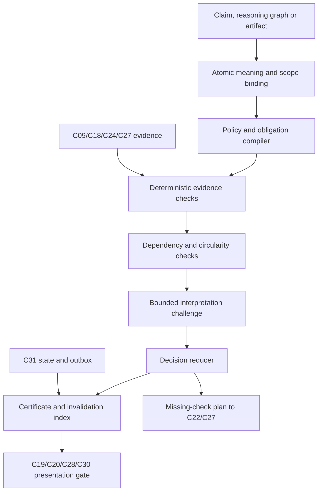

# C16 v3 — Evidence, Reasoning and Publication Verification

Detailed component design · Version 3.0 design proposal · 4 October 2026

## 1 Purpose, version meaning and present status

C16 v3 verifies the chain from evidence to individual assertions, through reasoning dependencies, to rendered views and exact change proposals. It decides which conclusions may be displayed, in which form, under what scope, and what additional checks are needed.

**Status: proposed implementation design.** The existing C16 contract is the four-operation specification in Code_Intelligence_Component_API_Contracts.md v1.1. A v2 capability set was proposed in discussion; no completed v2 implementation or migration is assumed. “v3” names the target design, not evidence that three production releases exist. No repository audit, implementation, benchmark or test execution is supplied by this document.

This design integrates C22_Hypothesis_Engine_Detailed_Design.md, C24_Runtime_Causality_Detailed_Design.md, C27_Reliable_Counterfactual_Simulation_Design.md and Code_Intelligence_Defect_Performance_and_PR_Design.md. Their artifact references and evidence classes must be mapped through versioned schemas; C16 does not replace their domain owners.

Its guarantee is procedural and scoped: required checks cannot be bypassed silently, and certificates bind the evidence actually checked. It cannot establish arbitrary program correctness, complete telemetry, universal causal truth or safety outside declared models. A correct verifier can still receive misleading inputs from a trusted but faulty adapter; the trusted computing base is explicit.

## 2 What makes this v3

| Capability | Current contract | Proposed v2 baseline | v3 target |
|---|---|---|---|
| Subject | ClaimDraft plus evidence | Typed atomic claim and obligations | Claim/reasoning dependency graph plus publication artifacts |
| Scope | Revision and evidence gates | Version-bound certificate | Complete evidence, workload, deployment, model, oracle and policy lineage |
| Contradictions | Fact consistency and challenge | Claim-level conflicts | Cross-claim, cross-view and cross-proposal inconsistency |
| Independence | Separate reasoning invocation | Source correlation groups | Provenance traversal and circular-support rejection |
| Missing checks | Report unknowns | Explicit obligations | Typed verification plan handed to C22/C27 |
| Revalidation | Reload supporting facts | Certificate invalidation | Selective dependency invalidation and enforcement before serving |
| Presentation | verifyView diagnostics | Authorized wording/mode | Semantic manifest binding for text, edges, charts, badges and PR body |
| Fix verification | Supporting claims | Exact patch evidence | Detect weakened properties, altered population and stale validation |
| Verifier changes | Acceptance suite | Registry and tests | Independent reference evaluation, checker mutations and staged rule rollout |

The target release must demonstrate these capabilities through the acceptance suite; renaming an API or adding a second model prompt does not qualify as v3.

## 3 Ownership and execution boundary

| C16 owns | Other component owns |
|---|---|
| Typed obligations, rule evaluation and verification decisions | C18 claim identities, human verdict history and provenance ledger |
| Reasoning-graph validation and circular-support detection | C09 facts and graph queries; C24 certified runtime relations |
| Certificates and allowed presentation meaning | C19 representation compiler; C20 rendering |
| Verification plans describing missing checks | C22 scheduler, steering, budgets and investigation execution |
| Experiment evidence eligibility/applicability checks | C27 execution, models, validation certificates and counterfactual reports |
| Patch/publication verification bindings | C28 patch artifacts and independent property checks; C30 authorized publisher |
| Verification-policy application | C03 authorization/egress; C17 evaluation/calibration; C31 durable state |

C16 is a TypeScript module. Deterministic checker adapters may call trusted analysis/proof tools through isolated approved services. It has no shell executor, repository writer, direct experiment runner or forge credential. It cannot enlarge authority by generating a verification plan. C14 handles model calls; C03 approves their content egress; C31 owns transactions.

## 4 Safety and truth-status invariants

1. Verified meaning is no stronger than the checks/evidence supporting it.
2. Authority, source integrity, scope freshness and mandatory correctness are noncompensatory hard gates; scores cannot offset failure.
3. Absence of evidence requires an applicable completeness certificate before it supports a negative assertion.
4. Observation, inference, hypothesis, simulation prediction, measured experiment and formal/bounded proof remain distinct.
5. Human confirmation is attributed judgment; it is not an empirical proof or source-independent reproduction.
6. Model challenge agreement is not independent evidence; model confidence is not calibrated probability.
7. Evidence used to construct an assumption cannot establish that assumption merely through the consequences of that same assumption.
8. A certificate binds exact claims, rules, source versions and scope; it is not a transferable authority grant.
9. Only committed current certificates authorize publication; revoked authority is rechecked even for cached artifacts.
10. Partial verification/budget stops retain incomplete state; they do not issue a passing certificate.
11. C16 validates assertions relevant to a declared task; it does not certify “all defects found.”
12. The verifier’s implementation/policy must be evaluated independently of its own verdicts.

## 5 Architecture and processing stages



| Module | Inputs → outputs |
|---|---|
| ClaimNormalizer | Draft → bounded atomic claims and explicit ambiguity |
| ScopeBinder | Claim + artifacts + C03 scope → pinned VerificationScope |
| ObligationCompiler | Claim type/rule version → obligation DAG |
| EvidenceResolver | Authorized evidence refs → checked metadata/excerpts/provenance |
| DeterministicCheckRunner | Obligation + facts/certificates → result with reasons |
| ReasoningGraphChecker | Claim/support dependencies → graph consistency/circularity report |
| AdversarialCoordinator | Claims + scoped evidence → challenge issues, not proof |
| CalibrationResolver | Claim class/context → applicable C17 artifact or uncalibrated |
| DecisionReducer | Obligation results/challenge → decision/allowed meaning |
| CertificateService | Decision + scope/hashes → immutable certificate |
| InvalidationManager | Changed dependencies → stale/revoked eligibility |
| VerificationPlanBuilder | Missing obligations → registered checks for external execution |
| PresentationGuard | Certificate + artifact semantic manifest → publication decision |
| VerifierEvaluationBridge | Rule/checker version → C17 independent results |

## 6 Atomic claim representation and reasoning graphs

A free-text sentence is not itself a sufficient verification target. Decompose compound assertions into stable atomic subjects/predicates/scope and dependency links, retaining their original text location. LLM decomposition is a candidate parse; deterministic validation, source anchoring and ambiguity checks prevent a subtly weaker reformulation.

Example: “The lock caused the timeout and this patch fixes it” decomposes into: a request waited on a specific lock; the wait contributed to the observed deadline outcome; the proposed change preserves required behavior; the change reduced the relevant failures under the tested workload. Each has different obligations. A parent sentence may be shown only with an explicit qualified rendering corresponding to the atomic results, not a blanket green badge.

### Dependency semantics

| Relation | Meaning | Evaluation |
|---|---|---|
| SUPPORTS | Evidence/claim supports another assertion | Domain rule must accept the entailment/interpretation |
| REQUIRES | Conclusion depends on prerequisite | Mandatory prerequisite must pass or conclusion remains conditional |
| ASSUMES | Conclusion holds under an explicit assumption | Assumption disclosed; not silently promoted to fact |
| CONTRADICTS | Assertions materially conflict in matching scope | Conflict persists until contextualized/resolved |
| DERIVED_FROM | Provenance of analysis/model output | Does not itself provide independent support |
| REFERS_TO | Narrative/visual association | No truth propagation |

Analyze strongly connected components of support/prerequisite/derivation relationships. A support cycle cannot self-certify. For a cyclic component, require an independently justified registered derivation method or decompose it into externally grounded obligations; otherwise reject the cycle as evidence and retain assertions as unresolved hypotheses where policy permits. Independent observations anchoring one member do not magically validate every inference around the cycle.

Reference/context cycles are allowed. State-machine/time-unrolled feedback and mathematical recursive proofs require their own validated semantics; the graph checker must not reject all cycles indiscriminately. Default v3 does not implement a general recursive proof system.

### Circular simulation example

A model assumes lock contention caused the timeout, predicts that removing contention helps, then uses that predicted help as evidence that contention caused the real timeout. Provenance shows assumption→model→result→original assumption. C16 allows a conditional consequence claim but blocks factual causal promotion. Real independently measured intervention evidence can supply new support if C27 validity/scope checks pass.

## 7 Claim-specific verification policies

| Claim class | Mandatory obligations | Typical allowed outcome |
|---|---|---|
| STRUCTURAL_FACT | Symbol/entity/revision validity, source span, analyzer resolution and scope | FACT if checked; partial/unknown otherwise |
| RUNTIME_ORDER | Trusted identities, accepted C24 ordering semantics, clock/coverage limits | Execution relationship with omissions |
| DEFECT_CANDIDATE | Relevant paths/accesses/locks, feasible assumptions, detector coverage | HYPOTHESIS, not reproduced defect |
| REPRODUCED_DEFECT | Build/input/oracle identity, run integrity, property failure and adapter scope | Failure under recorded setup |
| MEASURED_BOTTLENECK | Workload/population, attributable measurements, waits/critical-path limits, alternatives | Scoped measurement/mechanism finding |
| MECHANISM_EXPLANATION | Source/runtime path, dependency semantics, counter-evidence and material gaps | Supported/contested explanation with limits |
| MODEL_PREDICTION | Executable model/spec, assumptions and result lineage | Model prediction; unvalidated if no certificate |
| VALIDATED_MODEL_PREDICTION | C27 holdout and intervention-class certificate, domain and exact model hash | Validated prediction within tested domain |
| MEASURED_IMPROVEMENT | Comparable runs, unchanged oracle, complete outcome population, uncertainty/regression checks | Scoped measured improvement |
| CAUSAL_EFFECT | Intervention/identification design, confounder/interference treatment, behavioral equivalence and tested population | Intervention-supported effect with scope |
| NEGATIVE_OR_UNIVERSAL | Complete predicate/search scope, sound adapter semantics, exclusions/bounds | Bounded negative result; universal only with applicable proof |
| FORMAL_PROPERTY | Approved proof/checker format, exact property/artifact/environment binding, assumptions and TCB | Proven property within declared semantics |

Formal-tool output is not accepted as an opaque “proof=true.” Verify certificate format, property hash, tool/checker version and TCB assumptions; independent proof checking where the backend supports it. SMT UNSAT for a bounded encoded property does not prove whole-program absence of races. An unsupported encoding/property remains unknown.

Rules distinguish necessary versus optional checks. Policy must predeclare when challenge/calibration is not applicable, with justification. The original five-gate structure is preserved; N/A is explicit rather than silently skipping a gate. A deterministic source-span check need not spend tokens on a model adversary, but causal interpretation must not bypass its required challenge merely because the provider is unavailable.

## 8 The five gates, strengthened

| Gate | v3 behavior | Failure handling |
|---|---|---|
| 1 Grounding | Existence/access, source hash, exact scope, provenance, relevant support—not citation presence alone | Fabricated/denied/mismatched evidence cannot support publication |
| 2 Consistency | Facts, atomic assertions, reasoning prerequisites, numerical/population constraints and cross-artifact meaning | Block unsupported factual conclusion or mark disputed |
| 3 Adversarial challenge | Material alternatives, missing coverage, causal confounding and interpretation disputes; findings enter decision | Verified blocker blocks; unresolved material challenge downgrades/abstains |
| 4 Calibration/status | Applicable evaluated artifact by claim class/domain/version; otherwise uncalibrated | Never synthesize probability or treat challenge votes as calibration |
| 5 Display/publication | Exact permitted meaning, evidence style, current certificate, required caveats and artifact binding | Reject upgraded wording, hidden caveats or changed patch |

**Existing pseudocode correction:** the challenge result must be an input to the final reducer. Reporting a counterargument while ignoring it in eligibility is not sufficient.

Challenge output is untrusted structured data. Validate cited IDs, then adjudicate each issue deterministically where possible or mark interpretation unresolved. A malicious/incorrect adversarial model cannot arbitrarily become the truth authority. A challenge provider failure is a missing required obligation for policies that need it; safe hypothesis/abstention presentation may remain possible, but no automatic passing fallback.

## 9 Evidence lineage, independence and contradiction

Resolve provenance to originating observations/artifacts, rather than counting surface documents. Group duplicates/correlated events by source identity, trace lineage, data/sample set, model inputs and derivation ancestry. One trace plus five summaries is one observation group. Agreement of two models over that trace is two interpretations, not two independent observations.

Independence is a declared assessment, not guaranteed by different names or different tools. Report unknown independence when lineage is missing. Reuse of calibration/training data as evaluation, or test data used to revise a model, invalidates its claim to untouched independent evidence until new validation is provided.

Contradictions are scoped: different revisions, workloads or cohorts may explain apparent differences. Do not average contradictory assertions into a passing score. Keep support/opposition and define contextual subclaims only when evidence supports that split. Human override records attributed disagreement but cannot bypass mandatory authority or source-integrity checks.

Absence requires a predicate-specific C24 coverage certificate or a relevant C27 finite-search/proof scope. UNKNOWN collection quality cannot establish NO_EVENT/NO_DEFECT. The same rule applies to “no regressions”: passing selected tests supports only the tested properties, not all possible behavior.

## 10 Decision algebra and permitted wording

Obligations have PASS, FAIL, UNKNOWN and NOT_APPLICABLE. FAIL means a check establishes violation; UNKNOWN means insufficient/unavailable evidence. NOT_APPLICABLE requires a rule-defined reason. Skipping a check because of cost is UNKNOWN, never N/A.

| Condition | Decision | Display |
|---|---|---|
| Authority/integrity/mandatory scope hard failure | WITHHELD | Safe error; no denied evidence leakage |
| Required property disproved | REJECTED | Supported failure report only, original positive claim prohibited |
| Mandatory evidence incomplete | INSUFFICIENT | Gap/explanation, optionally grounded hypothesis per policy |
| Material support and valid contradiction | CONTESTED | Dispute and both permitted evidence sets |
| Prerequisites hold only under assumptions | CONDITIONAL | “Under assumptions A…” with material conditions visible |
| All required scoped obligations satisfied | SUPPORTED | Exact authorized claim class and scope, not universal truth |

Separate content support from use authorization. A supported claim may be allowed for a local investigation but not a public export or alarm. “VERIFIED” is not a universal badge; a certificate specifies what checks passed and what meaning is allowed.

No weighted score determines hard eligibility. Priority/relevance can guide verification order but cannot cure a false reference, stale build or wrong experiment population. Calibration probability, if present, belongs to its evaluated prediction class; it is not the probability that the certificate or authorization is valid.

## 11 Verification certificates, scope and TCB

Certificate payload binds claim graph hash, policy/rule versions, evidence/content hashes, source versions, revision set, deployment/workload/environment/model/oracle/patch identities, obligations, challenge issues, conclusion and allowed meaning. It contains exact dependency IDs for invalidation and a safe rationale summary, never hidden chain-of-thought.

| Binding | Prevents |
|---|---|
| Claim text/atomic predicate/graph hash | Reusing verdict for stronger or different assertion |
| Evidence/source versions | Stale or substituted observations |
| Revision/build/model/oracle/workload | Applying validation to another target |
| Policy/rule/checker version | Ignoring invalidated verifier logic |
| Permission/policy epoch and purpose | Reusing a cached private verdict as export permission |
| Patch/head/diff hash | Editing candidate after validation |
| Presentation semantic-manifest hash | Badge/edge/text meaning upgrade |

A local certificate can be an immutable authenticated server record. Portable exports may use a signed digest and key ID when that infrastructure is configured. Cryptographic signatures establish issuer/integrity, not truth. No signing key or cross-organization trust assumption is invented here. A certificate alone never authorizes access; current C03 authority is checked separately.

Record TCB dependencies: trusted source adapters, schema registry, identity/policy, storage integrity, semantic analyzers, proof checkers, model adapters and statistical evaluation procedures. A critical adapter/checker defect invalidates affected certificates by version dependency. Soft TTLs supplement explicit invalidation; expiry policy does not replace source-version/authority checks.

## 12 Verification plans and autonomy

C16 emits missing obligations as a declarative plan, not executable model scripts. Each step names a registered check, required scope/grant, expected evidence, budget estimate and dependency. C22 schedules read/investigation steps; C27 runs separately authorized experiments. C16 then reevaluates resulting evidence.

Example plan: resolve deployment build; obtain pool ownership events; discriminate database slowdown versus pool starvation; replay independent invariant test for candidate; compare representative baseline/candidate runs. Scope cannot silently expand across repositories or production instrumentation. If no registered check can satisfy the obligation, return a genuine gap.

Prevent infinite verifier/investigator recursion: plan ID, originating obligation and generation; max verification rounds; dedup evidence fingerprints; no-progress detection; overall deadlines/token/read/run ceilings. New evidence may justify a new round; simply rewording a claim does not reset budgets. C16 does not call C22.advance synchronously while holding an aggregate transaction or reentering the same verification job.

## 13 Presentation and patch-publication semantics

C19 compiles a registered semantic manifest alongside ViewSpec/text. Every consequential node/edge/badge/chart annotation points to atomic claim IDs and certificate versions. C16 checks the manifest, exact generated strings where relevant and render constraints. C20 enforces allowed modes at render time and rechecks current eligibility on updates.

| Surface | Verification example |
|---|---|
| Narrative | “May contribute” cannot become “caused” through summarization |
| Graph edge | Inferred dependency cannot become observed causal arrow |
| Badge | Candidate race cannot receive confirmed-defect alarm style |
| Chart | Simulated latency cannot be labeled measured; errors/timeouts cannot silently disappear |
| Summary | Material unknown cannot be hidden by foreground grouping |
| PR | Improvement statement bound to exact benchmark/patch/workload evidence |

General free-text semantic equivalence cannot be guaranteed automatically. Prefer registered wording templates and explicit claim bindings for critical assertions. Free-form text uses bounded semantic checking and remains blocked/needs review if its meaning cannot be matched reliably. A template ID is only trusted if its content/version/hash and renderer integration match the registry.

Patch verification separately binds original property/oracle, baseline reproduction, candidate build and regression scope. Changes to oracle/tests/workload are flagged and require explicit independent review and revalidation. Legitimate requirement changes are possible, but they cannot retrospectively turn an old bug into a validated fix. Performance claims need complete outcome/population handling and tradeoffs; faster error responses do not establish higher successful throughput.

Publication purpose controls display, alarm, experiment recommendation and PR. Existing alarm policy—deterministic proof or two authorized confirmations—is retained, with exact scope, distinct principals and explicit policy semantics. Two confirmations are an operational alarm authorization path, not causal proof or a way to display a disproven assertion as fact. Policy changes require versioned decisions, not a model instruction.

## 14 Typed entities

Shared imports retain existing meanings: Id, Hash, Timestamp, Int, Float, Decimal, JsonValue, Option, List, RevisionRef, MultiRevisionRef, EvidenceRef, ClaimDraft, EvidenceBundle, GateReport, Verdict, ViewSpec, Diagnostic, Budget, Job, CommitReceipt, ApiResult and CallContext. New DTOs use `c16.verification.v3`. Integers are bounded safe JSON integers; all text/list sizes constrained.

```typescript
AtomicClaim {
  id: Id; version: Int; parentDraftId: Id; claimClass: ClaimClass;
  predicate: RegisteredValue; text: String; textHash: Hash;
  originalTextLocator: String; scope: VerificationScope;
  evidenceIds: List<Id>; assumptionIds: List<Id>;
}
RegisteredValue { schemaId: Id; version: Int; value: JsonValue }
VerificationScope {
  tenantId: Id; revisionSet: MultiRevisionRef; deploymentIds: List<Id>;
  window: Option<TimeWindow>; workloadHash: Option<Hash>;
  environmentHash: Option<Hash>; modelHash: Option<Hash>;
  oracleHash: Option<Hash>; patchHeadHash: Option<Hash>;
  policyEpoch: Int; accessScopeId: Id; scopeHash: Hash;
}
ReasoningNode {
  id: Id; kind: ReasoningNodeKind; artifactId: Id; artifactVersion: Int;
  artifactHash: Hash; scopeHash: Hash;
}
ReasoningEdge {
  id: Id; fromNodeId: Id; toNodeId: Id; relation: ReasoningRelation;
  ruleId: Option<Id>; evidenceIds: List<Id>;
}
ReasoningGraph {
  id: Id; version: Int; nodes: List<ReasoningNode>;
  edges: List<ReasoningEdge>; rootClaimIds: List<Id>; hash: Hash;
}
VerificationPolicy {
  id: Id; version: Int; claimClass: ClaimClass;
  obligationRuleIds: List<Id>; challengeRuleId: Id;
  calibrationRuleId: Id; presentationRuleId: Id;
  applicablePurposes: List<PublicationPurpose>; maximumRounds: Int;
}
VerificationObligation {
  id: Id; claimId: Id; ruleId: Id; ruleVersion: Int;
  kind: ObligationKind; required: Bool; hardGate: Bool;
  dependsOn: List<Id>; parameters: RegisteredValue;
  expectedEvidenceSchemas: List<Id>;
}
ObligationResult {
  obligationId: Id; state: CheckState; checkerId: Id;
  checkerVersion: String; inputHashes: List<Hash>;
  evidenceIds: List<Id>; reasonCodes: List<String>;
  safeRationale: String; assessedAt: Timestamp;
}
EvidenceGroup {
  id: Id; evidenceIds: List<Id>; originArtifactIds: List<Id>;
  independence: IndependenceState; rationale: String;
}
ChallengeIssue {
  id: Id; claimIds: List<Id>; kind: ChallengeKind;
  material: Bool; evidenceIds: List<Id>;
  adjudication: ChallengeDisposition; reason: String;
}
VerificationDecision {
  state: DecisionState; claimIds: List<Id>;
  allowedMeanings: List<AllowedMeaning>; materialGapIds: List<Id>;
  contradictionIds: List<Id>; calibration: CalibrationStatus;
}
AllowedMeaning {
  claimId: Id; maximumClass: ClaimClass; displayMode: DisplayMode;
  templateIds: List<Id>; requiredCaveatIds: List<Id>;
  permittedPurposes: List<PublicationPurpose>;
}
VerificationCertificate {
  id: Id; version: Int; claimGraphHash: Hash; scope: VerificationScope;
  policyId: Id; policyVersion: Int; ruleVersions: RegisteredValue;
  obligationResults: List<ObligationResult>;
  challengeIssues: List<ChallengeIssue>; evidenceGroupIds: List<Id>;
  decision: VerificationDecision; dependencyBindings: List<DependencyBinding>;
  tcbArtifactIds: List<Id>; issuedAt: Timestamp; expiresAt: Option<Timestamp>;
  state: CertificateState; digest: Hash; issuerAttestation: Option<Attestation>;
}
DependencyBinding {
  artifactId: Id; version: String; hash: Hash;
  kind: DependencyKind; invalidatesObligationIds: List<Id>;
}
Attestation { issuerId: Id; keyId: Id; algorithm: String; signature: String }
VerificationPlan {
  id: Id; certificateId: Id; generation: Int;
  steps: List<VerificationStep>; maximumRounds: Int; budget: Budget;
}
VerificationStep {
  id: Id; obligationIds: List<Id>; executorComponentId: Id;
  checkId: Id; request: RegisteredValue; dependsOn: List<Id>;
  requiredGrantKinds: List<String>; expectedEvidenceSchemas: List<Id>;
}
PresentationManifest {
  id: Id; artifactId: Id; artifactHash: Hash; purpose: PublicationPurpose;
  items: List<PresentationItem>; compilerVersion: String; hash: Hash;
}
PresentationItem {
  id: Id; locator: String; claimIds: List<Id>; certificateIds: List<Id>;
  templateId: Option<Id>; textHash: Option<Hash>;
  intendedClass: ClaimClass; mode: DisplayMode; caveatIds: List<Id>;
  dataPopulationHash: Option<Hash>; units: Option<String>;
}
PublicationDecision {
  id: Id; manifestHash: Hash; artifactHash: Hash;
  certificateIds: List<Id>; eligible: Bool;
  diagnostics: List<Diagnostic>; expiresAt: Option<Timestamp>;
  authorizationEpoch: Int;
}
PatchBinding {
  proposalId: Id; baseHash: Hash; headHash: Hash; diffHash: Hash;
  originalOracleHash: Hash; candidateOracleHash: Hash;
  workloadHash: Option<Hash>; runManifestIds: List<Id>;
  propertyChangeReviewId: Option<Id>;
}
VerificationRun {
  id: Id; generation: Int; graphHash: Hash; scopeHash: Hash;
  state: RunState; completedObligationIds: List<Id>;
  budget: Budget; usageHandle: Id; checkpointId: Id;
}
```

```typescript
ClaimClass = STRUCTURAL_FACT | RUNTIME_ORDER | DEFECT_CANDIDATE
  | REPRODUCED_DEFECT | MEASURED_BOTTLENECK | MECHANISM_EXPLANATION
  | MODEL_PREDICTION | VALIDATED_MODEL_PREDICTION | MEASURED_IMPROVEMENT
  | CAUSAL_EFFECT | NEGATIVE_OR_UNIVERSAL | FORMAL_PROPERTY
ReasoningNodeKind = CLAIM | ASSUMPTION | OBSERVATION | DERIVATION | EXPERIMENT | PROPERTY
ReasoningRelation = SUPPORTS | REQUIRES | ASSUMES | CONTRADICTS | DERIVED_FROM | REFERS_TO
ObligationKind = AUTHORITY | INTEGRITY | SCOPE | GROUNDING | CONSISTENCY
  | INDEPENDENCE | COVERAGE | CIRCULARITY | CHALLENGE | CALIBRATION
  | CORRECTNESS | COMPARABILITY | APPLICABILITY | PROOF_CHECK | PRESENTATION
CheckState = PASS | FAIL | UNKNOWN | NOT_APPLICABLE
DecisionState = SUPPORTED | CONDITIONAL | CONTESTED | INSUFFICIENT | REJECTED | WITHHELD
IndependenceState = INDEPENDENT_SUPPORTED | CORRELATED | UNKNOWN
ChallengeKind = COUNTER_EVIDENCE | ALTERNATIVE_MECHANISM | SCOPE_MISMATCH
  | MISSING_COVERAGE | CONFOUNDING | INTERPRETATION | CIRCULAR_SUPPORT
ChallengeDisposition = VALID_BLOCKER | VALID_LIMITATION | REJECTED_ISSUE | UNRESOLVED
PublicationPurpose = INVESTIGATION_VIEW | ALARM | EXPORT | PR_DESCRIPTION | PATCH_REVIEW
CertificateState = CURRENT | STALE | REVOKED | EXPIRED | SUPERSEDED
DependencyKind = EVIDENCE | CLAIM | SOURCE | MODEL | ORACLE | WORKLOAD
  | PATCH | POLICY | CHECKER | AUTHORITY | PRESENTATION
RunState = QUEUED | RUNNING | WAITING_EVIDENCE | PARTIAL | COMPLETED | FAILED | CANCELLED
```

TimeWindow and DisplayMode are existing shared imports. CalibrationStatus is `Uncalibrated { reason: String }` or `Calibrated { evaluationId: Id; classId: Id; domainHash: Hash; probability: Float; interval: Option<RegisteredValue> }`. Schema/range/domain checks are required; a probability is optional evidence, never a hard-gate override. Signed attestations require configured trusted algorithm/key policies; arbitrary client signatures are not accepted.

## 15 API catalogue and v1 compatibility

Existing methods remain:

```typescript
verify(ctx, { draft: ClaimDraft; bundle: EvidenceBundle }): ApiResult<GateReport>
validateAlarm(ctx, { report: GateReport; proofEvidenceIds: List<Id>;
                     verdicts: List<Verdict> }): ApiResult<GateReport>
revalidate(ctx, { claimId: Id; revision: RevisionRef }): ApiResult<GateReport>
verifyView(ctx, { view: ViewSpec }): ApiResult<List<Diagnostic>>
```

Internally these adapt to v3 policies and project back to GateReport/diagnostics. Legacy results cannot describe all dependency/purpose distinctions; reference the v3 certificate and keep incomplete conditions explicit. Legacy verifyView checks current C18/certificate state and rejects missing/invalid meaning bindings; it cannot fabricate a v3 passing manifest from arbitrary strings.

All v3 operations return Promise<ApiResult<T>>, take trusted CallContext, propagate deadlines/cancellation and use C03 authorization. Mutations require idempotency and expected resource version. `Expected` below is resourceId + expectedVersion.

| Operation | Request | Value returned |
|---|---|---|
| normalizeClaims | draft, evidenceIds, scope | AtomicClaimBatch |
| compileObligations | claims, reasoningGraph, purpose, policyId | ObligationBundle |
| verifyGraph | graphId, expectedGraphVersion, policyId, purpose, budget | Job<VerificationCertificate> |
| verifyAtomic | claimId, claimVersion, policyId, purpose | VerificationCertificate |
| getCertificate | certificateId | VerificationCertificate |
| explainDecision | certificateId, claimId | DecisionExplanation |
| planMissingChecks | certificateId, budget | VerificationPlan |
| incorporateEvidence | Expected, planId, evidenceIds | Job<VerificationCertificate> |
| revalidateDependencies | certificateId, changedDependencyIds, budget | Job<VerificationCertificate> |
| verifyPresentation | manifest, certificateIds | PublicationDecision |
| verifyPatch | patch: PatchBinding, claimIds, certificateIds, purpose | Job<VerificationCertificate> |
| verifyAlarmV3 | certificateId, proofEvidenceIds, verdictIds, alarmPolicyId | PublicationDecision |
| invalidate | dependencyIds, sourceVersion, reason | CommitReceipt |
| cancelRun | runId, expectedGeneration | CommitReceipt |
| listPolicies | claimClass, purpose | List<VerificationPolicy> |
| proposePolicyVersion | Expected, policy, evaluationManifestId | PolicyReviewRecord |

AtomicClaimBatch includes claims, rejected/ambiguous source locators and diagnostics. ObligationBundle contains graph/policy hashes and typed obligation DAG. DecisionExplanation contains results, safe rationale, conflicts and next checks. PolicyReviewRecord contains candidate policy/version, C17 evaluation refs, state and required reviewer identities. Policy activation is privileged, separately authorized and not a model tool. Evidence intake from verification plans checks provenance and original scope, not only schema validity.

C16 remains a core module. Gateway routes are allowlisted by purpose; raw policy mutation/invalidation intake is privileged. C14/C27/C24 and C18 integrations use existing facades or explicitly versioned new adapters. No blanket generic gateway makes all verifier internals callable from the browser.

## 16 Decision and publication pseudocode

```typescript
async function verifyGraph(ctx, req) {
  scope = await authorizeAndPinGraphScope(ctx, req.graphId, req.purpose);
  graph = await loadExactGraph(req.graphId, req.expectedGraphVersion);
  policy = loadRegisteredPolicy(req.policyId, graph, req.purpose);
  obligations = compileTypedObligationDag(graph, policy);
  results = await runCheapRequiredChecks(ctx, obligations, scope);
  lineage = analyzeEvidenceDependenceAndCircularSupport(graph, results);
  results = incorporateLineageResults(results, lineage);
  if (!mayContinueAfterHardChecks(results)) {
    return await commitNoneligibleCertificate(ctx, graph, scope, policy, results);
  }
  challenge = await runPolicyBoundChallenge(ctx, graph, results, policy);
  issues = validateAndAdjudicateChallengeReferences(challenge, scope);
  calibration = await resolveApplicableCalibrationOrUncalibrated(graph, policy);
  decision = reduceDecisionWithAllInputs(results, issues, calibration, policy);
  await recheckSourceVersionsAuthorityAndGeneration(ctx, scope);
  return await commitCertificateDependenciesAndOutbox(
    graph, scope, policy, results, issues, decision
  );
}

async function verifyPresentation(ctx, req) {
  await authorizeCurrentPurpose(ctx, req.manifest.purpose);
  certificates = await loadCurrentCertificates(req.certificateIds);
  assertExactArtifactAndManifestHashes(req.manifest);
  assertNoInvalidatedDependencyWatermark(certificates);
  diagnostics = compareRenderedMeaningWithPermittedClaims(req.manifest, certificates);
  return commitPublicationDecisionBoundToExactArtifact(req.manifest, diagnostics);
}
```

The first function may return a terminal withheld/rejected/insufficient certificate; Job completion does not mean a passing verification. Model timeout becomes required-check UNKNOWN. No database lock spans external calls. Dependency versions and authority are rechecked at commit and again at serving/publication; a decision checked yesterday cannot authorize today’s revised artifact.

## 17 Persistence, selective revalidation and concurrency

C31 stores immutable claim-normalization versions, graphs, obligations/results, evidence groups, challenge issues, certificates, dependency indexes, verification plans/runs, presentation decisions and policy-review records. C18 remains the claim/verdict owner; C16 references its versioned IDs rather than maintaining a competing claim truth ledger.

| Store | Key/index | Persistent content |
|---|---|---|
| verification_graphs | tenant/graph/version; hash | Typed nodes/edges and source locators |
| verification_runs | tenant/run; generation/state | Budgets, checkpoints and pinned input hashes |
| verification_obligations | run/obligation | Rule version, result and input refs |
| evidence_groups | scoped group/version | Shared origin/correlation/unknown independence |
| verification_certificates | certificate/version/digest | Decision, allowed meaning, scope and TCB |
| certificate_dependencies | dependency/version → certificate/obligation | Invalidation fan-out |
| verification_plans | plan/version/generation | Missing-check DAG and progress refs |
| presentation_decisions | artifact/manifest/purpose hash | Eligibility, current dependencies and diagnostics |
| verification_policy_versions | policy/version | Rules, evaluation and activation history |

On source/model/oracle/policy/checker changes, atomically record an invalidation watermark and outbox; readers enforce it before asynchronous recomputation. Recheck only affected obligations plus downstream conclusions, unless the change invalidates scope or policy globally. New certificates reference reused results only with matching checked inputs/checker policy; reuse is not blind copying.

Cache keys include tenant, authority epoch, purpose, graph/claim/evidence hashes, model/oracle/workload/patch scope and checker/policy versions. Permission filtering is not a cache afterthought. Revoked source content cannot remain accessible via certificate rationale, historical event replay or grouped counts.

Crash recovery loads exact pinned run/checkpoint, reconciles completed expensive checks and resumes current generation. Same-key/different-payload replay is a conflict. Late challenge/results are quarantined if generation/version changed. Cancellation fences publication; missing usage for an in-flight provider call remains reserved until reconciled, not silently refunded.

Delete governed evidence/derived excerpts and minimize certificate history according to C31 policy. Digest retention can still be sensitive and needs policy; deleting payloads means later verification/replay can become unavailable rather than reconstructing private source data.

## 18 Efficient verification and resource limits

Run schema, access, hash, version and existence checks before retrieval-heavy/model work. Share evidence resolution within an authorized job; collapse exact duplicate checks; use dependency-indexed incremental revalidation. Keep model challenge bounded to relevant atomic claims and permitted excerpts.

Proposed initial limits: 100 atomic claims, 500 reasoning edges, 1,000 obligations per job; 50 evidence groups per challenge; maximum three evidence-acquisition rounds; one active verifier generation per graph; configurable global model concurrency. These are unmeasured engineering defaults requiring fixture tests. Large graphs return explicit partial coverage/pagination or reject admission; they cannot receive a passing whole-graph badge after checking only the visible portion.

Reserve tokens/cost/read budgets before dispatch. Record deterministic-check, evidence-resolution, challenge and certificate times separately. Precision/latency targets depend on claim class; a single global score is misleading. Cost policy cannot skip mandatory checks while leaving eligibility unchanged.

## 19 Threat model and safe degradation

Threats include prompt injection through evidence/challenge, forged IDs/certificates, false trusted adapter records, stale cache publication, cross-tenant joins, altered oracles, cherry-picked benchmark samples, adversarial claim rewording, inconsistent renderer badges and verifier-policy weakening.

Mitigations: registered schemas, trusted actor context, artifact hashes, purpose authorization, source-version enforcement, lineage rules, mandatory independent properties, manifest binding, candidate policy evaluation and mutation tests. Authentication proves source identity; it does not guarantee that the source is correct. Trusted adapter errors remain a TCB risk with explicit independent fixtures and version invalidation.

If the model/provider is unavailable, deterministic claims can still pass policies whose challenge is legitimately N/A; interpretation-dependent claims become incomplete/conditional/hypothesis according to policy. Denied evidence cannot be replaced with speculation revealing its content. A safe diagnostic should describe caller-visible missing authority without disclosing private entity names/counts.

## 20 Verifier evaluation and governance

C17 owns independent golden judgments/evaluation; C16 consumes the results. Separate datasets for policy selection, calibration and final evaluation. Record ambiguity and reviewer disagreement; disagreement is a legitimate result, not a forced consensus label.

| Evaluation dimension | Measure |
|---|---|
| Atomic meaning preservation | Unsupported strengthening/weakening during decomposition |
| Support precision | Rate of unsupported claims incorrectly permitted |
| Abstention quality | Material unknowns identified and actionable checks provided |
| Contradiction handling | Missed blockers and false disputes by class |
| Scope/freshness | Stale/revoked/wrong-domain publication attempts blocked |
| Presentation fidelity | Text/edge/badge/chart upgrades caught |
| Patch integrity | Oracle/workload/head substitutions caught |
| Calibration | Applicable class/domain reliability; uncertainty and sample sufficiency |
| Checker integrity | Relevant mutants detected, with justified equivalent/unreachable exclusions |
| Efficiency | Per-class latency/cost, cache correctness and invalidation lag |

Evaluation thresholds must be chosen per intended use and risk. No “99% reliable” claim is made from a finite test suite. A new verifier/rule runs in shadow against an independent corpus and real authorized examples; compare newly admitted/rejected claims, review disagreement, then activate versioned policy with rollback. No model can approve its own rule change. Emergency unsafe-checker revocation must immediately block affected certificates before asynchronous reevaluation.

## 21 Worked end-to-end example

Synthetic timeout investigation:

1. C24 records a request waiting for a connection owned by another task. C16 checks identity, semantics and scope before allowing the execution relation.
2. C26 proposes that ownership across a payment call contributed to timeout. C16 checks mechanism evidence, counter-evidence and coverage; missing cohort data prevents a universal cause claim.
3. C22 proposes shortening connection lifetime. C27 tests candidate with state-version correctness oracle and comparable workload.
4. C16 verifies exact patch/build/oracle, complete outcomes, comparison uncertainty and C27 domain. If faster latency comes from extra failures, improvement is rejected.
5. C19 produces a diagram and summary. “Potential contributor” remains conditional; measured improvement is restricted to the experiment cohort. C16 rejects a “root cause fixed everywhere” heading.
6. C30 prepares a draft PR bound to that head/diff and permitted wording. A late source correction or rebased head invalidates the relevant eligibility and triggers revalidation.

The graph may contain both supported execution facts and incomplete causal conclusions. The user sees the boundary; a compound green badge cannot erase it.

## 22 Acceptance and checker-mutation suite

| ID | Test | Required result |
|---|---|---|
| V301 | Compound assertion split | Each atomic meaning preserved; no stronger merged badge |
| V302 | Decomposer changes “may” to “caused” | Reject/clarify strengthened assertion |
| V303 | Fabricated source/evidence ID | Grounding fails; no publication |
| V304 | Evidence exists but does not support predicate | Unsupported assertion withheld/insufficient |
| V305 | Stale revision/build | Certificate cannot authorize new target |
| V306 | Wrong workload/deployment/model domain | Scope/applicability blocks promotion |
| V307 | Five summaries of one trace | One correlated origin, not independent confirmation |
| V308 | Hypothesis→simulation→hypothesis support cycle | Conditional prediction only; no factual circular promotion |
| V309 | Reference-only graph cycle | No false circular-proof rejection |
| V310 | External observation anchors unsupported cyclic inference | Each inference still checked; no automatic cycle certification |
| V311 | Material challenge blocker ignored by reducer | Mutation detected; publication blocked/downgraded |
| V312 | Challenge invents an evidence ID | Issue rejected as ungrounded, original claim still checked |
| V313 | Required challenge provider timeout | UNKNOWN/incomplete, not passing fallback |
| V314 | No calibration dataset | Uncalibrated; no invented probability |
| V315 | High relevance score with hard failure | Score cannot override gate |
| V316 | Valid support plus contradiction | CONTESTED with authorized evidence retained |
| V317 | Missing sampled event used as negative evidence | Coverage obligation prevents negative claim |
| V318 | “No defects” from bounded search | Restricted bounded wording only |
| V319 | Formal-tool output with wrong property/hash | Proof-check gate rejects |
| V320 | Unsupported proof TCB assumption | Explicit scope limitation or insufficient result |
| V321 | Missing verification plan loops without new evidence | Round/no-progress budget stops honestly |
| V322 | Plan tries unauthorized repo/experiment | No authority expansion or runner dispatch |
| V323 | Source correction during verification | Commit/serve freshness fence rejects stale result |
| V324 | Revocation after certificate cache | Current authority prevents read/export |
| V325 | Candidate race rendered confirmed | Semantic manifest/mode check rejects |
| V326 | Simulated metric chart labeled measured | Presentation gate rejects |
| V327 | Caveat hidden in collapsed/omitted summary | Critical required caveat remains visible or publication blocked |
| V328 | Patch changed after validation | Head/diff binding fails |
| V329 | Generated test weakens failing oracle | Independent property/change review required |
| V330 | Benchmark drops errors/changes population | Improvement claim rejected/incomplete |
| V331 | Two confirmations from same principal/wrong scope | Alarm policy fails |
| V332 | Alarm approvals interpreted as causal proof | Factual promotion blocked |
| V333 | Cancel/crash/late provider result | No duplicate or stale passing certificate |
| V334 | Policy/checker revoked | Affected eligibility blocked before refresh |
| V335 | Deleted payload recoverable via rationale/history | Lifecycle redaction test fails until fixed |
| V336 | Rule evaluated on its own training/tuning corpus | Independent-evaluation claim withheld |

Each invariant has a positive control, negative control and relevant bypass mutation. Mutation tests must exercise the production decision/publication path, not a test-only mirror of its logic. Equivalence exclusions are reviewed; a stub detecting an artificial mutation is useful harness preparation but cannot certify the actual verifier.

## 23 Requirement traceability

| Original checkpoint | v3 responsibility | Acceptance |
|---|---|---|
| S6/FR-602 | Five mandatory gates and no unevidenced factual promotion | V303/304/311–315 |
| S6/FR-203/202 | Evidence/rationale/challenge and claim lifecycle | V301/307/316; C18 lifecycle checks |
| S6/FR-207/108/406 | Drift, correction and verdict propagation | V323/334 plus C18/C07 suites |
| S6/FR-601 | Epistemic presentation semantics | V325–327 |
| S6/FR-603/604/605/606 | Authority/minimization/egress/audit | V322/324/335 |
| S6/FR-501/505 | Grounded hypotheses, bounded plans and honest completion | V308/313/318/321 |
| S6/FR-507/508/309 | Runtime and counterfactual evidence boundaries | V305/306/317/326 |
| S6/FR-403/404 | Typed change proposals and no silent writes | V322/328–330 |
| S6/NFR-04/05/07/08/12 | Recovery, budgets, deletion, traceability, calibration | V314/321/333/335/336 |
| S6/UX-06/12; S6/NFR-11 | Evidence explanation, trust labels and required caveats | V327 plus renderer/a11y suite |

These are design checkpoints. The shared contract’s single primary FR-602 mapping and broad supporting register remain authoritative; this document does not independently mark their source clauses accepted. New policies, v3 APIs and publication semantics need reviewed clause-level mapping before implementation commitments.

## 24 Implementation sequence and release gates

**P0 — Contract closure:** concrete atomic predicate, dependency, scope, obligation, decision and certificate schemas; C18 staging/claim mapping; C03 purpose authority; legacy GateReport projection; golden positive/negative fixtures.

**P1 — Deterministic core:** hard gates, atomic/graph validation, provenance grouping, circularity, immutable certificates and current serving checks. Initially use registered meaning templates and a narrow structural/runtime claim class set.

**P2 — Reasoning verification:** bounded challenges with actual reducer consequences, contradiction/conditional states, typed missing-check plans and C22 integration.

**P3 — Runtime/counterfactual/patch policies:** C24 certificates, C27 model/experiment applicability, C28 independent oracle/head/workload bindings and C30 publication gate.

**P4 — Presentation and selective revalidation:** C19 semantic manifests, C20 enforcement, dependency indexing, revocation/retention/recovery, per-class performance checks.

**P5 — Independent evaluation:** reviewed fixtures, real authorized examples, checker mutations, policy shadow rollout and documented limitations.

v3 release requires reasoning-chain verification, circular-support rejection, cross-surface consistency, bounded plans, selective invalidation and exact publication bindings in the supported scope. Mandatory safety tests remain release blockers; failed implemented guarantees cannot be relabeled as optional gaps. Real adapter coverage is separately validated from synthetic engine fixtures.

## 25 Decisions to close before integration

Choose initial claim classes and registered predicate vocabulary; mandatory challenge/calibration policies; C18 staging/transaction boundaries; independently derived fixture oracles; permitted proof/checker formats and TCB; render-manifest enforcement; scope/redaction across repositories; confidence/evaluation thresholds; property-change review rules; policy activation roles; certificate freshness/deletion and exact job budgets.

The implementation baseline should record these decisions and test outcomes rather than unsupported confidence percentages. No external repository target or deployment is specified here. This document delivers a detailed design, not a built verifier or a guarantee of universal truth.
