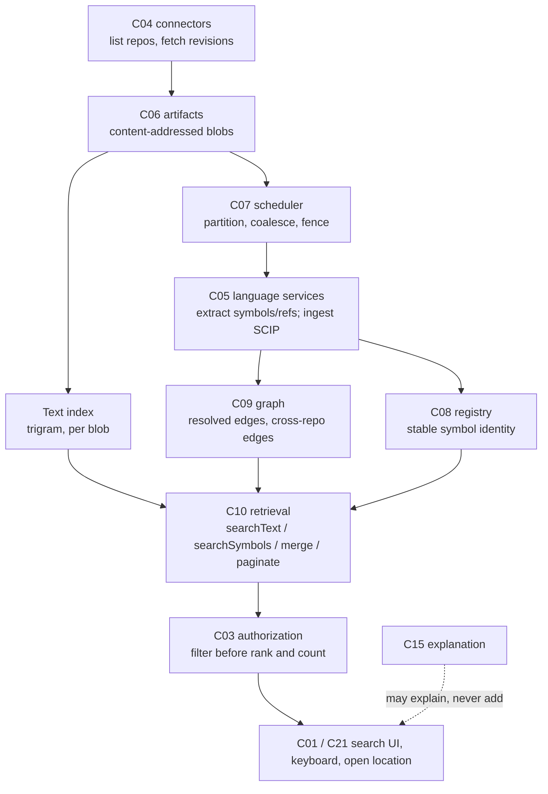
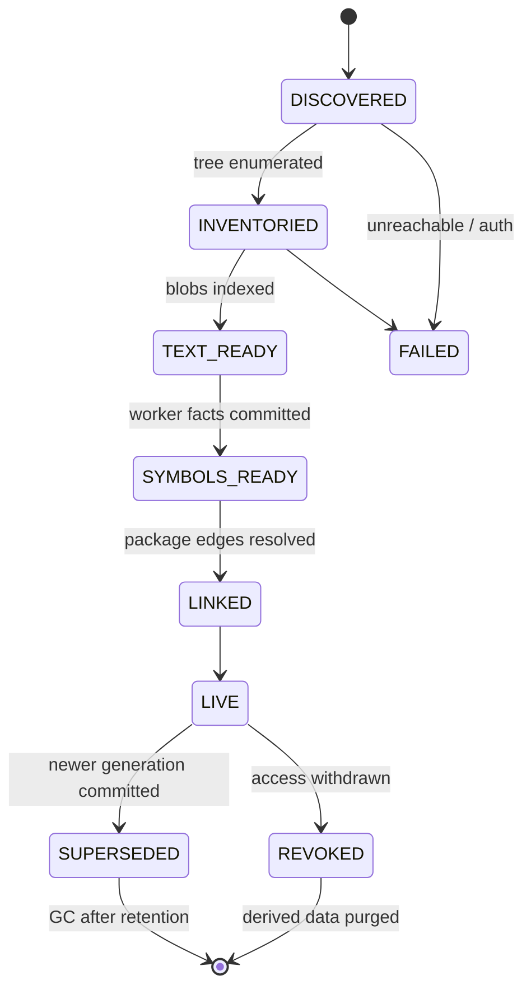

# F01 — Cross-repository search and precise navigation

Detailed design · Version 1.0 · 4 October 2026 · Proposed implementation specification

Source: `Competitive_Features_Component_Implementation_Guide.md` §3, §4, §14–§17. Repository evidence observed at commit `8b07b5e`.
Priority P1. First deliverable: revision-bound search and references for the supported languages.

---

## 1 Purpose, user experience and status

### 1.1 The experience this feature exists for

| User asks | Product should deliver |
|---|---|
| "Where is this API used?" | Exact references, callers and relevant repositories, with unresolved cases disclosed |

A developer selects `createPayment` (from the map, from the editor, or by typing it). The product answers with a bounded, ranked, *honest* list:

```
References to createPayment  ·  function · src/api/payments-controller.ts:6          revision a19a978 (payments-api)
  Showing 14 of 14 · 3 repositories searched · 1 repository not indexed · 6 dynamic call sites could not be resolved

  ▾ payments-api  (rev a19a978)                                             9 references
      ✓ call        src/api/payments-controller.ts:21     router.post("/pay", createPayment)            precise
      ✓ call        src/jobs/reconciler.ts:44             await createPayment(ctx, row)                 precise
      ✓ test        tests/payment-service.test.ts:12      createPayment(fixtureAccount, 100)            precise
      ~ call        src/legacy/adapter.ts:88              adapter["createPayment"](…)                   heuristic (name match)
      …
  ▾ billing-worker (rev 3f09c1e)                                            4 references
      ✓ import+call src/handlers/charge.ts:9              import { createPayment } from "@acme/payments-api"      precise (package edge)
      …
  ▾ web-checkout   (rev 77be210)                                            1 reference
      ~ string      src/api/client.ts:31                  "/v1/createPayment"                           heuristic (string literal)

  Not shown:  mobile-app — not indexed.   6 call sites in 2 repositories use dynamic dispatch and may reach this symbol (show).
```

The legend (`✓` precise, `~` heuristic, `?` unresolved) is a *word and a glyph*, never colour alone. Every row opens the exact span, the revision it was found at, and how it was resolved. The list never claims completeness it does not have.

### 1.2 What "done" means for the user

1. A reference list that matches a compiler's answer for the supported constructs, and says so by tier.
2. Searching across several repositories in the tenant, with each repository's revision and coverage visible.
3. No count, snippet or path from a repository or folder the user may not see.
4. A stale answer is never presented as current: rapid edits produce one current generation; late results are dropped.
5. "No results" is distinguishable from "not indexed", "language unsupported", "extraction incomplete" and "timed out".

### 1.3 Status

**Proposed implementation specification.** Nothing in this document is a measured capability. Latency figures are placeholders for budgets to be *derived from measured corpora* (acceptance F01-A6), exactly as the guide requires.

---

## 2 Scope, non-goals and first delivery boundary

### 2.1 In scope

- Exact and regular-expression text search over indexed source, bound to a repository revision.
- Symbol search (definitions by name, kind, qualified name).
- Go-to-definition and find-references with an explicit **resolution tier**.
- Cross-repository references through package/module identity (a repository that exports a package; repositories that import it).
- Authorization-filtered, paginated, deterministic results with per-repository coverage.
- A search surface in the web app and a hand-off to the editor.

### 2.2 Non-goals (first release)

- Natural-language question answering. That already exists (`retrieveForQuestion`, `C10`/`C15`) and must not invent references: it may *explain* results after retrieval but never add to them (guide §4 flow note).
- Semantic (embedding) code search as a primary ranking path. It may be an optional *supplement* labelled as such.
- Cross-tenant search. The architecture isolates tenants by database file and parser (`tenants.ts`).
- Whole-language type systems for every ecosystem. Precision comes from compiler-backed indexers where they exist and is otherwise explicitly graded.
- Code intelligence for languages the worker does not parse. They are searchable as text and labelled "text only".

### 2.3 First delivery boundary

One tenant, up to a bounded set of repositories (target: dozens, to be validated), the languages the worker already parses (TypeScript/JavaScript, Java, Go, Python, Rust as observed in `crates/worker/src`), text + symbol search, definition/references with tiers `PRECISE` (where a compiler-backed index is ingested) and `HEURISTIC`/`UNRESOLVED` (everything else), package-based cross-repository edges for the ecosystems with an adapter in F04. Anything beyond that is disclosed as a gap in the response, not silently omitted.

---

## 3 Current state in this repository

Classification follows the guide's work-package template: `EXISTING_REUSE`, `EXISTING_EXTEND`, `NEW`, `NOT_NEEDED`.

### 3.1 What exists (observed)

| Capability | Where | What it does today | Class |
|---|---|---|---|
| Syntax extraction | `crates/worker/src/language.rs` (`RawFile`, `RawSymbol`, `RawImport`, `RawCall`, …) and `polyglot.rs` | tree-sitter extraction of symbols, imports, calls (with `receiver` and, where the language states it, `recv_type`), throws, channels, reads/writes, locks, declarations | EXISTING_EXTEND |
| Cross-file resolution | `crates/worker/src/index.rs` (`resolve_module`, `resolve_py`, `rust_module_candidates`) | Resolves imports to files and calls to entities; dynamic and external calls stay `UNRESOLVED` (test `dynamic_and_external_calls_stay_unknown`) | EXISTING_EXTEND |
| Revision identity | `index.rs` (`same_content_at_different_roots_gets_different_revisions`), `store.ts` `revisions` table | A revision id is derived from content and root | EXISTING_REUSE |
| Incremental indexing | `index.rs` (delta/unchanged modes, digests per file), `indexer.ts` (`Indexer`, generation fence, coalescing timers) | An edit produces a delta; a generation fence rejects stale results | EXISTING_REUSE |
| Canonical identity across revisions | `registry.ts` (`Registry`) | Stable ids across rename/move/split/merge with explicit verdicts | EXISTING_REUSE |
| Graph projection | `graph.ts` (`project`, `findPath`, `dependents`, `cycles`) | Bounded, access-aware reachability over `calls` and `async-flow` | EXISTING_EXTEND |
| Access control | `access.ts` (`policyFor`, `AccessPolicy`) | Path-prefix denial applied to retrieval, graph and evidence; denied things are counted, never named | EXISTING_EXTEND |
| Keyword/graph retrieval | `retrieval.ts` (`retrieveForQuestion`, `queryTerms`) | Question → evidence bundle, keyword + graph | EXISTING_REUSE (stays separate) |
| Per-tenant isolation | `tenants.ts` (`TenantHost`) | A database file and parser process per tenant | EXISTING_REUSE |
| Editor hand-off | `extensions/vscode`, "Open in VS Code" in the evidence drawer | Sends file path and line numbers only (never contents) | EXISTING_EXTEND |
| Job runner | `jobs.ts` (`JobRunner`) | One job at a time; cancel before the commit point | EXISTING_EXTEND |
| Redaction | `redact.ts`, `policy.ts` | Secret-looking names removed before anything goes to a hosted model | EXISTING_REUSE |

### 3.2 Verified gaps

| Gap | Evidence | Consequence |
|---|---|---|
| No text search over source | No `searchText`/regex search anywhere in `packages/core/src` (grep) | NEW text index and query path |
| References are not first-class | `RawFile` records *calls* and *imports* and reads of *written* fields; it does not record every identifier reference (type usage, non-call value reference, re-export) | NEW reference extraction, or ingestion from a compiler-backed indexer |
| No compiler/LSP/SCIP-backed information | grep for `scip`/`lsif`/language server finds only an unrelated hit in `c24/causality.ts` | NEW ingestion path; tier `PRECISE` does not exist today |
| Single repository per revision query | `store.ts` queries are `revision`-bound and `repo_root`-keyed; no repository set concept | NEW `repositories` registry and a repository-set query layer |
| No package/module identity across repositories | Not present | NEW `package_provides`/`package_requires` (shared with F04) |
| One parser, one job at a time | `jobs.ts` header comment | Indexing N repositories serially is slow; needs a queue with priority and, if measured necessary, a worker pool |
| `--no-renames` history | `gitinfo.ts` | Not a F01 blocker; matters for "references over time" (out of scope) |

### 3.3 Not verified

- Behaviour of `graph.ts` at tens of thousands of nodes (its limits are `maxDepth: 12, maxNodes: 2000`).
- Memory and time to index a very large repository with the current worker.
- Whether the web app's evidence drawer can show a result for a revision other than the one currently loaded.

These are checked in the first work package (WP-01) before design choices that depend on them are frozen.

---

## 4 Architecture and ownership



### 4.1 Responsibilities

| Component | Responsibility | Functions (guide) | Class |
|---|---|---|---|
| C04 | Enumerate authorized repositories and revisions; incremental updates; submodule and generated-source exclusion | `listRepositories`, `fetchRevision`, `readFile`, `watchChanges` | EXISTING_EXTEND (`ingestRepository`, `ensureGhForgeConnector`) + NEW (`listRepositories`, `watchChanges`) |
| C05 | Definitions, references, imports, coverage; compiler/SCIP-backed where available; heuristics kept separate | `extractSymbols`, `resolveDefinition`, `extractReferences`, `resolveImports`, `reportCoverage` | EXISTING_EXTEND (symbols, imports) + NEW (references, definition, coverage, SCIP ingest) |
| C06 | Content-addressed source, reuse of unchanged artifacts | `ingestSource`, `lookupContent`, `registerIndexArtifact` | NEW blob store (today only config artifacts, `artifacts.ts`) |
| C07 | Partition by repository/language; coalesce edit bursts; readiness; cancel superseded generations | `enqueueIndex`, `deduplicateJob`, `cancelGeneration` | EXISTING_EXTEND (`Indexer` generation fence) |
| C08 | Stable symbol identity with explicit revision bindings | `bindSymbol`, `resolveRevisionIdentity` | EXISTING_EXTEND (`Registry`) |
| C09 | Resolved definitions/references, cross-repository dependencies with provenance | `upsertResolvedEdge`, `queryReferences`, `queryCallers` | EXISTING_EXTEND (`graph.ts`) |
| C10 | Exact/regex text + symbol filters + optional semantic; match kind, rationale, coverage, bounded cursors | `searchText`, `searchSymbols`, `mergeResults`, `paginate` | NEW (distinct from `retrieveForQuestion`) |
| C01/C21 | Search UI, keyboard navigation, open-in-source, reference drill-down; preserve repository/revision | `openSearch`, `resolveSelection`, `openLocation` | NEW surface; EXISTING_EXTEND the evidence drawer and VS Code link |
| C03/C16/C18/C31/C32 | Filter before ranking/counting; evidence for generated explanations; index storage; latency and indexing lag | — | EXISTING_EXTEND |

### 4.2 Data flow in words

1. **Ingest.** C04 lists the repositories the principal may see and resolves each to a revision (a git commit, or the working tree). C06 stores every file by blob hash; a file that did not change between revisions is not re-read, re-parsed or re-indexed.
2. **Index.** Per repository revision, C07 schedules independent partitions: text index (per blob), syntax facts (worker), optional compiler-backed index (SCIP artifact), package manifests (F04 inventory). Results carry the revision and an `indexGeneration`.
3. **Resolve.** C05/C09 produce definition and reference rows with a tier and a basis. A package edge connects an import in repository B to an export in repository A.
4. **Query.** C10 receives a query, asks C03 for the caller's visible repository set and path policy, searches and resolves *inside that set*, ranks deterministically, and returns hits with coverage. Counts are computed *after* authorization.
5. **Present.** C01 shows results; opening a location uses the repository and revision the hit carries, never "whatever is loaded".

---

## 5 Reconciliation with existing contracts

The guide's pseudocode is not the repository's contract. F01 uses the existing types and adds fields rather than a parallel envelope.

| Guide | Repository | F01 decision |
|---|---|---|
| `Context` | `CallContext { requestId, idempotencyKey, actor{principalId,tenantId,sessionId}, expectedRevision?, deadlineMs, traceId }` | Use as is. `purpose` and `authorizationScopeHash` are derived from the actor and the tenant's access policy, not carried by the caller |
| `SnapshotRef { repositoryId, commitHash, contentRootHash, indexGeneration, analyzerVersion }` | Revision id string (`wt-…`), `RevisionRow { id, repoRoot, gitHead, analyzerVersion }`, generation in `index_generation` | Introduce `SnapshotRef` as a *derived value object* assembled from `RevisionRow` + `index_generation`; do not change the primary key |
| `Outcome<T>` with `COMPLETE\|PARTIAL\|FAILED\|CANCELLED\|STALE` | `ApiResult<T>`: `ok` + `metadata.completeness: COMPLETE\|PARTIAL\|UNKNOWN`, `ErrorCode` incl. `STALE_REVISION`, `CANCELLED`, `DEADLINE_EXCEEDED` | `COMPLETE/PARTIAL` → `metadata.completeness`; `FAILED/CANCELLED/STALE` → `ok:false` with the matching `ErrorCode`. Per-repository outcomes live *inside* the value (`coverageByRepository`) |
| `EvidenceRef { snapshot, producer, producerVersion, artifactHash, coverage }` | `EvidenceRef { id, sourceId, location{CodeLocation span}, class, observedAt, accessScopeId, state }` | Keep. `producer`/`producerVersion` go into the evidence `class` namespace (e.g. `SEARCH_INDEX`, `SCIP`) and the revision's `analyzerVersion` |
| `SearchHit`, `Reference`, `SourceLocation` | `SourceSpan { sourceId, contentHash, revision, startByte, endByteExclusive }` | Locations are `SourceSpan` plus a derived `{line, column}` for display; byte spans stay canonical |
| `resolution: 'PRECISE'\|'HEURISTIC'` | `ResolutionKind = PARSED\|RESOLVED\|OBSERVED\|UNRESOLVED` | Do **not** change the enum. Add `resolution.basis` (see §6.4) and derive the tier |

---

## 6 Data model

### 6.1 Identity rules

- **Repository identity** — `repositoryId`: a stable id for a repository inside a tenant. Today `repo_root` (an absolute path) plays this role. Keep `repo_root` as the *locator* and add `repositoryId` so a repository can move on disk or be re-cloned without becoming a different repository.
- **Revision identity** — unchanged: the existing revision id, bound to content and root.
- **Blob identity** — SHA-256 of file bytes. Identical content in two repositories shares a blob row, but *visibility* is per repository/path (authorization is never inferred from blob identity).
- **Symbol identity** — the existing entity id (`function:path#name`) *within a revision*; the canonical id from `Registry` across revisions. Two identically named symbols in different scopes or repositories never merge (acceptance F01-A2); the identity includes the file path and the repository.
- **Cross-repository symbol key** — `(repositoryId, canonicalId)`. A package export row records which exported name maps to which canonical id.

### 6.2 Tables (proposed, SQLite)

```sql
-- Which repositories exist for this tenant and how to reach them.
create table repositories(
  repository_id text primary key,
  display_name  text not null,
  root          text,                 -- local path, if local
  remote_url    text,                 -- GitHub URL, if remote
  default_branch text,
  authz_scope_id text not null,       -- ties to access policy / revoked-source purge
  state         text not null,        -- ACTIVE | REVOKED | UNREACHABLE
  added_at      text not null
);

-- Per repository revision: how far indexing got, and at which tier.
create table repo_revision_state(
  repository_id text not null, revision text not null,
  commit_hash text, content_root_hash text not null,
  index_generation integer not null, analyzer_version text not null,
  text_state text not null,           -- NONE | PARTIAL | COMPLETE
  symbol_state text not null,
  semantic_tier text not null,        -- NONE | SYNTAX | COMPILER      (highest tier present for any language)
  files_total integer not null, files_indexed integer not null,
  skipped_json text not null,         -- {"generated":n,"binary":n,"too_large":n,"unsupported_language":n,"denied":n}
  indexed_at text not null,
  primary key(repository_id, revision)
);

-- Content-addressed file inventory (a file's bytes are stored once per tenant).
create table blobs(
  blob_hash text primary key, size integer not null,
  language text, is_binary integer not null, is_generated integer not null,
  skip_reason text                    -- null when indexed
);
create table tree_entries(
  repository_id text not null, revision text not null,
  path text not null, blob_hash text not null,
  primary key(repository_id, revision, path)
);

-- Text index: one trigram FTS5 row per *blob* (reused across revisions and repositories).
create virtual table blob_text using fts5(body, tokenize='trigram', detail='none');
-- rowid ↔ blob_hash is kept in blob_text_map(blob_hash text primary key, rowid integer unique)

-- Definitions (symbol search and go-to-definition).
create table symbol_defs(
  repository_id text not null, revision text not null, symbol_id text not null,
  canonical_id text, name text not null, qualified text not null, kind text not null,
  path text not null, start_byte integer not null, end_byte integer not null,
  exported integer not null, basis text not null,   -- SCIP | COMPILER | SYNTAX
  primary key(repository_id, revision, symbol_id)
);
create index symbol_defs_name on symbol_defs(repository_id, revision, name);

-- References (find-references). One row per occurrence.
create table symbol_refs(
  repository_id text not null, revision text not null, ref_id text not null,
  target_symbol text,                 -- resolved definition, null when unresolved
  target_name text not null,          -- the identifier as written
  path text not null, start_byte integer not null, end_byte integer not null,
  ref_kind text not null,             -- CALL | IMPORT | TYPE | READ | WRITE | EXTEND | TEST | STRING | DOC
  resolution text not null,           -- PARSED | RESOLVED | OBSERVED | UNRESOLVED   (existing enum)
  basis text not null,                -- SCIP | COMPILER | IMPORT_GRAPH | NAME_MATCH | STRING_MATCH
  candidates_json text,               -- when ambiguous: every candidate, never a silent pick
  primary key(repository_id, revision, ref_id)
);
create index symbol_refs_target on symbol_refs(repository_id, revision, target_symbol);
create index symbol_refs_name   on symbol_refs(repository_id, revision, target_name);

-- Package identity (shared with F04's inventory).
create table package_provides(
  repository_id text not null, revision text not null,
  ecosystem text not null, package_name text not null, version text,
  manifest_path text not null,
  primary key(repository_id, revision, ecosystem, package_name, manifest_path)
);
create table package_exports(
  repository_id text not null, revision text not null,
  ecosystem text not null, package_name text not null,
  exported_name text not null, symbol_id text not null,
  primary key(repository_id, revision, ecosystem, package_name, exported_name)
);

-- Edges between repositories: derived, never authoritative on their own.
create table cross_repo_edges(
  from_repository text not null, from_revision text not null,
  to_repository text not null,   to_revision text not null,
  via_ecosystem text not null, via_package text not null,
  kind text not null,                 -- IMPORTS | CALLS_API | REQUIRES
  evidence_id text not null,
  primary key(from_repository, from_revision, to_repository, via_package, kind)
);
```

**Why a per-blob trigram index.** Source files are mostly unchanged between revisions and often duplicated between repositories (vendored code). Indexing by blob makes an unchanged file cost nothing on re-index, and makes F01-A4 (rapid edits) cheap: only the blobs of changed files are inserted. A query joins `blob_text` hits to `tree_entries` for the requested revision(s), which is also where authorization is applied.

**Verified in this environment:** the project's `node:sqlite` is SQLite 3.53.4 and an FTS5 table with `tokenize='trigram'` was created and returned a substring match (`ymen` found `createPayment handler`). *Not verified:* index size and build time at corpus scale (WP-01 measures them).

### 6.3 Index-size and retention

Trigram FTS indexes typically cost a multiple of the source size (*to be measured, not assumed*). Controls: skip generated/binary/oversized files (recorded in `skip_reason`); keep text indexes only for revisions that are "live" (default branch head + open-PR heads + user-pinned), and garbage-collect blobs not referenced by any live `tree_entries` row; a text query against a non-live revision either re-indexes on demand (job, with a clear "indexing" state) or returns `STALE_REVISION`/`NOT_FOUND` with an explanation — never an answer from a different revision.

### 6.4 Resolution tier and basis

The existing grade is not enough to say *how* a reference was resolved. Add a `basis` and derive a user-facing tier:

| basis | meaning | typical `resolution` | tier shown |
|---|---|---|---|
| `SCIP` / `COMPILER` | The language's own tooling resolved the occurrence | `RESOLVED` | **PRECISE** |
| `IMPORT_GRAPH` | Resolved through import binding and a unique exported name | `RESOLVED` | **RESOLVED (static)** — exact when the binding is unique, otherwise `candidates_json` is populated and the hit is `AMBIGUOUS` |
| `NAME_MATCH` | Same identifier in a file that plausibly sees the definition | `PARSED` | **HEURISTIC** |
| `STRING_MATCH` | The name appears in a string or comment | `PARSED` | **HEURISTIC (string/doc)** |
| none | dynamic dispatch, reflection, unresolved external | `UNRESOLVED` | **UNRESOLVED** (counted as a gap, not listed as a reference) |

The tier is *computed at query time from stored basis and resolution*, so a future better resolver upgrades results without a schema change.

---

## 7 Algorithms

### 7.1 Repository partitioning and indexing

Per `(repositoryId, revision)` the scheduler creates independent work items:

1. `inventory` — enumerate the tree (git objects for a commit; filesystem for a working tree), classify each path: language, binary, generated, size, denied. Generated detection: configurable path globs (`**/generated/**`, `*.pb.go`, `*.min.js`, `dist/`), header markers (`@generated`, `DO NOT EDIT`), lockfiles. *Never silently*: every skip is counted in `skipped_json` and shown in coverage.
2. `text` — for each *new blob*, insert into `blob_text`. A file larger than a limit (proposed 1 MiB, configurable) or with a NUL byte is skipped and counted.
3. `syntax` — the existing worker run (`index_repo`), delta mode where a base revision exists.
4. `semantic` — optional per-language compiler-backed index (see §7.3). Absent index → the repository's semantic tier for that language is `SYNTAX`.
5. `packages` — parse manifests (shared with F04) to fill `package_provides` and the import-to-package map.
6. `link` — after 3–5 complete: resolve cross-repository edges. This step is cheap and re-runs whenever any participating repository's revision changes.

**Coalescing and fencing (F01-A4).** Reuse `Indexer`: each repository has a generation counter; an edit bumps it; results from an older generation are rejected on commit. A burst of edits within the debounce window collapses into one index (`coalesced` is already reported by the indexer). The query path reads `repo_revision_state.index_generation` and returns it, so a client can tell which generation it saw.

**Priority.** Interactive (a user is waiting on `openSearch` for a repo that is not yet indexed) > invalidation of live revisions > background backfill of old revisions. This matches the guide's "interactive work and invalidation take precedence" rule and needs the scheduler change in WP-02 because the current `JobRunner` is first-in-first-out with one job at a time.

### 7.2 Text search

Input: query string, mode (`LITERAL` | `REGEX`), case sensitivity, filters (repositories, path globs, languages, symbol kind, revision selector).

**Literal.** Extract trigrams from the query; the FTS5 trigram index answers substring match for queries ≥ 3 characters directly. For 1–2 characters, a bounded scan with an explicit "short query, scan limited" disclosure (no silent truncation).

**Regex.** Trigram prefiltering plus verification:

1. Derive a *necessary-trigram set* from the regex (literal runs ≥ 3 chars along every alternative; if none can be derived, the query is "unindexable").
2. Candidate blobs = intersection/union per the regex structure.
3. Verify each candidate with a **linear-time regex engine**. Node's `RegExp` backtracks and can be driven to catastrophic runtime by a hostile pattern; therefore regex verification runs in the Rust worker using the `regex` crate (guaranteed linear in input size, no backreferences/lookaround — features that are *rejected with a clear error* rather than approximated), under a CPU/time budget. *Decision D1 below.*
4. An unindexable regex is allowed only with an explicit repository/path scope and a candidate cap; otherwise the response is `BUDGET_EXCEEDED` with a suggestion, never a silent partial scan.

**Bounds.** `limit` (default 50, max 200), a candidate-blob cap, and a wall-clock budget derived from `ctx.deadlineMs`. When any bound stops the search, `metadata.completeness = PARTIAL` and `coverageByRepository[].stoppedBy` says which.

### 7.3 Definitions and references

#### Tier 0 — syntax and import resolution (exists)

The worker already resolves imports to files and calls to entities when the binding is unique. F01 adds **reference extraction** for non-call usage: type annotations, value references, `extends`/`implements`, re-exports, decorators/annotations, and identifier usage in tests. Rows are written to `symbol_refs` with `basis = IMPORT_GRAPH` when the identifier is bound by a unique import, and `NAME_MATCH` otherwise. For each language the grammar queries are small and versioned (`analyzer_version` increments with them).

#### Tier 1 — compiler/SCIP-backed (new)

For each supported language, run or ingest an indexer that emits a precise symbol/occurrence index (the guide names "compiler/LSP/SCIP-backed symbol information where available"). **Candidate adapters, to be evaluated rather than assumed:** SCIP indexers for TypeScript/JavaScript, Java, Go and Python, and rust-analyzer's SCIP output for Rust. Adapter requirements:

- Run in an isolated process with the repository's build configuration; capture tool name, version and the exact command in the evidence record.
- Produce an artifact stored by hash (`registerIndexArtifact`).
- Map each occurrence's `(file, byte range)` onto the worker's entities, so a precise reference *attaches to the same symbol identity* the rest of the product uses. Where an occurrence cannot be mapped to an entity (e.g., inside generated code), it is stored as a reference without `target_symbol` and flagged.
- An indexer failure (cannot build, missing toolchain) downgrades that repository/language to `SYNTAX` and says why in `reportCoverage`; it never blocks the text and syntax tiers.

#### Resolving a definition

`resolveDefinition(snapshot, fileId, position)`:

1. Convert `(line, column)` to a byte offset using the blob content (UTF-8; editor columns are UTF-16 code units — conversion is explicit and unit-tested with multi-byte identifiers).
2. Find the occurrence at that offset: first `symbol_refs` (a use), then `symbol_defs` (the definition itself).
3. If `basis ∈ {SCIP, COMPILER}`: return the target, `resolution: PRECISE`.
4. Else if `candidates_json` has one entry: return it with `resolution: RESOLVED`.
5. Else if several: return **all** candidates, ordered, with `ambiguous: true` — *never choose silently*.
6. Else: return `HEURISTIC` candidates by name within files that import the defining module, labelled as such, or an empty list with `UNRESOLVED` and the reason (dynamic dispatch, external package not indexed, reflection).

#### Finding references

`findReferences(snapshot, symbolId, scope, cursor)`:

1. **Direct.** `symbol_refs` rows with `target_symbol = symbolId` in the snapshot; plus existing `calls`/`async-flow` relationships whose `to` is the symbol (these are the worker's own resolved call edges and stay the source of truth for calls).
2. **Re-exports.** Follow `export { x } from` and barrel files to a bounded depth (default 4; cycle-safe via the visited set), because "where is this API used" must count uses through the package's public surface.
3. **Cross-repository.** If the symbol is exported (`package_exports`), find repositories that *require* that package (`package_requires` from F04 inventory) within the visible repository set; for each, find import bindings that name the exported symbol and the references to those bindings. Each such hit carries `viaPackage` and the consuming repository's revision.
4. **Heuristic (optional, off by default in the first response, offered as "show likely references").** Name matches in files that do not import the defining module (e.g., a service called by URL) — shown only on request, separated, labelled.
5. **Gaps.** Count, per repository, call sites whose callee is unresolved and whose textual callee *could* name this symbol (same final identifier). Reported as a number and a drill-down, never merged into the reference list.

The result lists *what exists* and *what could not be determined*; the user never has to guess which is which.

### 7.4 Ranking and merge

Deterministic, explainable, no learned ranker in the first release. Features, in priority order:

| Feature | Rule |
|---|---|
| Match kind | exact symbol name > qualified-name suffix > literal text > regex > heuristic |
| Tier | PRECISE > RESOLVED > HEURISTIC |
| Definition vs usage | definitions first for symbol search |
| Scope proximity | same repository as the selection > a repository that depends on it > others |
| Path class | source > test > docs > generated/vendored (demoted, never hidden) |
| Recency | tie-breaker only: more recently changed file first (deterministic: the repository's own newest commit, as `salience.ts` does) |
| Stable tiebreak | `(repositoryId, path, startByte)` |

Every hit returns `rationale: string[]` (e.g., `["exact symbol name", "precise reference", "same repository"]`). `mergeResults` interleaves text and symbol hits **by rank key**, deduplicating the same `(repository, revision, path, span)` and keeping the strongest tier and the union of `matchKinds`.

### 7.5 Authorization before ranking and counting

The order is fixed; each step is a place a leak could occur:

1. Resolve the principal's **visible repository set** (`C03`): repositories whose `authz_scope_id` the principal holds and whose `state = ACTIVE`.
2. Apply **path policy** per repository (`policyFor`): denied prefixes are removed from the candidate set *before* scoring.
3. Search, resolve and rank inside that set only.
4. Counts (total, per repository, "not indexed") are computed from the filtered set. A repository the principal cannot see contributes **nothing**, including to "N repositories not indexed"; only repositories they *can* see but that are not indexed are named.
5. A **revoked** repository is purged from derived data (as `access.ts` already does for revoked sources) and its cached results are invalidated; cursors that referenced it fail with `STALE_REVISION`.
6. Snippets are cut from the blob only after step 2 permits the path. Redaction applies when a snippet is passed to any model (C15); local display shows source as the user is entitled to see it.

### 7.6 Pagination

Cursors are opaque, signed (HMAC with a per-tenant key), and bind `(queryHash, snapshotSetHash, authorizationScopeHash, position)`. Any change to the snapshot set, the policy, or the generation invalidates the cursor; the caller receives `STALE_REVISION` with the new snapshot set and can restart. Page size is bounded; `nextCursor` is omitted when the result is complete.

### 7.7 Coverage reporting

`reportCoverage` returns, per repository: revision, `indexGeneration`, `text_state`, `symbol_state`, `semantic_tier` per language, files total/indexed, skip counts by reason, whether any package edge to another repository could not be resolved (an import of a package whose provider repository is not indexed or not visible), and `stoppedBy` (`LIMIT`, `BUDGET`, `DEADLINE`, `NONE`). The UI's "Showing 14 of 14 · 3 repositories searched · 1 repository not indexed" is a direct rendering of this object.

---

## 8 API contracts

Operation keys follow the existing registry (`/api/v1/components/{C}/{op}`); mutating operations require `Idempotency-Key`. All responses are `ApiResult<T>`.

### 8.1 Types

```typescript
type RepositorySelector =
  | { kind: 'ALL_VISIBLE' }
  | { kind: 'IDS'; repositoryIds: string[] }
  | { kind: 'DEPENDENTS_OF'; repositoryId: string; transitive?: boolean };

type RevisionSelector =
  | { kind: 'DEFAULT_BRANCH_HEAD' }          // each repository's current indexed default-branch head
  | { kind: 'COMMIT'; repositoryId: string; commitHash: string }
  | { kind: 'REVISION'; revisionId: string };

type SearchFilters = {
  languages?: string[]; pathGlobs?: string[]; excludePathGlobs?: string[];
  symbolKinds?: string[]; includeTests?: boolean; includeGenerated?: boolean;
};

type Tier = 'PRECISE' | 'RESOLVED' | 'HEURISTIC' | 'UNRESOLVED';
type MatchKind = 'SYMBOL_EXACT' | 'SYMBOL_QUALIFIED' | 'TEXT_LITERAL' | 'TEXT_REGEX' | 'STRING_OR_DOC';

type SearchHit = {
  hitId: string;
  repositoryId: string; revision: string; path: string;
  span: SourceSpan;                         // canonical byte span
  display: { line: number; column: number; endLine: number; endColumn: number; snippet: string[]; snippetStartLine: number };
  matchKinds: MatchKind[]; tier: Tier;
  symbol?: { canonicalId: string; name: string; kind: string };
  rationale: string[];
  evidenceIds: string[];
};

type CoverageByRepository = {
  repositoryId: string; revision: string; indexGeneration: number;
  textState: 'NONE'|'PARTIAL'|'COMPLETE'; symbolState: 'NONE'|'PARTIAL'|'COMPLETE';
  semanticTierByLanguage: Record<string, 'NONE'|'SYNTAX'|'COMPILER'>;
  files: { total: number; indexed: number; skipped: Record<string, number> };
  unresolvedPackageEdges: { package: string; reason: 'PROVIDER_NOT_INDEXED'|'PROVIDER_NOT_VISIBLE_COUNTED_NOT_NAMED'|'VERSION_MISMATCH' }[];
  stoppedBy: 'NONE'|'LIMIT'|'BUDGET'|'DEADLINE';
};
```

`PROVIDER_NOT_VISIBLE_COUNTED_NOT_NAMED` is deliberately not a name: for a provider the principal cannot see, the entry carries only a count, never the package or repository name.

### 8.2 Operations

```typescript
// C10 — text and symbol search
C10/search(ctx, {
  query: string, mode: 'LITERAL'|'REGEX'|'SYMBOL'|'AUTO',
  repositories: RepositorySelector, revision: RevisionSelector,
  filters?: SearchFilters, cursor?: string, limit?: number /*default 50, max 200*/
}) -> ApiResult<{ hits: SearchHit[]; nextCursor?: string;
                  coverageByRepository: CoverageByRepository[];
                  totals: { shown: number; matched: number | 'AT_LEAST' };
                  queryDiagnostics: Diagnostic[] }>

// C05 — navigation
C05/resolveDefinition(ctx, { repositoryId, revision, path, position: { line, column } })
  -> ApiResult<{ locations: DefinitionLocation[]; tier: Tier; ambiguous: boolean; gaps: Diagnostic[] }>

// C09 — references
C09/findReferences(ctx, {
  repositoryId, revision, symbolId, scope: RepositorySelector,
  include: { heuristic?: boolean; tests?: boolean; generated?: boolean },
  cursor?: string, limit?: number
}) -> ApiResult<{ references: ReferenceHit[]; nextCursor?: string;
                  coverageByRepository: CoverageByRepository[];
                  unresolvedCallSites: { repositoryId: string; count: number; sampleHitIds: string[] }[] }>

// C04 — repositories and readiness
C04/listRepositories(ctx, { includeCoverage?: boolean }) -> ApiResult<{ repositories: RepositoryView[] }>
C07/indexStatus(ctx, { repositoryId, revision? }) -> ApiResult<RepositoryIndexStatus>
C07/enqueueIndex(ctx, { repositoryId, revision, priority: 'INTERACTIVE'|'LIVE'|'BACKFILL' }) -> ApiResult<JobView>   // mutating
```

`C10/search` with `mode: 'AUTO'` classifies the query: a bare identifier → symbol search first, then text; a string with regex metacharacters → needs an explicit `REGEX`, to avoid surprising a user who typed a dot.

### 8.3 Error vocabulary

Each error distinguishes the guide's required cases (§3, "Errors must distinguish…"):

| Situation | `ErrorCode` | Extra fields |
|---|---|---|
| Unsupported language | not an error: result with `semanticTierByLanguage[lang] = NONE` and a `Diagnostic` | — |
| Incomplete extraction | `ok: true`, `completeness: PARTIAL` | `Diagnostic{code:'EXTRACTION_PARTIAL', relatedEntityIds}` |
| Missing index for the requested repository/revision | `NOT_FOUND` with `retryable: true` and an `enqueueIndex` hint | — |
| Authentication failure to the GitHub | `UNAUTHORIZED` | — |
| Timeout / budget | `DEADLINE_EXCEEDED` / `BUDGET_EXCEEDED` | partial hits returned in `value` where safe |
| Stale snapshot / cursor | `STALE_REVISION` | current snapshot set |
| Regex feature unsupported (backreference, lookaround) | `INVALID_SCHEMA` | the offending construct, with an alternative |
| A genuine negative: query matched nothing in a fully indexed set | `ok: true`, zero hits, `completeness: COMPLETE` | — |

A zero-hit answer carries `coverageByRepository` so the UI can say "No matches in 3 repositories (fully indexed)" versus "No matches — 1 of 3 repositories is still indexing".

### 8.4 Idempotency and determinism

Search and navigation are read operations; they are deterministic for a given `(snapshot set, policy, query)`; two identical requests return identical ordering (the stable tiebreak in §7.4). `enqueueIndex` deduplicates on `(repositoryId, revision)` and returns the existing job.

---

## 9 States and lifecycles

### 9.1 Repository revision index state



A search may run against `TEXT_READY` (text tier only) and says so in coverage; navigation requires `SYMBOLS_READY`.

### 9.2 Search request lifecycle

`RECEIVED → AUTHORIZED → PLANNED (indexable?) → EXECUTING → MERGED → PAGED → RETURNED`, with exits `REJECTED` (invalid schema/regex), `STOPPED_BY_BUDGET` (partial), `CANCELLED` (client dropped; the cancellation id from `ctx.traceId` stops work at the next checkpoint). No state writes anything except an optional query-latency metric.

---

## 10 Authorization, egress and privacy

- **Authorization is a precondition, not a filter at the end** (§7.5). Two enforcement points: before retrieval (visible set, path policy) and before rendering/export (a hit opened later is re-checked, because access can be revoked between search and click).
- **Cache keys** include revision, analyzer version, policy hash and authorization scope hash (guide §3). A cached result is never served across principals with different scopes.
- **Egress.** Search is local. Only *explanations* (C15) may send data to a hosted model, under the existing opt-in (`repo_policy.allow_hosted`), with `redact.ts` applied and never including source text that the principal's policy denies.
- **Secrets in source.** Search can surface a committed secret. Local display is permitted (the user can already read the file); copying to an export or to a hosted model passes through the existing redaction. A built-in "secret-like match" badge is a *candidate* label, not a finding (see F03 for the analysis path).
- **Audit.** Search queries are logged by action and repository set, **not** by query text when the text may contain secrets (configurable; default off). Opening a hit records resource and span.

---

## 11 Freshness, cancellation, idempotency and recovery

| Concern | Mechanism |
|---|---|
| Rapid edits | One generation per burst; older generation results rejected on commit (F01-A4) |
| Late results | Each index job carries `(repositoryId, revision, generation)`; the commit step compares with the current generation and discards |
| Cancel | Index jobs cancel before the commit point (existing `JobRunner` semantics); query cancellation stops at the next checkpoint |
| Crash | A job left `RUNNING` is marked `FAILED` at start-up (existing behaviour); the next `enqueueIndex` re-runs from the last committed state; blob and text rows are idempotent (`insert or ignore` keyed by blob hash) |
| Partial index | `repo_revision_state` records which tiers are complete; queries never read a tier that is not `COMPLETE` for the requested guarantee |
| Deleted/revoked repository | Derived rows purged transactionally with the access change (extension of the existing revoked-source purge) |

---

## 12 Interface specification

### 12.1 Surfaces

1. **Search overlay** (new header entry "Search", keyboard `Ctrl+K`/`⌘K`; the Insights dialog already uses `/` for its own filter, so a global `/` is *not* used). A single input, a mode chip (Auto / Text / Regex / Symbol), repository scope chip, revision chip, filters popover.
2. **Results list** — grouped by repository, then file; each row shows match kind, tier glyph and word, path:line, snippet with the match emphasised.
3. **Reference panel** — "References to X": the same grouping, with tabs *References · Callers · Tests · Likely (heuristic) · Gaps*.
4. **Coverage strip** — always visible above results: "3 repositories searched · 1 not indexed · 6 call sites unresolved". Clicking a part opens its explanation (which repositories, why).
5. **Open location** — opens the evidence drawer (existing) with the exact span, revision, and "Open in VS Code" (existing link); a button "Show on map" selects the symbol's entity and focuses it on the canvas.

### 12.2 Wireframe

```
┌ Search ───────────────────────────────────────────────────────────────────────────────────────┐
│ [ createPayment____________________ ]  Mode: Auto ▾   Scope: All visible ▾   Revision: Default ▾ │
│ Filters: ☐ include tests  ☐ include generated  Languages: any ▾                               │
├───────────────────────────────────────────────────────────────────────────────────────────────┤
│ 3 repositories searched · 1 not indexed (mobile-app) · 6 call sites unresolved   [details]     │
├───────────────────────────────────────────────────────────────────────────────────────────────┤
│ ▾ payments-api · a19a978                                                          9 references │
│   ✓ precise  call   src/api/payments-controller.ts:21      router.post("/pay", createPayment)  │
│   …                                                                                           │
│ ▾ billing-worker · 3f09c1e                                                        4 references │
│   ✓ precise  import src/handlers/charge.ts:9               via package @acme/payments-api      │
└───────────────────────────────────────────────────────────────────────────────────────────────┘
 ↑↓ move · Enter open · E open in editor · M show on map · Tab next group · Esc close
```

### 12.3 States (every one has a defined appearance and copy)

| State | Copy rule |
|---|---|
| Empty query | Recent searches, scope reminder. No results area. |
| Searching | Indeterminate progress with a Cancel button; results appear incrementally ordered by rank, never reshuffled after the first page renders (new hits append in a labelled "more results" region) |
| Zero hits, fully indexed | "No matches in N repositories. They are fully indexed (generation …)." |
| Zero hits, partly indexed | "No matches yet — mobile-app is still indexing." plus a "Search again when ready" toggle |
| Partial (budget) | "Showing the first 50 of at least 800 matches. Narrow the scope or add a path filter." |
| Unsupported language | Row tagged "text only" with the reason |
| Stale | "Results are from an older index. Refresh." — never silently refreshed under the user's cursor |
| Forbidden | Indistinguishable from "does not exist" for names; only counts of *visible* but unindexed repositories are shown |

### 12.4 Accessibility

The results region is a single listbox with `aria-activedescendant`; each option's accessible name is composed as *"precise call, src/api/payments-controller.ts line 21, in payments-api"*. Tier is conveyed by text and glyph and by `aria-label`, never colour alone. A live region announces "14 results, 1 repository not indexed" once per search, not per row. Focus moves to the first result on submit and returns to the originating control on close. All actions have keyboard equivalents. Reduced motion: no animated list reordering.

### 12.5 Editor integration

The VS Code extension already sends path and lines (never contents). Add the reverse direction as a typed command, "Find references in CIE", that opens the search overlay pre-filled with the selected symbol's canonical id; the extension passes `{path, line, column}` and never file contents.

---

## 13 Performance and bounded work

All numbers below are **proposed measurement targets**; the guide forbids promising latency before measurement (F01-A6).

**Benchmark protocol (WP-01).** Record three corpora with fixed hashes — small (≈10³ files), medium (≈10⁴), large (≈10⁵) — and measure: cold index time per tier, incremental re-index after a one-file edit, text-index size per source MB, query latency (p50/p95) for literal, regex-with-trigrams, regex-unindexable, symbol, and references; cold (empty cache) versus warm. Record machine, SQLite version (3.53.4 here), tool versions and corpus hashes alongside results.

**Bounds that exist regardless of measurement:**

| Bound | Default | Why |
|---|---|---|
| Result page | 50 (max 200) | Rendering and transfer |
| Candidate blobs examined per query | configurable cap | Prevents an unindexable regex from scanning everything |
| Regex verification time | derived from `deadlineMs`, hard cap | Linear-time engine, but input can be large |
| Re-export depth | 4 | Barrel-file explosion |
| References per symbol returned across all pages | cap with `AT_LEAST` total | Hot utility functions have millions of uses |
| Snippet context | 2 lines each side | Payload size |

---

## 14 Failure modes

| Failure | Detection | Behaviour |
|---|---|---|
| Indexer toolchain missing for a language | Adapter capability check | Repository/language falls to `SYNTAX`; coverage says "compiler tier unavailable: toolchain not found" |
| Two packages export the same name | `package_exports` uniqueness check | Edge marked `AMBIGUOUS`; both candidates listed |
| Package version mismatch (consumer pins `1.2`, provider indexed at `2.0`) | Compare `package_requires.version` to `package_provides.version` | Cross-repository hits shown with "provider revision differs from required version" |
| Renamed symbol | Registry canonical id | References follow the canonical id across revisions; the display shows the name at *that* revision |
| Monorepo with many packages | Manifest paths | `package_provides` per manifest; edges within one repository are not "cross-repository" |
| Huge generated file | Size/generated rule | Skipped and counted, never silently |
| Non-UTF-8 file | Decode check | Treated as binary for text index; counted |
| Position beyond file end / stale position | Bounds check against the blob at that revision | `INVALID_SCHEMA` with the revision's length; never guess |
| Index corruption | `repo_revision_state` vs row counts check at open | State set to `FAILED`; re-index offered |
| Clock skew on recency tiebreak | Uses repository-relative time | Deterministic regardless of wall clock |

---

## 15 Test plan

### 15.1 Acceptance (from the guide)

| ID | Test | Real input |
|---|---|---|
| F01-A1 | Definitions and references match an independent compiler fixture for supported constructs | Fixture project per language. **Oracle:** the TypeScript compiler API for TS (already a dependency, used in `changes.ts`); an equivalent compiler-based oracle per additional language chosen in WP-04. Compare sets of `(path, span)`; every difference is either a documented unsupported construct or a failure |
| F01-A2 | Identical names in different scopes do not merge | Fixture with `process` defined as a function, a method on two classes, and a local in three files across two repositories; references to each must be disjoint |
| F01-A3 | Unauthorized repositories do not affect bodies **or counts** | Run the same query as two principals; the second lacks one repository. Assert: result bodies, `totals`, `coverageByRepository`, and error text contain nothing from the hidden repository; compare output of the two runs with the hidden repository's hits removed |
| F01-A4 | A rapid edit produces one current generation and no stale published result | Fire N edits within the debounce window; assert one committed generation; inject a slow older job and assert its result is dropped |
| F01-A5 | Cross-repository results disclose unresolved dependencies | Repository B imports a package whose provider is not indexed; assert `unresolvedPackageEdges` and the UI strip |
| F01-A6 | Benchmark cold/warm search on recorded corpora | Section 13 protocol; output committed with corpus hashes |

### 15.2 Design-level checks

| ID | Test |
|---|---|
| F01-D1 | Cursor from a superseded generation returns `STALE_REVISION` |
| F01-D2 | A regex with a backreference is rejected with the specific unsupported construct |
| F01-D3 | Pathological regex (`(a+)+$`) terminates within the deadline (linear-time engine) |
| F01-D4 | UTF-16 column to byte offset conversion with multi-byte identifiers |
| F01-D5 | Re-export chain of depth 5 is cut at depth 4 and the cut is disclosed |
| F01-D6 | Revoking a repository removes its rows and invalidates a held cursor |
| F01-D7 | Zero-hit result states "fully indexed" only when every repository in scope is `COMPLETE` |
| F01-D8 | Identical content in two repositories shares a blob but a user with access to only one sees only that path |
| F01-D9 | Keyboard-only: open, search, navigate to a reference, open the location, return focus |
| F01-D10 | Screen-reader name for a result includes tier, kind, path, line and repository |

### 15.3 Mutation and negative controls

Break resolution (return the first candidate when ambiguous) → F01-A2 must fail. Skip authorization before counting → F01-A3 must fail. Drop the generation check → F01-A4 must fail. These controls must be *run* and recorded; a test that cannot fail is not evidence.

### 15.4 Real-input demonstration

The guide requires each slice to run on real inputs, not only self-authored fixtures: index at least two real repositories that depend on one another through a package, run the "where is this API used?" flow, and record corpus hashes, tool versions, revisions and browser dimensions.

---

## 16 Work packages

| WP | Title | Depends on | Size | Result |
|---|---|---|---|---|
| WP-01 | Benchmark harness and corpus capture; verify graph/worker limits | — | M | Measured baselines; confirms or changes §6.3 |
| WP-02 | Repository registry, per-repository state, scheduler priority and generations | WP-01 | M | `repositories`, `repo_revision_state`, priority queue |
| WP-03 | Blob store and trigram text index; `C10/search` literal | WP-02 | M | Literal search with coverage and authorization |
| WP-04 | Regex verification in the Rust worker (linear-time), indexability analysis | WP-03 | M | `REGEX` mode with safe errors |
| WP-05 | Reference extraction in the worker (non-call usage, re-exports) | WP-02 | L | `symbol_refs` at `IMPORT_GRAPH`/`NAME_MATCH` |
| WP-06 | SCIP/compiler ingestion adapters (one language first) | WP-05 | L | `PRECISE` tier for the first language; adapter evidence |
| WP-07 | Package identity and cross-repository linking (with F04 inventory) | WP-05 | M | `package_*`, `cross_repo_edges` |
| WP-08 | `C05/resolveDefinition`, `C09/findReferences`, ranking, cursors | WP-05, WP-07 | M | Navigation API |
| WP-09 | Search overlay, reference panel, coverage strip, accessibility | WP-08 | L | Interface in §12 |
| WP-10 | Editor round-trip command | WP-09 | S | "Find references in CIE" |
| WP-11 | Acceptance suite, mutation controls, real-input demonstration, ledger items | all | M | F01-A1…A6 and D-checks green |

Each work item records the guide's template fields: existing code evidence (§3), precise gap, input/output schema (§8), functions (§4.1 classification), dependencies, state/persistence (§6, §9), authorization and egress (§10), cancellation and stale-result handling (§11), bounded-work policy (§13), acceptance IDs (§15), migration (§17), owner, demonstrated result.

---

## 17 Migration, rollout and compatibility

- **Migrations.** `migrations.ts` is an ordered, reversible migration list. Each new table above is its own migration; down-migrations drop the table. Existing revisions are unaffected; `repositories` is back-filled from distinct `revisions.repo_root` (display name = directory name).
- **Flag.** `search.enabled` per tenant; default off until WP-11. The search button is hidden when the flag is off or the repository has no `TEXT_READY` revision.
- **Compatibility.** `retrieveForQuestion` and the map are untouched. `ResolutionKind` is unchanged; `basis` is additive in new tables. An older web client simply lacks the overlay.
- **Backfill.** Existing indexed revisions get text and symbol rows on first search request (interactive priority) or through a background backfill job at `BACKFILL` priority.
- **Rollback.** Disabling the flag removes the surface; tables can be left in place.

---

## 18 Risks and open decisions

| ID | Decision / risk | Options | Recommendation |
|---|---|---|---|
| D1 | Where does regex verification run? | Node `RegExp` (backtracking) / Rust `regex` crate (linear) / external search backend | Rust worker. Adds an RPC and a Rust dependency but removes a denial-of-service class |
| D2 | Text index technology | SQLite FTS5 trigram (verified available) / custom Rust posting lists / external Zoekt-style engine | FTS5 for the first slice behind a `TextIndex` interface; revisit when WP-01 shows size or latency exceeding budgets |
| D3 | Which compiler-backed indexers? | Per-language SCIP indexers / LSP servers / custom | Evaluate in WP-06 on real repositories; pick by measured precision against the oracle, not by availability |
| D4 | Repository identity | `repo_root` only / `repositoryId` + locator | `repositoryId` + locator, so re-clones and moves do not fork identity |
| D5 | Live-revision policy | All revisions / live only | Live only plus on-demand with explicit "indexing" state |
| D6 | Are heuristic references shown by default? | Yes / no | No: precise and statically resolved first; heuristic on request, separated |
| R1 | Index size explosion | Measured in WP-01; controls in §6.3 | |
| R2 | Single parser serialises indexing | Worker pool if WP-01 shows it matters | |
| R3 | Package-name collisions across ecosystems | Ecosystem is part of the key; ambiguity is displayed | |
| R4 | Users read "no results" as "unused" | Coverage strip, wording rules in §12.3 | |

---

## 19 Definition of done

F01 is done when: the declared scope works end-to-end on at least two real, mutually dependent repositories; F01-A1…A6 pass with the mutation controls recorded; unsupported coverage is exposed in every response; exact evidence (revision, span, tier, basis) survives into the interface; a user can recover from a failed or stale search; and the ledger contains named tests for each item. Passing compilation, a designed API, or raw test counts alone are not completion.

## 20 References

- Guide §3 (shared contracts), §4 (F01), §14 (assignment index), §16 (work-package template), §17 (release checks).
- Repository: `crates/worker/src/{language,polyglot,index}.rs`, `packages/core/src/{indexer,registry,graph,access,retrieval,tenants,jobs,store,gitinfo}.ts`, `packages/schema/src/index.ts`.
- Competitor references (guide §18): Sourcegraph search and code navigation documentation.
