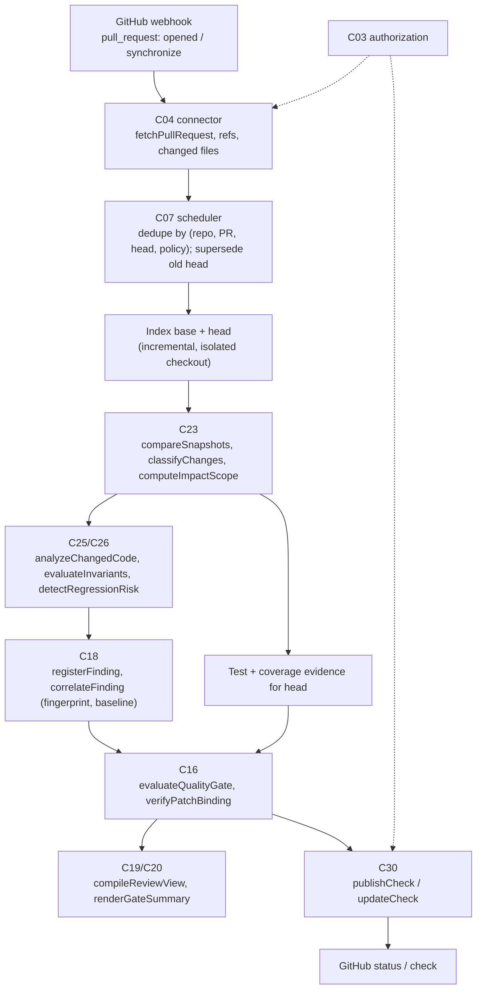
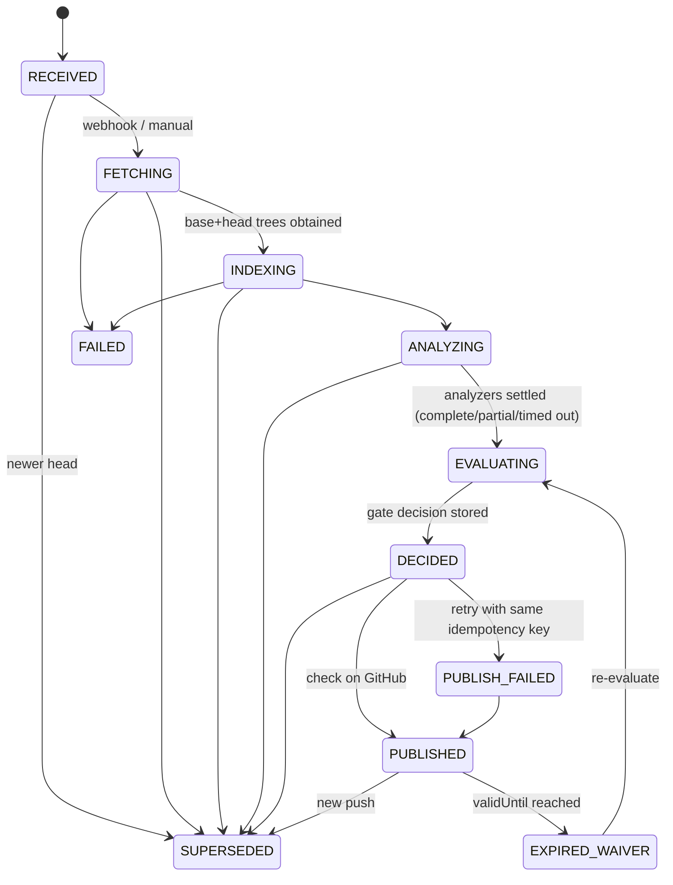

# F02 — PR analysis and quality gates

Detailed design · Version 1.0 · 4 October 2026 · Proposed implementation specification

Source: `Competitive_Features_Component_Implementation_Guide.md` §3, §5, §14–§17. Repository evidence observed at commit `8b07b5e`.
Priority P1. First deliverable: changed-code findings and a GitHub check bound to the exact head revision.

---

## 1 Purpose, user experience and status

### 1.1 The experience this feature exists for

| User asks | Product should deliver |
|---|---|
| "Is this PR safe?" | Changed-code findings, affected dependencies, test results and an actionable gate decision |

A reviewer opens a pull request (from GitHub's check link, or from CIE) and sees one page that answers the question *for this exact head commit*, without pretending to certify anything:

```
PR #482  "Make commit transactional; add insufficient-funds guard"      base main@9acc9b0 → head a19a978   analysed 2 min ago
┌─────────────────────────────────────────────────────────────────────────────────────────────────────────────┐
│  GATE: INCOMPLETE    policy "payments-default" v7        decision d-91f3 bound to head a19a978               │
│  ✗ 1 blocking condition failed   ◔ 1 mandatory check did not finish   ✓ 4 conditions passed   ○ 1 waived     │
└─────────────────────────────────────────────────────────────────────────────────────────────────────────────┘
  ✗ New high-severity finding        R-AUTHZ-GAP   state change reachable from handler without an authorisation check
        introduced by this PR (not present at merge base)      src/api/refunds.ts:41     [evidence] [data-flow path] [waive…]
  ◔ Mandatory analyzer did not finish   dependency-scan timed out after 120 s  → the gate cannot pass until it completes   [retry]
  ✓ No tests lost                  3 reaching tests unchanged, 1 gained
  ✓ Coverage on changed lines      84% of 19 executable changed lines (policy requires ≥ 70%)
  ○ Waived: R-PII-LOG at src/jobs/export.ts:88   by dana@…  until 2026-11-01  "tracked in #4410"
  Changed code: 6 symbols in 4 files · affects 17 dependents across 2 repositories · 12 existing findings in touched files (not introduced here)
  What this does not tell you: dynamic calls in createRefund (3) could not be resolved; no runtime data was used.
```

### 1.2 What "done" means for the user

1. The decision is `PASS`, `FAIL` or `INCOMPLETE`, each with named reasons that link to the policy condition and the evidence behind it.
2. *New* problems are separated from *existing* ones, using the same rule version on both sides or an explicit re-analysis of the base.
3. A mandatory analyzer that times out, crashes or is unavailable yields `INCOMPLETE`, never `PASS`.
4. The GitHub shows a check for the head commit that CIE actually analysed; pushing a new commit supersedes it; webhook redelivery never duplicates it.
5. A waived finding stays visible, with who waived it, why, for which scope and until when.

### 1.3 Status

**Proposed implementation specification.** The repository already contains most of the *evidence producers* (semantic change sets, security rules, test artifacts, defect detectors) and an idempotent draft-PR publisher. It contains **no** pull-request analysis flow, no gate policy, no per-head test results and no GitHub check publication. This document specifies those and how they reuse what exists.

---

## 2 Scope, non-goals and first delivery boundary

### 2.1 In scope

- Ingest a PR's base and head, including PRs from forks, safely.
- Index base and head (incrementally), compute the semantic change set and affected scope.
- Run the configured analyzers over **changed code and its affected neighbourhood**, labelling coverage.
- Separate newly introduced findings from pre-existing ones.
- Evaluate a **versioned gate policy** deterministically against exact evidence; bind the decision to a hash.
- Publish an idempotent check (and, optionally, a summary comment) to the GitHub for the exact head; supersede on push.
- A PR review view in CIE.
- Waivers/exceptions with scope and expiry.

### 2.2 Non-goals (first release)

- Merging, approving or blocking merges by CIE's own authority. The GitHub's branch protection consumes the check; CIE does not merge.
- Running arbitrary PR code on the analysis host. Static analysis only by default; any build/test execution is opt-in, isolated, and covered by F07's execution model.
- Automatic fixes (that is F07).
- Other source hosts (GitLab, Bitbucket). The product has one connector: GitHub.
- A defect-probability model. Findings are candidates with evidence and counter-arguments (existing `security.ts` stance), not scores of "likelihood of bug".

### 2.3 First delivery boundary

One repository, GitHub, a policy with four condition types (new findings above a severity, required analyzers completed, no tests lost, coverage on changed lines), static analyzers already in the repository (`security.ts` rules, the defect detectors under `defect/`, the semantic consequences in `history.ts`), results published as a **commit status** with a link back to the CIE PR page, plus an updatable summary comment. Check Runs (rich output, annotations) require a GitHub App and are specified in §10.3 as the second step.

---

## 3 Current state in this repository

### 3.1 What exists (observed)

| Capability | Where | What it does today | Class |
|---|---|---|---|
| PR metadata (read-only) | `connectors.ts` (`PullRequest`, `parsePullRequest`, `ForgeConnector`), `gh.ts` | Reads titles, states, authors, bodies through the `gh` CLI's authentication; validates every record; quarantines invalid ones; resumes after rate limits | EXISTING_EXTEND (needs base/head SHAs, changed files, fork info) |
| Inbound webhooks | `connectors.ts` `receiveWebhook` | Authenticated (HMAC), ordered, idempotent via `ext_deliveries`; replays are `replayed: true` | EXISTING_REUSE |
| Semantic change set between two indexed revisions | `history.ts` `History.compare` → `ChangeSet` | Entities `ADDED/REMOVED/MODIFIED/RENAMED/MOVED`; consequences (`TRANSACTION_BYPASS`, `ERROR_PATH_ADDED`, `NEW_CYCLE`, `TESTS_LOST`, …); `blastRadius`; `testImpact` (lost/gained/unchanged); explicit `gaps` | EXISTING_REUSE |
| Impact through reverse dependencies | `indexer.ts` `computeImpact`, `graph.ts` `dependents` | Affected entities, claims, concepts, workspaces | EXISTING_REUSE |
| Changed-code impact assessment | `history.ts` `assessChangeImpact` | Dependents, files, tests, owners per changed entity | EXISTING_REUSE |
| Security/policy rules | `security.ts` (`RULES`, `Finding`, alarm gate) | Versioned rules (`R-PII-LOG`, `R-AUTHZ-GAP`, `R-POLICY-MISSING`); finding is a `CANDIDATE` until deterministic proof or two authorised confirmations; stored in `sec_findings` | EXISTING_EXTEND (needs to run on a *subset* and on two revisions) |
| Defect/performance detectors | `defect/*.ts`, `defect-workflow.ts` | Lock-order, memory/logical races, call-in-loop; `RunManifest`, `PatchValidation` | EXISTING_EXTEND |
| Test and coverage artifacts | `testartifacts.ts` (`parseLcov`, `parseIstanbul`, `parseJUnit`, `parseJestJson`, `ingestTestArtifacts`) | Parses JUnit/Jest/lcov/Istanbul found *in the repository checkout*; stored in `test_runs(repo_root primary key)` | EXISTING_EXTEND — **one row per repository, not per revision** |
| Claim lifecycle and alarm gate | `claim-ledger.ts` (`validateAlarm`, `ALARM_ROLE`), `claims.ts` | Append-only claim events; role-based confirmations | EXISTING_REUSE |
| Draft PR publisher | `defect-workflow.ts` (`DraftForge`, `preparePullRequest`, `publishPullRequest`) | Grant-checked, stale-head-checked, find-then-create (idempotent) draft PR for a validated fix | EXISTING_EXTEND (pattern for checks) |
| Outbound webhooks | `exports.ts` (`Notifications`) | One delivery per (event, subscription), stable idempotency key, retries, HMAC signing | EXISTING_REUSE |
| Collaboration/exceptions principals | `collab.ts` (`collab_principals`, `collab_access`) | People, roles, scoped access | EXISTING_EXTEND (waiver approvals) |
| Isolation for untrusted execution | `defect-isolation.ts` (`ContainerProfile`), `defect-local.ts` | Container adapters for untrusted repos; local adapters refuse untrusted roots | EXISTING_REUSE |
| Evidence-faithful export | `exports.ts` (`buildExport`) | Claims leave with their class, state, confidence and the "this is a copy" limit | EXISTING_EXTEND |

### 3.2 Verified gaps

| Gap | Evidence | Consequence |
|---|---|---|
| The GitHub connector cannot write | `HttpRequest.method` is typed `"GET"` (`connectors.ts:10`); no check/status/comment API anywhere | NEW write transport (`ForgePublisher`) with its own authorization and idempotency |
| No PR analysis flow | No `analyzePullRequest`; `History.compare` takes two *already indexed* revisions | NEW orchestration: obtain base/head trees, index them, compare |
| No gate policy | No policy evaluation code | NEW `C16.evaluateQualityGate` |
| Test results are per repository | `test_runs(repo_root primary key)` | A PR's test results for *its head* need a per-revision store |
| Findings are not compared across revisions | `sec_findings` holds `revision`, `superseded`; no baseline diff | NEW fingerprint and baseline comparison |
| No fork handling | Not present | NEW: fetch `refs/pull/N/head` without trusting the fork |
| Exceptions are per-claim confirmations only | `claim-ledger.ts` | NEW waiver record with scope and expiry |

### 3.3 Not verified

- Whether `History.compare` is fast enough on large PRs (it pairs *all* symbol entities; the cost on a 5,000-file PR is unmeasured).
- Whether the existing worker can index a `git worktree` checkout produced from `refs/pull/N/head` with the same revision identity semantics as a developer's working tree (the revision id depends on root + content).
- GitHub rate-limit behaviour with this transport under a burst of `synchronize` events.

---

## 4 Architecture and ownership



### 4.1 Responsibilities

| Component | Responsibility | Functions | Class |
|---|---|---|---|
| C04 | PR base/head, changed files, fork-safe ref fetch, webhook intake | `fetchPullRequest`, `compareSnapshots` (refs), `fetchHeadRef` | EXISTING_EXTEND (`ForgeConnector`) + NEW |
| C23 | Semantic and textual diff, changed symbols, affected dependencies | `compareSnapshots`, `classifyChanges`, `computeImpactScope` | EXISTING_REUSE (`History.compare`, `assessChangeImpact`) |
| C25/C26 | Run configured security, correctness and performance rules on affected code; label coverage | `analyzeChangedCode`, `evaluateInvariants`, `detectRegressionRisk` | EXISTING_EXTEND (rule runners over a subset) |
| C16 | Gate policy evaluation, mandatory checks, missing-data semantics; binding verification; invalidation | `evaluateQualityGate`, `verifyPatchBinding`, `invalidateDecision` | NEW (verification ledger exists as `claims.ts`/`claim-ledger.ts`; gate evaluation is new) |
| C18 | Findings with rule/version/location/status, deduplicated across runs without losing history | `registerFinding`, `correlateFinding`, `recordDisposition` | EXISTING_EXTEND (`sec_findings`, claims) |
| C28 | Exact candidate validation and original-oracle results; waived vs resolved | `validateCandidate`, `compareOracles`, `attachRuns` | EXISTING_EXTEND (F07 shares this) |
| C19/C20 | Base/head differences, gate conditions, evidence links, uncertainty; no fact-styled hypotheses | `compileReviewView`, `renderGateSummary` | NEW form + EXISTING_REUSE of display modes |
| C30 | Idempotent GitHub checks/comments bound to the head; revoke/replace stale results | `publishCheck`, `updateCheck`, `linkEvidence` | NEW (reuse the publisher pattern) |
| C03/C07/C31/C32 | GitHub-write authorization; prioritising current heads; gate history; publication failure audit | — | EXISTING_EXTEND |

---

## 5 Reconciliation with existing contracts

| Guide | Repository | Decision |
|---|---|---|
| `C23.analyzePullRequest -> Job<Outcome<ChangeImpact>>` | `JobKind = "index" \| "concepts" \| "investigate" \| "defect-detect" \| "defect-experiment"` | Add `JobKind` value `"pr-analysis"`; the job value is `ApiResult<PrAnalysisView>` |
| `ChangeImpact` | `ChangeSet` + `assessChangeImpact` output | `ChangeImpact` is a *view* assembled from `ChangeSet.blastRadius/testImpact/consequences/gaps`; no second structure |
| `C16.evaluateQualityGate -> {decisionId, status, reasons, bindingHash}` | No equivalent; `claims.ts` verifies claims, not policies | New operation; `status` is `PASS`/`FAIL`/`INCOMPLETE`; `INCOMPLETE` is **not** an `ErrorCode` — it is a successful, honest verdict |
| `C30.publishCheck -> PublicationReceipt` | `defect-workflow.ts` returns `PrPublication` for drafts | `PublicationReceipt` = `{GitHub, repository, headHash, externalId, url, state, idempotencyKey}`; reuse the grant pattern (`PublicationGrant`, `PUBLISH_DRAFT`) with a new purpose `PUBLISH_CHECK` |
| `PatchBinding` | `PatchValidation { baseHash, headHash, diffHash, harnessHash, oracleHash, runManifestIds, … }` | The gate's `bindingHash` uses the same field vocabulary; a PR decision binds `(baseHash, headHash, policyHash, evidenceArtifactHashes, runManifestIds)` |
| `Outcome<T>` | `ApiResult<T>` | As in F01 §5 |

---

## 6 Data model

### 6.1 Identity

- **PR identity** — `(repositoryId, GitHub, prNumber)`.
- **Analysis identity** — `(repositoryId, prNumber, baseHash, headHash, policyHash, analyzerSetHash)`. Two analyses with the same identity are the same analysis (deduplicate and return the existing one).
- **Finding fingerprint** — a rename- and move-stable key (§7.4).
- **Decision identity** — `decisionId`; **binding hash** = SHA-256 over the canonical serialisation of `{baseHash, headHash, mergeBaseHash, policyHash, analyzerSetHash, sorted evidence artifact hashes, sorted runManifestIds, coverageSummaryHash, exceptionsInEffect[].id}`. A decision is valid only for the exact set it hashes.

### 6.2 Tables (proposed)

```sql
create table pr_analyses(
  id text primary key,
  repository_id text not null, GitHub text not null, pr_number integer not null,
  base_hash text not null, head_hash text not null, merge_base_hash text not null,
  head_repository text,                 -- differs from repository for forks
  base_revision text, head_revision text,        -- CIE revision ids once indexed
  policy_id text not null, policy_hash text not null, analyzer_set_hash text not null,
  state text not null,                  -- see §9
  created_at text not null, updated_at text not null,
  supersedes text,                      -- previous analysis of the same PR (older head)
  unique(repository_id, pr_number, base_hash, head_hash, policy_hash, analyzer_set_hash)
);
create table pr_changed_files(
  analysis_id text not null, path text not null, status text not null,   -- added|modified|removed|renamed
  old_path text, additions integer, deletions integer, generated integer not null,
  primary key(analysis_id, path)
);

-- A finding occurrence for one analysis, tied to the existing finding/claim rows.
create table pr_findings(
  analysis_id text not null, finding_id text not null,
  fingerprint text not null, introduced integer not null,       -- 1 = new in this PR, 0 = existing at merge base
  baseline_finding_id text,                                      -- the matching base finding when existing
  rule_id text not null, rule_version integer not null, severity text not null,
  path text not null, line integer, entity_id text,
  disposition text not null,           -- OPEN | WAIVED | RESOLVED_BY_CHANGE | DISMISSED_FALSE_POSITIVE
  primary key(analysis_id, finding_id)
);

-- Policies are versioned and immutable once used.
create table gate_policies(
  policy_id text not null, version integer not null, policy_hash text not null,
  body text not null,                  -- canonical JSON (see §7.1)
  created_by text not null, created_at text not null,
  primary key(policy_id, version)
);

-- Per-condition result inside a decision, so every displayed line links to policy + evidence.
create table gate_decisions(
  decision_id text primary key, analysis_id text not null,
  status text not null,                -- PASS | FAIL | INCOMPLETE
  binding_hash text not null, evaluated_at text not null, valid_until text,   -- earliest waiver expiry
  superseded integer not null default 0, revoked_reason text
);
create table gate_condition_results(
  decision_id text not null, condition_id text not null,
  outcome text not null,               -- PASSED | FAILED | INCOMPLETE | WAIVED | NOT_APPLICABLE
  reason text not null, evidence_ids text not null,    -- JSON array
  waiver_id text,
  primary key(decision_id, condition_id)
);

create table gate_waivers(
  id text primary key, repository_id text not null,
  scope_kind text not null,            -- FINDING_FINGERPRINT | RULE_IN_PATH | CONDITION_ONCE
  scope_json text not null,
  actor text not null, approver text, rationale text not null,
  created_at text not null, expires_at text not null, revoked_at text
);

create table check_publications(
  id text primary key, decision_id text not null, repository_id text not null,
  GitHub text not null, head_hash text not null, idempotency_key text not null unique,
  kind text not null,                  -- STATUS | CHECK_RUN | COMMENT
  external_id text, url text, state text not null,     -- PREPARED | PUBLISHING | PUBLISHED | FAILED | SUPERSEDED
  attempts integer not null default 0, last_error text, updated_at text not null
);

-- Test results per head revision (replaces the per-repository `test_runs` for PR use).
create table revision_test_runs(
  revision text primary key, json text not null, source_hash text not null, ingested_at text not null
);
```

`revision_test_runs` is the **per-revision** counterpart of `test_runs`; existing behaviour is unchanged. It is populated from artifacts committed in the checkout *or* from CI-produced artifacts attached to the PR's head commit (§7.7), never from artifacts that the PR itself can fabricate without a stated source.

---

## 7 Algorithms and rules

### 7.1 Gate policy

A policy is a canonical JSON document, versioned and hash-addressed. A repository references a policy by id; the version used by an analysis is frozen into `policy_hash`.

```jsonc
{
  "policyId": "payments-default", "version": 7,
  "conditions": [
    { "id": "no-new-high",       "type": "NEW_FINDINGS",
      "severity": ["high"], "ruleSelectors": ["*"], "blocking": true,
      "onMissing": "INCOMPLETE" },
    { "id": "analyzers-complete","type": "REQUIRED_ANALYZERS",
      "analyzers": ["security-rules@1", "defect-detectors@3", "dependency-scan@1"],
      "blocking": true, "onMissing": "INCOMPLETE" },
    { "id": "no-tests-lost",     "type": "TESTS_NOT_LOST",
      "blocking": true, "onMissing": "INCOMPLETE" },
    { "id": "changed-line-coverage","type": "COVERAGE_ON_CHANGED_LINES",
      "minimumPercent": 70, "minimumExecutableLines": 5, "blocking": false,
      "onMissing": "INCOMPLETE" },
    { "id": "oracle-preserved",  "type": "ORACLE_PRESERVED",
      "blocking": true, "onMissing": "INCOMPLETE" },
    { "id": "dependency-policy", "type": "DEPENDENCY_POLICY",
      "ref": "licence-policy@4", "blocking": true, "onMissing": "INCOMPLETE" },
    { "id": "blast-radius-info", "type": "BLAST_RADIUS",
      "informationalAboveDependents": 25, "blocking": false }
  ],
  "baseline": { "mode": "REANALYZE_BASE_WITH_SAME_RULES" },
  "exceptions": { "maxDurationDays": 90, "requireApprovalFrom": ["security-owner"] },
  "missingDataDefault": "INCOMPLETE"
}
```

Rules that make the policy honest:

- Every condition declares `blocking` and `onMissing` (`FAIL` | `INCOMPLETE` | `IGNORE_WITH_DISCLOSURE`). The policy-level default is `INCOMPLETE`: **absence of evidence never passes a mandatory condition** (F02-A2).
- A policy must name the *required analyzers* with versions. If an analyzer in the set is unavailable on this installation, the analysis is `INCOMPLETE` from the start, with the reason "analyzer X@v not available".
- "Compilation success alone is not a safety verdict" (guide §5): there is no condition type that is satisfied by a successful build.
- Baseline comparison uses the same rule version or declares that the base was re-analysed (§7.3).

### 7.2 Decision evaluation (pure function)

```
evaluate(policy, evidence) -> Decision
  results = []
  for c in policy.conditions:
      r = EVALUATORS[c.type](c, evidence)       // each returns outcome ∈ {PASSED, FAILED, INCOMPLETE, NOT_APPLICABLE}
      r = applyWaivers(c, r, evidence.waivers, evaluatedAt)       // FAILED→WAIVED only for the waived fingerprints/scope
      if r.outcome == INCOMPLETE: r.outcome = map(c.onMissing)    // FAIL | INCOMPLETE | PASSED(+disclosure)
      results.push(r)
  status =
      FAIL        if any blocking result is FAILED
      INCOMPLETE  else if any blocking result is INCOMPLETE
      PASS        otherwise
  return { status, results, bindingHash, validUntil: min(expiry of waivers used) }
```

Properties: deterministic (no clock reads except the injected `evaluatedAt`), side-effect free, total (every condition produces a result), and independent of presentation. The same inputs always produce the same `bindingHash`. `FAIL` dominates `INCOMPLETE`: a known failure is reported even if another analyzer did not finish.

### 7.3 Baseline: new versus existing

1. Compute `mergeBaseHash` (GitHub's merge base, or `git merge-base`).
2. Obtain findings **at the merge base** produced by the *same rule versions*. If a stored base analysis with the same `analyzerSetHash` exists (for that commit, from an earlier PR or from the default branch's own analysis), reuse it. Otherwise **re-analyse the base** with the analyzers in the policy and record that it was done (`baseline.reanalyzed = true`) — never compare a head analysed with `R-AUTHZ-GAP@2` against a base stored under `@1`.
3. Match head findings to base findings by **fingerprint** (§7.4). Unmatched head findings are `introduced = 1`; matched ones are existing; base findings with no head match are `RESOLVED_BY_CHANGE`.
4. The review view shows all three groups, with *introduced* first.

### 7.4 Finding fingerprint

A fingerprint must survive the edits a PR typically makes around a finding (reformatting, moves, renames, line shifts) but change when the finding's substance changes.

```
fingerprint = H(
  ruleId,
  canonicalEntityId(entity containing the finding),      // from Registry: stable across rename/move
  normalizedAnchor,                                       // the matched construct, whitespace/comment-normalised
  occurrenceIndexWithinEntity                             // nth match of the same normalizedAnchor in that entity
)
```

Line numbers are **not** in the fingerprint. If two findings of the same rule have identical normalised anchors inside one entity, the occurrence index disambiguates them in source order. When the canonical id cannot be established (a file-level finding), the key falls back to `(path, normalizedAnchor, occurrenceIndex)`. Fingerprint stability is a tested property (F02-D2), including after a pure rename and a pure reformat.

### 7.5 Changed-code analysis scope

Analyzing the whole repository on every PR is wasteful, and analyzing only changed lines misses interaction effects. The scope is **changed entities plus their reverse-dependency neighbourhood to a bounded depth** (default 2; configurable): `ChangeSet.entities` filtered to changed/added/renamed → `dependents(store, headRevision, id, {maxDepth})` → affected files. Analyzers run on that file set. Coverage is labelled: `{analyzedFiles, skippedFiles, reason}`; "analysis covered 31 of 4,208 files (changed + dependents depth 2)" is part of the decision's disclosure. A condition may require `scope: WHOLE_REPOSITORY` for rules where local analysis is insufficient (e.g., `R-POLICY-MISSING`); such analyses use the cached default-branch result when still valid for the base and re-run on head only if their inputs changed.

### 7.6 Analyzer execution

- Static analyzers (rules, detectors) run in the TypeScript process over already-parsed facts; they do not execute PR code.
- **Per-analyzer budget** (wall time, memory, output) and a **deadline** derived from the PR job. Exceeding a budget yields `INCOMPLETE` for that analyzer with `partial` findings retained, flagged as partial (F02-A2).
- **Isolation of PR content.** The head is checked out into a temporary directory that is read-only to analyzers, outside any trusted-root list (`defect-local.ts` refuses untrusted roots; static analysis does not need a trusted root). Symlinks pointing outside the checkout are not followed. Path traversal in a PR's file names is rejected at checkout.
- Tests and builds from the PR do **not** run in this feature. If a policy requires a "tests passed" condition, the evidence comes from CI results attached to the head (§7.7) or from an F07-style isolated run with an explicit grant.

### 7.7 Test and coverage evidence for the head

Three sources, in descending trust; the condition result states which was used:

1. **CI artifacts for the exact head commit** (JUnit, Jest JSON, lcov, Istanbul) fetched through GitHub's checks/artifacts API and parsed with the existing parsers (`parseJUnit`, `parseJestJson`, `parseLcov`, `parseIstanbul`). The artifact hash and the CI run id are recorded as evidence. Artifacts from a different commit are rejected (`EVIDENCE_STALE`).
2. **Artifacts committed in the repository at the head.** Accepted only with the disclosure "supplied by the PR itself".
3. **A CIE-run isolated execution** (F07 machinery) with a run manifest.

Coverage on changed lines: map each changed hunk's added/modified line range to executable lines from the coverage file; the percentage is `covered / executable-changed`. If fewer than `minimumExecutableLines` exist, the condition is `NOT_APPLICABLE`, not a trivially perfect 100%.

`TESTS_NOT_LOST` uses `ChangeSet.testImpact[].lost`: a test that reached a changed entity at base and no longer reaches it at head. That is *structural* evidence (static reachability), and the result says so; it does not claim the test ran.

### 7.8 Oracle preservation

When a PR changes test files, `ORACLE_PRESERVED` checks assertion-level change: removed or loosened assertions, deleted test cases, `skip`/`xfail` additions, weakened expected values. The check is a **detector with a stated limitation** (guide §15: "claiming automatic weakening detection is complete" is not allowed): it reports *candidates* for review (`propertyChangeReviewId` in the guide's `PatchBinding`), and a human decision records a legitimate property change. Un-reviewed candidates make the condition `FAILED` (blocking) or `INCOMPLETE`, per policy.

### 7.9 Waivers

A waiver is created by an authorised actor, names a scope (`FINDING_FINGERPRINT`, `RULE_IN_PATH`, or `CONDITION_ONCE` for a single decision), must include a rationale and an expiry no later than the policy's `maxDurationDays`, and where the policy requires it is **approved by a second principal holding a named role** (reusing `ALARM_ROLE`-style role checks in `claim-ledger.ts`). Evaluation treats a waiver as in effect only if `evaluatedAt < expiresAt` and it is not revoked. A decision that relies on a waiver records `validUntil = min(expiry)`; a scheduled re-evaluation job runs at that time and supersedes the decision. A waiver converts `FAILED` → `WAIVED` for the **matching findings only**; it never marks the finding resolved, and it never hides it from the view.

---

## 8 API contracts

Operations follow the existing gateway registry. Mutating operations require `Idempotency-Key`.

### 8.1 Types

```typescript
type PullRequestRef = { repositoryId: string; prNumber: number };

type PrAnalysisView = {
  analysisId: string; pr: PullRequestRef;
  baseHash: string; headHash: string; mergeBaseHash: string; headRepository?: string;
  state: PrAnalysisState; supersededBy?: string;
  changes: { files: ChangedFile[]; symbols: EntityChange[]; consequences: Consequence[];
             blastRadius: ChangeSet['blastRadius']; testImpact: ChangeSet['testImpact']; gaps: string[] };
  findings: { introduced: PrFinding[]; existing: PrFinding[]; resolvedByChange: PrFinding[] };
  analyzers: { id: string; version: string; state: 'COMPLETE'|'PARTIAL'|'TIMED_OUT'|'UNAVAILABLE'|'FAILED';
               coverage: { analyzedFiles: number; skippedFiles: number; reason?: string } }[];
  baseline: { mode: 'REUSED' | 'REANALYZED'; analyzerSetHash: string };
  decision?: GateDecisionView;
};

type GateDecisionView = {
  decisionId: string; status: 'PASS' | 'FAIL' | 'INCOMPLETE'; bindingHash: string;
  policy: { policyId: string; version: number; policyHash: string };
  evaluatedAt: string; validUntil?: string; superseded: boolean;
  conditions: { id: string; type: string; blocking: boolean;
                outcome: 'PASSED'|'FAILED'|'INCOMPLETE'|'WAIVED'|'NOT_APPLICABLE';
                reason: string; evidenceIds: string[]; waiverId?: string }[];
};

type PublicationReceipt = {
  publicationId: string; repositoryId: string; headHash: string;
  kind: 'STATUS' | 'CHECK_RUN' | 'COMMENT'; externalId?: string; url?: string;
  state: 'PUBLISHED' | 'SUPERSEDED' | 'FAILED'; idempotencyKey: string;
};
```

### 8.2 Operations

```typescript
C23/analyzePullRequest(ctx, { pr: PullRequestRef, baseHash: string, headHash: string, policyId?: string })
  -> ApiResult<JobView>                                   // mutating; deduplicated by analysis identity
C23/getPrAnalysis(ctx, { analysisId } | { pr, headHash? }) -> ApiResult<PrAnalysisView>
C16/evaluateQualityGate(ctx, { analysisId, policyId?, now? }) -> ApiResult<GateDecisionView>   // idempotent per analysis+policy
C16/verifyBinding(ctx, { decisionId }) -> ApiResult<{ valid: boolean; reasons: string[] }>
C16/invalidateDecision(ctx, { decisionId, reason }) -> ApiResult<GateDecisionView>             // mutating
C18/recordDisposition(ctx, { analysisId, findingId, disposition, rationale?, waiver?: WaiverInput }) -> ApiResult<PrFinding> // mutating
C30/publishCheck(ctx, { decisionId, idempotencyKey, kind?: 'STATUS'|'CHECK_RUN', alsoComment?: boolean }) -> ApiResult<PublicationReceipt>   // mutating
C04/ingestWebhook(ctx, { GitHub, headers, rawBody }) -> ApiResult<{ applied: boolean; replayed: boolean; analysisId?: string }>
C16/listPolicies / C16/getPolicy / C16/putPolicy   // putPolicy creates a new immutable version
```

Errors: `STALE_REVISION` when the PR head moved before publication; `EVIDENCE_STALE` for CI artifacts from another commit; `FORBIDDEN` for missing GitHub-write scope; `INSUFFICIENT_EVIDENCE` is *not* used for an incomplete gate (that is a normal `INCOMPLETE` decision); `VERSION_CONFLICT` for policy or waiver races.

---

## 9 States and lifecycles

### 9.1 PR analysis



`SUPERSEDED` is terminal for the analysis but not for the PR: the new head has its own analysis. Late results from a superseded analysis are rejected at every commit point (generation = the PR's head sequence number).

### 9.2 Check publication

`PREPARED → PUBLISHING → PUBLISHED`, `PUBLISHED → SUPERSEDED` when a newer decision for a newer head replaces it, `FAILED` with bounded retries (same `idempotencyKey`). A publisher always `find`s by idempotency key before it creates, as `publishPullRequest` already does for drafts.

---

## 10 Authorization, egress, GitHub writes

### 10.1 Reads

A principal sees a PR analysis only if they may see the repository (existing access policy). Findings in denied paths are counted, never named (existing rule from `access.ts`). Fork PRs: head content is fetched through the **base repository's** `refs/pull/N/head`, so no credential for the fork is needed.

### 10.2 Writes

Writing a status or comment is an *outward-facing action* and needs a grant: a stored `PublicationGrant`-style record with purpose `PUBLISH_CHECK`, bound to `(repositoryId, headHash, decisionId)`, checked twice (before `find` and before create) as the draft-PR path does. A grant for head X is useless for head Y.

### 10.3 Status versus check run

| Mechanism | Credentials | Capability | Use |
|---|---|---|---|
| Commit status (`POST /repos/{o}/{r}/statuses/{sha}`) | User or token with repo status scope; works with the `gh` CLI session CIE already uses | `state`, a ≤140-character description, a target URL, a context name | First release |
| Check run (Checks API) | A **GitHub App** installation token (to be confirmed against the current GitHub documentation at implementation time) | Title, summary (long Markdown), annotations on lines, re-run action | Second release, behind an explicit "install the GitHub App" step |
| PR comment | Token with PR write | A summary table; updated in place via a hidden marker | Optional, off by default (comment noise) |

The publisher interface hides this: `GitHubChecksPublisher.publish(decision, kind)`; an installation without an App simply never offers `CHECK_RUN`. Whether branch protection can require a *status context* versus a *check name* is a GitHub configuration matter that the setup guide must state.

### 10.4 Egress

Gate output sent to the GitHub is an **export**: claim class, state and the "this is a copy" limit (existing `COPY_LIMIT`) accompany it; text derived from source is limited to rule ids, paths and line numbers, **not** code snippets, unless the repository owner opts in. Findings from a *private* repository posted to a *public* PR thread would leak; the publisher refuses when the target repository's visibility is wider than the analysis's access scope.

### 10.5 Threat model for hostile PRs

| Threat | Control |
|---|---|
| PR file names with `..`, absolute paths, symlinks to the host | Checkout into a sandboxed directory, reject traversal, do not follow outward symlinks |
| Huge or adversarial files (parser DoS) | Per-file size and parse-time caps; parse in the worker with the existing frame limit (8 MiB) and a timeout |
| PR modifies the policy or the analyzer config to pass itself | The policy is read from the **base branch** or a central store, never from the head |
| PR commits fake coverage/test artifacts | Prefer CI artifacts for the head; label PR-supplied artifacts (§7.7) |
| PR tries to exfiltrate through analysis output | Output is IDs/paths/lines only; snippets are opt-in |

---

## 11 Freshness, cancellation, idempotency, recovery

| Concern | Mechanism |
|---|---|
| New push during analysis (F02-A1) | `synchronize` webhook → new analysis for the new head; old analysis marked `SUPERSEDED`; in-flight jobs for the old head are cancelled before their commit point; any attempt to publish a decision whose `headHash` differs from GitHub's *current* head (`DraftForge.resolve`) fails with `STALE_REVISION`. The UI shows the old decision as "superseded" and never as the current gate |
| Webhook redelivery (F02-A4) | `receiveWebhook` is already idempotent; analysis creation is idempotent on the analysis identity; `check_publications.idempotency_key` is unique, and the publisher `find`s before creating |
| Out-of-order events | The existing connector orders deliveries; analysis uses the head sequence, not arrival order |
| Crash mid-publish | `PUBLISHING` rows are re-driven on start-up; because the GitHub call is keyed by `(headHash, context)`, a repeat updates the same status rather than creating another |
| Analyzer timeout (F02-A2) | Marks that analyzer `TIMED_OUT`; conditions requiring it become `INCOMPLETE`; the decision is `INCOMPLETE` unless another blocking condition `FAIL`s |
| Policy edited after analysis | A new policy version yields a new `policyHash` and a **new** analysis identity; the old decision stays as history |
| Waiver expiry | Scheduled re-evaluation at `validUntil`; the superseded decision is marked, and a new status is published |

---

## 12 Interface specification

### 12.1 Surfaces

1. **PR review page** (new route/overlay; the header gains "Pull requests" next to *Investigations*). Sections in fixed order: *Gate* → *Introduced findings* → *Analyzer completeness* → *Tests & coverage* → *Changed code and impact* → *Existing findings in touched files* → *Waivers* → *What this does not tell you*.
2. **Gate banner** — status word plus glyph (`✓ PASS`, `✗ FAIL`, `◔ INCOMPLETE`), policy name/version, head hash, "analysed N minutes ago", and a persistent "bound to head a19a978 — superseded if the PR changes".
3. **Condition list** — one row per condition: outcome, reason sentence, links "evidence", "policy", and (when applicable) "waive…".
4. **Findings table** — grouped *Introduced / Existing / Resolved by this change*; each row opens the F03 path (when present), the code span, the rule text with its counter-argument (existing `security.ts` text).
5. **Map hand-off** — "Show changed code on the map" renders the V6 semantic-diff form for `(mergeBase → head)` (existing form `diffview.ts`) and V11-style consequences.
6. **Policy editor** (admin) — JSON with schema validation and a diff to the previous version; a "dry-run on PR #…" button that evaluates without publishing.

### 12.2 Copy rules (the honest-label rules for this feature)

- `PASS` is never worded "safe", "approved" or "verified". Banner copy: *"No blocking condition failed under policy payments-default v7."*
- `INCOMPLETE` always names the missing thing: *"dependency-scan timed out after 120 s."*
- Findings are *"candidates"* until the existing alarm gate is satisfied.
- "No findings" is rendered with its coverage sentence: *"No new findings in 31 analysed files (changed files and their direct dependents)."*
- Existing-finding counts are clearly labelled "not introduced by this PR".

### 12.3 States

| State | Presentation |
|---|---|
| Analysing | Stepper (Fetch → Index → Analyse → Evaluate → Publish) with elapsed time, per-analyzer progress, Cancel |
| Superseded | Whole page banner: "A newer commit was pushed. This analysis described a19a978." with a link to the new analysis |
| Publish failed | Gate decision visible; a separate "Could not post status to the GitHub: …" notice with Retry |
| Policy missing | "No gate policy applies to this repository. Findings are shown without a decision." — no decision is invented |
| Forbidden | Indistinguishable from "not found" for the PR; counts only for what is visible |

### 12.4 Accessibility

The gate banner is a `role="status"` region announced once when it changes. The condition list is a table with row/column headers; outcome is text first, glyph second. The findings table supports keyboard row navigation and Enter to open evidence. Waiver dialogs trap focus and require an explicit rationale field. No outcome relies on colour.

---

## 13 Performance and bounded work

Targets are proposals; measure on recorded PRs of small/medium/large size first.

| Quantity | Bound |
|---|---|
| Time from webhook to a "pending" status on GitHub | A pending status is published immediately on receipt (before analysis), so a reviewer sees "analysing" within seconds; the budget for the *final* decision is derived from measurement |
| Dependent-neighbourhood depth | 2 default, 4 max |
| Files analysed per analyzer | Cap with disclosure; exceeding cap = `PARTIAL` coverage |
| Findings listed per page | 50; totals shown |
| Concurrent PR analyses | Queue with priority: current heads > older; a superseded head's job is dropped, not completed |
| Comment updates | One comment per PR, updated at most once per decision |

Index reuse is the main lever: base and head share most files; the worker's delta mode and parse cache (`CacheKey(rel, hash)`) mean only changed files reparse.

---

## 14 Failure modes

| Failure | Detection | Behaviour |
|---|---|---|
| GitHub unreachable / credential expired | Connector states (`EXPIRED`, `UNREACHABLE`, `RATE_LIMITED` already exist) | Analysis can finish; publication `FAILED` with retry; UI says what is wrong; no silent success |
| Rate limited while posting status | `RATE_LIMITED` with resume time | Backoff with the stored resume time; one outstanding publication per (head, context) |
| PR head force-pushed to an earlier commit | `headHash` differs | New analysis for that head (idempotent identity may already exist → reuse) |
| Base branch moved | Merge base changes | `mergeBaseHash` differs → new analysis identity; "baseline reanalysed" recorded |
| Mandatory analyzer crashes | Exit status | `FAILED` analyzer → `INCOMPLETE` decision |
| Findings explosion (a rule fires thousands of times) | Per-rule cap | Cap with explicit "N more not shown"; the condition still evaluates over **all** findings, not the shown ones |
| Fingerprint collision | Same fingerprint twice in one entity | Occurrence index disambiguates; a residual collision is reported as an analysis diagnostic |
| Fork PR with a deleted fork | Ref fetch fails | `FAILED` with "head not retrievable"; no stale head used |
| Policy references an unknown condition type | Schema validation | Policy rejected at `putPolicy`, never at evaluation time |

---

## 15 Test plan

### 15.1 Acceptance (from the guide)

| ID | Test | How |
|---|---|---|
| F02-A1 | Push a new head between analysis and publication; the old PASS cannot become the current check | Harness with a fake GitHub whose `resolve` changes mid-flow; assert `publishCheck` returns `STALE_REVISION`, the old decision is `superseded`, and the UI/API never reports it as current. Mutation control: remove the head comparison → test must fail |
| F02-A2 | Timeout of a mandatory analyzer yields `INCOMPLETE`, not `PASS` | Inject an analyzer that exceeds its budget; assert decision `INCOMPLETE` and reason text names the analyzer; a second case with a known failing blocking condition must yield `FAIL` |
| F02-A3 | Existing findings are separated from newly introduced findings | Fixture PR that (a) leaves an existing finding untouched, (b) moves it, (c) renames its function, (d) adds a new one: only (d) is `introduced`; (b),(c) keep the same fingerprint |
| F02-A4 | Repeated webhook delivery creates no duplicate check | Deliver the same event N times and with reordering; assert one `pr_analyses` row, one `check_publications` row, one external status |
| F02-A5 | Every displayed condition links to its policy and evidence | Render the review view and assert each condition has non-empty `evidenceIds` (or `NOT_APPLICABLE` with reason) and a policy anchor |
| F02-A6 | An approved exception remains visible with actor, rationale, scope and expiry | Create a waiver, evaluate, assert `WAIVED` outcome, assert the finding remains in the view, then advance the injected clock past expiry and assert the decision is re-evaluated and fails again |

### 15.2 Design-level checks

| ID | Test |
|---|---|
| F02-D1 | `evaluate` is pure: same inputs → same `bindingHash` across runs and machines |
| F02-D2 | Fingerprint stable under reformat, rename, move; changes when the matched construct changes |
| F02-D3 | Policy read from head is ignored; policy edit in the PR cannot affect its own gate |
| F02-D4 | PR-supplied coverage is labelled as such; CI artifact for a different commit is rejected with `EVIDENCE_STALE` |
| F02-D5 | `ORACLE_PRESERVED` reports a deleted assertion as a candidate and the un-reviewed candidate blocks per policy |
| F02-D6 | Baseline with a different rule version is re-analysed, never compared |
| F02-D7 | Path traversal and outward symlinks in a PR checkout are rejected |
| F02-D8 | Private-repository decision is not posted to a wider-visibility target |
| F02-D9 | Findings in denied paths are counted, not named, in the review view and in the GitHub description |
| F02-D10 | `FAIL` dominates `INCOMPLETE` |
| F02-D11 | Zero executable changed lines → coverage condition `NOT_APPLICABLE`, not 100% |

### 15.3 Real-input demonstration

Run the whole flow on a real repository with at least three real PRs (one clean, one introducing a finding, one that touches tests) and a real GitHub status, recording commit hashes, policy hash, analyzer versions and the rendered page's browser dimensions. Self-authored fixtures alone do not satisfy the guide's real-input rule.

---

## 16 Work packages

| WP | Title | Depends on | Size | Result |
|---|---|---|---|---|
| WP-01 | PR ingestion: base/head/merge-base, changed files, fork-safe ref fetch, sandboxed checkout | — | M | `C04/fetchPullRequest`, checkout service |
| WP-02 | Orchestration job `pr-analysis` with identity, dedupe, supersede, generation fence | WP-01 | M | `C23/analyzePullRequest`, `pr_analyses` |
| WP-03 | Scope computation (changed + dependents), analyzers over a file subset with budgets and coverage labels | WP-02 | M | Per-analyzer outcomes |
| WP-04 | Fingerprinting and baseline comparison | WP-03 | M | `pr_findings.introduced`, re-analysed base |
| WP-05 | Gate policy model, `evaluate`, `gate_*` tables, policy API | WP-04 | L | `C16/evaluateQualityGate` |
| WP-06 | Per-revision test/coverage evidence; CI artifact ingestion; changed-line coverage | WP-03 | M | `revision_test_runs`, evaluators |
| WP-07 | Oracle-preservation detector and review hook | WP-06 | M | `ORACLE_PRESERVED` |
| WP-08 | Waivers: model, approvals, expiry job | WP-05 | M | `gate_waivers` |
| WP-09 | GitHub write transport and `GitHubChecksPublisher` (status first), grants, idempotency | WP-05 | L | `C30/publishCheck` |
| WP-10 | PR review page, banner, condition list, findings table, a11y | WP-05 | L | Interface in §12 |
| WP-11 | Check Runs via GitHub App (optional second release) | WP-09 | L | Annotations and long summaries |
| WP-12 | Acceptance suite, mutation controls, real-input demonstration, ledger items | all | M | F02-A1…A6 and D-checks green |

---

## 17 Migration, rollout and compatibility

- All new tables are separate migrations in `migrations.ts` with down-migrations. `test_runs` is untouched; `revision_test_runs` is additive.
- `JobKind` gains `"pr-analysis"` (schema change in `packages/schema/src/index.ts`; web client treats unknown kinds as generic jobs).
- **Rollout flags:** `pr.analysis` (ingest and analyse, no GitHub writes) → `pr.publish.status` → `pr.publish.comment` → `pr.publish.checkrun`. The first flag alone lets a team see the page with zero outward effect.
- **Dry-run mode** evaluates and renders without publishing; the policy editor's "dry-run on PR" uses it.
- Teams adopt a policy in *advisory* mode first (`blocking: false` everywhere) so the first weeks produce data instead of blocked merges.

---

## 18 Risks and open decisions

| ID | Decision / risk | Options | Recommendation |
|---|---|---|---|
| D1 | Where does the policy live? | In the repository's default branch / central store | Central or default-branch, never head (F02-D3); default-branch file is easiest to review |
| D2 | Status versus check run for release one | Status (works with `gh` auth) / Check run (needs App) | Status first (§10.3); check run second |
| D3 | Whole-repo vs neighbourhood analysis | Always whole / neighbourhood with whole-repo rules flagged | Neighbourhood by default, per-rule override |
| D4 | CI artifact source | GitHub artifacts API / commit statuses / manual upload | GitHub artifacts for the head; label PR-supplied ones |
| D5 | Comment noise | Off / one updated comment | Off by default |
| D6 | Who may waive | Any maintainer / role-gated with approver | Role-gated with an approver, expiry mandatory |
| R1 | Re-analysing the base doubles cost | Cache by `(baseHash, analyzerSetHash)` and reuse across PRs targeting the same base |
| R2 | Reviewers read PASS as "safe" | Copy rules in §12.2; banner always states the policy and limits |
| R3 | Fingerprints drift after rule changes | Rule version is part of the baseline identity; rule upgrades re-baseline explicitly |
| R4 | GitHub API changes (Checks, statuses) | Isolate behind `GitHubChecksPublisher`; contract tests against recorded responses |

---

## 19 Definition of done

F02 is done when a real repository's real PRs are analysed end-to-end; the gate decision is deterministic, bound to the exact head and policy, and honest about incompleteness; new findings are separated from existing ones; the GitHub shows one current check per head and never a stale one; waivers remain visible with scope and expiry; F02-A1…A6 pass with their mutation controls recorded; and the ledger holds named tests for every item.

## 20 References

- Guide §3, §5 (F02), §14, §15 (presentation prerequisite), §16, §17.
- Repository: `packages/core/src/{connectors,gh,history,indexer,security,testartifacts,claim-ledger,claims,exports,collab,defect-workflow,defect-isolation}.ts`, `packages/schema/src/{index,defect}.ts`.
- Competitor reference (guide §18): Sonar quality gates documentation.
