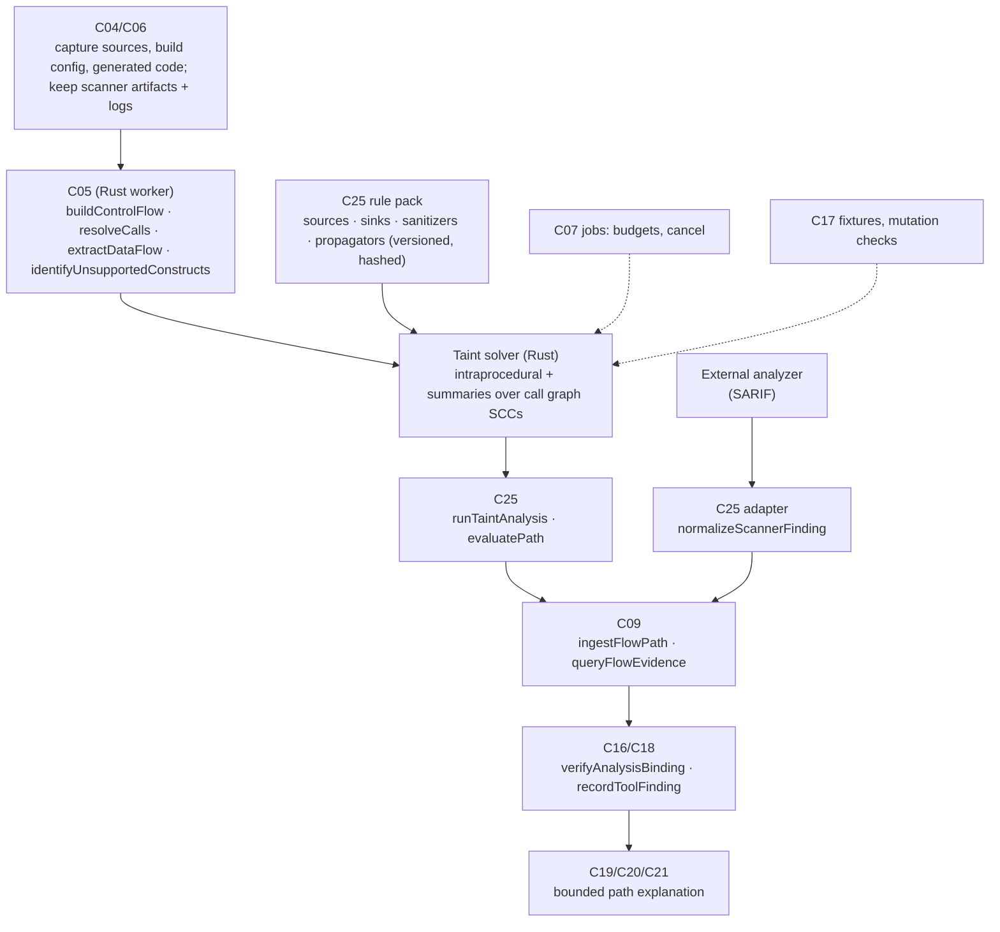
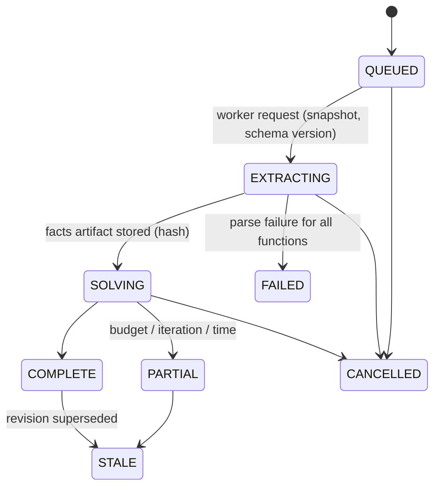

# F03 — Deterministic data-flow and taint analysis

Detailed design · Version 1.0 · 4 October 2026 · Proposed implementation specification

Source: `Competitive_Features_Component_Implementation_Guide.md` §3, §6, §14–§17. Repository evidence observed at commit `8b07b5e`.
Priority: P1 integration, P2 deeper analysis. First deliverable: one language and a small versioned source/sink rule set.

---

## 1 Purpose, user experience and status

### 1.1 The experience this feature exists for

F03 does not answer a user question on its own; it is the evidence engine behind two of them:

| User asks | What F03 contributes |
|---|---|
| "Is this PR safe?" (F02) | A changed-code finding with an actual **source → propagation → sink path**, not a name match |
| "Is this dependency risky?" (F04) | Whether the project's own code reaches the vulnerable API with attacker-influenced data (as *reachability evidence*, never as proof of exploitation) |

What a reviewer sees for one finding:

```
R-TAINT-SQL@1   CWE-89   SQL built from untrusted input          candidate · static path · not runtime-observed
 SOURCE  src/api/refunds.ts:22    req.query.accountId                                   (HTTP query parameter)
   │     src/api/refunds.ts:22    const id = req.query.accountId                        assigned to  id
   │     src/api/refunds.ts:27    const q = `select * from refunds where acct = '${id}'`   concatenated into  q
   │     src/refunds/store.ts:14  listRefunds(q)  →  parameter sql                      call argument (resolved, 1 hop)
 SINK    src/refunds/store.ts:19  db.query(sql)                                         (raw SQL execution)
 Path conditions on this route:   if (isAdmin(user))  (line 24)   ← the path exists only when this is true
 Sanitizers seen on the path:     none.   Considered but not applicable: escapeHtml (line 25, HTML only — wrong class for SQL)
 Not followed:                    1 call through a dynamic dispatch (handlers[name]) at line 31 — path may continue there
 Alternate paths to the same sink: 2   [show]
 Evidence: rule pack core-taint@1 · analyzer dataflow-ts@0.1 · artifact 7e1c… · revision a19a978
 This is a possible path found by static analysis. It does not establish that the code runs, that the input is attacker-controlled in your deployment, or that the sink is reachable.
```

### 1.2 What "done" means for the user

1. A known source-to-sink fixture is found, with each step bound to a source span (F03-A1).
2. A validated sanitizer is not reported as a vulnerability, and removing it changes the result (F03-A2, A4).
3. An unresolved call is a **gap shown on the path**, never silently treated as a sanitization boundary (F03-A3).
4. The same finding looks identical in the finding list, the path view, the PR gate and an export (F03-A5).
5. Resource exhaustion yields a `PARTIAL` result with coverage, not silence (F03-A6).

### 1.3 Status

**Proposed implementation specification.** The repository today has *pattern-based* security rules and a *token-level* function scanner. It has no control-flow graph builder, no data-flow solver and no taint propagation. This document specifies the first of each, and an adapter path for scanners that already exist.

---

## 2 Scope, non-goals and first delivery boundary

### 2.1 In scope

- A **rule pack** format (versioned, hash-addressed): sources, sinks, sanitizers, propagators, and the vulnerability class each applies to.
- An **intraprocedural** control-flow and data-flow analysis for one language, extended to **interprocedural** by function summaries over the existing call graph.
- A **provider interface** so an external analyzer's results (SARIF) enter the same finding and path model.
- Bounded path storage and a path viewer.
- Honest limits: sensitivity, dynamic dispatch and reflection limits documented and surfaced.

### 2.2 Non-goals

- Soundness. The analysis is a *may* analysis with documented blind spots; neither "no finding" nor "finding" is a proof (the existing disclaimer in `security.ts` stands: "No finding does not mean safe").
- Whole-program points-to analysis, alias analysis beyond simple local aliasing, or symbolic execution in the first release.
- Runtime exploit confirmation. A static path is never called "exploited" (guide §6).
- Languages beyond the first. The architecture admits more; the first release analyses one.
- Replacing a dedicated commercial analyzer. Integration is a first-class path precisely so that teams can use the best engine available to them.

### 2.3 First delivery boundary (decisions recorded in §18)

- **Language:** TypeScript/JavaScript (the worker's most exercised parser and the demo repository's language). Java is the second target.
- **Vulnerability classes:** two with the same structural shape — SQL injection (CWE-89) and OS command injection (CWE-78) — in an Express-style HTTP handler model.
- **Rule pack:** `core-taint@1`, roughly twenty source/sink/sanitizer entries, versioned and tested against fixtures.
- **Provider interface** with a SARIF 2.1.0 reader as the first external adapter (a SARIF result can carry `codeFlows`, which map directly to a path).

---

## 3 Current state in this repository

### 3.1 What exists (observed)

| Capability | Where | What it does | Class |
|---|---|---|---|
| Syntax-level facts | `crates/worker/src/language.rs` (`RawCall`, `RawWrite`, `RawRead`, `RawThrow`, …), `index.rs` | Per-function calls (with receiver text), field reads/writes, throws, channels, transactions, locks; dynamic/external calls stay `UNRESOLVED` | EXISTING_EXTEND |
| Call graph | `store.ts` `relationships` (`calls`, `async-flow`), `graph.ts` | Resolved and unresolved call edges; `dependents`, `project`, `findPath`, `cycles` (SCC) | EXISTING_REUSE |
| Token-level function scanner | `packages/core/src/defect/source.ts` (`blank`, `scanFunction`, `Scan`), `defect/functions.ts` (`Fn`, `loadFunctions`, `spanEvidence`) | Blanks comments/strings, then scans for acquisitions, calls, loops, ifs, awaits by pattern. **Not** an AST-based CFG | EXISTING_REUSE for span evidence; the scanner itself is insufficient for data flow |
| CFG data types and dominators | `defect-semantics.ts` (`ControlFlowGraph`, `computeDominators`, `identifyNaturalLoops`, `summarizeCallEffects`, `EffectSummary`) | Algorithms over a *given* CFG (used for loop-transformation safety); nothing here builds a CFG from source | EXISTING_REUSE |
| Security rules and the alarm gate | `security.ts` (`RULES`, `Finding`, `sensitiveLogArgs`, `isRequestHandler`, `securedByDeclaration`), `claim-ledger.ts` (`validateAlarm`) | Versioned rules; findings are `CANDIDATE` until deterministic proof or two authorised confirmations; heuristic `sensitiveLogArgs` is regex-based | EXISTING_EXTEND |
| Entry points, guards, sinks (state sinks) | `forms/analysis.ts` (`entryPoints`, `guards`, `sinks`, `routes`, `gatesOnRoute`) | Routes from entry points to **state-changing sinks** through the call graph, with gates | EXISTING_REUSE (entry-point model) — note these "sinks" are *state writes*, not vulnerability sinks |
| Findings storage | `sec_findings` table | Findings per revision with `superseded` | EXISTING_EXTEND |
| Declarative inputs | `artifacts.ts` | Routes, migrations, queue bindings and flags read as declarations | EXISTING_REUSE (route → handler join gives entry points) |
| Evaluation harness | `evaluation.ts` (planted-failure suites, confidence intervals, paired tests) | Suites with planted failures; labels never counted as expert labels if scripted | EXISTING_REUSE |
| RPC | `crates/worker/src/protocol.rs`, `worker.ts` | Length-prefixed JSON, 8 MiB frame cap, versioned analyzer | EXISTING_EXTEND |

### 3.2 Verified gaps

| Gap | Evidence | Consequence |
|---|---|---|
| No AST control-flow graph builder | `ControlFlowGraph` is only an input type in `defect-semantics.ts`; nothing constructs it from source | NEW `buildControlFlow` (guide: C05) |
| No data-flow/def-use facts | `RawFile` has no def-use, assignment or argument-binding records; `RawRead`/`RawWrite` are field accesses | NEW extraction of local def-use and argument-to-parameter bindings |
| No taint rules or analysis | `security.ts` rules are pattern matchers over function text | NEW rule pack + solver |
| No scanner-result ingestion | No SARIF or external-tool adapter | NEW provider SPI and SARIF reader |
| 8 MiB RPC frame | `protocol.rs MAX_FRAME` | Result sets must be paged; large path sets cannot be returned in one frame |

### 3.3 Not verified

- Precision of the call graph on real TypeScript code that uses dependency injection, decorators, higher-order functions or barrel re-exports (the worker's resolution is import-based and unique-binding-based).
- How the worker's tree-sitter grammar represents template literals, optional chaining and async iteration for the constructs the rule pack needs.
- Licence terms of any external engine one might bundle or call; they must be reviewed before an adapter ships.

---

## 4 Architecture and ownership



### 4.1 Responsibilities

| Component | Responsibility | Functions | Class |
|---|---|---|---|
| C04/C06 | Capture scanner inputs, build configuration, generated sources; retain scanner artifacts and logs with versions | `ingestScannerArtifact` | NEW (artifact store from F01 WP) |
| C05 | Typed CFG and data-flow extraction, call resolution, unsupported-construct reporting | `buildControlFlow`, `resolveCalls`, `extractDataFlow`, `identifyUnsupportedConstructs` | NEW module `dataflow.rs` beside `language.rs`; `resolveCalls` EXISTING_REUSE (`index.rs`) |
| C09 | Represent source→propagation→sink paths, sanitizers and unresolved boundaries; do **not** eagerly store every path | `ingestFlowPath`, `queryFlowEvidence` | EXISTING_EXTEND (`facts`/`relationships`) + NEW tables |
| C25 | Own rule packs, rule configuration, invariants | `loadRulePack`, `runTaintAnalysis`, `evaluatePath`, `normalizeScannerFinding` | EXISTING_EXTEND (`security.ts` becomes one *rule family*) |
| C16/C18 | Verify evidence binding and presentation class; preserve scanner limitations | `verifyAnalysisBinding`, `recordToolFinding` | EXISTING_EXTEND |
| C19/C20/C21 | Bounded path explanation with locations and branch conditions; drill-down; never claim all paths execute | — | NEW path viewer + map overlay |
| C07/C17/C31/C32 | Bounded analysis, independent positive/negative fixture evaluation, mutation checks, artifact retention, cost | — | EXISTING_EXTEND |

**Ownership note (guide §3).** Semantic extraction and graph semantics live in the Rust worker; Node orchestrates, stores and publishes. The taint solver is therefore a Rust module reading a typed rule-pack JSON, not a TypeScript re-implementation of graph semantics.

---

## 5 Reconciliation with existing contracts

| Guide | Repository | Decision |
|---|---|---|
| `C25.analyzeDataFlow -> Job<Outcome<{findingIds, analysisCoverage, analyzerArtifactHash}>>` | `C25/analyze` (`securityOps`, mutating) | Add `C25/analyzeDataFlow`; job kind `"dataflow"` in `JobKind`; value is `ApiResult<DataFlowRunSummary>` |
| `C09.getFindingPath -> Outcome<FlowPathPage>` | `C09` ops are graph projections | Add `C09/getFindingPath` |
| `Finding` | `security.ts Finding { source: "RULE" \| "MODEL", state: CANDIDATE \| ALARM, … }` | Extend `source` with `"DATAFLOW"` and `"TOOL"`; a tool or dataflow finding **starts as `CANDIDATE`** and reaches `ALARM` only through the existing gate (deterministic proof or two authorised confirmations) |
| "A tool finding, not automatically a proof" | Alarm gate | Same: no new bypass of `validateAlarm` |
| Rule identity | `Rule { id, version, title, text }`, `ruleDigest` | Rule packs add `packHash`; each finding records `(ruleId, ruleVersion, packHash)` |
| `analysisCoverage` | `Diagnostic`, completeness metadata | A typed `DataFlowCoverage` (§6.3) inside the value, with `metadata.completeness` mirroring it |

---

## 6 Data model

### 6.1 Rule pack (versioned JSON, canonicalised and hashed)

```jsonc
{
  "packId": "core-taint", "version": 1, "language": "ts",
  "classes": [
    { "id": "sql-injection", "cwe": "CWE-89", "title": "SQL built from untrusted input" },
    { "id": "command-injection", "cwe": "CWE-78", "title": "OS command built from untrusted input" }
  ],
  "sources": [
    { "id": "http-query",  "kind": "member", "match": "req.query.*",   "param": "express-handler", "label": "HTTP query parameter" },
    { "id": "http-body",   "kind": "member", "match": "req.body.*",    "param": "express-handler", "label": "HTTP body field" },
    { "id": "http-params", "kind": "member", "match": "req.params.*",  "param": "express-handler", "label": "HTTP path parameter" },
    { "id": "argv",        "kind": "member", "match": "process.argv[*]", "label": "command-line argument" }
  ],
  "sinks": [
    { "id": "sql-raw",  "class": "sql-injection",     "match": "$db.query(arg0)",          "sensitiveArgs": [0], "label": "raw SQL execution" },
    { "id": "sql-raw2", "class": "sql-injection",     "match": "$db.execute(arg0)",        "sensitiveArgs": [0], "label": "raw SQL execution" },
    { "id": "cmd-exec", "class": "command-injection", "match": "child_process.exec(arg0)", "sensitiveArgs": [0], "label": "shell command execution" },
    { "id": "cmd-spawn-shell", "class": "command-injection", "match": "child_process.spawn(arg0, *, {shell:true})", "sensitiveArgs": [0] }
  ],
  "sanitizers": [
    { "id": "sql-param", "classes": ["sql-injection"], "kind": "structural",
      "description": "parameterised query: value passed in the parameter array, not in the SQL text" },
    { "id": "sql-escape", "classes": ["sql-injection"], "match": "$db.escape(arg0)", "returnsSanitized": true },
    { "id": "shell-quote", "classes": ["command-injection"], "match": "shellQuote(arg0)", "returnsSanitized": true },
    { "id": "html-escape", "classes": ["xss"], "match": "escapeHtml(arg0)", "returnsSanitized": true }
  ],
  "propagators": [
    { "id": "concat", "kind": "operator", "ops": ["+", "template", "join", "concat"] },
    { "id": "string-methods", "kind": "method", "names": ["toString","trim","toLowerCase","toUpperCase","replace","slice","substring","padStart","padEnd"], "taint": "receiver-to-result" },
    { "id": "json-parse", "kind": "call", "match": "JSON.parse(arg0)", "taint": "arg0-to-result" }
  ],
  "knownSafeCalls": [
    { "match": "Number(arg0)", "classes": ["sql-injection","command-injection"], "reason": "numeric coercion" },
    { "match": "parseInt(arg0, *)", "classes": ["sql-injection","command-injection"], "reason": "numeric coercion; NaN handling is the caller's concern" }
  ]
}
```

Design rules for packs:

- **Sanitizers are class-scoped.** An HTML escaper applied to a value flowing to a SQL sink does *not* sanitize it. The path viewer shows "considered but not applicable" (as in §1.1) so the user can see the analyzer's reasoning.
- **Structural sanitizers.** A parameterised query is recognised by *shape* (a sink call whose sensitive argument is a literal without interpolation while the value appears in the parameter list), not by a name.
- **Pack hash** is the SHA-256 of the canonical JSON; findings carry it. A pack change = a new version = a new baseline for F02.
- Packs are **data**, loaded through a schema validator; a malformed pack is rejected at load, never at analysis time.

### 6.2 Storage (proposed)

```sql
create table dataflow_runs(
  run_id text primary key, revision text not null, language text not null,
  pack_id text not null, pack_version integer not null, pack_hash text not null,
  analyzer text not null, analyzer_version text not null, artifact_hash text not null,   -- hash of the extracted-facts artifact
  state text not null,                       -- QUEUED | RUNNING | COMPLETE | PARTIAL | FAILED | CANCELLED
  coverage_json text not null,               -- DataFlowCoverage
  budget_json text not null, started_at text not null, finished_at text
);

-- A finding links to the existing finding/claim rows; flow detail is separate so lists stay cheap.
create table flow_findings(
  finding_id text primary key, run_id text not null, class_id text not null,
  source_id text not null, sink_id text not null,
  source_entity text, sink_entity text,
  path_count integer not null,               -- how many distinct paths were found (bounded; see maxPaths)
  path_count_exact integer not null,         -- 1 if the enumeration finished, 0 if capped
  witness_path_id text not null,
  unresolved_boundaries integer not null, sanitizers_considered integer not null
);

create table flow_paths(
  path_id text primary key, finding_id text not null, ordinal integer not null,
  steps_json text not null,                  -- [{kind, spanEvidenceId, entityId, note, variable}]
  conditions_json text not null,             -- branch conditions along the path
  boundaries_json text not null,             -- unresolved boundaries: {at, callee, reason}
  length integer not null, summary_hash text not null
);
create index flow_paths_finding on flow_paths(finding_id, ordinal);
```

Only the **witness** path is stored eagerly; the rest are re-derivable from stored function summaries and the artifact (deterministic), so storage does not grow with the number of paths (guide §6: "Avoid eagerly storing every possible path").

### 6.3 Coverage

```typescript
type DataFlowCoverage = {
  language: string; packHash: string;
  functions: { total: number; analyzed: number; skipped: { tooLarge: number; unsupportedConstruct: number; parseError: number; budget: number } };
  calls: { total: number; resolved: number; unresolved: number; external: number; dynamic: number };
  unsupportedConstructs: { construct: string; count: number; example?: SourceSpan }[];  // e.g. 'eval', 'with', 'dynamic import', 'Proxy'
  stoppedBy: 'NONE' | 'FUNCTION_BUDGET' | 'SUMMARY_ITERATIONS' | 'WALL_TIME' | 'MEMORY';
  sensitivity: { flow: 'FLOW_SENSITIVE'; context: 'INSENSITIVE'; field: 'FIELD_SENSITIVE_DEPTH_2'; pathConditions: 'RECORDED_NOT_PRUNED' };
};
```

The `sensitivity` object is shown in the UI ("What this analysis does and does not model"), satisfying the requirement to "document field/context sensitivity, dynamic dispatch and reflection limits".

---

## 7 Algorithms

### 7.1 Extraction in the worker (C05)

For each function body (tree-sitter AST):

1. **Basic blocks and edges.** Build the CFG from statements: sequence, `if/else`, `switch`, `for/while/do`, `try/catch/finally`, `break/continue/return/throw`, short-circuit `&&`/`||`/`??`/`?:` (modelled as branches), optional chaining, `await` (a pass-through node that can resume after the call), generator `yield` (a pass-through).
2. **Def-use.** For each statement, record variable definitions and uses, destructuring patterns (expanded to member reads), parameter bindings, closures capturing variables (a captured variable is a *shared definition* flagged `CAPTURED`), and member assignments (`obj.f = x` is a field definition on the abstract object of `obj` up to depth 2).
3. **Calls.** For every call: callee text and resolved callee (if the existing resolver has one), receiver, argument expressions (each an expression tree reduced to its *taint-relevant operands*), and the node that receives the result.
4. **Constructs not modelled.** Recorded by `identifyUnsupportedConstructs`: `eval`/`new Function`, `with`, computed property writes on tainted keys, `Proxy`, dynamic `import()`, `require(variable)`, getters/setters with side effects, decorators with transforming behaviour, reflection (`Reflect.*`). Each occurrence becomes a **boundary** on any path that touches it.

The extraction is deterministic: identical bytes and analyzer version produce identical facts; the facts artifact is content-hashed (`artifact_hash`).

### 7.2 Intraprocedural taint (forward, flow-sensitive)

Abstract state per program point: `env: Var → TaintSet`, where `TaintSet = {(sourceId, originStep)} ∪ {SANITIZED(classId, via)}` — a value can be *tainted from source S*, and independently *sanitized for class C* (a sanitizer records `via` so the path viewer can show it).

Transfer functions:

| Construct | Effect |
|---|---|
| Assignment `x = e` | `env[x] = taint(e)` (strong update for locals) |
| Operator/template/propagator | union of operand taints (propagators from the pack) |
| Source expression | `{(sourceId, thisStep)}` |
| Sanitizer call for class C | result carries `SANITIZED(C)`; argument unchanged |
| `knownSafeCalls` | result has empty taint for the listed classes |
| Member read `o.f` | field taint of `o` at depth ≤ 2, else taint of `o` (conservative) |
| Member write `o.f = e` | field taint update (weak update unless `o` is a fresh local object) |
| Call to function with summary | apply summary (§7.3) |
| Call to unresolved function | **boundary**: result taint = union of argument taints *and* marked `UNRESOLVED_BOUNDARY` (the analysis continues conservatively; it does not claim the value is clean) |

Join at merge points = union of taints; `SANITIZED(C)` survives a join only if present on **all** incoming edges (a sanitizer applied on one branch does not sanitize the merged value). Loops are solved by worklist to fixpoint with a per-block visit cap.

**Branch sanitizers.** A guard such as `if (!isSafeId(id)) return;` is not a data transformation. It is honoured only when the rule pack lists `isSafeId` as a *validating guard* for the class **and** the guard's true-edge dominates the sink (`computeDominators` from `defect-semantics.ts` is reused on the extracted CFG). Otherwise the path remains, with the guard listed under *path conditions*.

### 7.3 Interprocedural summaries

1. Condense the call graph into strongly connected components (the existing `sccs` in `graph.ts`); process **callees before callers**.
2. For each function compute a **summary**: for each parameter `p_i`, which of {return value, a sink of class C reached inside, fields of other parameters} it influences; plus *source-introducing* behaviour (a function that returns data read from a source); plus unresolved boundaries inside.
3. Recursive SCCs iterate to a fixpoint with an iteration cap (default 5); hitting the cap marks the participating functions `PARTIAL` and records `SUMMARY_ITERATIONS` in coverage.
4. At a call site, instantiate the summary with the actual argument taints. **Context-insensitive**: one summary per function (documented limit: a function called with tainted data in one place and clean data elsewhere produces one summary; the solver mitigates by instantiating with actual argument taints, which recovers most precision for taint, not for all properties).
5. Calls through dynamic dispatch, callbacks passed to unresolved higher-order functions, event emitters (`emit`/`on`), and `async-flow` edges the worker cannot resolve are **boundaries** (§7.2).

### 7.4 Sink evaluation and finding creation

A *finding* exists when taint from a source reaches a sink's sensitive argument and is **not** `SANITIZED` for that sink's class. For each (source, sink) pair:

- Record a **witness path**: the shortest chain of steps by backward traversal of the def-use chain that produced the taint (BFS over predecessor links, ties broken by source order — deterministic).
- Count distinct paths up to `maxPaths` (default 20), noting whether the count is exact.
- Record **path conditions**: branch conditions on the control-dependence chain from entry to the sink *and* along the data path. Conditions are *recorded, not solved* — the analysis does not prove them satisfiable. The viewer says so.
- Record **sanitizers considered**: any sanitizer-pattern call on the path that did not apply (wrong class) or applied only on some branches.
- Record **boundaries**: unresolved calls along the path. A path with one or more boundaries is a *path with gaps* — not a smaller risk, not a larger one, just less certain; the finding says "may continue through …".

Severity and ordering are *not* a probability. Ranking features (shown, never hidden): path length, number of boundaries, whether the source is an HTTP source in a routed handler (`artifacts.ts` route → handler join), and whether a validating guard dominates the sink.

### 7.5 Provider interface and SARIF adapter

```typescript
interface TaintProvider {
  id: string; version: string;
  capabilities: { languages: string[]; classes: string[]; producesPaths: boolean };
  run(input: { snapshot: SnapshotRef; sourceRoot: string; budget: Budget }): Promise<{ artifactHash: string; findings: NormalizedFinding[]; limitations: string[] }>;
}
```

`normalizeScannerFinding(sarifResult)`: `ruleId` → rule identity; `level` → severity mapping table (kept in the adapter, versioned); `locations[0]` → sink span; `codeFlows[].threadFlows[].locations[]` → path steps (each step location mapped onto `(file, byte range)` and then onto an entity when possible); `partialFingerprints` → used as the fingerprint input for F02's baseline; `tool.driver.name/version` and the run's invocation → evidence producer fields; scanner-reported suppressions are preserved, not discarded. The finding enters as `source: "TOOL"`, `state: CANDIDATE`, with the scanner's own stated limitations in `assumptions`. **A scanner "high" is shown as the scanner's claim**, labelled with the tool name, never restyled as CIE's fact. Licence terms of any external engine must be confirmed before shipping an adapter that bundles it; invoking a user's own installation avoids redistribution questions.

### 7.6 Bounded work and determinism

| Bound | Default | Effect when hit |
|---|---|---|
| Functions analysed per run | configurable cap | `FUNCTION_BUDGET`; remaining functions listed as skipped |
| Basic blocks per function | 2,000 (aligned with the existing CFG cap in `defect-semantics.ts`) | Function skipped, counted, shown |
| Summary iterations | 5 | `SUMMARY_ITERATIONS` |
| Path length | 50 steps | Path truncated with "…" and a flag |
| Paths per finding | 20 | `path_count_exact = 0` |
| Wall time | from the job deadline | `WALL_TIME`, `PARTIAL` |
| RPC frame | 8 MiB | Results paged by cursor |

Output ordering is canonical (sorted by fingerprint then path ordinal), so two runs over identical inputs are byte-identical.

---

## 8 API contracts

```typescript
type DataFlowRunRequest = {
  snapshot: { repositoryId: string; revision: string };
  language: 'ts';                                // first release
  rulePack: { packId: string; version?: number };// default: latest installed
  scope?: { paths?: string[]; changedOnlyFrom?: string /* base revision, for F02 */ };
  budget?: { maxFunctions?: number; wallMs?: number };
};

C25/analyzeDataFlow(ctx, DataFlowRunRequest)
  -> ApiResult<JobView>                 // job kind 'dataflow'; mutating; idempotent on (revision, language, packHash, scope)
C25/getDataFlowRun(ctx, { runId })
  -> ApiResult<{ run: DataFlowRunSummary; coverage: DataFlowCoverage; findingIds: string[] }>
C09/getFindingPath(ctx, { findingId, cursor?, limit? /*paths per page*/ })
  -> ApiResult<{ paths: FlowPath[]; nextCursor?: string; pathCountExact: boolean }>
C25/listRulePacks / C25/getRulePack / C25/putRulePack(ctx, { body })     // putRulePack validates and creates an immutable version
C25/ingestScannerResult(ctx, { repositoryId, revision, format: 'sarif', artifact: Handle }) -> ApiResult<{ findingIds: string[]; rejected: Reason[] }>
```

```typescript
type FlowStepKind = 'SOURCE'|'ASSIGN'|'CONCAT'|'CALL_ARG'|'RETURN'|'FIELD_WRITE'|'FIELD_READ'|'AWAIT'|'SINK';
type FlowPath = {
  pathId: string; ordinal: number; length: number;
  steps: { kind: FlowStepKind; evidenceId: string; entityId?: string; variable?: string; note?: string }[];
  conditions: { evidenceId: string; text: string; polarity: 'TRUE'|'FALSE' }[];
  boundaries: { evidenceId: string; callee: string; reason: 'DYNAMIC_DISPATCH'|'EXTERNAL'|'UNRESOLVED'|'REFLECTION'|'UNSUPPORTED_CONSTRUCT' }[];
  sanitizersConsidered: { ruleSanitizerId: string; evidenceId: string; outcome: 'WRONG_CLASS'|'PARTIAL_BRANCH'|'NOT_ON_PATH' }[];
};
```

Errors: `BUDGET_EXCEEDED` is returned only when *nothing* useful could be produced; otherwise the run completes `PARTIAL`. `INVALID_SCHEMA` for a malformed rule pack or SARIF. `EVIDENCE_STALE` when a path's spans no longer match the file's content hash (existing STALE behaviour of code evidence applies, as in `defect/functions.ts`).

---

## 9 States and lifecycles



A finding's lifecycle uses the existing claim states (`DRAFTED → EVIDENCED → DISPLAYED → CONFIRMED/REFUTED/STALE`) and the alarm gate; F03 adds none.

---

## 10 Authorization, egress and privacy

- Findings, paths and snippets are filtered by the access policy: a path step inside a denied file is **omitted and counted** ("2 steps hidden by access policy"); a path that would reveal a denied file's existence is shown truncated at the boundary.
- Source snippets are fetched only for permitted paths and are never sent to a hosted model; any model-written explanation uses IDs, rule ids and entity names after `redact.ts`, per the existing egress rule.
- Scanner runs execute **inside the project's isolation boundary**: external tools run in the isolation used for untrusted code (`defect-isolation.ts`) when the repository is untrusted, and never receive network access unless the grant says so (private package metadata, source code and rule packs are not allowed to leave).
- Rule packs are *code-like configuration*: only principals with the `rules-admin` role can install them; installation is audited.

---

## 11 Freshness, cancellation, idempotency, recovery

- A run is bound to `(revision, packHash, language, scope)`; a new revision makes it `STALE`, and F02's PR flow re-runs on the head.
- Cancellation: before the commit point the worker request is abandoned and the worker restarted (existing `JobRunner` semantics); a partial facts artifact is not published.
- Idempotency: the same request returns the existing run; artifact storage is content-addressed.
- Crash: a run left `RUNNING` at start-up is marked `FAILED`; no partial findings are published without the `PARTIAL` flag and coverage.
- Late results from a superseded generation are rejected at the commit step.

---

## 12 Interface specification

### 12.1 Surfaces

1. **Finding detail → "Data-flow path" tab** (added to the Insights → Security finding detail and the Defects detail pattern).
2. **Path viewer** — a vertical list of steps; each step shows kind, `file:line`, a snippet (when permitted), the variable, and an icon *and* a word (`assigned`, `concatenated`, `call argument`, `returned`, `field write`). Sources and sinks are visually distinct and labelled. Unresolved boundaries appear **inline at the step where analysis stopped following** with the text "cannot see beyond this call (dynamic dispatch)".
3. **Conditions panel** — "this path exists only when…" listing branch conditions, labelled "recorded, not proven satisfiable".
4. **Sanitizers panel** — "Applied", "Considered but not applicable (wrong class)", "Applied on some branches only".
5. **Coverage and limits panel** — "What this analysis models": sensitivity, unsupported constructs found, functions skipped.
6. **Map overlay** — "Show on map" highlights path entities on the current form using the existing overlay mechanism (`mapoverlays.ts`), or composes a journey (V4) restricted to the path.
7. **Alternate paths** — "2 other paths reach this sink" with the same viewer.

### 12.2 Copy rules

- Never "exploit", "vulnerable (confirmed)", "attacker can". Use "a possible path", "untrusted input *may* reach".
- "Static path, not runtime-observed" appears in the finding header.
- A path with boundaries says "path may continue through N unresolved calls".
- A run with `PARTIAL` coverage shows the coverage sentence above any list of results.
- "No data-flow findings" is rendered with coverage: "No paths found among 312 of 340 analysed functions; 28 skipped (…)."

### 12.3 States

Empty (no pack installed): "No rule pack installed for TypeScript." Running: stepper Extract → Solve → Publish with function counts. Partial: banner with `stoppedBy`. Stale: "These paths describe an older revision." Failed: reason and the log artifact handle.

### 12.4 Accessibility

The path viewer is an ordered list; each item's accessible name is "Step 3 of 6: call argument, src/refunds/store.ts line 14, variable sql". Boundaries and conditions are announced as list items of their own. Code snippets are focusable regions with labels (existing `<pre tabIndex=0 role=group>` pattern). Nothing is conveyed by colour only.

---

## 13 Performance and bounded work

Proposed measurement targets (to be set from measurement on recorded corpora): extraction throughput in functions/second on the worker; solver time versus function count; peak memory; summary-iteration distribution. Record corpus hash, worker version, machine. The bounds in §7.6 hold regardless. Because the solver is context-insensitive with summaries, cost should grow roughly with (functions × average blocks × taint-set size); the first work package verifies this on real code rather than assuming it.

---

## 14 Failure modes

| Failure | Behaviour |
|---|---|
| Parse error in a file | The functions in it are `skipped: parseError`; other files proceed; coverage shows it |
| Very large function | `skipped: tooLarge` |
| Dynamic dispatch on the path | Boundary; the finding remains and says so |
| A sanitizer defined in a dependency (unresolved) | Treated as an unresolved call, **not** as a sanitizer; the viewer says "an unresolved call may sanitize this value; no sanitizer recognised" |
| Rule pack contradicts itself (a call both source and sanitizer) | Pack rejected at install with the conflicting ids |
| Same sink reached from many sources | One finding per (source, sink) pair, grouped in the list under the sink |
| Path spans a file whose content changed since analysis | Step shows `STALE`; the finding is marked stale |
| Scanner output with unmappable locations | Steps without mapping are kept with `unmapped: true`; finding degrades to "location-only" |
| Memory exhaustion in the worker | `MEMORY` in `stoppedBy`, run `PARTIAL`, worker restarted |

---

## 15 Test plan

### 15.1 Acceptance (from the guide)

| ID | Test | Fixture |
|---|---|---|
| F03-A1 | Known source-to-sink fixture is found | `req.query.id` → template literal → `db.query` across two files (one call hop); assert source, every step, sink, evidence spans |
| F03-A2 | A validated sanitizer fixture is not reported incorrectly | Same shape but `db.query("… where id = $1", [id])` and a variant with `db.escape` |
| F03-A3 | An unresolved call is a gap, not a sanitization boundary | `handlers[name](id)` between source and sink: assert the finding exists *with a boundary*, and a second variant where the callee is a known sanitizer (finding absent) differs from the unresolved variant |
| F03-A4 | Removing a sanitizer changes the expected result | Metamorphic test: delete the sanitizer call from fixture A2 → finding appears; add it back → disappears. Run over all fixtures automatically |
| F03-A5 | Findings survive display with identical rule/path identity | Compare `(ruleId, version, packHash, fingerprint, pathId, step evidence ids)` in the list, the viewer, the F02 gate payload and the export |
| F03-A6 | Resource exhaustion yields `PARTIAL` with coverage | Generated deep call chain and a huge-CFG function with small budgets: assert `PARTIAL`, `stoppedBy`, and that partial findings are flagged |

### 15.2 Design-level and negative controls

| ID | Test |
|---|---|
| F03-D1 | Determinism: two runs, identical facts artifact hash and identical output bytes |
| F03-D2 | Class scoping: HTML escaper does not sanitize a SQL flow (shown as "considered, wrong class") |
| F03-D3 | Branch merge: sanitizer on one branch only → still a finding |
| F03-D4 | Dominating validating guard → finding suppressed but the guard is listed |
| F03-D5 | Recursive SCC reaches the cap and reports `SUMMARY_ITERATIONS` |
| F03-D6 | Denied-path step omitted and counted |
| F03-D7 | Rule pack with an unknown field is rejected at install |
| F03-D8 | SARIF `codeFlows` map to steps; a result without `codeFlows` produces a location-only finding |
| F03-D9 | Scanner-claimed severity is labelled with the tool name; no restyling as fact |
| F03-D10 | Alarm gate: a dataflow finding does not reach `ALARM` without proof or two confirmations |

Mutation controls: make the solver treat unresolved calls as sanitizers → A3 must fail; ignore class scoping → D2 must fail; drop the "all incoming edges" rule at joins → D3 must fail. They are run and recorded.

### 15.3 Evaluation on real inputs

Beyond self-authored fixtures, evaluate on **real code with known outcomes**: (a) open-source TypeScript projects at commits immediately before and after a published injection fix (the "before" must report, the "after" must not for that path); (b) a planted-vulnerability suite run through the existing evaluation harness (`evaluation.ts`) with the usual rule that scripted labels are never counted as expert labels. Report recall on (a)/(b), the false-positive rate on a clean corpus, and the proportion of findings with boundaries — as measurements, with corpus hashes, not as promises.

---

## 16 Work packages

| WP | Title | Depends on | Size | Result |
|---|---|---|---|---|
| WP-01 | Spike: CFG + def-use extraction for TS on 50 real functions; check tree-sitter coverage of needed constructs | — | M | Go/no-go and the extraction schema |
| WP-02 | `dataflow.rs`: CFG builder, def-use facts, unsupported-construct report; RPC `extractDataFlow` with schema version | WP-01 | L | Facts artifact |
| WP-03 | Rule pack schema, validator, `core-taint@1` for two classes; install/audit | WP-01 | M | `C25/{list,get,put}RulePack` |
| WP-04 | Intraprocedural solver + sink evaluation + witness paths | WP-02, WP-03 | L | Findings within a function |
| WP-05 | Summaries over SCCs, interprocedural paths, boundaries | WP-04 | L | Cross-function paths |
| WP-06 | Storage, `C09/getFindingPath`, coverage object, paging over the 8 MiB frame | WP-05 | M | Persistence and API |
| WP-07 | Finding integration: `source: DATAFLOW`, alarm gate unchanged, fingerprints for F02 | WP-06 | S | Findings in existing lists |
| WP-08 | SARIF adapter + provider SPI + one external provider run in isolation | WP-06 | M | `C25/ingestScannerResult` |
| WP-09 | Path viewer, conditions/sanitizers/coverage panels, map overlay, a11y | WP-06 | L | Interface in §12 |
| WP-10 | Fixtures, metamorphic tests, mutation controls, real-input evaluation, ledger items | all | M | F03-A1…A6 green |
| WP-11 | Second language (Java) behind the same rule schema | WP-10 | L | Optional |

---

## 17 Migration, rollout and compatibility

- New tables are additive migrations; `sec_findings` rows are unchanged. `Finding.source` gains enum values (readers ignore unknown values safely; the web client already tolerates extra fields).
- `JobKind` gains `"dataflow"`.
- Rollout flag `dataflow.enabled` per tenant and language; a **shadow mode** runs the analysis and stores results without showing them, so precision can be measured before users see anything.
- The worker analyzer version increments with the new facts; revision identities of existing indexes are unaffected because data-flow facts are a *separate artifact*, not rows added to the existing batch.

---

## 18 Risks and open decisions

| ID | Decision / risk | Options | Recommendation |
|---|---|---|---|
| D1 | First language | TypeScript / Java | TypeScript (most exercised parser here), Java second |
| D2 | Own engine vs integrate | Own minimal engine / integrate only / both | Both: the minimal engine gives deterministic, testable behaviour and a reference; the provider SPI lets teams bring a stronger engine |
| D3 | Where the solver runs | TypeScript / Rust worker | Rust worker (guide §3 ownership) |
| D4 | Context sensitivity | Insensitive / k-CFA | Insensitive with argument-instantiated summaries first; revisit with measured precision |
| D5 | First vulnerability classes | One / two / many | Two with the same shape (CWE-89, CWE-78) |
| D6 | External engine licences | Bundle / user-installed | User-installed; confirm terms per engine before any adapter ships |
| R1 | False-positive volume erodes trust | Shadow mode, per-class precision measurement, ranking features shown |
| R2 | Call-graph imprecision dominates results | Report boundaries prominently; measure share of paths with boundaries |
| R3 | Rule packs become a maintenance burden | Versioned, tested, small first; community packs only via the same schema |
| R4 | Users read a static path as an exploit | Copy rules in §12.2 |

---

## 19 Definition of done

F03 is done when one language and two vulnerability classes are analysed end to end with a versioned rule pack; every finding has a bounded, evidence-bound path with its conditions, sanitizers and boundaries; unresolved calls are visible gaps; resource exhaustion is `PARTIAL` with coverage; F03-A1…A6 pass with their mutation controls recorded; precision and recall are *measured* on real before/after code and reported as measurements; and the ledger holds named tests for each item.

## 20 References

- Guide §3, §6 (F03), §14, §16, §17.
- Repository: `crates/worker/src/{language,polyglot,index,protocol}.rs`, `packages/core/src/{security,claim-ledger,graph,artifacts,evaluation,defect-semantics}.ts`, `packages/core/src/defect/{source,functions}.ts`, `packages/core/src/forms/analysis.ts`.
- Competitor reference (guide §18): CodeQL data-flow analysis documentation.
- SARIF 2.1.0 (OASIS) for `codeFlows`/`threadFlows`.
