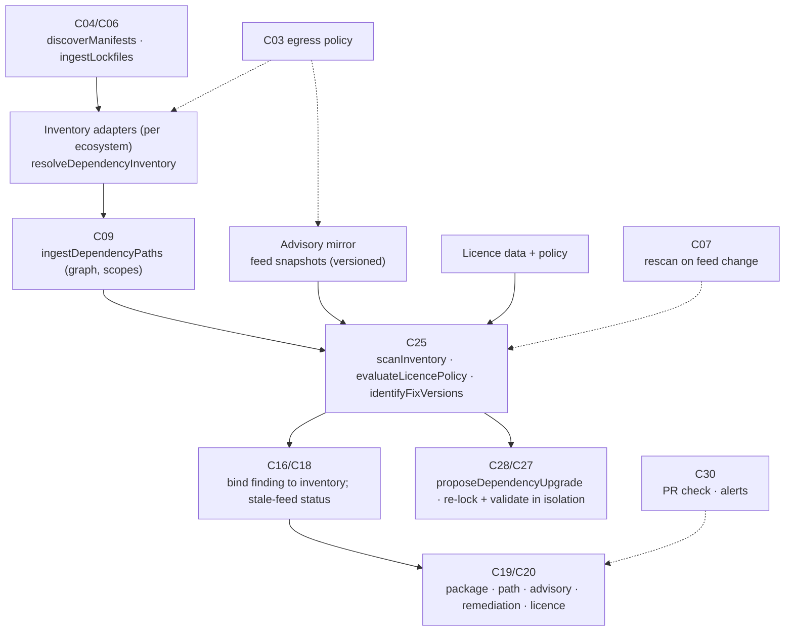
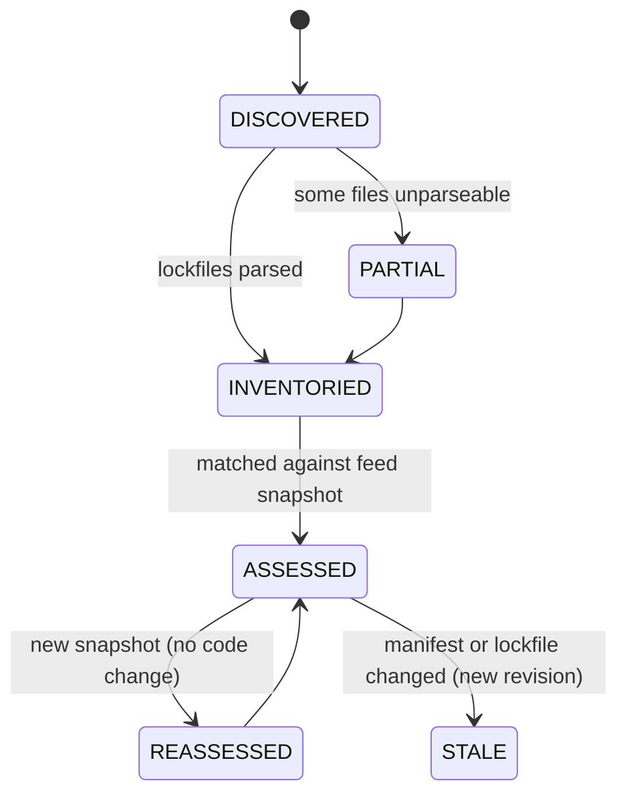

# F04 — Dependency vulnerability and licence scanning

Detailed design · Version 1.0 · 4 October 2026 · Proposed implementation specification

Source: `Competitive_Features_Component_Implementation_Guide.md` §3, §7, §14–§17. Repository evidence observed at commit `8b07b5e`.
Priority P1 (integration). First deliverable: lockfile inventory plus scanner-backed findings.

---

## 1 Purpose, user experience and status

### 1.1 The experience this feature exists for

| User asks | Product should deliver |
|---|---|
| "Is this dependency risky?" | Affected versions, dependency paths, licence concerns and remediation options |

```
Dependencies · payments-api @ a19a978                 inventory 9c41… (npm, lockfile v3)   advisory data: osv-mirror 2026-10-03 21:00 (14 h old)

  ✗ minimist 1.2.5  →  fixed in 1.2.6        GHSA-xvch-5gv4-984h   CRITICAL (as reported by the advisory)      applies: yes (1.2.5 is in range <1.2.6)
      Introduced via:   payments-api → mocha@8.4.0 → yargs-unparser@2.0.0 → minimist@1.2.5      (dev dependency · not in the production bundle)
                        payments-api → web-sdk@3.1.0 → minimist@1.2.5                            (prod dependency)
      Reachability:     not assessed   (no vulnerable-symbol data in this advisory; the package is imported by 2 files)
      Options:          1) bump web-sdk 3.1.0 → 3.1.4 (re-resolves minimist to 1.2.8)   [preview patch]
                        2) add an override  minimist ≥1.2.6   (temporary; hides the symptom, not the cause)
                        3) accept with an expiry   [waive…]

  ◔ licence: left-pad-ng 2.0.1   "SEE LICENSE IN LICENSE.txt"   → needs review (not treated as acceptable)
  ✓ 614 packages have a licence that policy "internal-saas" allows.   ○ 3 packages: licence unknown → needs review.

  Not covered:  2 packages come from a private registry — their names were not sent anywhere and no advisory data exists for them.
  Lockfile check: package.json and package-lock.json agree (0 drift).
```

Severity, applicability and reachability are **three separate statements** on every row; none implies another.

### 1.2 What "done" means for the user

1. A transitive vulnerability shows **how it got into the project** (F04-A1) and which direct dependency to change.
2. Disagreement between a manifest and its lockfile is reported, not papered over (F04-A2).
3. An unknown or unparseable licence is "needs review", never silently accepted (F04-A3).
4. When the advisory feed changes, assessments change **without a code commit**, and both the old and new assessments remain visible (F04-A4).
5. An upgrade proposal is an exact manifest + lockfile patch that was re-locked and validated in isolation, with incompatibilities reported (F04-A5).
6. When egress policy forbids it, no private package metadata leaves the machine (F04-A6).

### 1.3 Status

**Proposed implementation specification.** The repository today records *which external modules are imported* (`imports_external` facts, `viewspec.ts` externals) but has **no manifest or lockfile parsing, no dependency graph, no advisory data and no licence handling**. All of that is new. Findings from advisory data are **tool/feed findings, not proofs**; a vulnerable version is not an exploitable program.

---

## 2 Scope, non-goals and first delivery boundary

### 2.1 In scope

- Inventory of direct and transitive dependencies from **lockfiles** (primary) and manifests (declared ranges), per ecosystem.
- Vulnerability matching against a **locally mirrored** advisory database with ecosystem-correct version semantics.
- Licence extraction, SPDX expression evaluation and a policy.
- Introduction paths, remediation options and exact upgrade patches.
- Re-assessment on feed change without a source change; scheduled and event-driven.
- PR integration (F02 `DEPENDENCY_POLICY`), and package identity for F01's cross-repository edges.

### 2.2 Non-goals (first release)

- Proving exploitability or reachability. Reachability is a labelled, optional, tiered *evidence level* (§7.6).
- Malware/typosquat detection and secret scanning (different problems, different data).
- Binary/container image SBOMs (the model is extensible; the first release reads source repositories).
- Legal advice. Licence output is a policy evaluation over declared metadata.
- Resolving dependencies by *running a package manager on untrusted code* outside isolation.

### 2.3 First delivery boundary

Two ecosystems with complete lockfiles and cheap, safe parsing: **npm** (`package-lock.json` v2/v3; `package.json`) and **Cargo** (`Cargo.lock`), because the repository's own code is TypeScript and Rust. Then Go (`go.mod`/`go.sum`), Python (`poetry.lock`, pinned `requirements.txt`), and Maven (`pom.xml` + a dependency-tree artifact) in that order. A local advisory mirror from an open advisory feed in OSV format; a hosted provider is an optional adapter behind the egress policy.

---

## 3 Current state in this repository

### 3.1 What exists (observed)

| Capability | Where | What it does | Class |
|---|---|---|---|
| External import facts | `crates/worker/src/index.rs:509` (`predicate: "imports_external"`, id `fact:external-import:{file}:{module}`) | Records each external module a file imports; test `dynamic_and_external_calls_stay_unknown` | EXISTING_REUSE (usage evidence: which files import which module) |
| System-level externals | `viewspec.ts:105` (`externals`), web `graph.ts:208` | L0 shows external packages the system depends on, derived from import facts | EXISTING_REUSE |
| Config artifacts joined to code | `artifacts.ts` | Routes, migrations, queue bindings and flags as declarations of intent with graded joins | EXISTING_EXTEND (manifest parsing is the same kind of work) |
| Isolation for untrusted execution | `defect-isolation.ts` (`ContainerProfile`, `IsolatedCommand`, `hashCheckout`, budgets) | Container adapters; refuses symlinks/special files; hashes the checkout; byte and file budgets | EXISTING_REUSE (resolution/validation runs here) |
| Exact edits and proposals | `changes.ts` (`ChangeEngine`, `TextEdit`, patch export, validation in an isolated copy) | Typed edits against exact file contents; never writes to the repository | EXISTING_EXTEND (lockfile edits are large generated edits — see §7.8) |
| Egress policy and redaction | `policy.ts`, `redact.ts`, `repo_policy` table | Opt-in for hosted models, secret-looking names removed, send log | EXISTING_EXTEND (package metadata egress) |
| Webhooks/notifications | `exports.ts` (`Notifications`) | Retried, idempotent, HMAC-signed deliveries | EXISTING_REUSE (advisory alerts) |
| Findings model and alarm gate | `security.ts`, `claim-ledger.ts` | Candidate → alarm only with proof or two confirmations | EXISTING_EXTEND |
| Test and coverage artifacts | `testartifacts.ts` | JUnit/lcov parsing | EXISTING_REUSE (validation evidence) |

### 3.2 Verified gaps

| Gap | Evidence | Consequence |
|---|---|---|
| No manifest/lockfile parsing | grep for `package.json`/`pom.xml`/`go.mod`/`requirements.txt`/`Cargo.toml` finds only test-harness uses in `defect-local.ts` | NEW inventory adapters |
| No dependency graph | Not present | NEW `dependency_edges` with scope and path queries |
| No advisory/vulnerability data | grep for `advisory`/`cvss`/`osv` finds nothing in source | NEW mirror, matching, feed versioning |
| No licence handling | grep for `licen[sc]e` finds only tool metadata in `defect-isolation.ts` | NEW SPDX evaluation and policy |
| `imports_external` records the module string, not the package | e.g. `lodash/fp` vs package `lodash` | NEW mapping from module specifier to package per ecosystem for reachability evidence |
| Network egress model is per repository for hosted *models* | `repo_policy.allow_hosted` | NEW egress category "package metadata" with its own opt-in |

### 3.3 Not verified

- The size and refresh cost of a local advisory mirror for the ecosystems in scope.
- Behaviour of `ChangeEngine` with multi-megabyte generated files (lockfiles).
- Whether the worker's import-specifier capture is complete for `require()`, dynamic `import()` and re-exports (it affects reachability evidence, not matching).

---

## 4 Architecture and ownership



### 4.1 Responsibilities

| Component | Responsibility | Functions | Class |
|---|---|---|---|
| C04/C06 | Parse manifests and lockfiles incl. workspace boundaries; retain package identities, exact versions, inventory hashes | `discoverManifests`, `ingestLockfiles` | NEW |
| C05/C09 | Direct/transitive relationships via ecosystem adapters; paths | `resolveDependencyInventory`, `ingestDependencyPaths` | NEW (adapters) + EXISTING_EXTEND (`graph.ts` patterns for path queries) |
| C25 | Integrate vulnerability and licence providers; version policy and database timestamps; severity, licence restrictions, exceptions | `scanInventory`, `evaluateLicencePolicy`, `identifyFixVersions` | EXISTING_EXTEND (`security.ts` finding model) + NEW |
| C16/C18 | Preserve scanner confidence, applicability and stale-feed status; bind finding to inventory | — | EXISTING_EXTEND |
| C19/C20 | Package, introduction path, advisory, remediation, licence rationale; severity distinct from reachability | — | NEW tab/form |
| C28/C27 | Exact manifest/lockfile changes; isolated build/test; incompatible upgrade reports | `proposeDependencyUpgrade` | EXISTING_EXTEND (`ChangeEngine`, defect isolation) |
| C07/C30/C31/C32/C03 | Rescan on feed change; PR checks; inventory snapshots; egress policy for private package metadata | — | EXISTING_EXTEND |

---

## 5 Reconciliation with existing contracts

| Guide | Repository | Decision |
|---|---|---|
| `C25.scanDependencies -> Job<Outcome<DependencyReport>>` | `securityOps` (`C25/analyze`) | New `C25/scanDependencies`; `JobKind` `"dependency-scan"`; value `ApiResult<DependencyReport>` |
| `C28.proposeDependencyUpgrade -> Outcome<ChangeProposal>` | `ChangeEngine`, `ChangeProposal`, `Status = DRAFT\|FAILED\|REVIEWABLE\|REVIEWABLE_WITH_LIMITS\|APPROVED\|REJECTED\|EXPORTED\|STALE` | Reuse the proposal state machine. A lockfile patch is a proposal whose edits are `TextEdit`s; the **lockfile edit** is represented as a *generated-file edit* with `expected` replaced by a whole-file hash (see §7.8) |
| Vulnerable dependency "is not automatically a reachable exploit" | Alarm gate | Dependency findings are `source: "FEED"` candidates; the alarm gate is unchanged |
| `inventoryHash`, `vulnerabilityFeedVersion`, `licencePolicyHash` | — | New fields on `DependencyReport` and bound into F02's gate binding hash |

---

## 6 Data model

### 6.1 Identity

- **Package identity** is a **Package URL** (purl): `pkg:npm/%40acme/payments@1.2.3`, `pkg:cargo/serde@1.0.200`, `pkg:golang/golang.org/x/net@v0.17.0`, `pkg:maven/org.apache.logging.log4j/log4j-core@2.14.1`, `pkg:pypi/django@4.2.1`. The purl carries ecosystem, namespace, name and version; qualifiers carry `repository_url` for non-default registries (this is also how a *private* package is recognised, §10).
- **Inventory identity** — `inventoryHash` = SHA-256 of the canonical, sorted list of `(purl, integrity, scope)` plus edges plus the *source file hashes* of every manifest and lockfile. A change to any lockfile byte that does not change resolution still changes the file hash but not the logical inventory; both are recorded.
- **Finding identity** — `(repositoryId, purl, advisoryId)` (the *package-level* finding). The **assessment** — verdict against a feed version — is separate and append-only (§6.3).

### 6.2 Tables (proposed)

```sql
create table dependency_inventories(
  inventory_id text primary key, repository_id text not null, revision text not null,
  workspace_path text not null,                    -- '' for the root, or the workspace package dir
  ecosystem text not null, tier text not null,     -- LOCKFILE | DECLARED_ONLY | TOOL_RESOLVED
  inventory_hash text not null, source_hashes_json text not null,  -- {path: sha256}
  drift_json text not null,                         -- LOCKFILE_DRIFT diagnostics
  created_at text not null
);
create table dep_packages(
  inventory_id text not null, purl text not null, name text not null, version text not null,
  integrity text,                                   -- lockfile hash, when present
  registry text,                                    -- null = ecosystem default
  is_private integer not null,                      -- decided by registry/scope rules, never by name guess
  licence_declared text,                            -- SPDX expression or raw string
  primary key(inventory_id, purl)
);
create table dep_edges(
  inventory_id text not null, from_purl text not null, to_purl text not null,
  range text,                                       -- the declared range, when known
  scope text not null,                              -- PROD | DEV | OPTIONAL | PEER | BUILD
  primary key(inventory_id, from_purl, to_purl, scope)
);
create table dep_roots(inventory_id text not null, purl text not null, scope text not null, primary key(inventory_id, purl, scope));

create table feed_snapshots(
  snapshot_id text primary key, feed text not null, fetched_at text not null,
  upstream_modified text, content_hash text not null, advisories integer not null,
  licence_notice text not null                      -- attribution / terms recorded with the data
);
create table advisories(
  snapshot_id text not null, advisory_id text not null, aliases_json text not null,
  ecosystem text not null, package_name text not null,
  summary text, details text, severity_json text,   -- as reported: CVSS vectors, labels
  published text, modified text, withdrawn text,
  affected_json text not null,                       -- ranges / versions / events (introduced, fixed, last_affected)
  ecosystem_specific_json text,                      -- e.g. vulnerable imports/symbols, when the feed has them
  primary key(snapshot_id, advisory_id, ecosystem, package_name)
);
create index advisories_pkg on advisories(snapshot_id, ecosystem, package_name);

create table dep_findings(
  finding_id text primary key, repository_id text not null, purl text not null, advisory_id text not null,
  introduced_in_revision text not null, last_seen_revision text not null, state text not null,   -- OPEN | FIXED | WAIVED | WITHDRAWN
  unique(repository_id, purl, advisory_id)
);
create table dep_assessments(                           -- append-only: one row per (finding, feed snapshot, inventory)
  assessment_id text primary key, finding_id text not null,
  snapshot_id text not null, inventory_id text not null,
  applies integer not null, applicability_reason text not null,    -- version in an affected range?  + which range
  severity_reported text, reachability text not null,              -- NOT_ASSESSED | PACKAGE_IMPORTED | SYMBOL_REFERENCED | NOT_IMPORTED
  evidence_json text not null, assessed_at text not null
);
create table dep_licence_findings(
  inventory_id text not null, purl text not null, policy_hash text not null,
  outcome text not null,                              -- ALLOWED | DENIED | NEEDS_REVIEW | EXCEPTION
  expression text, reason text not null, evidence_json text not null,
  primary key(inventory_id, purl, policy_hash)
);
create table licence_policies(policy_id text not null, version integer not null, policy_hash text not null, body text not null, primary key(policy_id, version));
```

### 6.3 Why assessments are append-only (F04-A4)

A finding is *about a package and an advisory*; whether it *applies* depends on which feed snapshot and which inventory were consulted. When the feed changes (an advisory is added, its affected range is corrected, or it is withdrawn), a **new assessment row** is written; the old one stays. The UI shows the latest, with "previously assessed against snapshot X as …" one click away. This also gives F02 its baseline: the base revision's assessment under the *same* snapshot is comparable to the head's.

---

## 7 Algorithms

### 7.1 Discovery and inventory

**Discover** manifests by file name across the tree (excluding vendored/ignored directories per F01's inventory rules): `package.json`, `package-lock.json`, `npm-shrinkwrap.json`, `yarn.lock`, `pnpm-lock.yaml`, `Cargo.toml`/`Cargo.lock`, `go.mod`/`go.sum`, `requirements*.txt`, `poetry.lock`, `Pipfile.lock`, `pom.xml`, `build.gradle(.kts)`/`gradle.lockfile`. A directory containing a manifest is a **workspace package**; npm/Cargo workspaces (`workspaces`, `[workspace]`) are expanded so each member gets its own `workspace_path` and the root lockfile is attributed to all members. Monorepos produce several inventories per revision.

**Parse without executing anything.** Parsers read files as data. No `npm install`, `go list` or `mvn` runs during inventory (these can execute arbitrary code: install scripts, build plugins). Resolution *by tool* is a separate, opt-in tier that runs only in isolation (§7.7).

**Tiers.** `LOCKFILE` — a complete, parseable lockfile gives exact versions and the full graph. `DECLARED_ONLY` — only manifests with ranges: direct dependencies are known by range, transitive ones are **unknown**, and findings are limited to "declared range *includes* an affected version" with that caveat shown. `TOOL_RESOLVED` — the graph came from a package manager run in isolation. The tier is shown on every report.

### 7.2 Per-ecosystem adapter notes

| Ecosystem | Source of truth | Specifics the adapter must handle |
|---|---|---|
| npm | `package-lock.json` v2/v3 (`packages` map keyed by install path; `dependencies` in v1) | Nested `node_modules` paths (same package, several versions); `link: true` workspace links; `optional`/`dev`/`peer` flags; `resolved`/`integrity`; `bundleDependencies`; `file:`/`git+`/URL specs → **non-registry** (private/unknown provenance) |
| Cargo | `Cargo.lock` | `[[package]]` with `source` (registry/git/path); path dependencies are first-party; checksums |
| Go | `go.mod` + `go.sum` | Minimal version selection graph needs each module's `go.mod`; `go.sum` has hashes only; `replace`/`exclude`; pseudo-versions; the module graph for a full transitive set requires module metadata not in the repo → tier `DECLARED_ONLY` unless a vendor directory or tool-resolved graph exists |
| Python | `poetry.lock`, `Pipfile.lock`, pinned `requirements.txt` | Markers/extras; name normalisation (PEP 503); unpinned requirements → `DECLARED_ONLY` |
| Maven | `pom.xml` | Property interpolation, parent POMs, `dependencyManagement`, BOM imports, version ranges; **full transitive resolution needs the resolver** → `DECLARED_ONLY` or `TOOL_RESOLVED` (isolated `dependency:tree`) |

### 7.3 Manifest–lockfile drift (F04-A2)

For each workspace package, compare **declared** dependencies (name, range, scope) with **locked** ones: report `MISSING_IN_LOCK` (declared, not locked), `EXTRA_IN_LOCK` (locked, not declared and not transitive), `RANGE_VIOLATION` (locked version outside the declared range, evaluated with the ecosystem's range semantics), `INTEGRITY_MISSING`, `STALE_LOCK_FORMAT`. Any drift sets the inventory's `tier` to `LOCKFILE` *with drift* and the report states "the lockfile may not be what the build installs". A package manager's own check (`npm ci` refuses on mismatch) is the reference behaviour; CIE reports the same condition without running it.

### 7.4 Version semantics and matching

**One comparator per ecosystem; never a generic semver.** npm/Cargo use semver with their own pre-release and range grammars; PyPI uses PEP 440 (epochs, post/dev releases, local versions); Maven uses its `ComparableVersion` ordering; Go uses semver with `v` prefix and pseudo-versions; RPM/Deb are out of scope. Each comparator ships with a published test-vector set and is exercised in property tests (transitivity, antisymmetry).

**OSV-style `affected` evaluation.** For an advisory entry on `(ecosystem, package)`:

1. If `versions[]` lists exact versions: affected iff the installed version is in the list.
2. For each `ranges[]` of type `SEMVER` or `ECOSYSTEM`: process `events` in order — `introduced` opens an interval, `fixed` closes it exclusively, `last_affected` closes it inclusively; `introduced: "0"` means from the beginning. The version is affected iff it lies in any open-closed interval.
3. Ranges of type `GIT` (commit ranges) **cannot** be evaluated from a version number: the assessment is `applies: UNKNOWN` with reason "commit-range advisory; version mapping unavailable" — not "no".
4. A **withdrawn** advisory yields no finding but records the assessment (so the history shows it).
5. A package name must match after the ecosystem's normalisation (PEP 503; npm scopes case; Maven `groupId:artifactId`).

The result of each evaluation stores *which interval matched*, so the UI says "1.2.5 is in range introduced 0, fixed 1.2.6".

### 7.5 Introduction paths (F04-A1)

Given the inventory graph (`dep_edges` with scope) and the vulnerable `purl`:

1. **Roots** are the workspace package(s) (`dep_roots`).
2. Compute the **distinct direct dependencies** through which the package is reachable (BFS from each root; record predecessor sets).
3. For each distinct direct dependency, report the **shortest path**, and the total number of paths up to a cap (path explosion is real: `path_count_exact` flag).
4. Mark each path's **scope**: a package reachable *only* through dev dependencies is a dev-only exposure; production exposure requires a path with all-`PROD` edges. Never merge the two.
5. The *fix location* heuristic: if the vulnerable package is a direct dependency, bump it; otherwise the candidate is the direct ancestor(s) on the shortest production path.

### 7.6 Reachability evidence (labelled, never proof)

Four levels, shown as a separate badge from severity and applicability:

| Level | Meaning | How established |
|---|---|---|
| `NOT_ASSESSED` | Nothing was checked | Default |
| `NOT_IMPORTED` | No file in the repository imports the package | `imports_external` facts mapped through the package→module map (§7.6.1) — absence is *only* the statement "no import found by the extractor", with the extractor's limits listed (dynamic `require`, bundler aliases) |
| `PACKAGE_IMPORTED` | At least one file imports the package | Same facts; lists the importing files |
| `SYMBOL_REFERENCED` | A symbol the advisory names as vulnerable is referenced | Requires the advisory to carry symbol data (ecosystem-specific fields such as vulnerable imports/symbols, where a feed provides them); resolved through F01 `findReferences` and, optionally, F03 flow evidence |

**7.6.1 Package → module map.** npm: module specifier's package part (`@scope/name`, `name`, ignoring subpaths); Cargo: crate name with `-`→`_`; Go: module path prefix; PyPI: needs top-level module names from package metadata (often unavailable from a lockfile) → `NOT_ASSESSED` rather than a guess; Maven: group/artifact do not determine package names → `NOT_ASSESSED` unless a tool-resolved class index exists. The adapter declares what it can map; a missing map is *shown*, not defaulted to "not imported".

### 7.7 Remediation options

For each finding the engine proposes, in order of preference, with a plain statement of risk:

1. **Direct bump** — if the vulnerable package is direct: the *smallest* version ≥ the advisory's fixed version that satisfies the declared range or, if the range blocks it, the smallest range change; prefer same-major.
2. **Ancestor bump** — bump the direct ancestor to a version whose resolved subtree no longer contains an affected version. Needs registry metadata of ancestor versions → either a network grant to the registry or the package manager run in isolation (`TOOL_RESOLVED`). Without it the option is shown as "possible; cannot verify offline".
3. **Override/resolution** — npm `overrides`, Yarn `resolutions`, Maven `dependencyManagement`, Go `replace`. Labelled **temporary**: it forces a version the ancestor was not tested with.
4. **Remove or replace** the dependency (advisory-independent; suggested when unmaintained).
5. **Accept with expiry** — a waiver (same model as F02 §7.9: scope, rationale, approver, expiry).
6. **No fix available** — stated plainly with the advisory's own text.

`identifyFixVersions` returns these as data (`FixOption[]`); producing the *patch* for an option is `proposeDependencyUpgrade`.

### 7.8 Producing and validating an upgrade (F04-A5)

1. Build the candidate in an isolated checkout (`hashCheckout` bound): edit `package.json` (small, exact `TextEdit`) and **re-lock** by running the ecosystem's lock-only command in isolation with **scripts disabled** and network restricted to the registry named in the repository's own configuration (the grant records the registry and the budget): e.g. a lock-only install with scripts ignored. The tool's version and command are recorded in the run manifest.
2. The lockfile change is a large, generated edit. Represent it as a **generated-file edit**: `{file, baseHash, candidateHash, diff}` rather than line edits with `expected` text, so the patch binding is `(baseContentHash, candidateContentHash, diffHash)` for the whole manifest + lockfile set. Reviewers still see the unified diff.
3. **Re-assess** the candidate inventory against the same feed snapshot: the target advisory must no longer apply, and **no new advisory** may have been introduced by the re-resolution (compare finding sets; report introduced/resolved/unchanged).
4. **Validate** with the repository's tests/build in isolation (F07 machinery), recording run manifests. Peer-dependency conflicts, engine-range violations, test failures and type errors are reported as **incompatible upgrade** reasons; the proposal becomes `REVIEWABLE_WITH_LIMITS` or `FAILED`, never silently `REVIEWABLE`.
5. The proposal records the **exact resulting patch** (manifest + lockfile) and the assessment snapshot it was validated against; if the feed changes, the proposal's "resolved" claim is re-checked (assessments are append-only, so this is a new assessment row).

### 7.9 Licence evaluation (F04-A3)

- **Extraction order:** lockfile `license` field (npm records it for many packages), manifest metadata, vendored `LICENSE` text detection (when files are present), registry metadata (only if egress allows). The source is recorded.
- **Parsing:** SPDX expressions (`AND`, `OR`, `WITH`, parentheses, `+`). Non-SPDX strings (`SEE LICENSE IN …`, `UNLICENSED`, free text, `Custom`) are **unparseable** → `NEEDS_REVIEW`.
- **Policy** (versioned JSON): `allow[]`, `deny[]`, `review[]` SPDX ids; project **distribution model** (`INTERNAL`, `SAAS`, `DISTRIBUTED`, `LIBRARY`) because obligations differ (copyleft triggers differently); per-package exceptions with expiry.
- **Evaluation:** `A OR B` → allowed if *any* branch is allowed (the chosen branch is recorded); `A AND B` → all must be allowed; `WITH exception` → evaluated as the licence plus exception id against the policy; unknown ids → `NEEDS_REVIEW`.
- **Never accept silently:** a missing, `NOASSERTION`, unparseable or unknown licence is `NEEDS_REVIEW`, shown in the same list as denials, counted separately.
- Output is "policy outcome", not legal advice; the page says so.

### 7.10 Feed management and re-assessment (F04-A4)

- A **feed snapshot** is an immutable, content-hashed import of the advisory data (with its licence/attribution notice stored beside it). Updates create a new snapshot; the diff (added/modified/withdrawn advisories) is computed.
- An **inverted index** `(ecosystem, package) → inventories` lets a snapshot diff find the affected inventories without scanning all repositories.
- A scheduled job (per tenant) or an on-demand refresh imports the new snapshot, computes the diff, and enqueues `dependency-scan` jobs **only for affected inventories**, with `BACKFILL` priority (below interactive work). New open findings emit an outbox event → notifications (existing webhook machinery), and a PR check re-evaluation (F02) when open PRs are affected.
- **Stale-feed disclosure:** every report carries the snapshot time; a configurable maximum age turns "advisory data is N h old" into a warning, and beyond a hard limit makes the dependency condition in F02 `INCOMPLETE`.

---

## 8 API contracts

```typescript
type DependencyScanRequest = {
  repositoryId: string; revision: string;
  workspacePaths?: string[];                   // default: all
  feed?: { snapshotId?: string };              // default: latest installed
  licencePolicy?: { policyId: string; version?: number };
  resolution?: 'LOCKFILE_ONLY' | 'ALLOW_ISOLATED_TOOL';   // default LOCKFILE_ONLY
};

C25/scanDependencies(ctx, DependencyScanRequest) -> ApiResult<JobView>       // job kind 'dependency-scan'; idempotent on (revision, inventoryHash, snapshotId, policyHash)
C25/getDependencyReport(ctx, { reportId }) -> ApiResult<DependencyReport>
C25/getIntroductionPaths(ctx, { inventoryId, purl, cursor?, limit? }) -> ApiResult<{ paths: DepPath[]; nextCursor?: string; exact: boolean }>
C25/identifyFixVersions(ctx, { findingId }) -> ApiResult<{ options: FixOption[]; unknowns: string[] }>
C28/proposeDependencyUpgrade(ctx, { findingId, option: FixOptionRef, snapshotId }) -> ApiResult<ChangeProposal>   // mutating
C25/importAdvisoryFeed(ctx, { source: FeedSource }) -> ApiResult<JobView>                                           // mutating; egress-checked
C25/listFeedSnapshots(ctx) -> ApiResult<{ snapshots: FeedSnapshotView[] }>
C25/recordDependencyDisposition(ctx, { findingId, disposition, rationale, expiresAt }) -> ApiResult<DepFindingView>  // mutating
```

```typescript
type DependencyReport = {
  reportId: string; repositoryId: string; revision: string;
  inventories: { inventoryId: string; workspacePath: string; ecosystem: string; tier: 'LOCKFILE'|'DECLARED_ONLY'|'TOOL_RESOLVED';
                 inventoryHash: string; packageCount: number; drift: DriftItem[] }[];
  feed: { snapshotId: string; fetchedAt: string; ageHours: number; stale: boolean };
  findings: DepFindingView[];
  licences: { policyHash: string; counts: Record<'ALLOWED'|'DENIED'|'NEEDS_REVIEW'|'EXCEPTION', number>; items: LicenceItem[] };
  coverage: { ecosystemsSupported: string[]; ecosystemsPresentButUnsupported: string[]; privatePackagesExcluded: number; unmappedReachability: string[] };
};

type DepFindingView = {
  findingId: string; purl: string; advisoryId: string; aliases: string[];
  installedVersion: string; fixedIn: string[];
  severity: { source: string; label?: string; cvss?: string };            // as reported — the feed's claim
  applicability: { applies: boolean | 'UNKNOWN'; matchedRange?: string; reason: string };
  reachability: 'NOT_ASSESSED'|'NOT_IMPORTED'|'PACKAGE_IMPORTED'|'SYMBOL_REFERENCED'; reachabilityEvidenceIds: string[];
  exposure: { prodPaths: number; devOnlyPaths: number; exact: boolean };
  previous?: { snapshotId: string; applies: boolean | 'UNKNOWN'; at: string }[];
  state: 'OPEN'|'FIXED'|'WAIVED'|'WITHDRAWN';
};
```

Errors: `FORBIDDEN` if egress policy prevents an import or hosted lookup; `INVALID_SCHEMA` for a malformed lockfile (the inventory is **partial** with the parse failure listed, not dropped); `EVIDENCE_STALE` when a manifest changed since the inventory; `BUDGET_EXCEEDED` for path explosion (paths truncated, `exact: false`).

---

## 9 States and lifecycles



Finding states: `OPEN → FIXED` (a later inventory no longer contains an affected version) `| WAIVED` (disposition with expiry; expiry returns it to `OPEN`) `| WITHDRAWN` (advisory withdrawn upstream). Upgrade proposals use the existing `Status` machine in `changes.ts`.

---

## 10 Authorization, egress and privacy (F04-A6)

The design makes the safe behaviour the default rather than a setting someone must remember:

1. **Match locally.** Advisory data is mirrored; matching happens on the machine. No package name leaves for matching.
2. **Private package detection is structural.** A package is private if its registry is not the ecosystem default, its scope maps to a configured private registry, its source is `file:`/`git+`/path/URL, or it is a workspace member. It is **never** decided by whether the name "looks internal".
3. **Egress categories.** `PACKAGE_METADATA_PUBLIC` (registry metadata for public packages: version lists, licence) and `PACKAGE_METADATA_PRIVATE` (never allowed to leave; no setting enables it in the first release). A hosted vulnerability provider is allowed only under `PACKAGE_METADATA_PUBLIC` and receives **only public purls**; private ones are filtered before the request is built, and the filter is unit-tested by recording the outgoing request.
4. **Isolated resolution/validation** runs with a network grant naming only the registry URL taken from the repository's own configuration; credentials for private registries are not mounted unless the grant says so, and then the run is tagged `PRIVATE_REGISTRY`.
5. **Feed import** is an egress action (fetching a public feed); it is permitted by tenant policy and logged in the existing audit chain (source URL, snapshot hash).
6. **Output** to GitHub/exports excludes private package names when the target is wider than the repository's scope.
7. Advisory text is third-party data; it is rendered as text, never as markup.

---

## 11 Freshness, cancellation, idempotency, recovery

- Inventories are bound to `(revision, inventoryHash)`; a lockfile edit produces a new inventory and marks reports `STALE`.
- `dependency-scan` jobs deduplicate on `(inventoryHash, snapshotId, policyHash)`; re-running changes nothing.
- Feed imports are atomic (new snapshot visible only when fully written); a failed import leaves the previous snapshot active and says so.
- Cancellation follows the job runner's commit-point rule. A job left `RUNNING` by a crash is marked `FAILED` at start-up; assessments are idempotent inserts keyed by `(finding, snapshot, inventory)`.
- A superseded revision's late scan result is rejected at commit.

---

## 12 Interface specification

### 12.1 Surfaces

1. **Dependencies tab** (new, in Insights beside Security/Configuration/…). Header: inventory tier, lockfile name, feed snapshot age; filters: severity (as reported), applies, scope (prod/dev), reachability, state, ecosystem.
2. **Findings table** — columns: package@version, advisory (link + aliases), *severity (reported)*, *applies*, *reachability*, *exposure (prod/dev paths)*, state. Row expands to introduction paths and fix options.
3. **Path viewer** — indented tree from workspace root; each edge shows the declared range and scope; the "fix here" candidate is marked. Cap shown ("12 more paths").
4. **Fix options panel** — the ordered list from §7.7 with risk text and a "Preview patch" button that opens the exact manifest + lockfile diff and the validation results (or "not yet validated").
5. **Licences section** — counts by outcome; a needs-review list with the raw string and the source; policy name/version; the legal-advice disclaimer.
6. **Coverage section** — ecosystems found but unsupported; private packages excluded (count); packages without a reachability map.
7. **History** — "previously assessed" for each finding.
8. **PR integration** (F02): "Dependency changes in this PR" — added/removed/changed packages, new findings introduced, with the same row format.
9. **Map** — package nodes at L0 already exist (externals); selecting a vulnerable external highlights importing files.

### 12.2 Copy rules

- "Vulnerable version" ≠ "vulnerable application". Row badge words: **Applies** / **Does not apply** / **Unknown (commit-range advisory)**.
- Severity is labelled with its source: *"CRITICAL (as reported by GitHub Advisory)"*.
- Reachability *Not assessed* is the default and is displayed, not hidden.
- Dev-only exposure is stated separately: *"dev dependency — not in the production bundle (as declared)"*.
- Stale feed: *"Advisory data is 14 h old."* Beyond limit: *"Advisory data is too old to give a complete answer."*
- Zero findings: *"No advisory in snapshot 2026-10-03 applies to the 614 packages with exact versions. 3 packages have no exact version; 2 private packages were not checked."*

### 12.3 States

Empty (no lockfile): "No lockfile found. Only declared ranges are available; transitive dependencies are unknown." Scanning: stepper Discover → Parse → Match → Licences. Partial: names the unparsed file. Stale inventory: banner with "Rescan". Offline/no feed: "No advisory data installed. Import a feed to assess vulnerabilities." — never an empty "clean" result.

### 12.4 Accessibility

The findings table is a real table with row/column headers; badge semantics are text. The path viewer is a tree (`role="tree"`) with expand/collapse by keyboard and an accessible name per node including scope. Diffs and snippets use the existing focusable code-region pattern. Colour is never the only carrier of severity or scope.

---

## 13 Performance and bounded work

Targets are proposals pending measurement: lockfile parse time versus package count (npm lockfiles can contain tens of thousands of entries); advisory-match time (an index on `(ecosystem, package_name)` makes it linear in packages); path enumeration is bounded (§7.5 cap). Feed imports are streamed and indexed incrementally. Record corpus hashes (real lockfiles of small/medium/large projects), feed snapshot hash and machine for every measurement.

| Bound | Default |
|---|---|
| Paths enumerated per finding | 50 (flag `exact:false` beyond) |
| Packages per inventory | cap with `PARTIAL` and a stated reason |
| Isolated resolution run | budget from `ExperimentBudget` (wall time, memory, output bytes) |
| Rescan fan-out per feed update | affected inventories only; `BACKFILL` priority |

---

## 14 Failure modes

| Failure | Behaviour |
|---|---|
| Unparseable lockfile | Inventory `PARTIAL`; parse error with byte offset; declared-only fallback for that workspace, clearly tiered |
| Same package in many versions (npm nesting) | Each `(name, version)` is its own purl; findings per version; paths show install locations |
| Version string the comparator rejects | `applies: UNKNOWN` with reason, never "no" |
| Advisory lists a package under an alias/rename | Name normalisation and alias table; unmatched renames are a documented limitation |
| Registry unreachable during isolated resolution | Option reported "cannot verify offline"; no partial lockfile is published |
| Re-resolution introduces a new vulnerability | Proposal flagged `REVIEWABLE_WITH_LIMITS` with the new finding listed |
| Feed import interrupted | Previous snapshot stays active; the failed import is logged |
| Withdrawn advisory | Finding becomes `WITHDRAWN`; history retained |
| Workspace member also published privately | `is_private` true; excluded from external lookups |
| Lockfile of a different ecosystem tool version | Adapter version check; unsupported format → `PARTIAL` with `STALE_LOCK_FORMAT` |

---

## 15 Test plan

### 15.1 Acceptance (from the guide)

| ID | Test | Fixture |
|---|---|---|
| F04-A1 | Transitive vulnerability includes its introduction path | npm lockfile where an affected package is reached through two different direct dependencies (one dev, one prod); assert both paths, scopes, and the distinct direct ancestors |
| F04-A2 | Lockfile and manifest mismatch is disclosed | Manifest range excludes the locked version; extra lock entry; missing lock entry: assert each drift kind and the lowered tier statement |
| F04-A3 | Unknown licence is not silently accepted | Packages with `UNLICENSED`, `SEE LICENSE IN …`, free text, absent, `NOASSERTION`, and a valid `MIT OR GPL-3.0-only`: assert `NEEDS_REVIEW` for the first five and the recorded chosen branch for the last under an allow-MIT policy |
| F04-A4 | A feed update can change a finding without a code commit and preserves both assessments | Two frozen snapshots (S1 without the advisory, S2 with it) and one inventory: assert the finding appears after S2, S1's assessment remains readable, no new revision was created |
| F04-A5 | Upgrade re-locks and validates the exact resulting patch | Real small project with a vulnerable direct dependency: run the isolated lock-only resolution; assert the patch binding hashes, that the advisory no longer applies, that no new advisory appeared, and that the repository's tests ran in isolation with a run manifest. A second fixture with a peer-dependency conflict must produce `REVIEWABLE_WITH_LIMITS`/`FAILED` with the reason |
| F04-A6 | No private package metadata leaves the machine when egress policy forbids it | Inventory with scoped-private, `file:`, git-URL and workspace packages and a hosted provider configured but denied: record **all** outgoing requests with a recording transport; assert none contains a private name; assert the same with the provider allowed for public packages only |

### 15.2 Design-level checks

| ID | Test |
|---|---|
| F04-D1 | Comparator vectors per ecosystem (semver pre-release ordering, PEP 440 epochs/post, Maven qualifiers, Go pseudo-versions); property tests for ordering laws |
| F04-D2 | `introduced: 0`, `fixed`, `last_affected` boundaries inclusive/exclusive exactly as specified |
| F04-D3 | `GIT` range advisory → `applies: UNKNOWN`, not `false` |
| F04-D4 | Withdrawn advisory produces an assessment but no open finding |
| F04-D5 | Prod vs dev exposure counted separately |
| F04-D6 | Reachability mapping absent for an ecosystem → `NOT_ASSESSED` with the reason, never `NOT_IMPORTED` |
| F04-D7 | Parsing a malicious lockfile (huge, deeply nested, circular edges) terminates within budget and reports `PARTIAL` |
| F04-D8 | No process other than the isolated adapter is spawned during inventory (assert by spawning guard) |
| F04-D9 | Advisory markup is rendered as text |
| F04-D10 | PR condition: lockfile diff introduces a vulnerable version → new finding attributed to the PR; removal → resolved |

Mutation controls: make the matcher treat `GIT` ranges as non-applicable → D3 fails; skip private-package filtering → A6 fails; drop append-only assessments (overwrite) → A4 fails.

### 15.3 Real-input demonstration

Run the whole flow on at least three real repositories with different ecosystems and at least one with a known historic vulnerability fixed by an upgrade; record lockfile hashes, feed snapshot hash and tool versions; show the introduction path in the UI and apply the generated patch to a scratch clone to confirm the finding disappears.

---

## 16 Work packages

| WP | Title | Depends on | Size | Result |
|---|---|---|---|---|
| WP-01 | purl identity, inventory model, tables, npm lockfile adapter (v2/v3) + drift detection | — | L | First inventory |
| WP-02 | Cargo adapter; ecosystem comparator library with vectors | WP-01 | M | Second ecosystem |
| WP-03 | Advisory mirror: OSV-format importer, snapshots, inverted index, attribution storage | WP-01 | L | `feed_snapshots`, `advisories` |
| WP-04 | Matching, assessments (append-only), findings, severity-as-reported | WP-02, WP-03 | M | `C25/scanDependencies` |
| WP-05 | Introduction paths, exposure scopes | WP-01 | M | `getIntroductionPaths` |
| WP-06 | Reachability levels: package→module map (npm, Cargo), import-fact join | WP-04 | M | Reachability badge |
| WP-07 | Licence extraction, SPDX evaluator, policy, review flow | WP-01 | M | Licence section |
| WP-08 | Egress classification, private-package filter, recording-transport tests | WP-03 | M | F04-A6 |
| WP-09 | Fix options; isolated lock-only re-resolution; generated-file edit binding; validation; incompatible reports | WP-04, F07 WP-03 | L | `proposeDependencyUpgrade` |
| WP-10 | Feed-change rescan, notifications, PR condition integration (F02) | WP-04 | M | Re-assessment without commits |
| WP-11 | Dependencies tab, path viewer, fix panel, a11y | WP-05, WP-09 | L | Interface in §12 |
| WP-12 | Go/Python/Maven adapters (declared-only tiers first) | WP-02 | L | Further ecosystems |
| WP-13 | Acceptance suite, mutation controls, real-input demo, ledger | all | M | F04-A1…A6 green |

---

## 17 Migration, rollout and compatibility

- Additive migrations; no existing table changes. `JobKind` gains `"dependency-scan"`.
- Flags: `deps.inventory` (read-only, no feed) → `deps.vulnerabilities` (requires a mirror) → `deps.licences` → `deps.upgrades` (isolated execution; opt-in per repository).
- A feed mirror is **optional infrastructure**: without it the tab shows inventory and licences and says no advisory data is installed.
- Advisory data licensing and attribution requirements differ per feed; the importer stores each feed's notice with the snapshot and refuses to import a feed whose terms were not recorded (decision D5).

---

## 18 Risks and open decisions

| ID | Decision / risk | Options | Recommendation |
|---|---|---|---|
| D1 | Provider model | Local OSV mirror / hosted scanner / both | Local mirror default; hosted as an opt-in adapter under egress policy |
| D2 | Which ecosystems first | npm + Cargo / npm only / many | npm + Cargo (complete lockfiles, own repo uses them) |
| D3 | Run package managers? | Never / isolated and opt-in | Isolated and opt-in, only for re-locking (§7.8) |
| D4 | Reachability depth in v1 | None / package-level / symbol-level | Package-level for npm/Cargo; symbol-level only where advisories carry symbols |
| D5 | Feed licences | Import any / require recorded terms | Require recorded terms and attribution |
| D6 | Severity display | CVSS only / source-labelled labels | Source-labelled as reported; never recomputed or merged |
| R1 | Advisory data quality (wrong ranges, aliases) | Show matched range; allow a per-repository override with rationale |
| R2 | Alert fatigue | Dev-only separation, applicability and reachability badges, waivers with expiry |
| R3 | Maven/Gradle transitive precision | Tiers state what is known; isolated tool resolution is the way up |
| R4 | Lockfile formats evolve | Adapter versioning, `PARTIAL` on unknown format |
| R5 | A fix proposal that breaks the build | Validation in isolation; `REVIEWABLE_WITH_LIMITS` rather than silent success |

---

## 19 Definition of done

F04 is done when, for at least two ecosystems on real repositories, a user can see exact inventories with drift disclosed, advisory findings with introduction paths and separate severity/applicability/reachability statements, licence outcomes with unknowns surfaced, re-assessments after a feed change with history preserved, remediation options and an exact validated upgrade patch, and a recording-transport test proves no private package metadata left the machine under a restrictive policy; F04-A1…A6 pass with their mutation controls; and the ledger holds named tests for each item.

## 20 References

- Guide §3, §7 (F04), §14, §16, §17.
- Repository: `crates/worker/src/index.rs` (`imports_external`), `packages/core/src/{artifacts,changes,defect-isolation,policy,redact,security,exports}.ts`, `packages/schema/src/index.ts`.
- Competitor reference (guide §18): Snyk dependency analysis documentation.
- Package URL (purl) specification; OSV schema; SPDX license expression syntax; ecosystem version specifications (semver, PEP 440, Maven version ordering). Feed terms to be confirmed per feed before import.
