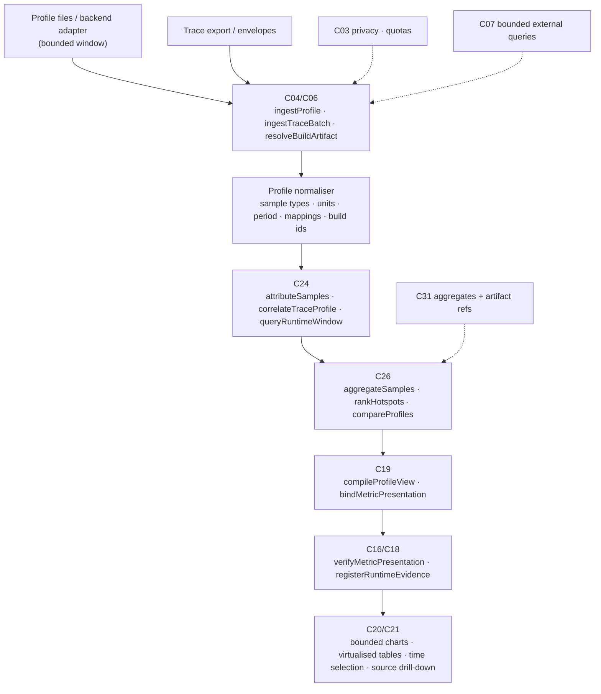

# F05 — Trace-linked continuous profiling

Detailed design · Version 1.0 · 4 October 2026 · Proposed implementation specification

Source: `Competitive_Features_Component_Implementation_Guide.md` §3, §8, §14–§17. Repository evidence observed at commit `8b07b5e`.
Priority P2. First deliverable: import a real profile, correlate it to a trace and display hotspots.

---

## 1 Purpose, user experience and status

### 1.1 The experience this feature exists for

| User asks | Product should deliver |
|---|---|
| "Why is this endpoint slow?" | Trace → profile → source line, with measured CPU, wait or allocation evidence |

```
GET /v1/refunds/{id}      checkout-service  ·  window 2026-10-04 11:00–11:15  ·  revision a19a978 (matches the profiled build)
 p50 84 ms · p95 1,310 ms · error rate 0.4 %   (4,182 requests)                             slow-trace exemplar: 7f3c…  (1,402 ms)

 ┌ Trace waterfall (critical path in bold) ───────────────────────────────────────────────────────────┐
 │ GET /v1/refunds/{id}                         ████████████████████████████████████████  1,402 ms  │
 │  ├ auth.verify                               ██                                           64 ms  │
 │  ├ refunds.compute        (exclusive 1,096)  ░░████████████████████████████████████░░  1,160 ms  │
 │  │   └ db.query  select … from refunds …     ██                                           64 ms  │
 │  └ events.publish                            █                                            38 ms  │
 └──────────────────────────────────────────────────────────────────────────────────────────────────┘
 Profile evidence   (CPU, pprof, 100 Hz · 1,482 samples · 14.8 s of CPU · 12 profiles overlap the window)
   Correlation: window overlap only (samples are not labelled with span ids)   → population-level, not this request
   1  computeTax            src/tax/rules.ts:88      41.3 % of samples (self)   [34.9 %–47.9 %]     ← open the line at revision a19a978
   2  JSON.stringify        runtime                  12.0 %
   3  matchRegion           src/tax/regions.ts:31     9.4 %
   Not shown / not known:   wall-time (off-CPU) profile not available → time spent waiting cannot be explained by a CPU profile.
                            2.1 % of expected samples were not collected (sampling shortfall).
```

### 1.2 What "done" means for the user

1. From a slow trace the user reaches the profile **population** for the same service, time and revision, and from there the exact source line (F05-A1).
2. A profile whose build or symbols do not match the revision cannot claim a precise source line (F05-A2).
3. CPU, wall-clock and allocation measurements stay distinct; they are never summed or relabelled (F05-A3).
4. Dropped or missing samples are disclosed and **never** become zero usage (F05-A4).
5. A modelled or simulated number can never appear as a measured one (F05-A5).
6. A candidate cannot look faster because failed requests were removed from the comparison (F05-A6).

### 1.3 Status

**Proposed implementation specification.** The repository has trace/span ingestion and attribution (C24 slice), an OpenTelemetry-style trace *file* reader, span exclusive-cost and critical-path functions, and deployment-marker based revision joins. It has **no profile ingestion, no profile data model, no hotspot aggregation, no flamegraph or waterfall form and no presentation manifest for metrics**. Those are specified here.

---

## 2 Scope, non-goals and first delivery boundary

### 2.1 In scope

- Import of profiles in a small set of open formats, with build/symbol identity and sampling metadata retained.
- Correlation of profiles with traces at stated **grades** (span-labelled, endpoint-labelled, window-overlap).
- Aggregation into hotspots (self and cumulative) for the metrics the input actually supports (CPU, wall, allocation, in-use memory).
- Comparison of equivalent populations with uncertainty and explicit non-comparability reasons.
- A typed, bounded presentation: metric table, hotspot table, flamegraph, waterfall, timeline; each metric bound to units, population, window and basis.
- Source drill-down at the revision that was actually profiled.

### 2.2 Non-goals (first release)

- Running a profiler or an agent. CIE does **not** instrument production (guide: "do not import unlimited samples into the local graph"; raw volume stays in the telemetry store).
- Live streaming/continuous polling. The first release imports files and queries bounded windows from a backend adapter.
- Causal claims. Time overlap or parentage is never proof that a hotspot *caused* a slow request (guide §8).
- Automatic optimisation suggestions (F07/F10 build on this evidence later).
- Unbounded retention of raw samples.

### 2.3 First delivery boundary

One service, one language runtime, one profile format, one trace format: **import a real profile file and a real trace export, correlate them, display hotspots and open the source line**. Proposed first formats (final choice in decision D1): **pprof** (the interchange format of Go and of several continuous-profiling backends), **V8 `.cpuprofile`** (Node/TypeScript, the language of this repository) and **collapsed/folded stacks** (the lowest-common-denominator text format). Trace input: the OpenTelemetry-style JSON export the repository already reads (`traceexport.ts`) plus the envelope API (`runtime.ts`).

---

## 3 Current state in this repository

### 3.1 What exists (observed)

| Capability | Where | What it does | Class |
|---|---|---|---|
| Runtime envelope ingestion | `runtime.ts` (`RuntimeEnvelope`, `RtSpan`, `Runtime.ingest`) | Bounded span samples per envelope (`maxSpansPerEnvelope: 5000`, `maxStoredSpansPerSource: 20_000`), idempotent by digest, backpressure instead of silent drops, impossible-timestamp flags | EXISTING_REUSE |
| Attribution with graded exactness | `runtime.ts` (`RuntimeAttribution`, `attribute`) | Methods `CODE_LOCATION_EXACT`, `CODE_LOCATION_OTHER_REVISION`, `FUNCTION_NAME`, `UNATTRIBUTED`; `exact` only when revision, a deployment marker and a code location agree; fog counted | EXISTING_EXTEND (frames for profile samples reuse the same grades) |
| Deployment markers | `runtime.ts` (`recordMarker`, `rt_markers`) | The authoritative join: deployment → revision from a time on | EXISTING_REUSE (build → revision) |
| Trace file ingestion | `traceexport.ts` | OpenTelemetry-style export under well-known paths; spans become `OBSERVED` facts; stale exports flagged | EXISTING_EXTEND |
| Stack frame → entity mapping | `trace.ts` (`parseTrace`, `locateFrames`, `entityAt`, `byteOffset`) | Frames mapped onto entities by file and line | EXISTING_REUSE (profile locations are the same problem) |
| Exclusive cost and critical path | `defect-performance.ts` (`computeExclusiveCosts`, `reconstructCriticalPath`, `TimedSpan` with `category`, `buildHash`, `workloadHash`) | Union-of-children subtraction, cyclic-ancestry rejection, critical path with gaps | EXISTING_REUSE |
| Hotness from runtime signals | `hotness.ts` (`runtimeHotness`) | Ranks entities hot from reported exceptions (frame position, repeat count) | EXISTING_EXTEND (profile-derived hotness feeds the same channel) |
| Map overlays | `overlays.ts`, web `mapoverlays.ts` | Test and runtime decorations on entities | EXISTING_EXTEND |
| Benchmark comparison | `defect-benchmark.ts`, schema `BenchmarkComparison` | Paired trials with `workloadHash`, `environmentHash`, `correctnessPassed`, intervals | EXISTING_REUSE (compare semantics) |
| Replay | `runtime.ts` (`replay`), web `RuntimeReplay.tsx` | Cumulative recorded spans by start time | EXISTING_REUSE |

### 3.2 Verified gaps

| Gap | Evidence | Consequence |
|---|---|---|
| No profile format support | No pprof/JFR/perf/cpuprofile/folded-stack parser anywhere in the source | NEW importers |
| No sample/metric data model | `RtSpan` has no stack, sample type or unit | NEW profile model |
| No hotspot or flamegraph form | `forms/` has 16 forms, none for profiles; web has `TerrainView`/`MatrixView` only | NEW form(s) and chart adapters |
| No presentation manifest | Guide §1: "no presentation manifest, wording registry or chart surfaces" | NEW minimum binding path (guide §15) before any metric is shown as measured |
| No build identity on spans | `RuntimeEnvelope.codeRevision` is optional; no build id/symbol map | NEW build↔revision resolution |
| Per-source cap of 20,000 spans | `LIMITS.maxStoredSpansPerSource` | Profile samples must **not** go through this path; aggregates only |

### 3.3 Not verified

- Which profile formats the target users' stacks actually emit (to be confirmed with real users in WP-01).
- Quality of file/line symbolization in typical production profiles (many are function-name only).
- Whether the existing trace exports carry service/instance attributes sufficient for window-overlap correlation.

---

## 4 Architecture and ownership



### 4.1 Responsibilities

| Component | Responsibility | Functions | Class |
|---|---|---|---|
| C04/C06 | Trace/profile import adapters; retain build ID, symbol maps, sampling metadata, time ranges | `ingestProfile`, `ingestTraceBatch`, `resolveBuildArtifact` | NEW (trace file reader EXISTING_EXTEND) |
| C24 | Correlate profile samples with services, threads/tasks, spans and revision; overlap alone is not causality | `attributeSamples`, `correlateTraceProfile`, `queryRuntimeWindow` | EXISTING_EXTEND (`Runtime.attribute`, `queryWindow`) + NEW |
| C26 | CPU/wall/allocation/wait hotspots only where the format supports them; compare equivalent populations | `aggregateSamples`, `rankHotspots`, `compareProfiles` | NEW (compare semantics from `defect-benchmark.ts`) |
| C19 | Typed metric, flamegraph, waterfall and hotspot-table specifications; bind units, population, window and basis to every metric item | `compileProfileView`, `bindMetricPresentation` | NEW |
| C20/C21 | Bounded chart adapters, virtualised tables, time selection, source drill-down; chart navigation separate from semantic graph levels | — | NEW |
| C16/C18 | Verify measured-versus-inferred wording, manifest identities, metric denominators | `verifyMetricPresentation`, `registerRuntimeEvidence` | EXISTING_EXTEND (claims) + NEW (metric verification) |
| C07/C31/C32/C03 | Bounded external telemetry windows; retain aggregates and artifact references; privacy and quotas; report dropped samples | — | EXISTING_EXTEND |

---

## 5 Reconciliation with existing contracts

| Guide | Repository | Decision |
|---|---|---|
| `C24.correlateProfile(ctx,{profileArtifactId, traceSourceId, buildId, timeWindow}) -> Outcome<ProfileCorrelation>` | `C24/ingest`, `C24/attribute…` via `runtimeOps` | Add `C24/correlateProfile`; `ProfileCorrelation` includes the **grade** (§7.3) and the build/revision resolution |
| `C26.queryHotspots(…) -> Outcome<{rows, units, sampleCount, coverage, uncertainty}>` | `C26/*` are defect operations | Add `C26/queryHotspots`, `C26/compareProfiles`; value includes `basis` and `populationHash` |
| "A caller-provided MEASURED enum is insufficient" (guide §3) | `scenarios.ts` `Basis = STRUCTURAL \| MEASURED \| INTERPOLATED \| EXTRAPOLATED \| INFERRED`, with `CapacityPoint.runId` | Keep the enum; the new rule is that `MEASURED` **requires** a traceable `profileArtifactId`/`runManifestId`; the verifier rejects a `MEASURED` item without one |
| `RunManifest` | `RunManifestSchema` (defect) has `specId`, `buildHash`, `environmentHash`, … | Profile imports get a **`ProfileManifest`** with the same identity vocabulary (`artifactHash`, `buildHash`, `environmentHash`, `workloadHash?`); they are not experiment runs and do not pretend to be |
| `RuntimeAttribution.method` | Existing enum | Extended **additively** with `PROFILE_SAMPLE_LABELLED`, `PROFILE_WINDOW_OVERLAP` for population attribution; existing values unchanged |
| Chart surfaces | Forms V1–V16 | Add one form **V17 "Trace-linked profile"** to `VISUALS`; the gallery lists it with its needs ("a profile and a trace for the same service") |

---

## 6 Data model

### 6.1 Identity

- **Profile artifact** — `artifactHash` (SHA-256 of the bytes as received) + `format` + `formatVersion`.
- **Profile chunk** — a profile covers one `[startNs, endNs)` window for one `(service, instance)`; a continuous-profiling backend returns many per window. Chunk identity = `(artifactHash, chunkIndex)`.
- **Population** — a set of chunks selected by `(service, instances, window, revision, sampleType)`; `populationHash` is the hash of the sorted chunk identities plus the filter. A metric is meaningful **only relative to its population**, so it is always carried with the hash.
- **Build identity** — the profile's mapping `build_id` (native), or a content hash of the loaded bundle (JS), or a class-file/jar hash (JVM). `buildId → revision` is resolved through deployment markers (existing) and, where available, build metadata; unresolved is a **state**, not a guess.

### 6.2 Tables (proposed)

```sql
create table profile_artifacts(
  artifact_hash text primary key, format text not null, format_version text,
  profiler text, profiler_version text,                        -- as declared by the input, else null
  service text, instance text, runtime text,                   -- from labels / resource attributes
  start_ns integer not null, end_ns integer not null,
  period_ns integer,                                           -- sampling period if time-based
  sampling_rate_hz real, declared_overhead_percent real,       -- null when the input does not say
  dropped_samples integer,                                     -- null = unknown, 0 = known none (distinct!)
  truncated integer not null default 0,
  stored_ref text not null,                                    -- handle to the raw artifact in the artifact store
  ingested_at text not null
);
create table profile_sample_types(
  artifact_hash text not null, ordinal integer not null,
  kind text not null,                                          -- CPU | WALL | ALLOC_SPACE | ALLOC_OBJECTS | INUSE_SPACE | INUSE_OBJECTS | LOCK_CONTENTION | OTHER
  unit text not null, raw_type text not null, raw_unit text not null,
  primary key(artifact_hash, ordinal)
);
create table profile_mappings(
  artifact_hash text not null, mapping_id integer not null,
  build_id text, file text, has_functions integer, has_filenames integer, has_line_numbers integer, has_inline_frames integer,
  revision text, revision_state text not null,                 -- MATCHED | MISMATCH | UNKNOWN
  primary key(artifact_hash, mapping_id)
);

-- Aggregates (never raw samples). One row per (artifact, function, sample type).
create table profile_function_agg(
  artifact_hash text not null, sample_type_ordinal integer not null,
  function_key text not null,                                  -- (name, file, startLine) normalised
  name text not null, file text, line integer,
  self_value real not null, total_value real not null, sample_count integer not null,
  entity_id text, attribution_method text,                     -- from §7.2
  primary key(artifact_hash, sample_type_ordinal, function_key)
);
-- A bounded aggregated call tree for flamegraphs (pruned; see §7.5).
create table profile_tree(
  artifact_hash text not null, sample_type_ordinal integer not null,
  tree_json text not null, node_count integer not null, pruned_value real not null,
  primary key(artifact_hash, sample_type_ordinal)
);

create table profile_trace_links(
  link_id text primary key, artifact_hash text not null, chunk_index integer,
  trace_source text not null, trace_id text, span_id text,
  grade text not null,                                         -- SPAN_LABELLED | ENDPOINT_LABELLED | WINDOW_OVERLAP | NONE
  overlap_ms integer, reason text not null, created_at text not null
);

create table profile_populations(
  population_hash text primary key, service text not null, window_from_ns integer not null, window_to_ns integer not null,
  revision text, sample_type_kind text not null, chunk_ids_json text not null,
  sample_count integer not null, expected_samples integer, collection_ratio real,
  request_count integer, error_count integer, created_at text not null
);
```

`dropped_samples` is **nullable on purpose**: `NULL` means *unknown* and is displayed as "not reported", while `0` means *reported none*. Treating unknown as zero would violate F05-A4.

### 6.3 What is *not* stored

Raw samples, per-sample timestamps beyond the chunk boundaries, high-cardinality labels (user ids, request ids, tenant ids) and command lines. The raw artifact stays in the artifact store by reference (and in the customer's telemetry system); the local graph holds aggregates and links.

---

## 7 Algorithms

### 7.1 Import and normalisation

For each format the importer produces one canonical in-memory form: `sampleTypes[]`, `samples[]` (stack of location ids, value vector, labels), `locations[]` (mapping, address, lines[{function, file, line}]), `mappings[]`, `periodNs`, `durationNs`.

| Format | Specifics |
|---|---|
| pprof (gzip-compressed protobuf) | Decode `Profile` (sample_type, sample, mapping, location, function, string_table, period, duration_nanos, time_nanos, comments). `location.line[]` holds *inlined* frames — each becomes a frame in the stack, inner-most first. Numeric/string labels on samples preserved through an allowlist |
| V8 `.cpuprofile` | JSON `nodes` (callFrame with functionName, url, lineNumber, columnNumber) + `samples` + `timeDeltas`; convert to stacks; CPU time = sum of deltas; line numbers are 0-based in the format and normalised to 1-based; source-map resolution needs the maps (`resolveBuildArtifact`) |
| Folded stacks | `frame;frame;frame count`; no units, no period → sample type `OTHER` with `unit: samples` and a prominent "units unknown" caveat; excluded from time-based claims |

**Validation.** Reject, with typed diagnostics: an unsupported version; a sample referencing an undefined location; a negative value; a period of zero with a time-based type; a decompressed size above a limit (zip-bomb protection); a stack deeper than the cap (truncated frames counted in `truncated`). The 8 MiB RPC frame cap applies if parsing runs in the worker; large profiles are parsed in a streaming fashion and only aggregates cross the boundary.

**Classification of metrics.** `kind` is derived from the declared type/unit, not guessed: `cpu/nanoseconds` → `CPU`; `samples/count` with a time period → `CPU` *only if the profiler is declared on-CPU*, otherwise `OTHER`; `wall`/`wallclock` → `WALL`; `alloc_space/bytes` → `ALLOC_SPACE`; `inuse_space` → `INUSE_SPACE`; `contentions/delay` → `LOCK_CONTENTION`. An unlabelled type is `OTHER`; the UI says "metric kind not declared by the profiler". **Different `kind`s are never summed, averaged together or plotted on one axis** (F05-A3).

### 7.2 Symbolization and revision binding (F05-A2)

For each frame the importer has `(function, file, line)` possibly empty. The attribution ladder (reusing the grade vocabulary of `RuntimeAttribution`):

1. **`CODE_LOCATION_EXACT`** — the mapping's build is **MATCHED** to revision R (deployment marker, build id found in a recorded build, or bundle hash equal to R's), the file exists at R, and the line falls inside a function entity whose name equals the frame's function. Only this grade allows "open the line".
2. **`CODE_LOCATION_OTHER_REVISION`** — the build is known and ≠ the revision being viewed: the frame is shown with the revision it *does* match ("profiled at b71c04e, you are viewing a19a978") and navigation opens **that** revision, never the current one.
3. **`FUNCTION_NAME`** — only a name is available; matched to an entity by unique name within the service's code; ambiguous names list candidates. Never shown as a precise line.
4. **`UNATTRIBUTED`** — runtime/native/unknown frames; counted in a **separate bucket** ("runtime and native: 18.3%") so shares add to 100% of the *profile*, not of the attributed subset.

**Build mismatch rule.** If `revision_state ∈ {MISMATCH, UNKNOWN}` for a mapping, **precise source attribution is blocked** for frames in that mapping; the importer sets a population-level warning (`SYMBOL_BUILD_MISMATCH` or `BUILD_UNRESOLVED`), and the hotspot table shows function names without line links. Whether a build "matches" is derived from evidence, never assumed from "the latest deploy".

**Inlining and generated code.** Inlined frames use the line table of the inner function; minified/bundled JS needs source maps — without them, frames are `FUNCTION_NAME` at best. Frames in files denied by the access policy are aggregated into "code you cannot see (N%)" so denominators remain honest.

### 7.3 Correlation with traces

A profile is **not** a trace. The correlation grade says how strong the link is; the UI states the grade next to every statement derived from it.

| Grade | Condition | What may be claimed |
|---|---|---|
| `SPAN_LABELLED` | Samples carry a span id (and trace id) label that matches a span in the trace source | "These samples ran while this span was active" — per-span attribution, subject to sampling error |
| `ENDPOINT_LABELLED` | Samples carry an endpoint/route/operation label matching the span's route | "Samples attributed to this endpoint across the window" — population of the endpoint, not this request |
| `WINDOW_OVERLAP` | Same service (and instance, when known) and revision; profile window overlaps the span/endpoint window | "The service's CPU during this window was dominated by …" — **not** this request, not causal |
| `NONE` | No overlap or service/revision mismatch | No claim; shown as "no profile covers this trace" |

Rules: a profile from a *different revision* than the trace's cannot be linked beyond `NONE` (unless the user explicitly overrides and the override is labelled); instances are matched by the resource attributes both sources share (host/pod/process id) — if the trace has none, only `WINDOW_OVERLAP` at service level is possible and is so labelled; trace sampling rate is carried (existing `samplingRate`) and exemplars are never presented as a representative distribution.

**Why this is conservative.** Two things happening at the same time on the same service are not cause and effect. The guide makes this explicit; the grade ladder is how the product refuses to blur it.

### 7.4 Aggregation and hotspots

For a population (the set of chunks from §6.1) and one `kind`:

1. **Self** value of a function = sum of sample values whose **leaf** frame is the function (inlined leaf counts for the inner function). **Total (cumulative)** value = sum over samples containing the function **at least once** (recursion counts a sample once for the function: *distinct* membership per sample), so total ≤ population value always.
2. Convert to the **unit** of the sample type; for CPU samples the seconds are `samples × period` when the type is sample-count and the period is declared; otherwise the native unit.
3. **Share** = value / populationValue. The denominator is the *whole population value for that kind*, including `UNATTRIBUTED`, so shares never exceed or silently exclude the profile.
4. **Uncertainty.** With `n` samples and a function with `s` self samples, report a Wilson score interval for `s/n` at 95 %. Samples within one profile are not independent (autocorrelated stacks, bursty workloads), so the interval is labelled **indicative, likely too narrow**; below a minimum `n` (proposed 100) rankings are shown as "too few samples to rank" and the table is sorted but flagged.
5. **Collection ratio.** For time-based sampling, `expected = durationNs / periodNs`; `collectionRatio = actual / expected`. Below a threshold (proposed 0.9) the report says "N % of expected samples were collected — absolute values are underestimates; shares may be biased if loss was uneven". If the input reports `dropped_samples`, that number is shown; if it does not, the field reads "not reported" (F05-A4).
6. **Ranking.** Default order: self value descending; secondary toggle: cumulative. Both are shown; the UI never labels one of them "the" cost.
7. **Entity roll-up.** Function aggregates map to entities (through `entityAt`/`locateFrames`) for map overlays and for F06's historical join; entity totals are sums of *self* values to avoid double counting.

### 7.5 Bounded call tree for flamegraphs

Build the merged call tree (function-level), then **prune**: drop any node whose value is below `max(minShare × total, absoluteFloor)` into its parent's `other` bucket (`pruned_value` recorded so the total is preserved); cap depth (default 64) and node count (default 5,000) deterministically (keep the heaviest, tie-break by name). The stored tree is the *only* representation used for rendering; one node per sample is never created. The importer records `pruned_value / total` so the UI can say "0.6 % of samples are in frames too small to draw".

### 7.6 Comparing profiles (F05-A6)

`compareProfiles(baseline, candidate)` is allowed only when the two populations are **equivalent** under declared rules:

- Same `sample_type_kind`, same unit.
- Same service; workload fingerprint equal (`workloadHash`) **or** the user explicitly declares equivalence (recorded, shown).
- Same environment fingerprint class (instance type, runtime version) — differences listed.
- **Request population equivalence**: `request_count` and `error_count` from the traces for the same windows. The comparison is expressed **per request** (`value / request_count`) and the **error rates must be shown**; if the candidate's error rate differs from the baseline's by more than a threshold (proposed 1 percentage point or 2×, whichever is smaller), the verdict is `NOT_COMPARABLE: error populations differ` — an improvement is *not* reportable. This is what prevents "faster because failures were dropped".
- Failed/timed-out requests are **in** the population on both sides (as in `defect-benchmark.ts`, where `correctnessPassed` is carried per trial and failures stay in).

Output: per-function delta (per request), share change, uncertainty from both sides, and an explicit `limitations[]` list ("single run each", "different instance types", "indicative intervals"). A single pair of profiles can **suggest** a difference; claiming an *effect* needs repeated paired runs (F10's experiment machinery), which the comparison view links to.

### 7.7 "Why is this endpoint slow?" orchestration

1. **Select** the endpoint/operation and window; compute latency distribution and error rate from the span population (`queryWindow` + percentile function already in `runtime.ts`). Disclose trace sampling: the distribution is of *sampled* traces.
2. **Pick exemplars**: slowest N traces and one near the median; never only the slowest.
3. **Waterfall**: build spans for the exemplar; `computeExclusiveCosts` gives exclusive time; `reconstructCriticalPath` gives the path; the dominant span on the critical path is flagged. If the critical path is mostly *waiting* (child I/O, lock, queue categories from `TimedSpan.category`), the narrative says "most of this request's time was not on the CPU of this service".
4. **Profile evidence**: select the population per §6.1 for the dominant span's service/instance; choose `kind` = `CPU` if the dominant span's exclusive time plausibly is CPU (category `CPU`), `WALL` if wall-time profiles exist, otherwise state which kind is missing.
5. **Hotspots** for that population with the correlation grade written next to the header.
6. **Source**: each hotspot row opens the code at the matched revision using F01 navigation (precise grade) or says why it cannot.
7. **Statement generation** uses registered templates only (§7.9): measured values in measured wording; overlap-grade statements in population wording; no causal verbs.

### 7.8 Backends and bounded queries

The first release imports files. A **backend adapter** interface is defined now so later adapters do not reshape the model:

```typescript
interface ProfileSource {
  id: string; kind: 'FILE' | 'PYROSCOPE' | 'PARCA' | 'DATADOG' | 'CLOUD_PROFILER' | 'OTHER';
  listProfiles(q: { service: string; from: number; to: number; labels?: Record<string,string>; limit: number }): Promise<ProfileDescriptor[]>;
  fetchProfile(d: ProfileDescriptor): Promise<{ bytes: Uint8Array; format: string; declaredDropped?: number }>;
}
```

Queries are bounded by window length, number of chunks and bytes; a request exceeding bounds returns what fit plus `completeness: PARTIAL` and *which* chunks were not fetched. Credentials follow the connector rules (`connectors.ts`): never stored or logged, expiry as a stated state, rate limits waited out or resumed from a cursor.

### 7.9 Presentation binding (guide §15, minimum path)

Before any metric is displayed as measured, implement the smallest binding path:

1. **Wording templates** registered by id, version, content and hash. A template has an allowed **claim class** (`MEASURED_PROFILE`, `POPULATION_OVERLAP`, `OBSERVED_TRACE`, `MODELED`, `ESTIMATED`). "Samples attributed to this endpoint show 41 % of CPU in computeTax" is `MEASURED_PROFILE`/`ENDPOINT_LABELLED`; "the service's CPU in this window was 41 % computeTax" is `POPULATION_OVERLAP`. A template cannot be edited to a stronger class without a new version and a stronger authority.
2. Every rendered **metric item** is `{ locator, claimId, templateId, templateVersion, certificateId, value, unit, basis, populationHash, window, sampleCount, uncertainty?, caveatIds[] }`. The manifest of all items on a view is hashed.
3. `C16.verifyMetricPresentation` checks each item: basis `MEASURED_*` requires a traceable artifact (`artifactHash`) and an intact `populationHash`; the denominator equals the population total; units match the sample type; correlation grade is in the caveats; `MODELED`/`ESTIMATED` items cannot use a measured template.
4. The renderer draws **only** items that verify; a failing item is replaced by an explicit "unverified" placeholder with the reason (F05-A5). A sidecar manifest the renderer ignores does not satisfy this (guide §15).

---

## 8 API contracts

```typescript
C04/ingestProfile(ctx, { source: FileHandle | { sourceId: string; descriptor: ProfileDescriptor }, serviceHint?: string, buildHints?: { buildId?: string; revision?: string } })
  -> ApiResult<{ artifactHash: string; format: string; sampleTypes: SampleTypeView[]; periodNs?: number;
                 mappings: MappingView[]; diagnostics: Diagnostic[]; droppedSamples: number | 'NOT_REPORTED' }>     // mutating, idempotent on artifactHash

C04/ingestTraceBatch(ctx, { source: FileHandle | TraceSourceRef }) -> ApiResult<{ envelopeIds: string[]; spans: number; quality: string[] }>   // wraps Runtime.ingest

C24/correlateProfile(ctx, { profileArtifactId: string, traceSourceId: string, buildId?: string, timeWindow?: { from: number; to: number } })
  -> ApiResult<ProfileCorrelation>

type ProfileCorrelation = {
  correlationId: string;
  links: { traceId?: string; spanId?: string; grade: 'SPAN_LABELLED'|'ENDPOINT_LABELLED'|'WINDOW_OVERLAP'|'NONE'; overlapMs?: number; reason: string }[];
  build: { buildId?: string; revision?: string; state: 'MATCHED'|'MISMATCH'|'UNKNOWN'; evidenceIds: string[] };
  populationHash: string;
};

C26/queryHotspots(ctx, { correlationId: string, metric: SampleKind, filters?: { pathGlobs?: string[]; excludeRuntime?: boolean },
                         population?: PopulationSpec, order: 'SELF'|'TOTAL', limit?: number, cursor?: string })
  -> ApiResult<{ rows: HotspotRow[]; unit: string; sampleCount: number; populationValue: number;
                 coverage: { collectionRatio?: number; droppedSamples: number | 'NOT_REPORTED'; truncatedStacks: number; unattributedShare: number; prunedShare: number };
                 uncertainty: { method: 'WILSON_95_INDICATIVE'; minSamplesForRanking: number; tooFewSamples: boolean };
                 basis: 'MEASURED_PROFILE'; grade: string; populationHash: string; nextCursor?: string }>

C26/compareProfiles(ctx, { baselinePopulation: string; candidatePopulation: string; normalise: 'PER_REQUEST'|'ABSOLUTE'; declareEquivalent?: { reason: string } })
  -> ApiResult<{ verdict: 'DIFFERENCE_OBSERVED'|'NO_MATERIAL_DIFFERENCE'|'NOT_COMPARABLE'|'INCONCLUSIVE'; reasons: string[]; rows: DeltaRow[]; populations: PopulationCompare; limitations: string[] }>

C19/compileProfileView(ctx, { correlationId, kind: 'HOTSPOT_TABLE'|'FLAMEGRAPH'|'WATERFALL'|'TIMELINE'|'METRIC_TABLE', params })
  -> ApiResult<{ viewSpec: ViewSpec; presentationManifest: PresentationManifest }>
C16/verifyMetricPresentation(ctx, { manifestHash }) -> ApiResult<{ items: { itemId: string; verdict: 'VERIFIED'|'REJECTED'; reasons: string[] }[] }>
```

Errors: `INVALID_SCHEMA` (corrupt/unsupported profile, with the offending construct), `RESOURCE_LIMIT` (size/depth caps, as `runtime.ts` already phrases it), `EVIDENCE_STALE` (the code at the viewed revision no longer matches the profile's build), `INSUFFICIENT_EVIDENCE` (no profile covers the window — a normal answer, with what is missing), `BUDGET_EXCEEDED` (external query bounds).

---

## 9 States and lifecycles

Profile artifact: `RECEIVED → PARSED → NORMALISED → AGGREGATED → LINKED` with `REJECTED` (invalid) and `PARTIAL` (parsed with diagnostics). Correlation: `PENDING → RESOLVED` (links graded) `| STALE` (revision superseded or markers changed). Population: immutable once hashed. View: `COMPILED → VERIFIED → RENDERED`; verification failure moves individual items to `UNVERIFIED`, never the whole view silently. All jobs follow the existing runner rules (cancel before commit point, `RUNNING` at crash → `FAILED`).

---

## 10 Authorization, egress and privacy

- **Local by default.** Nothing here sends profile data anywhere. A backend adapter *reads* from the customer's telemetry store with the user's credentials; those credentials follow the connector rules and are never persisted.
- **Label hygiene.** Profile and span labels can carry user ids, tenant ids, request ids or secrets. Only an **allowlist** of labels is imported (service, instance, endpoint/route, span id, trace id, version, environment); everything else is dropped at import and counted (`labelsDropped`), configurable per source. Command lines and environment strings in profile comments are not stored.
- **Access policy.** Frames in denied paths are aggregated into an anonymous bucket; counts and shares still include them (denominators stay true) but their names and lines never appear. Authorization is applied again when a hotspot row is opened.
- **Quotas.** Per-source and per-tenant byte and chunk quotas; exceeding yields a stated `RESOURCE_LIMIT` (as the existing envelope path does), not silent truncation.
- **Retention.** Raw artifacts are retained per policy (default short) while aggregates and links persist; deleting a source purges derived rows (existing deletion-propagation approach).
- **Model use.** Narrative explanations (C15) receive function names, files and numbers after redaction; never raw labels.

---

## 11 Freshness, cancellation, idempotency, recovery

- Import is idempotent on `artifactHash`; re-importing returns the existing artifact.
- A new revision or a new deployment marker invalidates correlations that depended on the old binding (`STALE`), and the UI shows the profile's own revision rather than silently re-pointing.
- Large imports run as jobs with cancel-before-commit; partial aggregates are never published.
- External queries carry a deadline; partial results are labelled with the chunks missing.
- Late results from a superseded generation are rejected at commit.

---

## 12 Interface specification

### 12.1 Surfaces (form V17 "Trace-linked profile")

1. **Endpoint list** — route/operation, service, p50/p95, error rate, request count, "slow traces", profile coverage ("12 profiles, CPU"), correlation grade available.
2. **Trace waterfall** — spans as horizontal bars with exclusive cost shading; critical path emphasised by weight *and* a marker; waiting categories labelled.
3. **Profile panel** — metric selector (CPU / wall / allocation / …; only kinds present are enabled, others show "not provided by this profile"), correlation-grade chip, collection-ratio chip, build-match chip.
4. **Hotspot table** (primary, accessible) — function, file:line link (only for `CODE_LOCATION_EXACT`), self %, total %, samples, indicative interval, attribution grade.
5. **Flamegraph** — drawn from the pruned tree on a canvas; click zoom, search, "focus on function". It is a *view of the table*, not a separate truth.
6. **Timeline** — chunk timeline with brush selection to define the population; selection changes `populationHash` visibly.
7. **Compare mode** — baseline vs candidate populations side by side, with the equivalence checklist (service, workload, environment, error populations) and the verdict.
8. **Source drill-down** — evidence drawer at the profiled revision; "Open in VS Code".

Chart navigation (zoom/brush/focus) is **separate** from semantic graph levels (guide C20/C21): the L0–L6 stepper does not appear on this form.

### 12.2 Copy rules

- Measured words only for verified `MEASURED_*` items: "measured CPU samples", never "caused".
- Overlap grades: "during this window the service spent …" (population), never "this request spent …".
- Always show the unit and the kind: "14.8 s of CPU", "1.2 GiB allocated".
- Missing data is stated: "wall-time profile not provided"; never a 0 bar.
- Shortfalls: "2.1 % of expected samples were not collected."
- Zero profiles: "No profile covers this window for checkout-service at revision a19a978." with the nearest available window.

### 12.3 States

Importing (stepper, bytes, parse stage); invalid profile (typed reason); symbol mismatch (banner: "This profile was collected from a build that does not match revision a19a978; function names are shown without source lines."); no correlation (`NONE`); too few samples (rows flagged, ranking suppressed); stale (revision moved); unverified item (placeholder with reason).

### 12.4 Accessibility

The hotspot table is the accessible primary; the flamegraph canvas has an `aria-label` summarising the top frames and a **tree-table outline** equivalent (same pattern as the existing `Outline.tsx` text outline) navigable by arrow keys, Enter to focus a node, Left/Right to collapse/expand. The waterfall is also exposed as a table (span, start, duration, exclusive, on-critical-path). Kinds and grades are text. Reduced motion disables animated zoom.

---

## 13 Performance and bounded work

Targets are proposals; record measured numbers with profile sizes (bytes, samples, distinct functions) and machine.

| Bound | Default |
|---|---|
| Decompressed profile size | cap (zip-bomb guard) with a typed rejection |
| Stack depth | 256 frames, truncated and counted |
| Chunks per population | cap; `PARTIAL` if exceeded |
| Flamegraph nodes | 5,000 after pruning, depth 64 |
| Hotspot rows per page | 50; keyset cursor |
| Import time | streaming parse; budget from job deadline |
| Aggregation | linear in samples; one pass per sample type |

---

## 14 Failure modes

| Failure | Behaviour |
|---|---|
| Profile symbolized for a different binary | Mapping `MISMATCH`; precise attribution blocked; warning |
| No `build_id` in the profile | `UNKNOWN`; attribution at `FUNCTION_NAME` at best |
| Sample type unknown | `OTHER`; excluded from time claims |
| Profile covers a window with no traces | Correlation `NONE`; hotspots still shown as *service-level* evidence with that label |
| Very low sample count | "Too few samples to rank"; no intervals promoted as precise |
| Dropped samples reported / not reported | Number shown / "not reported" — never zero |
| Many instances, one profile | Instance label limits the population; otherwise stated as "one of N instances" |
| Different trace and profile clocks | Skew bound from `runtime.ts` (`skewMs`) applied; overlaps within skew flagged `UNCERTAIN_ALIGNMENT` |
| Minified bundle without source maps | Frames `FUNCTION_NAME` or unattributed; a prompt to supply maps |
| Benchmark with failures dropped | Comparison `NOT_COMPARABLE` (F05-A6) |
| External backend unavailable | Adapter state (`EXPIRED`/`UNREACHABLE`/`RATE_LIMITED` vocabulary from `connectors.ts`) |

---

## 15 Test plan

### 15.1 Acceptance (from the guide)

| ID | Test | Input |
|---|---|---|
| F05-A1 | A slow trace opens the corresponding profile population and source revision | Real Node service with a deliberately hot function: record a `.cpuprofile` and a trace export during load; assert endpoint → exemplar → population → hotspot → source line at the matched revision; golden values hashed |
| F05-A2 | Symbol/build mismatch blocks precise source attribution | Same profile, but the source revision has the function moved/renamed: assert `MISMATCH`, no line link, warning text; and a profile with no build id → `UNKNOWN` |
| F05-A3 | CPU and wall time remain distinct | A pprof with both CPU and wall types (or two profiles of one run): assert separate tables, no combined total, selector disables absent kinds |
| F05-A4 | Dropped samples are disclosed | Profile with `dropped_samples` set, one with it unset, one with a shortfall in samples vs period: assert "N dropped", "not reported", and the collection-ratio warning respectively; assert none is shown as zero |
| F05-A5 | Simulated metrics cannot appear as measured | Feed a `MODELED` item (e.g., from F10) into a measured template: `verifyMetricPresentation` must reject it; the renderer must show the placeholder |
| F05-A6 | An error-heavy candidate cannot look faster by dropping failed requests | Baseline with 1 % errors, candidate benchmark with 15 % errors whose profile omits failures: assert `NOT_COMPARABLE` with the error-rate reason; mutation: remove the error-population check → test fails |

### 15.2 Design-level checks

| ID | Test |
|---|---|
| F05-D1 | pprof decoder against profiles produced by independent tools; inline frames expanded correctly |
| F05-D2 | `.cpuprofile` 0-based line normalisation; time deltas sum to the duration within tolerance |
| F05-D3 | Self ≤ total for every function; total ≤ population; recursion counted once per sample |
| F05-D4 | Shares sum to 100 % including the unattributed bucket |
| F05-D5 | Pruned tree preserves the total (`value + pruned_value`) |
| F05-D6 | Label allowlist: a profile carrying `user_id` labels imports with the label dropped and counted |
| F05-D7 | Zip-bomb and depth-bomb profiles rejected within budget |
| F05-D8 | Window-overlap correlation never produces "this request" wording (template verification) |
| F05-D9 | Denied-path frames aggregated anonymously; denominators unchanged |
| F05-D10 | Keyboard-only: select endpoint, open exemplar, navigate the hotspot table, open the source line |
| F05-D11 | Revoking access removes hotspot names from cached views |

### 15.3 Real-input demonstration

Per the guide, run on **real** profiles and traces, not only synthetic ones: at least one pprof from a real Go or Rust service, one `.cpuprofile` from a real Node service, and a matching trace export, covering a real slow endpoint; record artifact hashes, profiler versions, revisions, sample counts and browser dimensions. Include one real profile whose build does not match the viewed revision to prove F05-A2 on genuine data.

---

## 16 Work packages

| WP | Title | Depends on | Size | Result |
|---|---|---|---|---|
| WP-01 | Confirm formats with real stacks; collect real profile + trace corpora with hashes | — | S | D1 decided; corpora |
| WP-02 | Profile model, tables, `.cpuprofile` and folded-stack importers, validation | WP-01 | M | `C04/ingestProfile` (JS) |
| WP-03 | pprof importer (streaming, inline frames, labels allowlist) | WP-02 | L | pprof support |
| WP-04 | Build/revision resolution (markers, build ids, bundle hash); attribution ladder; `entityAt` mapping | WP-02 | M | F05-A2 |
| WP-05 | Aggregation: self/total, shares, collection ratio, intervals, pruned tree | WP-02 | M | `C26/queryHotspots` |
| WP-06 | Trace correlation grades; population model | WP-04 | M | `C24/correlateProfile` |
| WP-07 | Presentation binding: templates, manifest, `verifyMetricPresentation` | WP-05 | L | F05-A5 |
| WP-08 | Form V17: hotspot table, waterfall, timeline, flamegraph canvas, outline equivalent, a11y | WP-05, WP-07 | L | Interface in §12 |
| WP-09 | Compare mode with equivalence checks | WP-05, WP-06 | M | F05-A6 |
| WP-10 | Backend adapter interface + one adapter (bounded queries, connector rules) | WP-03 | M | External source |
| WP-11 | Orchestration "why is this endpoint slow?" and map hand-off | WP-06, WP-08 | M | End-to-end flow |
| WP-12 | Acceptance suite, mutation controls, real-input demo, ledger items | all | M | F05-A1…A6 green |

---

## 17 Migration, rollout and compatibility

- Additive migrations; existing `rt_*` tables untouched. `RuntimeAttribution.method` gains values (readers must treat unknown methods as `UNATTRIBUTED`).
- New form `V17` registered in `VISUALS` with its `needs`; hidden if no profile is imported.
- Flags: `profiles.import` → `profiles.correlate` → `profiles.compare`.
- A compatibility shim exposes profile-derived hotness to `runtimeHotness` behind a flag so map ranking can use it only after the metric verification path exists.

---

## 18 Risks and open decisions

| ID | Decision / risk | Options | Recommendation |
|---|---|---|---|
| D1 | First formats | pprof / `.cpuprofile` / folded / JFR | `.cpuprofile` + folded first (cheapest, TypeScript), pprof next (broadest tooling), JFR via conversion later |
| D2 | Sample-level correlation vs window overlap | Require span labels / accept overlap with grades | Accept overlap **with grades**; encourage span labels |
| D3 | Interval method | Wilson / bootstrap / none | Wilson, labelled indicative; repeated runs for claims (F10) |
| D4 | Parse location | Worker (Rust) / TypeScript | Streaming parse in the worker for pprof (size), TypeScript for JSON formats |
| D5 | Where aggregates live | Same SQLite / separate | Same store, separate tables, per-source quotas |
| R1 | Users read overlap as causation | Grade chip, template verification, wording rules |
| R2 | Symbolization quality is poor in practice | Tiered attribution; build-resolution UX; source-map support |
| R3 | Profile overhead and bias distort conclusions | Declare profiler, rate, shortfall; never hide |
| R4 | Label leakage | Allowlist; drop-and-count |
| R5 | Chart accessibility | Table-first design; outline equivalent |

---

## 19 Definition of done

F05 is done when, on real inputs, a user can go from a slow trace to the profile population and to the exact source line at the profiled revision; every number carries its kind, unit, population, window and basis; build mismatch blocks precise attribution; dropped and missing samples are disclosed; modelled numbers cannot appear as measured; failed requests cannot disappear from a comparison; F05-A1…A6 pass with their mutation controls; and the ledger contains named tests for every item.

## 20 References

- Guide §3, §8 (F05), §14, §15 (presentation prerequisite), §16, §17.
- Repository: `packages/core/src/{runtime,traceexport,trace,hotness,overlays,defect-performance,defect-benchmark,scenarios,connectors}.ts`, `packages/schema/src/defect.ts`, `apps/web/src/{TerrainView,MatrixView,RuntimeReplay,Outline,mapoverlays}.tsx`.
- Competitor reference (guide §18): Datadog continuous profiler documentation.
- Format references: pprof `profile.proto`; V8 CPU profile format; Brendan Gregg's collapsed-stack format.
