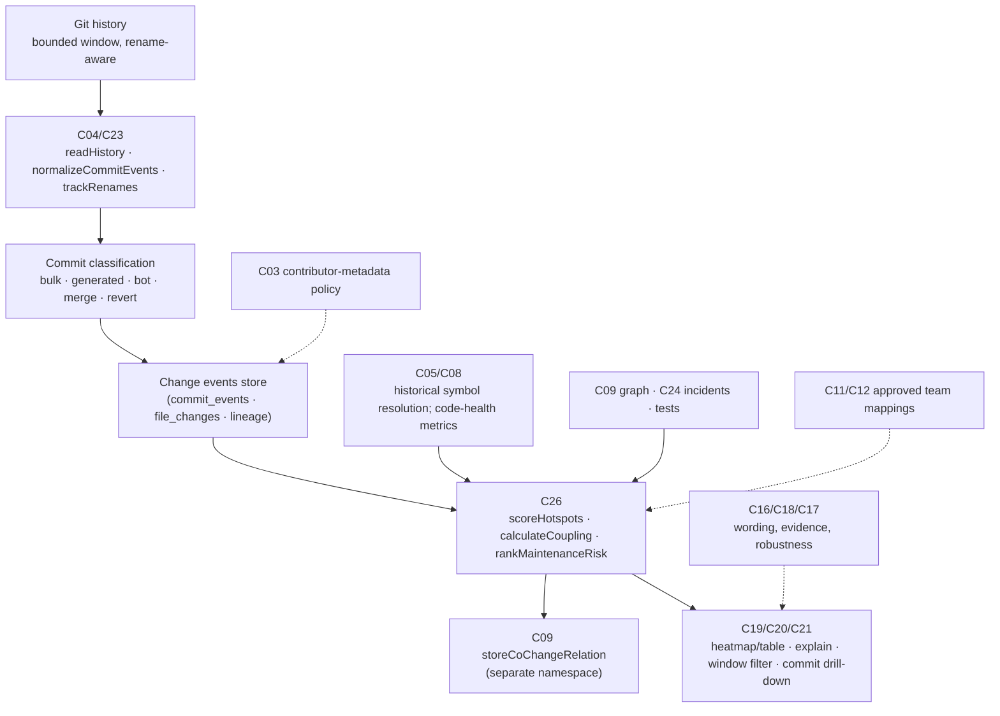
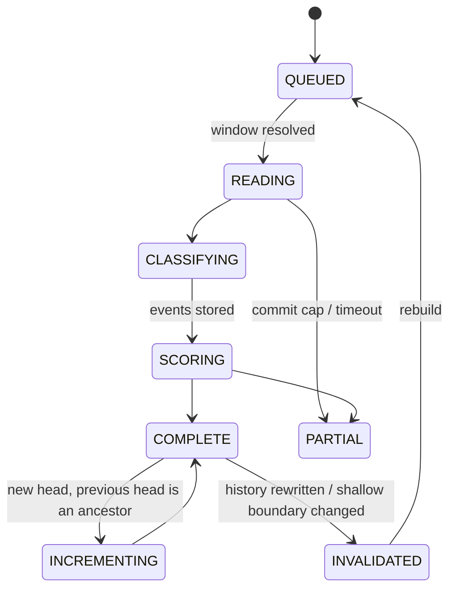

# F06 — Historical hotspots and change coupling

Detailed design · Version 1.0 · 4 October 2026 · Proposed implementation specification

Source: `Competitive_Features_Component_Implementation_Guide.md` §3, §9, §14–§17. Repository evidence observed at commit `8b07b5e`.
Priority P2. First deliverable: Git-history evidence with explainable ranking.

---

## 1 Purpose, user experience and status

### 1.1 The experience this feature exists for

| User asks | Product should deliver |
|---|---|
| "What should we refactor first?" | Hotspots ranked using change frequency, code health and impact |

```
Hotspots · payments-api · history 2025-10-04 → 2026-10-04 (412 commits analysed, 38 excluded)  · preset: refactor           score policy v3

  #  File                                  Score  Change freq.        Code health        Impact (dependents · incidents · tests)      Knowledge
  1  src/ledger/ledger.ts                  0.81   31 changes (high)   long fns, nesting   17 dependents · 2 incidents · 54 % covered   1 active author
  2  src/payments/payment-service.ts       0.74   27 changes          1 fn = 142 lines    11 dependents · 1 incident  · 71 % covered   3 authors
  3  src/jobs/reconciler.ts                0.58   12 changes          ok                  4 dependents  · 0 incidents · 12 % covered   2 authors
  Ranking stability: the top 5 are the same in 9 of 10 re-rankings with weights varied ±20 %.

  Change coupling for #1 ledger.ts (statistical, not a dependency):
     src/payments/capture-worker.ts   changed together in 14 of 31 commits (45 %) · lift 6.2 · also a static dependency
     src/db/migrations/2026_09.sql    changed together in  9 of 31 commits (29 %) · lift 3.4 · NO static dependency  ← hidden coupling worth a look
  Excluded from the counts:  26 bulk-format/rename commits, 9 dependency-bump commits, 3 revert pairs   [show]
  What this does not tell you: a score is a prioritisation heuristic, not a defect probability. Co-change shows files that tend to change together, not that one depends on the other.
```

### 1.2 What "done" means for the user

1. A rename does not silently reset a file's history (F06-A1).
2. A bulk reformatting commit cannot dominate the ranking without being disclosed (F06-A2).
3. A coupling edge always shows its **support count** (F06-A3).
4. The same history and policy always give the same score (F06-A4).
5. Every ranking exposes its contributing factors and the supporting commits (F06-A5).
6. Ownership data respects authorization and is never presented as individual productivity (F06-A6).

### 1.3 Status

**Proposed implementation specification.** A first version of "change risk" exists as the V16 terrain form, which composes five normalised factors per file. Its *churn* input is a bare commit count over the last 500 commits; it follows no renames, ignores merge and bulk-commit effects, has no time window and no coupling analysis. This document replaces that input with a history evidence store and adds explainable coupling.

---

## 2 Scope, non-goals and first delivery boundary

### 2.1 In scope

- A bounded, incremental ingestion of Git history into **change events**, with rename tracking, merge policy, bulk/generated/automated-commit classification and a stated history boundary.
- **Change frequency** per file (and, for top candidates, per function), with time decay.
- **Code-health signals** computed from the code at the analysed revision.
- **Impact signals** from the static graph, runtime evidence (F05, incidents) and tests.
- **Change coupling** between files with support, confidence and lift.
- A reproducible, explainable ranking (the V16 formula pattern extended), with sensitivity analysis.
- Drill-down to the commits behind every number.

### 2.2 Non-goals

- Predicting defects. The guide is explicit: a score is a prioritisation heuristic, "not a defect probability unless independently calibrated".
- Evaluating people. Authorship counts feed *knowledge concentration*, not performance.
- Learning from issue trackers or code review text (out of scope; F02/F07 produce such evidence later).
- Whole-organisation analytics dashboards.

### 2.3 First delivery boundary

One repository (the architecture admits several), file-level hotspots and file-level coupling, a 12-month default window, a transparent code-health model of four signals (function length, cyclomatic complexity, nesting depth, file size), impact from the existing graph and incidents, presets (default, refactor, security, incident — the existing V16 presets). Function-level history for the top 20 files only, through the existing `symbolLog`.

---

## 3 Current state in this repository

### 3.1 What exists (observed)

| Capability | Where | What it does | Class |
|---|---|---|---|
| Per-file history facts | `crates/worker/src/index.rs` `git_history` | `git log --name-only --no-renames -n 500` aggregated per file: commits, last commit/author/date/subject, distinct authors; stored as a `history` fact | EXISTING_EXTEND (replace) |
| Read-only git helpers | `gitinfo.ts` (`fileLog`, `authorCounts`, `recentCommits`, `symbolLog`, `forgeRefs`, `codeowners`, `teamMembers`) | Commands run without a shell, with timeouts, read-only; `fileLog` uses `--no-renames`; `forgeRefs` finds `(#123)` / `#42` in subjects | EXISTING_EXTEND |
| Change-risk terrain | `forms/terrain.ts` (`FACTORS`, `PRESETS`, `buildTerrain`), web `TerrainView.tsx` | Five factors (coupling, churn, incidents, test gap, thin knowledge) min-max normalised; missing data = neutral 0.5 flagged and hatched; weights are sliders; the formula is shown; labelled a composite, never a fact | EXISTING_EXTEND |
| Static coupling | `graph.ts`, `forms/common.ts` (`flowGraph`) | Call/async link degree per file | EXISTING_REUSE |
| Ownership form | `forms/ownership.ts`, `gitinfo.ts` | CODEOWNERS plus de facto owners from author counts; marked as inference | EXISTING_REUSE |
| Archaeology | `history.ts` (`archaeology`), `symbolLog` | Commits for an entity with `precise` flag | EXISTING_REUSE |
| Canonical identity | `registry.ts` | Stable ids across rename/move/split/merge at the *symbol* level | EXISTING_REUSE (symbol-level rename continuity) |
| Test coverage and incidents | `testartifacts.ts`, `hotness.ts` | Per-file coverage; reported-exception hotness | EXISTING_REUSE |
| Access policy | `access.ts` | Denied paths invisible | EXISTING_REUSE |
| Graph kinds | `graph.ts` `DEFAULT_KINDS = ["calls","async-flow"]` | Default projections include only static relations | EXISTING_REUSE (co-change must stay out of these) |

### 3.2 Verified gaps

| Gap | Evidence | Consequence |
|---|---|---|
| History follows no renames | `--no-renames` in `index.rs` and `gitinfo.ts` | A renamed file starts at zero commits (violates F06-A1) |
| History is capped and unwindowed | `-n 500` | No "last 12 months"; old busy files and new files are not comparable |
| No bulk/format/merge/bot handling | Not present | A single formatting commit counts like any change (F06-A2) |
| No time decay | Not present | Ancient churn weighs the same as last week's |
| No co-change analysis | Not present | New (F06 core) |
| No code-health metrics | The worker records symbols, calls, throws; no complexity, nesting or length metrics | NEW from the AST in the worker |
| History boundary not recorded | The `history` fact has no commit range or shallow-clone flag | Results not reproducible; shallow clones silently understate history |
| Churn normalised by repository maximum | `terrain.ts` `maxH` | One outlier compresses everyone else; scores shift when unrelated files change |

### 3.3 Not verified

- Time and memory for `git log` with rename detection (`-M`) on a very large repository.
- How often real repositories use `.git-blame-ignore-revs`.
- The proportion of squash-merge versus merge-commit workflows in target users' repositories (affects §7.2 grouping).

---

## 4 Architecture and ownership



### 4.1 Responsibilities

| Component | Responsibility | Functions | Class |
|---|---|---|---|
| C04/C23 | Ingest bounded Git history, rename mappings, merge policy; derive per-file/function change events | `readHistory`, `normalizeCommitEvents`, `trackRenames` | EXISTING_EXTEND (`gitinfo.ts`) + NEW |
| C05/C08 | Resolve historical changes to symbol identities; disclose unavailable historical semantic resolution | — | EXISTING_EXTEND (`Registry`, `symbolLog`) |
| C26 | Change frequency, code-health signals, co-change statistics; store numerator, denominator, sample size and formula version | `scoreHotspots`, `calculateCoupling`, `rankMaintenanceRisk` | EXISTING_EXTEND (`buildTerrain` factors) + NEW |
| C09 | Co-change edges separate from static dependencies and runtime causal edges | `storeCoChangeRelation` | NEW (separate table and kind) |
| C11/C12 | Optionally approved team/domain mappings; authorship is not productivity | — | EXISTING_REUSE (`collab.ts`, `teamMembers`) |
| C19/C20/C21 | Heatmap/table; explain ranking; filter history window; drill into commits | — | EXISTING_EXTEND (`TerrainView`) |
| C16/C18/C17 | Wording, evidence, ranking robustness; evaluation on histories with known rename/merge/churn cases | — | EXISTING_EXTEND |
| C07/C31/C32/C03 | Cache by history boundary and policy; incremental processing; restrict contributor metadata | — | EXISTING_EXTEND |

---

## 5 Reconciliation with existing contracts

| Guide | Repository | Decision |
|---|---|---|
| `C26.analyzeHistory(ctx,{repositoryIds, since, until, mergePolicyHash, generatedCodePolicyHash, scoringPolicyHash}) -> Job<Outcome<HotspotReport>>` | `C26/detect` is the defect job | Add `C26/analyzeHistory`; `JobKind` `"history-analysis"`; the three policy hashes are fields of one `HistoryPolicy` with a single `policyHash` |
| `C23.explainCoupling(ctx,{relationId, cursor}) -> Outcome<CommitEvidencePage>` | `C23` ops are `historyOps` | Add `C23/explainCoupling` and `C23/explainHotspot` |
| `V16 terrain` factors | `FACTORS`, `PRESETS` | The terrain form **keeps its contract**; its `churn` and `knowledge` factors now read from the history store through one function (`historyFactors`), and a new `health` factor is added behind a form version bump |
| Existing `history` fact `{commits, authors, last…}` | `facts` table, predicate `history` | Kept for compatibility (archaeology, ownership); the new store is additive and does not rewrite it |
| "A hotspot score is a prioritization heuristic" | Terrain caption: "a composite of measures, never a fact" | Same wording discipline carried to every new surface |

---

## 6 Data model

### 6.1 History boundary and identity

A **history boundary** pins what was analysed: `(repositoryId, headCommit, sinceTime, untilTime, shallow: boolean, commitCount, commitListHash)`. `commitListHash` is the SHA-256 of the ordered commit ids included. Every derived number carries `boundaryHash = H(boundary)`; two analyses with equal `boundaryHash` and `policyHash` must produce identical outputs (F06-A4).

### 6.2 Tables (proposed)

```sql
create table history_runs(
  run_id text primary key, repository_id text not null,
  head_commit text not null, since_time text, until_time text not null,
  shallow integer not null, commit_count integer not null,
  boundary_hash text not null, policy_hash text not null,
  worker_version text not null, state text not null, created_at text not null,
  unique(repository_id, boundary_hash, policy_hash)
);

create table commit_events(
  repository_id text not null, commit_hash text not null,
  author_hash text not null,                    -- HMAC of the email with a tenant key; names are not stored here
  committed_at text not null, parent_count integer not null,
  files_changed integer not null, insertions integer not null, deletions integer not null,
  class text not null,                          -- NORMAL | BULK | FORMAT | RENAME_ONLY | MERGE | BOT | REVERT | REVERTED | GENERATED_ONLY
  class_reason text not null,                   -- why: 'touches 312 files, additions≈deletions'
  logical_change_id text not null,              -- PR number, merge group, or the commit itself
  pr_number integer,
  primary key(repository_id, commit_hash)
);

create table file_changes(
  repository_id text not null, commit_hash text not null,
  path text not null, old_path text, status text not null,         -- A | M | D | R | C | T
  similarity integer,                                                -- for R/C
  insertions integer, deletions integer, generated integer not null,
  primary key(repository_id, commit_hash, path)
);

create table file_lineage(                       -- continuity across renames and moves
  repository_id text not null, lineage_id text not null,
  path text not null, valid_from_commit text not null, valid_to_commit text,
  primary key(repository_id, lineage_id, path, valid_from_commit)
);

create table hotspot_scores(
  run_id text not null, lineage_id text not null, path text not null,
  changes_raw integer not null, changes_decayed real not null,
  logical_changes integer not null, distinct_contributors integer not null,
  health_json text not null,                    -- the individual code-health signals and their values
  impact_json text not null,                    -- dependents, incidents, coverage, runtime hotness
  factors_json text not null,                   -- every factor: raw, normalised, missing flag, weight, contribution
  score real not null, rank integer not null, formula_version text not null,
  primary key(run_id, lineage_id)
);

create table cochange_edges(
  run_id text not null, a_lineage text not null, b_lineage text not null,
  support integer not null,                     -- logical changes touching both
  count_a integer not null, count_b integer not null, total_changes integer not null,
  confidence_a_to_b real not null, confidence_b_to_a real not null,
  lift real not null, jaccard real not null, first_seen text not null, last_seen text not null,
  static_dependency text not null,              -- NONE | A_TO_B | B_TO_A | BOTH   (from the graph at the head)
  primary key(run_id, a_lineage, b_lineage)
);
create index cochange_support on cochange_edges(run_id, support desc);

create table history_exclusions(                -- every excluded commit is listed, never silently dropped
  run_id text not null, commit_hash text not null, reason text not null, rule text not null,
  primary key(run_id, commit_hash)
);
```

`author_hash` is deliberate: contributor identity is stored as a keyed hash so analyses and aggregates (distinct contributors, bus factor) work without storing names or emails in the analytical tables; display names are resolved at read time only for principals authorised to see them (§10).

### 6.3 Why `cochange_edges` is separate from `relationships`

The static graph (`relationships`, kinds `calls`, `async-flow`, `imports`…) is **revision-bound structural fact**. Co-change is **history-bound statistics**: it has no evidence span, depends on a window, and changes meaning when the window changes. Mixing them would let a query for "dependents" return files that merely changed together. The projection functions use `DEFAULT_KINDS = ["calls","async-flow"]`; co-change is stored in its own table and exposed through its own operation, with `C09.storeCoChangeRelation` writing to it and nothing else.

---

## 7 Algorithms

### 7.1 Reading history

- **Window.** Default `since = until − 12 months`, `until = head commit date`; user-selectable (3/6/12/24 months, all). A hard cap on commits (proposed 20,000) with disclosure when it bites.
- **Shallow repositories.** Detect `git rev-parse --is-shallow-repository`; a shallow clone makes history incomplete **by construction**: the report states "history is truncated at <date>; scores are lower bounds" and the boundary records `shallow: true`. The scoring still runs, but the first line of every surface carries the warning.
- **Command.** One streaming `git log --no-color --find-renames=50% --name-status --numstat --date=iso-strict --format=…` per window, parsed incrementally (the existing pattern in `gitinfo.ts`: no shell, timeout, `maxBuffer`; for very large output the worker streams instead of buffering). Rename threshold is a policy value.
- **Merges.** Policy `mergePolicy ∈ {FIRST_PARENT, ALL_NO_MERGE_DIFFS, SQUASH_ONLY}`: `FIRST_PARENT` follows mainline (each PR = one logical change), `ALL_NO_MERGE_DIFFS` includes feature-branch commits but excludes the merge commits' own diffs (`-m` not used, so merge commits contribute no file changes), `SQUASH_ONLY` assumes squash-merge workflows. The default is chosen by a **detector** (share of merge commits vs `(#NNN)` squash subjects) and the choice is displayed; it is part of `policyHash`.
- **Incremental.** Store the boundary; on a new head, if the previous head is an ancestor of the new head (`git merge-base --is-ancestor`), read only `prev..head` and append; if not (force push, rebase), the boundary is invalid and the window is rebuilt, with the reason logged. Cache by `(boundaryHash, policyHash)`.

### 7.2 Logical changes

Commits are not the unit of change; a developer's *intent* is. `logical_change_id`:

1. If the commit message or merge links to a **PR/issue number** (`forgeRefs`), group all commits with the same PR into one logical change.
2. Else a **merge group**: commits reachable from a merge's second parent but not the first.
3. Else the commit itself.

Counting logical changes (not raw commits) prevents a developer who commits twenty times on a feature branch from inflating the file's "change frequency". Both numbers are stored and shown (`changes_raw`, `logical_changes`).

### 7.3 Classification and exclusion (F06-A2)

Each commit gets one class with a stated reason. Rules (all configurable, all listed in `history_exclusions` when they exclude):

| Class | Rule (proposed defaults) | Effect on change frequency |
|---|---|---|
| `BULK` | Touches more than **N** files (default 40) *and* more than 20 % of the tracked files in the window, or ≥ 5× the median commit size | Excluded; listed |
| `FORMAT` | Per-file `insertions ≈ deletions` for ≥ 80 % of files and the diff is whitespace/formatting-only under `git diff -w --stat` equality, **or** the commit is listed in `.git-blame-ignore-revs` | Excluded; listed |
| `RENAME_ONLY` | All file changes are renames with similarity ≥ 95 % | Counted for lineage, **not** for change frequency |
| `GENERATED_ONLY` | All touched files match the generated-file rules shared with F01 | Excluded |
| `BOT` | Author matches a configured bot pattern or subject matches dependency-bump conventions (`chore(deps)`, `Bump x from a to b`) | Excluded from frequency, counted separately ("9 dependency bumps") |
| `MERGE` | `parent_count > 1` | No file changes of its own (see merge policy) |
| `REVERT` / `REVERTED` | Subject `Revert "…"`, or a commit whose changes are exactly undone by a later revert | Pair excluded and listed (a change and its revert are noise, not two units of churn) |
| `NORMAL` | Everything else | Counted |

The default is **disclosure over deletion**: the report always shows "excluded N commits [show]" with the reason per commit, and the user can switch a rule off and see the ranking change. A *single* excluded commit never silently moves a rank: the "ranking effect" of exclusions is computed (rank with vs without) and shown for the top 10.

### 7.4 Rename and move tracking (F06-A1)

From `--name-status -M` build `file_lineage`: a rename `R<sim> old → new` at commit *c* ends `old`'s validity and starts `new`'s under the **same `lineage_id`**; copies (`-C`) start a new lineage with a `copied_from` annotation (not merged). Counting aggregates **by lineage**, not path, so a file's history follows it through moves. Limits stated in the UI: rename detection is heuristic (similarity threshold; splits and merges of files are not followed beyond copy detection); at the *symbol* level, `Registry` already carries identity across renames/splits/merges for the revisions that were indexed — history before the first indexed revision is **not** resolved to symbols ("historical semantic resolution unavailable" is a stated gap, per the guide).

### 7.5 Change frequency with time decay

For each lineage, over the window, with counted logical changes `c_1…c_n` at times `t_i`:

```
changesRaw      = n
changesDecayed  = Σ_i 0.5 ^ ((until − t_i) / halfLife)        halfLife default 180 days (policy)
```

Both are stored. The score uses a **robust normalisation** that fixes the outlier-compression weakness of the current min–max by the repository maximum: values are converted to **percentile ranks within the analysed population** (so one extreme file does not flatten everyone else), with ties handled by mid-rank, and the raw numbers are always displayed beside the percentile.

### 7.6 Code health (transparent, versioned)

Computed from the **head** revision's AST in the worker (a new, small `metrics.rs`), at function and file level:

| Signal | Definition | Notes |
|---|---|---|
| Function length | Lines of the function body | |
| Cyclomatic complexity | 1 + decision points (`if`, loop, `case`, `catch`, `&&`, `||`, `?:`, `??`) | Per-language node-kind table, versioned |
| Nesting depth | Maximum block depth | |
| Parameter count | | Smells above a threshold |
| File size | Lines and symbol count | |
| Coverage gap | `1 − coverage%` from existing test artifacts | Missing → neutral and flagged |

File health = a **documented combination** of function-level signals (share of functions above thresholds and the worst function), not a hidden composite. Thresholds are policy values with defaults citing the well-known conventions for these metrics; they are tuned by the team, shown in the UI, and versioned (`formulaVersion`). The guide's phrase "code-health signals" is honoured by exposing each signal, **never only a single "health score"**; an aggregate exists for sorting and always shows its parts.

### 7.7 Impact

| Component | Source |
|---|---|
| Dependents | `dependents()` from `graph.ts` at the head revision (and, with F01, across repositories) |
| Incidents/runtime | `runtimeHotness` today; F05 profile hotness when present (marked with its basis) |
| Coverage | `testartifacts.ts` |
| Knowledge concentration | Distinct contributors in the window **and** share of changes by the top contributor (bus-factor proxy), counted from `author_hash`; CODEOWNERS shown separately |
| Blast radius label | `high` when dependents exceed the repository's own 90th percentile — a relative statement, shown with the count |

Impact is intentionally **not** blended into "change frequency" or "health"; each stays a column.

### 7.8 Scoring and ranking

The existing terrain formula pattern is kept:

```
score = Σ_k w_k · factor_k  /  Σ_k w_k
factors = { change (percentile of changesDecayed), health (1 − healthPercentile), impact (percentile of composite impact),
            coupling (percentile of fan-out of co-change edges above threshold), knowledge (concentration) }
```

Each factor's **raw value, normalised value, weight, contribution and missing-data flag** are stored in `factors_json`; missing data is neutral 0.5 and flagged (as V16 already does). Weights are presets (default, refactor, security, incident) plus user sliders, and **a weight set is part of `policyHash`**, so reproducibility (F06-A4) holds for any chosen weights.

**Ranking stability (C17).** `rankStability(runId, perturbation=±20 %, trials=50, k=10)` re-ranks under random weight perturbations and window shifts (±1 month); the UI reports the fraction of trials whose top-*k* set equals the baseline top-*k* and lists which entries enter/leave. It is computed on the stored factors (cheap), deterministic through a fixed seed derived from `policyHash`.

### 7.9 Change coupling

Over the **logical changes** in the window, excluding classes `BULK`, `FORMAT`, `GENERATED_ONLY`, `BOT`, `REVERT*` and any logical change touching more than **K** files (default 30; K is policy):

```
support(a,b)      = |{logical changes touching both a and b}|
confidence(a→b)   = support / count(a)
lift(a,b)         = (support / total) / ((count(a)/total) · (count(b)/total))
jaccard(a,b)      = support / (count(a) + count(b) − support)
```

Report an edge only when `support ≥ minSupport` (default 5) **and** `confidence ≥ minConfidence` in at least one direction (default 0.3) **and** `lift > 1`; otherwise it is below the reporting floor and **not** shown as coupling. Every edge carries `support`, `count_a`, `count_b`, `total` — "14 of 31" — so small-sample claims are visible (F06-A3). Pair enumeration is bounded: only files with `count ≥ minSupport` participate, and pairs are generated per logical change with the K cap, keeping complexity roughly O(Σ k²) over changes with k ≤ K.

**Static dependency annotation.** Each edge records whether a static dependency exists in the graph at the head (`NONE`/`A_TO_B`/`B_TO_A`/`BOTH`). Co-change **without** a static dependency is surfaced as "hidden coupling (statistical)" — often configuration/SQL/test pairs, a different kind of risk from a call. It is never merged into the static graph (§6.3).

**Statistical care.** Many pairs are tested implicitly; the floor (`minSupport`, `lift`) limits false discoveries but does not eliminate them. The UI says so in one sentence and shows the support rather than a bare percentage. Co-change between a file and a **lockfile or changelog** is filtered by a built-in "ubiquitous file" list (files in more than 25 % of logical changes), listed in the exclusions.

### 7.10 Explaining (F06-A5)

`explainHotspot(lineage)` returns: the factor table with raw and normalised values; the **counted logical changes** (paged, newest first) with commit hashes, dates, subjects, PR numbers and class; the **excluded** commits touching the file with their reasons; and a "what would change the rank" panel (rank without each exclusion class, with each factor removed). `explainCoupling(edge)` returns the logical changes where both files changed (paged), so the "14 of 31" opens into 14 commits.

---

## 8 API contracts

```typescript
type HistoryPolicy = {
  window: { since?: string; until?: string; months?: number };
  mergePolicy: 'AUTO' | 'FIRST_PARENT' | 'ALL_NO_MERGE_DIFFS' | 'SQUASH_ONLY';
  rename: { enabled: boolean; similarityPercent: number };
  exclusions: { bulk: { files: number; shareOfTracked: number }; format: boolean; botPatterns: string[]; generated: boolean; revertPairs: boolean };
  decay: { halfLifeDays: number };
  coupling: { minSupport: number; minConfidence: number; maxFilesPerChange: number; ubiquitousShare: number };
  health: { thresholds: Record<string, number>; formulaVersion: number };
  weights: { preset: 'default'|'refactor'|'security'|'incident'|'custom'; custom?: Record<string, number> };
  contributors: 'HIDDEN' | 'COUNTS_ONLY' | 'NAMES_FOR_AUTHORISED';
};

C26/analyzeHistory(ctx, { repositoryIds: string[], policy: HistoryPolicy }) -> ApiResult<JobView>       // job kind 'history-analysis'; idempotent on (boundaryHash, policyHash)
C26/getHotspotReport(ctx, { runId, order?: 'SCORE'|'CHANGES'|'HEALTH'|'IMPACT', filter?: PathFilter, cursor?, limit? })
  -> ApiResult<{ boundary: HistoryBoundaryView; policyHash: string; rows: HotspotRow[]; exclusions: ExclusionSummary;
                 stability: { topK: number; stableFraction: number; changes: { entered: string[]; left: string[] }[] };
                 coverage: { shallow: boolean; commitCount: number; cappedAt?: number; symbolResolution: 'FILE_ONLY'|'FILE_AND_TOP_SYMBOLS'; gaps: string[] };
                 nextCursor?: string }>
C23/explainHotspot(ctx, { runId, lineageId, cursor?, limit? }) -> ApiResult<{ factors: FactorExplanation[]; changes: CommitEvidence[]; excluded: ExcludedCommit[]; sensitivity: RankSensitivity; nextCursor?: string }>
C23/explainCoupling(ctx, { relationId, cursor?, limit? }) -> ApiResult<{ support: number; countA: number; countB: number; total: number; commits: CommitEvidence[]; staticDependency: string; nextCursor?: string }>
C26/listCoupling(ctx, { runId, forLineage?: string, minSupport?: number, cursor?, limit? }) -> ApiResult<{ edges: CouplingEdgeView[]; nextCursor?: string }>
C26/rankStability(ctx, { runId, perturbationPercent?: number, trials?: number, topK?: number }) -> ApiResult<RankStabilityView>
```

```typescript
type HotspotRow = {
  lineageId: string; path: string; renamedFrom?: string[];
  score: number; rank: number;
  change: { raw: number; logical: number; decayed: number; percentile: number };
  health: { signals: { id: string; value: number; threshold: number; status: 'OK'|'ABOVE'|'MISSING' }[]; worstFunction?: { name: string; value: number } };
  impact: { dependents: number; incidents: number | 'NOT_AVAILABLE'; coveragePercent: number | 'NOT_AVAILABLE' };
  knowledge: { contributors: number | 'HIDDEN'; topContributorShare?: number };
  missing: string[];                       // factors that fell back to neutral
};
```

Errors: `INSUFFICIENT_EVIDENCE` when the repository is not a git work tree (the existing `isGitRepo` check) — a normal explanation, not a crash; `RESOURCE_LIMIT` when the commit cap bites (partial results flagged); `FORBIDDEN` for contributor names without permission; `STALE_REVISION` when the boundary no longer matches the repository (history rewritten).

---

## 9 States and lifecycles



---

## 10 Authorization, egress and privacy (F06-A6)

- **Contributor metadata is sensitive.** Analytical tables hold only `author_hash` (keyed hash). `contributors` policy: `HIDDEN` (counts suppressed), `COUNTS_ONLY` (default: "3 contributors, top contributor made 62 % of changes"), `NAMES_FOR_AUTHORISED` (principals holding a named role may resolve hashes to display names through the existing ownership resolution).
- **Not a productivity measure.** No per-person ranking is produced anywhere; no UI sorts by author; the wording rules forbid "most/least productive". Team mapping (C11/C12) is used only when approved, and rolls contributors up to teams.
- **Access policy.** Paths under denied prefixes are excluded from rankings and from counts shown to the principal (counted as "N files not shown").
- **Egress.** Everything runs locally. Commit messages and authors are never sent to a hosted model (existing rule: "git history … never sent"). Narrative explanations of a hotspot use file paths, counts and factor names after redaction.
- **Retention.** `commit_events` and derived tables follow repository deletion propagation; `author_hash` keys are per tenant and rotated on request, which makes old hashes unlinkable.

---

## 11 Freshness, cancellation, idempotency, recovery

- Runs are idempotent on `(boundaryHash, policyHash)`.
- A new head makes the previous run `STALE` but still readable (history is append-mostly); the UI shows "analysed up to commit X (N commits behind)".
- Rewritten history invalidates the boundary (§7.1) and triggers a rebuild; the reason is logged and shown.
- Cancellation follows the job runner; partial results are never published as complete; late results from a superseded run are rejected.
- Crash: `RUNNING` runs are marked `FAILED` at start-up; commit and file rows are inserted idempotently by `(repository, commit)`.

---

## 12 Interface specification

### 12.1 Surfaces

1. **Hotspots view** — extends the existing V16 terrain form: a treemap (area = lines of code, colour = score, as today) and a **table** (primary, accessible). Header strip: history boundary, shallow warning, merge policy, policy version, "excluded N commits".
2. **Factor columns** — change frequency, code health signals, impact, knowledge; each cell shows the raw value and a bar; missing data is hatched *and* labelled "no data".
3. **Window and policy controls** — window selector; preset buttons (existing); sliders (existing); exclusion toggles with live "ranking effect".
4. **Explain drawer** — factor table, counted changes (paged), excluded commits with reasons, "what would change the rank".
5. **Coupling tab** — edges for the selected file with support ("14 of 31"), confidence, lift and a static-dependency badge; a "hidden coupling" filter; drill to the commits.
6. **Stability strip** — "Top 5 identical in 9 of 10 re-rankings"; click for the entries that move.
7. **Trend** — per-file monthly change counts sparkline (decayed and raw), from stored aggregates.
8. **Map hand-off** — selecting a file highlights it on the architecture map; the hotspot score is available as an overlay on the map.

### 12.2 Copy rules

- A score is "a prioritisation heuristic", never "risk of bugs" or "likelihood of failure".
- Co-change reads "tend to change together" and always shows support.
- Exclusions are stated in the same sentence as the number: "31 changes (26 bulk-format commits excluded)".
- Contributor wording is about knowledge concentration ("changes concentrated in 1 contributor"), never about performance.
- Shallow clone: first line of the view.
- Missing data: "no coverage data" — neutral value labelled as such.

### 12.3 States

Not a git repo: "This folder is not a Git repository, so history-based hotspots are unavailable." Analysing: stepper Read → Classify → Score with commit counts. Partial: cap or timeout named. Stale: "analysed up to <commit>; N newer commits." Rebuilding after history rewrite: reason shown.

### 12.4 Accessibility

The table is a true data table with sortable column headers (`aria-sort`); sorting is keyboard-operable; the treemap keeps its `role`/label pattern and an outline equivalent. Hatching is paired with text; severity is never colour alone. Drawers trap focus and return it on close. The stability strip is announced as text.

---

## 13 Performance and bounded work

Targets are proposals pending measurement on real repositories of small/medium/large history; record commit counts, file counts, machine and git version.

| Bound | Default |
|---|---|
| Commits per analysis | 20,000 (disclosed cap) |
| Files per logical change for coupling | K = 30 |
| Files eligible for coupling | `count ≥ minSupport` |
| Pairs reported per file | top 20 by support |
| Function-level history | top 20 files only |
| Explain pages | 50 commits per page |
| Rank-stability trials | 50, seeded |

Incremental reads make steady-state cost proportional to *new* commits; a full rebuild occurs only on rewritten history or policy change that affects classification.

---

## 14 Failure modes

| Failure | Behaviour |
|---|---|
| Repository is shallow | Boundary flagged; warning on every surface; scores labelled lower bounds |
| Not a git work tree | `INSUFFICIENT_EVIDENCE` explanation |
| History rewritten | Boundary invalidated, rebuild, reason shown |
| Huge repository | Commit cap with disclosure; analysis of the most recent commits |
| File split or merged | Lineage follows renames only; the report states that splits/merges are not followed |
| Squash vs merge workflows mixed | Merge-policy detector reports the mix; the policy is displayed and overridable |
| Mailmap/identity changes | Contributors keyed by hashed email after applying `.mailmap`; unresolved aliases lower the distinct-contributor count — stated |
| Large generated churn | Generated rules exclude; listed |
| Forged/odd commit dates | Dates are as recorded; the decay uses committer date and the report notes out-of-order dates when detected |
| Missing coverage/incident data | Neutral 0.5, hatched, labelled |
| Contributor policy `HIDDEN` | Knowledge factor shown as "not available to you", neutral in the score for *display*, with the true value used in scoring only if the policy allows scoring on hidden data (default: the score uses the true value; the *display* is hidden) — stated in the UI |

---

## 15 Test plan

### 15.1 Acceptance (from the guide)

| ID | Test | Fixture |
|---|---|---|
| F06-A1 | A rename does not reset history silently | Scripted repository: `a.ts` with 10 commits, renamed to `b.ts` (similarity 100 %, and a second case at 60 %), then 5 more commits. Assert one lineage, 15 changes; assert the 60 % case follows at the configured threshold and **not** below it, with the limitation shown |
| F06-A2 | Bulk formatting cannot dominate rankings without disclosure | One commit reformatting 200 files plus normal history: assert it is excluded, listed with its reason, the ranking effect is shown, and switching the rule off reproduces the dominated ranking |
| F06-A3 | Small-sample coupling shows support count | Pair with support 3 (below floor) and pair with support 14: only the second is reported; its row shows `14 of 31`; the first appears only under "below reporting floor" with its count when requested |
| F06-A4 | Score is reproducible under the same policy | Run twice, on two machines; assert byte-identical `hotspot_scores` and `cochange_edges`; change one weight → new `policyHash`, different output |
| F06-A5 | Each ranking exposes contributing factors and commits | For every top-10 row, `explainHotspot` returns factors whose weighted sum equals the score and the counted commits whose number equals `logical_changes` |
| F06-A6 | Ownership metadata respects authorization | As an unauthorised principal: contributor names absent from every response and from UI text; counts only; as an authorised one: names present; assert no endpoint exposes per-person rankings |

### 15.2 Design-level checks

| ID | Test |
|---|---|
| F06-D1 | `.git-blame-ignore-revs` listed commits are classified `FORMAT` |
| F06-D2 | Change + its revert are excluded as a pair |
| F06-D3 | Squash-merge history groups by PR; multi-commit PR counts once |
| F06-D4 | Shallow clone sets `shallow: true` and prints the warning |
| F06-D5 | Incremental run (append) equals a clean full run on the same final head (like the indexer's parity requirement) |
| F06-D6 | Force-push invalidates the boundary and triggers a rebuild |
| F06-D7 | Lift/confidence formulas against a hand-computed table |
| F06-D8 | Ubiquitous files (lockfile) excluded from coupling and listed |
| F06-D9 | Percentile normalisation: adding one extreme outlier does not change other files' relative order |
| F06-D10 | Rank stability is deterministic for a given policy and seed |
| F06-D11 | Co-change edges are absent from `project`/`dependents` results (graph isolation) |
| F06-D12 | Keyboard-only: sort, open explain, page commits, open a coupling edge |

Mutation controls: remove rename tracking → A1 fails; disable bulk exclusion → A2 fails; drop the support floor → A3 fails; make the output depend on iteration order → A4 fails; return names regardless of policy → A6 fails. They are run and recorded.

### 15.3 Real-input evaluation

Run on this repository's own history and on at least two open-source repositories of different sizes and workflows (squash and merge-commit), recording commit-list hashes and git versions. **Exploratory validation only:** compare the top-ranked files with files touched by later commits whose subjects indicate bug fixes, report the overlap as a *measurement with its limitations* (subject keywords are noisy), and state that no calibration claim is made (the guide: not a defect probability unless independently calibrated).

---

## 16 Work packages

| WP | Title | Depends on | Size | Result |
|---|---|---|---|---|
| WP-01 | Fixture factory: scripted git histories (rename, bulk, bot, revert, merge/squash, shallow) | — | M | Deterministic test repos |
| WP-02 | History reader: windowed, rename-aware, streaming, incremental, shallow detection; boundary hash | WP-01 | L | `commit_events`, `file_changes`, `file_lineage` |
| WP-03 | Logical-change grouping and commit classification with exclusion ledger | WP-02 | M | `history_exclusions`, F06-A2 |
| WP-04 | Change frequency with decay and percentile normalisation; replace terrain `churn` input | WP-02 | M | Scores with parity tests vs V16 on a baseline |
| WP-05 | Code-health metrics in the worker (`metrics.rs`) | — | L | Health signals per function/file |
| WP-06 | Impact assembly (dependents, incidents, coverage, knowledge) with contributor policy | WP-02 | M | `impact_json`, F06-A6 |
| WP-07 | Scoring policy, presets, `factors_json`, reproducibility, rank stability | WP-04, WP-05, WP-06 | M | F06-A4, D10 |
| WP-08 | Co-change engine, `cochange_edges`, static-dependency annotation, graph isolation | WP-03 | L | F06-A3 |
| WP-09 | `explainHotspot`/`explainCoupling`, APIs, paging | WP-07, WP-08 | M | F06-A5 |
| WP-10 | Hotspots UI: table, explain drawer, coupling tab, stability strip, trend, a11y | WP-09 | L | Interface in §12 |
| WP-11 | Function-level history for top files via `symbolLog` | WP-04 | S | Symbol drill-down |
| WP-12 | Real-input evaluation, mutation controls, ledger items | all | M | F06-A1…A6 green |

---

## 17 Migration, rollout and compatibility

- Additive tables; the existing `history` fact stays so archaeology and ownership are unchanged.
- The terrain form gains `formulaVersion`; with the new store absent it behaves exactly as today. A flag `history.v2` switches terrain's `churn` and `knowledge` factors to the new store; a **parity report** (old vs new ranking on a repository without renames/bulk commits) is generated first so differences are understood before users see them.
- `JobKind` gains `"history-analysis"`.
- Default contributor policy is `COUNTS_ONLY`.

---

## 18 Risks and open decisions

| ID | Decision / risk | Options | Recommendation |
|---|---|---|---|
| D1 | Unit of change | Commit / logical change | Logical change (PR/merge group), raw shown too |
| D2 | Normalisation | Min–max / percentile | Percentile, raw alongside |
| D3 | Merge policy default | Fixed / auto-detect | Auto-detect, displayed and overridable |
| D4 | Rename threshold | 50 % / higher | 50 % default, policy value, stated limits |
| D5 | Code-health model | Single index / exposed signals | Exposed signals plus a sortable aggregate with parts shown |
| D6 | Contributor display default | Names / counts | Counts only |
| R1 | A score is read as defect probability | Wording rules, no probability language |
| R2 | Co-change false discoveries | Support/lift floors, support always shown |
| R3 | History cost on huge repos | Cap, incremental, disclosure |
| R4 | Gaming (splitting commits) | Logical-change grouping and PR-level counting reduce but do not remove it; stated |
| R5 | Misuse for performance reviews | No per-person views; contributor policy; wording |

---

## 19 Definition of done

F06 is done when, on real repositories, the ranking follows renames, discloses and controls bulk/format/bot/revert effects, shows support for every coupling edge, is reproducible for a given boundary and policy, explains itself down to the commits, keeps co-change out of the static graph, and respects contributor authorization; F06-A1…A6 pass with their mutation controls recorded; the real-input evaluation is reported as measurement with its limits; and the ledger holds named tests for each item.

## 20 References

- Guide §3, §9 (F06), §14, §16, §17.
- Repository: `crates/worker/src/index.rs` (`git_history`), `packages/core/src/{gitinfo,history,registry,graph,hotness,testartifacts,access}.ts`, `packages/core/src/forms/{terrain,ownership}.ts`, `apps/web/src/TerrainView.tsx`.
- Competitor reference (guide §18): CodeScene hotspots documentation.
- Git documentation: `git log` rename detection, `--first-parent`, `blame.ignoreRevsFile`.
