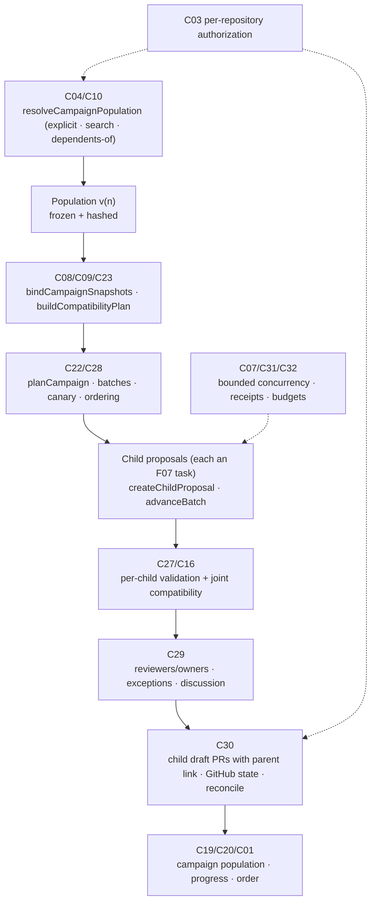
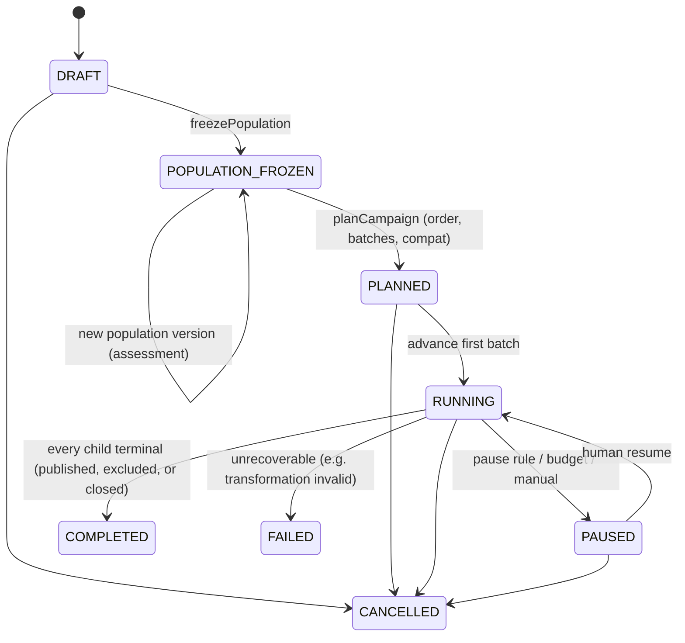

# F08 — Coordinated multi-repository changes

Detailed design · Version 1.0 · 4 October 2026 · Proposed implementation specification

Source: `Competitive_Features_Component_Implementation_Guide.md` §3, §11, §14–§17. Repository evidence observed at commit `8b07b5e`.
Priority P3. First deliverable: a parent campaign with independently reviewable child proposals.

---

## 1 Purpose, user experience and status

### 1.1 The experience this feature exists for

| User asks | Product should deliver |
|---|---|
| "Fix this across our services." | Reviewable per-repository patches, validation results and tracked PRs |

```
Campaign  "Migrate @acme/payments-client 2.x → 3.x (createPayment now takes an options object)"          v4 · population v2 (frozen 11:20)
 Transformation: recipe "payments-client-3" v1.2 (hash 6be1…)  ·  validated per repository  ·  nothing is merged by CIE
 Order: producer first, then consumers in canary batches          Batch 1 (canary, 2 repos) → Batch 2 (6) → Batch 3 (rest)

 Batch 1 — canary                                        proposal            validation              PR                         gate (F02)
   billing-worker   owner @pay-core                      ✓ ready (9 files)    ✓ passed (3 runs)       #218 draft · open          ✓ PASS
   refunds-api      owner @pay-core                      ✓ ready (4 files)    ✗ 2 tests failed        —  (not published)         —
 Batch 2 — waiting for batch 1 (pause rule: ≥ 1 failure in a canary batch)
   web-checkout     owner @storefront                    · not started
   …
 Joint compatibility: payments-api@candidate + billing-worker@candidate  ✓ builds and passes the shared contract tests   [rm-77]
 Population: 8 repositories selected by "depends on @acme/payments-client" · 1 added after freeze (mobile-bff) → needs assessment   [review change]
 You can see 8 repositories in this campaign.   (Repositories you are not allowed to see are not counted here.)
 Reminder: there is no atomic transaction across PRs. Merge order and a revert plan are listed under "Order and rollback".
```

### 1.2 What "done" means for the user

1. Mixed outcomes stay **mixed**: some repositories pass, some fail, none is averaged away (F08-A1).
2. Adding a repository to the population changes the **population version** and requires an assessment before it can proceed (F08-A2).
3. A child whose base moved is `STALE` **independently**; the rest continue (F08-A3).
4. A partial publication retries **only** the unpublished children (F08-A4).
5. Incompatible producer/consumer versions **fail the joint check** (F08-A5).
6. The campaign respects per-repository access and does not leak counts of repositories a viewer may not see (F08-A6).

### 1.3 Status

**Proposed implementation specification.** Nothing in the repository today models a population of repositories, a campaign, or cross-repository ordering. It does contain every building block for *one* repository: exact validated candidates and idempotent draft-PR publication (F07's base, `changes.ts`, `defect-workflow.ts`), package identity and cross-repository edges (designed in F01/F04), collaboration principals (`collab.ts`) and per-tenant isolation (`tenants.ts`). F08 is deliberately last (P3): it multiplies a path that must first work for one repository.

---

## 2 Scope, non-goals and first delivery boundary

### 2.1 In scope

- A **campaign**: a parent record with a transformation, a **frozen, versioned population**, a batch policy and a compatibility plan.
- **Independent children**: one candidate, one validation, one review, one PR per repository (each is an F07 task).
- Ordering by dependency (producer before consumers), **canary batches** and pause rules.
- **Joint compatibility** checks for producer/consumer pairs.
- Reviewer/owner assignment, per-child exceptions and discussion; no child can approve another.
- Tracking of GitHub state per child, reconciliation of partial publication, explicit rollback planning.
- Budgets and bounded concurrency across the whole campaign.

### 2.2 Non-goals

- **Atomicity across repositories.** The guide states it plainly: "There is no atomic transaction across independent GitHub PRs." CIE does not pretend otherwise and does not merge.
- Automatic revert. A revert is itself a new reviewed change (a new campaign or child), never an implied undo.
- Reusing validation across repositories. A certificate belongs to exactly one diff on one base.
- Cross-tenant campaigns.
- Changing external systems (databases, deployments, schemas). Where a campaign depends on one, it is listed as a manual step, not automated.

### 2.3 First delivery boundary

One ecosystem (npm/TypeScript) and one transformation kind (a deterministic **recipe** run in isolation per repository), a population of up to a few dozen repositories selected by *explicit list* or *depends on package X*, producer→consumer ordering with one canary batch, draft PRs on GitHub, joint compatibility through workspace linking. Model-authored per-repository changes (F07 `TASK` children) and other ecosystems follow.

---

## 3 Current state in this repository

### 3.1 What exists (observed)

| Capability | Where | What it does | Class |
|---|---|---|---|
| Single-repository exact candidate and validation | `changes.ts`, `defect-workflow.ts`, `defect-isolation.ts` | Exact edits, binding, isolated validation, run manifests, approvals | EXISTING_REUSE (F07 makes it a task) |
| Idempotent draft-PR publication with grant | `defect-workflow.ts` `publishPullRequest` | Grant bound to base/head/diff; stale check; find-then-create | EXISTING_REUSE |
| Per-tenant isolation | `tenants.ts` (`TenantHost`, `allowedRoots`, members) | Database file and parser per tenant; a tenant may index only paths under its allowed roots | EXISTING_REUSE |
| Access policy | `access.ts` | Denied prefixes; revoked sources purged; "counted, never named" | EXISTING_EXTEND (needs repository-level scope) |
| Collaboration principals and access | `collab.ts` (`collab_principals`, `collab_access`, shares, handover with access gaps counted not shown) | People, roles, scoped access; the same "N hidden" rule | EXISTING_EXTEND |
| CODEOWNERS and teams | `gitinfo.ts` (`codeowners`, `ownersOf`, `teamMembers`) | Owner rules per repository | EXISTING_REUSE (reviewer assignment) |
| Events, outbox, notifications | `events.ts`, `exports.ts` (`Notifications`) | Durable events become notifications; one delivery per (event, subscription) | EXISTING_REUSE |
| Jobs | `jobs.ts` | One at a time, cancel before commit point | EXISTING_EXTEND (campaigns need bounded concurrency) |
| GitHub connector with rate-limit/credential states | `connectors.ts`, `gh.ts` | `HEALTHY/PARTIAL/EXPIRED/RATE_LIMITED/UNREACHABLE/NEVER_RUN`; resumes from a cursor | EXISTING_REUSE (campaign-wide rate-limit handling) |
| Dependency identity and edges (designed) | F01 `package_provides`/`cross_repo_edges`, F04 inventories | Producer/consumer relations | NEW (depends on F01/F04 deliverables) |

### 3.2 Verified gaps

| Gap | Evidence | Consequence |
|---|---|---|
| No repository population, campaign or batch concept | Nothing in `packages/core/src` | NEW (`campaigns`, `campaign_children`, `campaign_batches`) |
| Store and jobs are per repository root, one job at a time | `store.ts`, `jobs.ts` header | A campaign across N repositories needs queueing with priority and bounded concurrency; a worker pool is likely required at scale |
| No joint build/test across repositories | Not present | NEW joint-check runner |
| No campaign-wide budgets | Budgets exist per experiment (`ExperimentBudget`) | NEW global cost/time/token budget |
| Access policy is path-prefix per repository | `access.ts` | NEW repository-level visibility for population counts |
| GitHub write path is one PR at a time | `defect-workflow.ts` | NEW orchestration, ordering and reconciliation |

### 3.3 Not verified

- Indexing and validation cost for dozens of real repositories on one machine.
- How GitHub secondary rate limits behave when many draft PRs are created in a burst.
- Whether `TenantHost` can host the repository count a real organisation has without a worker pool.

---

## 4 Architecture and ownership



### 4.1 Responsibilities

| Component | Responsibility | Functions | Class |
|---|---|---|---|
| C04/C10 | Select an authorised repository population by selectors or search; freeze it before execution | `resolveCampaignPopulation` | NEW (uses F01 search and F04 package edges) |
| C08/C09/C23 | Capture each base revision and cross-repository compatibility relations | `bindCampaignSnapshots`, `buildCompatibilityPlan` | NEW (F01 `cross_repo_edges`) |
| C22/C28 | Parent campaign and independent child proposals; canary batches and dependency order | `planCampaign`, `createChildProposal`, `advanceBatch` | NEW orchestration over F07 |
| C27/C16 | Validate each child and required joint compatibility cases; never reuse a certificate across different diffs | — | EXISTING_EXTEND + NEW joint runner |
| C29 | Assign reviewers/owners, track exceptions and discussions; one child's change never silently approves another | — | EXISTING_EXTEND (`collab.ts`) |
| C30 | Publish child draft PRs with parent links; track GitHub state; reconcile partial publication | — | EXISTING_EXTEND |
| C07/C31/C32/C03 | Bound concurrency; persist receipts and retries; per-repository authorization and global budgets | — | EXISTING_EXTEND |
| C19/C20/C01 | Campaign population, completed/blocked/failed children, dependency order | — | NEW form |

---

## 5 Reconciliation with existing contracts

| Guide | Repository | Decision |
|---|---|---|
| `C28.createCampaign(ctx,{repositorySelector, transformationSpecHash, compatibilityPolicyHash, batchPolicy}) -> Outcome<Campaign>` | `changeOps` (`C28/*`) | Add `C28/createCampaign`, `C28/advanceCampaign` etc.; `Campaign` is a new entity; child proposals are existing `ChangeProposal`s referenced by id |
| `C28.advanceCampaign -> Job<Outcome<CampaignProgress>>` | `JobKind` | Add `"campaign-advance"` |
| Child certificate reuse | `PatchValidation` binds `baseHash`, `headHash`, `diffHash` | Already per diff; F08 adds the **rule** that a campaign never copies a `PatchValidation` between children (asserted by a test, F08-D1) |
| `PublicationReceipt` per child | `PrPublication` | One `PrPublication` per child; the campaign stores references and the parent link |
| Hidden population counts | `access.ts`, `collab.ts` | Same convention: counted for the *viewer's visible subset* only — see §10.2 |

---

## 6 Data model

### 6.1 Identity

- **Campaign** — `campaignId`; immutable `CampaignSpec` (hash), versioned *population* and *plan*.
- **Population version** — `populationHash = H(selectorEvaluation, sorted (repositoryId, baseCommit), authorizationScopeOfCreator)`. Any difference creates `population v(n+1)`; nothing proceeds on an unassessed difference (F08-A2).
- **Child** — `(campaignId, repositoryId, populationVersion)`; owns exactly one F07 task, one candidate binding and one PR.
- **Batch** — an ordered set of children; ordering comes from the compatibility plan.
- **Compatibility case** — `(producerChild, consumerChild | consumerBase)` with its own run manifest.

### 6.2 Tables (proposed)

```sql
create table campaigns(
  campaign_id text primary key, tenant_id text not null, name text not null,
  spec_json text not null, spec_hash text not null,          -- selector, transformation, compat policy, batch policy, budgets
  transformation_hash text not null,                         -- the recipe (or task template) identity
  state text not null, version integer not null,             -- DRAFT | POPULATION_FROZEN | PLANNED | RUNNING | PAUSED | COMPLETED | CANCELLED | FAILED
  created_by text not null, created_at text not null, updated_at text not null
);

create table campaign_populations(
  campaign_id text not null, version integer not null,
  population_hash text not null, selector_result_json text not null,   -- how the set was derived, for audit
  frozen_at text not null, created_by text not null,
  primary key(campaign_id, version)
);

create table campaign_children(
  campaign_id text not null, repository_id text not null, population_version integer not null,
  base_commit text not null, task_id text,                              -- F07 task
  batch_id text, state text not null,                                   -- NOT_STARTED | PLANNED | RUNNING | REVIEW_READY | PUBLISHED | FAILED | BLOCKED | STALE | EXCLUDED | CANCELLED
  blocked_by_json text, assessment_state text not null,                 -- ASSESSED | NEEDS_ASSESSMENT (added after freeze)
  publication_id text, pr_number integer, pr_state text,                -- GitHub state mirror: draft | open | merged | closed
  updated_at text not null,
  primary key(campaign_id, repository_id)
);

create table campaign_batches(
  campaign_id text not null, batch_id text not null, ordinal integer not null,
  kind text not null,                                                   -- CANARY | STANDARD
  members_json text not null, depends_on_json text not null,            -- earlier batches or specific children (producer first)
  pause_rule_json text not null, state text not null,
  primary key(campaign_id, batch_id)
);

create table campaign_compat(
  campaign_id text not null, case_id text not null,
  producer_repository text not null, consumer_repository text not null,
  mode text not null,                                                   -- CANDIDATE_WITH_CANDIDATE | CANDIDATE_WITH_BASE | BASE_WITH_CANDIDATE
  run_manifest_id text, state text not null, reason text,
  primary key(campaign_id, case_id)
);

create table campaign_events(                                           -- append-only; projections above derive from it
  campaign_id text not null, seq integer not null, at text not null, actor text not null,
  type text not null, repository_id text, payload_json text not null, idempotency_key text,
  primary key(campaign_id, seq)
);

create table campaign_reviewers(
  campaign_id text not null, repository_id text not null, principal text not null,
  role text not null, source text not null,                             -- CODEOWNERS | MANUAL | TEAM
  primary key(campaign_id, repository_id, principal, role)
);
create table campaign_exceptions(                                       -- per child, never campaign-wide by default
  id text primary key, campaign_id text not null, repository_id text not null,
  scope text not null, rationale text not null, actor text not null, approver text,
  created_at text not null, expires_at text
);
```

---

## 7 Algorithms and rules

### 7.1 Transformation spec

A campaign has **one** transformation, identified by a hash, of one of two kinds:

| Kind | What it is | Deterministic? |
|---|---|---|
| `RECIPE` | A versioned, hash-addressed codemod: a runner (e.g., an AST-rewrite tool executed in the isolation boundary), its version, arguments, and the file selectors it applies to | Yes: same base tree + recipe → same diff |
| `TASK_TEMPLATE` | A parametrised F07 task (acceptance criteria + constraints) executed per repository, possibly model-assisted | No: each child is a separate generation |

**A recipe never writes directly.** It runs in an isolated checkout of the child's base tree; the resulting *tree diff* is converted into F07 `EditOperation`s (each hunk becomes a `REPLACE_SPAN` quoting the bytes it replaces; created/deleted files become `CREATE_FILE`/`DELETE_FILE`) and goes through **the same admission rules** as any other candidate (path containment, protected paths, size limits, no overlap). A recipe that tries to edit `.github/workflows/` is refused exactly as a model would be.

**Spec hash and drift.** The recipe's identity includes runner version and arguments. Changing either mid-campaign creates a new transformation hash and therefore a new *plan version*; children already validated under the old hash are marked `NEEDS_REASSESSMENT`, never silently carried.

### 7.2 Population selection and freezing

Selectors (combined with AND/OR, evaluated against **the creator's visible repositories**):

- **Explicit** — a list of repository ids.
- **Search** — an F01 query ("repositories with a reference to `createPayment` from `@acme/payments-client`"); the selector stores the query and the result set at evaluation time.
- **Dependents of** — consumers of a package/symbol through F01 `cross_repo_edges` and F04 `package_requires`.
- **Attribute** — owner/team/topic/language.

`resolveCampaignPopulation` evaluates the selector, records **how** (the selector result and the visible-set hash), resolves each repository to a **base commit** (default branch head at freeze time, or a pinned commit), and stores `population v1` with its hash. After freezing:

- A repository that would **now** match the selector but was not in v1 is *not* added silently. It appears under "Population changes since freeze" as `NEEDS_ASSESSMENT`; adding it creates **population v2**, with a diff against v1, and the new child cannot start until assessed (F08-A2).
- A repository removed from the selection is `EXCLUDED` with a stated reason (it stays in the history).
- Assessment of a new child checks: it is reachable and authorised, the transformation applies (the recipe's file selectors match something), a base commit is bound, and the compatibility plan is updated.

### 7.3 Compatibility plan and ordering

Build a directed graph over the population from F01/F04 edges: `producer → consumer` when the consumer requires the producer's package (or references its exported symbol). The plan:

1. **Classify** each repository's role *for this transformation*: `PRODUCER` (the change alters an API it exports), `CONSUMER` (it uses the changed API), `BOTH`, `INDEPENDENT`.
2. **Order**: producers before their consumers; consumers of one producer are mutually independent. Cycles (producer↔consumer pairs) are reported as `CYCLE` and need an explicit human decision (usually: one combined release); the planner never invents an order.
3. **Compatibility mode per edge** — what must hold when versions mix during rollout:
   - `CANDIDATE_WITH_CANDIDATE`: producer-after and consumer-after together (the end state).
   - `CANDIDATE_WITH_BASE`: *new producer, old consumer* (is the change backward compatible so producers can ship first?).
   - `BASE_WITH_CANDIDATE`: *old producer, new consumer* (can consumers ship before the producer?).
   The plan states which of these the policy **requires**; an unrequired mode is simply not evaluated (and the UI says "not evaluated", not "compatible").
4. **Batches**: `CANARY` batch first (default: the smallest-blast-radius 1–2 children, chosen by dependents count from F01/F06; the user may override), then standard batches in dependency layers, each bounded by a concurrency cap. A batch cannot start until its `depends_on` set satisfies the pause rule.
5. **Pause rules** (policy): e.g., "after a canary batch, proceed only if every canary child is `REVIEW_READY` or `PUBLISHED` and no mandatory validation failed"; "pause the campaign if more than 10 % of a standard batch fail validation"; "pause on any joint compatibility failure". A pause is an explicit state with the triggering evidence; **resuming is a human action**.

### 7.4 Child execution

`createChildProposal` creates an F07 task for the child with:

- the child's `base_commit` as `baseCommit`;
- `authorisedOperations` limited to `READ`, `EDIT`, `RUN_TESTS_ISOLATED`, `CREATE_BRANCH`, `PUBLISH_DRAFT` — and the **per-child grant** (§10.3) rather than a campaign-wide one;
- the transformation-specific acceptance (for a recipe: "the repository builds and its tests pass at the candidate, and the call sites that used the old API no longer do");
- a branch name derived from the campaign id and repository (`cie/campaign-<short>-<repo>`).

The child then follows F07's state machine unchanged. **F07's guarantees (exact edits, oracle preservation, isolated validation, idempotent publication) hold for every child**; F08 adds orchestration, not new trust.

`advanceBatch(campaignId, expectedVersion, batchId)` is a **job** (kind `campaign-advance`) that: checks the pause rule, enqueues the batch's children subject to the concurrency cap, and returns progress. It is idempotent on `(campaignId, batchId, version)`.

### 7.5 Joint compatibility (F08-A5)

Per-child validation proves each repository builds and passes **alone against its own dependencies at the pinned versions**; it does not prove two changed repositories work together. For each required `(producer, consumer, mode)` the **joint runner**:

1. Creates an isolated workspace containing the producer and consumer trees at the requested states (candidate/base) side by side.
2. **Links** them with the ecosystem's local-link mechanism (npm workspaces or `file:` overrides, Go `replace`, Maven local install, Cargo `[patch]`) — the mechanism is an adapter-declared capability; an ecosystem without a linker reports `NOT_EVALUABLE`, never `PASS`.
3. Runs the consumer's build and tests, plus the producer-supplied **contract tests** where the policy names them.
4. Produces a run manifest (`role: JOINT`) naming **both** candidate content hashes and the link method.

If the producer candidate changes `createPayment(ctx, amount)` to `createPayment(ctx, {amount})` while a consumer candidate still uses the old form, the joint run fails to type-check or fails tests, and the compatibility case is `FAILED` with the diagnostics (F08-A5). The campaign's pause rule treats it as a blocking failure.

### 7.6 Review, ownership and exceptions

- **Reviewer assignment** per child from CODEOWNERS for the touched paths (existing `ownersOf`), team mappings, or manual choice; unmatched children go to a stated default owner group. Assignment is *data in the campaign*, not a hidden rule.
- **Approval is per child.** The existing second-approver rule applies to each child; approving one child **does not** approve another, even when diffs are textually identical. A reviewer UI may *cluster* children by normalised diff shape to review a representative once, but each approval is recorded against that child's binding hash after the reviewer opens it (or confirms the cluster view for it).
- **Exceptions** (e.g., "this repository keeps the old API until Q1") are per child with scope, rationale, approver and expiry; they appear in the campaign table and never alter other children.
- **Discussion** is per child (existing review-thread machinery re-anchors threads across commits); a campaign-level thread is allowed but is not an approval channel.

### 7.7 Publication, tracking and reconciliation (F08-A4)

- **Order of publication.** Children are published **in batch order**, honouring the pause rule; within a batch in parallel up to the GitHub rate limit.
- **Each child publishes independently** with F07's idempotent flow (find-then-create keyed by head branch, grant bound to base/head/diff). The PR body gets a **parent link**: campaign name, id, the child's position, the transformation hash, links to the other children *the viewer is allowed to see* (§10.2), and the standard draft notice.
- **GitHub state mirror.** Each child's PR state (`draft`/`open`/`merged`/`closed`) is tracked by webhook (existing `receiveWebhook`: authenticated, ordered, idempotent) with polling as a fallback; the campaign table shows it. A child closed without merge is `CLOSED_ON_GITHUB` and counted separately — CIE does not reopen anything.
- **Partial publication.** If publication stops mid-way (crash, rate limit, one GitHub failure), `reconcile` lists every child's actual GitHub state, compares it with the recorded `PrPublication`, and the retry acts **only on children that are not `PUBLISHED`** (F08-A4); an already-created PR is adopted (found by head branch), never duplicated.
- **Rate limits.** A campaign-wide limiter reads the connector state; `RATE_LIMITED` pauses publication with the stored resume time and shows it.

### 7.8 Order and rollback (no atomicity)

The campaign page always includes an **Order and rollback** section generated from the plan:

1. Recommended **merge order** (producers before consumers; canary first) and the reason for each dependency.
2. What is **not** safe to reorder (producer/consumer edges requiring a mode that failed or was not evaluated).
3. A **rollback plan** per child: "revert this PR" is a *new* reviewed change; for producers whose consumers already merged, the plan says which consumers must be reverted first. CIE can *prepare* a reverse campaign (the inverse transformation as a new recipe) but never executes a revert on its own.
4. A list of **external effects** the campaign cannot control (database migrations, deployments, feature flags) marked as manual.

### 7.9 Budgets and concurrency

A campaign has global budgets: model tokens (if any child uses a model), isolated-run wall time, number of GitHub writes, and a **maximum concurrent children** (default small, e.g., 3). The scheduler admits children while budgets and the cap allow; exhaustion pauses the campaign with a stated reason (`BUDGET_STOPPED`) — it does not silently drop children. One clone/worktree is used per repository at a time (the F07 rule); different repositories run in parallel.

---

## 8 API contracts

```typescript
type CampaignSpec = {
  name: string;
  selector: { explicit?: string[]; search?: { query: string; mode: 'LITERAL'|'REGEX'|'SYMBOL' }; dependentsOf?: { package?: string; symbol?: string }; attributes?: Record<string,string> };
  transformation: { kind: 'RECIPE'; recipeId: string; recipeVersion: string; args: Record<string, unknown> } | { kind: 'TASK_TEMPLATE'; templateId: string };
  compatibility: { policyId: string; required: ('CANDIDATE_WITH_CANDIDATE'|'CANDIDATE_WITH_BASE'|'BASE_WITH_CANDIDATE')[]; contractTests?: string[] };
  batches: { canarySize: number; maxConcurrent: number; pauseRules: PauseRule[] };
  budgets: { wallMs: number; modelTokens?: number; githubWrites: number };
};

C28/createCampaign(ctx, { spec: CampaignSpec }) -> ApiResult<Campaign>                              // mutating; evaluates the selector against the caller's visible repositories
C28/freezePopulation(ctx, { campaignId, expectedVersion }) -> ApiResult<{ populationVersion: number; populationHash: string; children: ChildView[] }>   // mutating
C28/assessPopulationChange(ctx, { campaignId, fromVersion, toVersion }) -> ApiResult<PopulationDiff>
C28/planCampaign(ctx, { campaignId, expectedVersion }) -> ApiResult<CampaignPlan>                   // batches, order, compat cases, cycles
C28/advanceCampaign(ctx, { campaignId, expectedVersion, batchId }) -> ApiResult<JobView>            // job kind 'campaign-advance'; idempotent
C28/pauseCampaign / C28/resumeCampaign / C28/cancelCampaign(ctx, { campaignId, expectedVersion, reason }) -> ApiResult<Campaign>   // mutating
C28/getCampaign(ctx, { campaignId }) -> ApiResult<CampaignView>                                      // viewer-scoped (§10.2)
C28/listChildren(ctx, { campaignId, filter?, cursor?, limit? }) -> ApiResult<{ children: ChildView[]; nextCursor?: string }>
C28/runJointCheck(ctx, { campaignId, caseId }) -> ApiResult<JobView>                                // mutating
C30/publishCampaignChildren(ctx, { campaignId, batchId, childRepositoryIds?: string[], idempotencyKey }) -> ApiResult<{ results: ChildPublicationResult[] }>   // mutating; per-child grants required
C30/reconcileCampaign(ctx, { campaignId }) -> ApiResult<{ children: { repositoryId: string; recorded: string; github: string; action: 'NONE'|'ADOPT'|'RETRY'|'STALE' }[] }>
C29/assignChildReviewers / C29/recordChildException(ctx, { campaignId, repositoryId, ... }) -> ApiResult<...>        // mutating
```

`CampaignView` and `ChildView` are **viewer-scoped**: every aggregate (counts, progress percentages, batch membership) is computed over the children the caller may see. Errors: `STALE_REVISION` (child base moved), `VERSION_CONFLICT` (population or plan changed), `FORBIDDEN` (no access to a child or to GitHub write), `BUDGET_EXCEEDED` (campaign budget), `INSUFFICIENT_EVIDENCE` (a mandatory compatibility case not evaluated).

---

## 9 States and lifecycles

### 9.1 Campaign



`COMPLETED` means "CIE has done everything it will do", **not** "the change is deployed"; the page says so. Children keep their own F07 states and `STALE` applies **per child** (F08-A3): a stale child does not stop siblings, and re-planning it produces a new candidate under the same campaign.

### 9.2 Child outcomes shown, never aggregated away

The table shows each child's validation and PR state. The header may show *counts per state* but **never** a single "campaign health" score or a pass percentage as the headline; mixed results stay visible (F08-A1).

---

## 10 Authorization, egress and privacy

### 10.1 Per-repository authority

Every child operation — retrieve, edit, run, push, create PR — is authorised against **that repository** for **that actor**. A campaign creator's rights are not a campaign-wide capability; if an approver lacks access to a repository, they cannot approve its child. Grants for publication are **per child** and bound to its `(base, head, diff)`; "publish the batch" creates N grant checks, not one blanket permission.

### 10.2 No leak of hidden population (F08-A6)

The repository convention is "denied things are counted, never named" (`access.ts`) and "access gaps counted not shown" (`collab.ts`). For campaigns the stricter rule is needed because *the count itself* can reveal the existence of repositories:

- Aggregates (child counts, batch sizes, progress) are computed **only over the viewer's visible children**.
- The UI states "Showing the repositories you can access" **without a number** for the hidden remainder. (The campaign *creator*'s view of their own selector result is limited the same way; they cannot learn counts of repositories outside their scope.)
- Search-based and dependents-based selectors are evaluated **inside the caller's visible set**, so a population cannot be inferred from what the selector failed to find.
- PR parent links list only visible siblings.
- Notifications and webhooks about a child go only to principals with access to that child's repository.
- Audit records of the campaign are visible per child; the campaign-level audit view shows only visible entries.
- An approval by a principal who later loses access is retained but the child is re-checked at publication time.

### 10.3 Egress

Per-child egress follows F07 §10.2 (source snippets only where the repository's category is enabled). A campaign **never aggregates source across repositories into one model prompt**: each child's context is built from that child only; compatibility reasoning uses signatures from the F01 index, not concatenated source.

### 10.4 Credentials and rate limits

GitHub credentials remain in the CIE process; per-repository GitHub access is checked per call (a token that works for most repositories but not one yields a stated child failure, not a campaign-wide error). The campaign limiter respects `RATE_LIMITED` states.

---

## 11 Freshness, cancellation, idempotency, recovery

- **Child staleness** is evaluated per child by comparing the recorded base with GitHub's current default-branch lineage at validation, approval and publication time (`STALE_REVISION` per child).
- **Population staleness**: selector re-evaluation is *on demand and on schedule while PAUSED/RUNNING* and only produces a **diff proposal** (§7.2), never a silent change.
- **Cancellation** cancels the campaign's queued children and signals running ones (F07 generations); already published draft PRs are **not** closed (closing is an outward action needing its own grant and explicit request).
- **Crash recovery**: `campaign_events` is replayed to rebuild projections; `advanceBatch` and publication are idempotent; `reconcile` is safe to run at any time.
- **Late results** from a superseded plan version or child generation are dropped (generation fences from F07).

---

## 12 Interface specification

### 12.1 Surfaces

1. **Campaign list** — name, transformation, population version, state, per-state child counts (viewer-scoped).
2. **Campaign page** — header (spec summary, population version and hash, budgets used), the **Order and rollback** section, the **batch timeline**, and the **children table**.
3. **Children table** — repository, owner, role (producer/consumer/independent), state, validation summary (links to F07 runs), PR (link and GitHub state), F02 gate decision, staleness, exception badge. Filters: state, batch, owner, "failed", "stale", "needs assessment". Rows open the F07 task view.
4. **Compatibility graph** — a map form (reusing the canvas and the dependency-flow layout) showing repositories as nodes, producer→consumer edges, edge colour *and label* for compatibility case state (`passed`, `failed`, `not evaluated`), batch grouping.
5. **Population changes** — a diff between versions with "assess" actions; added-after-freeze repositories are `NEEDS_ASSESSMENT` until acted on.
6. **Review queue** — children awaiting this reviewer; cluster view of similar diffs; per-child approve requires opening that child's diff or confirming its cluster membership.
7. **Controls** — advance batch, pause, resume, cancel, reconcile, "prepare reverse campaign".
8. **Dry run** — run the transformation across the population **without** creating branches or PRs: shows per-repository diffs, validation and compatibility results; a dry run can be converted into a real campaign only by creating a new frozen population.

### 12.2 Copy rules

- Never "campaign succeeded" or a single success percentage. State counts per outcome.
- "Completed" is defined on the page: "CIE has finished its work; changes are not merged or deployed."
- Every compatibility mode that was not evaluated reads "not evaluated", never "compatible".
- A hidden remainder is never counted: "You can see the repositories you have access to."
- Draft notices persist on every child.

### 12.3 States

Draft (no population); frozen (assessment list); planned (order shown, cycles flagged); running (per-batch progress); paused (trigger shown with evidence and a Resume button); budget stopped; reconciling; completed; cancelled. A viewer with access to none of the children sees a standard "not found".

### 12.4 Accessibility

The children table is a real table with sortable headers and keyboard row navigation; state is text plus glyph. The compatibility graph has a tabular equivalent (pairs, mode, state). Progress is announced through a polite live region on state changes of the viewer's visible children only. Batch controls require confirmation dialogs with focus management.

---

## 13 Performance and bounded work

| Bound | Default |
|---|---|
| Population size (first release) | A few dozen repositories; the cap is stated and measured |
| Concurrent children | 3 (policy) |
| Joint cases | Only the modes the policy requires |
| GitHub writes per minute | Derived from connector rate-limit state |
| Children table page | 50 rows, keyset cursor |
| Dry-run output retained | Diffs and run summaries, with size cap |

Indexing of every repository (needed for F01-based selectors and compatibility edges) is the dominant cost; the first work package measures it on real repositories and decides whether a worker pool is needed (§3.2).

---

## 14 Failure modes

| Failure | Behaviour |
|---|---|
| Mixed PASS/FAIL (F08-A1) | Shown as is; the pause rule may pause; failed children stay `FAILED` with reasons |
| Repository added after freeze | `NEEDS_ASSESSMENT`; population v2 on acceptance |
| Child base moved | That child `STALE`; others continue |
| One GitHub call fails | That child's publication `FAILED` with the connector state; others proceed; `reconcile` shows exact state |
| Producer/consumer cycle | `CYCLE` flagged; no automatic order |
| Recipe produces a forbidden-path edit | Admission rejects that child (`BLOCKED`), other children unaffected |
| Recipe not applicable (no matching files) | Child `EXCLUDED: transformation does not apply` with the check shown — not "success" |
| Recipe version changes mid-campaign | New transformation hash; existing validated children `NEEDS_REASSESSMENT` |
| Access revoked mid-campaign | Child becomes invisible to the viewer; publication re-checks and refuses |
| Budget exhausted | `PAUSED: BUDGET_STOPPED` |
| Joint check impossible (no linker for the ecosystem) | `NOT_EVALUABLE` with reason; if the policy requires it, the campaign pauses |
| A child's PR closed on GitHub | `CLOSED_ON_GITHUB`; not reopened |
| Duplicate PR already exists for the head branch | Adopted via `find`; never duplicated |

---

## 15 Test plan

### 15.1 Acceptance (from the guide)

| ID | Test | Fixture |
|---|---|---|
| F08-A1 | Mixed PASS/FAIL results remain distinct | Five scratch repositories (one producer, three consumers, one independent); the recipe is crafted so one consumer fails its tests: assert the table shows 3 passed/1 failed/1 independent, no aggregate percentage, the failed child unpublished and its reason shown |
| F08-A2 | Adding a repository changes the population version and requires assessment | Freeze v1 over four repositories; add a fifth that matches the selector: assert v2 with a diff, the new child `NEEDS_ASSESSMENT`, and that `advanceCampaign` refuses to start it until assessed |
| F08-A3 | A changed child base is `STALE` independently | Push a commit to one child's base: assert only that child is `STALE`, siblings continue, and a re-plan creates a new candidate without touching others |
| F08-A4 | Partial publication retries only unpublished children | Inject a failure after the second of five publications (`failpoint.ts`): restart; assert `reconcile` reports 2 published/3 pending, retry creates exactly 3 PRs (found-or-created), and the first two are untouched; run against a recording GitHub and a real scratch organisation |
| F08-A5 | Incompatible producer/consumer versions fail the joint check | Producer candidate changes the signature; one consumer candidate is *not* updated: assert the `CANDIDATE_WITH_CANDIDATE` case fails with diagnostics and pauses the campaign; a correctly updated consumer passes; a mode that is not required is shown "not evaluated" |
| F08-A6 | Campaigns respect per-repository access and do not leak hidden population counts | Two principals, the second lacking access to two repositories: compare all responses and rendered UI — child lists, counts, batch sizes, progress, PR parent links, notifications, error messages; assert no byte differs except the removed children and that no hidden-count wording appears |

### 15.2 Design-level checks

| ID | Test |
|---|---|
| F08-D1 | No `PatchValidation`/certificate is ever copied between children (assert distinct `bindingHash` and run manifests even for identical diffs) |
| F08-D2 | Approving one child leaves identical-diff siblings unapproved |
| F08-D3 | Recipe output goes through admission: a recipe touching a forbidden path is rejected per child |
| F08-D4 | Producer-before-consumer ordering; cycle flagged without inventing an order |
| F08-D5 | Pause rules trigger on the defined conditions and require a human resume |
| F08-D6 | Budget exhaustion pauses, never drops children silently |
| F08-D7 | Event replay reproduces the campaign projection |
| F08-D8 | Cancel does not close published draft PRs |
| F08-D9 | A transformation version change marks validated children `NEEDS_REASSESSMENT` |
| F08-D10 | Selector evaluation inside the visible set: a hidden repository that would match does not affect any result |
| F08-D11 | Webhook redelivery does not duplicate child state transitions |
| F08-D12 | Keyboard-only: create campaign, freeze, plan, advance a batch, review a child, publish |

Mutation controls: copy a certificate between children → D1 fails; compute progress over all children instead of visible ones → A6 fails; allow an unassessed child to run → A2 fails; mark a joint case `PASS` when no linker exists → A5/D-check fails.

### 15.3 Real-input demonstration

Per the guide: run a real migration (for example, a real library's breaking release) across at least four real repositories that depend on it (open-source or the team's own), with a recipe, a canary batch, one deliberately failing child, and one crash-and-resume, publishing draft PRs to a scratch organisation. Record commit hashes, recipe hash, run manifests, and the rendered pages at stated browser dimensions.

---

## 16 Work packages

| WP | Title | Depends on | Size | Result |
|---|---|---|---|---|
| WP-00 | **Prerequisites:** F07 delivered for one repository; F01 cross-repository edges and F04 package identity available | F07, F01, F04 | — | Gate |
| WP-01 | Measure indexing/validation cost across real repositories; decide worker-pool need | WP-00 | M | Capacity numbers |
| WP-02 | Campaign model, event log, projections, `createCampaign`, `freezePopulation`, population diff | WP-00 | L | Campaign core |
| WP-03 | Selector evaluation inside the visible set (explicit, search, dependents) | WP-02 | M | F08-A6 base |
| WP-04 | Recipe runner in isolation → tree diff → `EditOperation`s through admission | WP-00 | L | Deterministic transformations |
| WP-05 | Compatibility plan: roles, ordering, cycles, batches, canary, pause rules | WP-02 | L | `planCampaign` |
| WP-06 | Child orchestration: tasks per repository, concurrency, budgets, `advanceBatch` job | WP-04, WP-05 | L | Running campaigns |
| WP-07 | Joint compatibility runner with an npm linker adapter | WP-04 | L | F08-A5 |
| WP-08 | Reviewer assignment, per-child approvals/exceptions, cluster view | WP-06 | M | Review flow |
| WP-09 | Publication with parent links, GitHub state mirror, `reconcile`, limiter | WP-06 | L | F08-A4 |
| WP-10 | Order-and-rollback generator; reverse-campaign preparation | WP-05 | M | Rollback plan |
| WP-11 | Campaign UI: list, page, table, compatibility graph, population diff, review queue, a11y | WP-06, WP-08 | L | Interface in §12 |
| WP-12 | Dry run | WP-06 | M | No-write preview |
| WP-13 | Acceptance suite, mutation controls, real-input demonstration, ledger items | all | M | F08-A1…A6 green |

---

## 17 Migration, rollout and compatibility

- Entirely additive: new tables and `JobKind` `"campaign-advance"`; nothing in the single-repository flow changes.
- Flags: `campaigns.enabled` → `campaigns.recipes` → `campaigns.publish`; **dry run** is available first and has no outward effect.
- Each child remains an F07 task, so teams that distrust campaigns can still use per-repository tasks.
- Rollback: disable the flag; campaign records remain readable; published draft PRs are unaffected.

---

## 18 Risks and open decisions

| ID | Decision / risk | Options | Recommendation |
|---|---|---|---|
| D1 | Transformation kinds in v1 | Recipe only / recipe + task template | Recipe only (deterministic, auditable); templates later |
| D2 | Recipe runner | Existing AST-rewrite tools / custom | Wrap an existing tool in the isolation boundary; evaluate on real migrations |
| D3 | Joint check mechanism | Local-link per ecosystem / contract tests only | Local-link adapter for npm first; contract tests as an optional supplement |
| D4 | Population hidden-count wording | Counts / no counts | No counts (§10.2) |
| D5 | Canary selection | Smallest blast radius / user-chosen | Default by dependents count; user may override |
| D6 | Concurrency model | Single process / worker pool | Decide from WP-01 measurements |
| R1 | Reviewer fatigue and rubber-stamping | Cluster view with per-child confirmation; outliers highlighted; no "approve all" |
| R2 | Secondary rate limits on GitHub | Campaign limiter; backoff; batch sizes |
| R3 | A partially merged campaign leaves the organisation inconsistent | Order and rollback plan; pause rules; clear non-atomic wording |
| R4 | Recipes hide bugs across many repositories | Per-child validation; canary; failure-rate pause; dry run |
| R5 | Cost explosion | Global budgets; admission by budget; stated pause |

---

## 19 Definition of done

F08 is done when, on real repositories, a campaign freezes and versions its population, plans a dependency-ordered canary rollout, produces independently validated and independently reviewable children, runs required joint compatibility checks, publishes draft PRs with parent links, tracks GitHub state, retries only unpublished children after a crash, marks stale children independently, never leaks hidden population counts, and states plainly that nothing is atomic or merged by CIE; F08-A1…A6 pass with their mutation controls recorded; and the ledger holds named tests for each item.

## 20 References

- Guide §3, §11 (F08), §14, §16, §17.
- Repository: `packages/core/src/{changes,defect-workflow,defect-isolation,tenants,access,collab,gitinfo,events,exports,connectors,gh,jobs}.ts`.
- Competitor reference (guide §18): Sourcegraph batch changes documentation.
