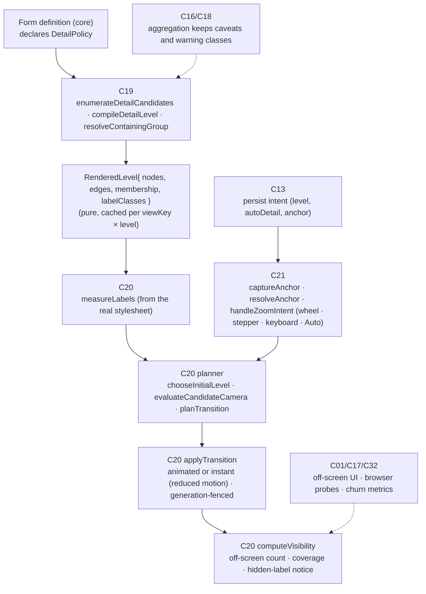
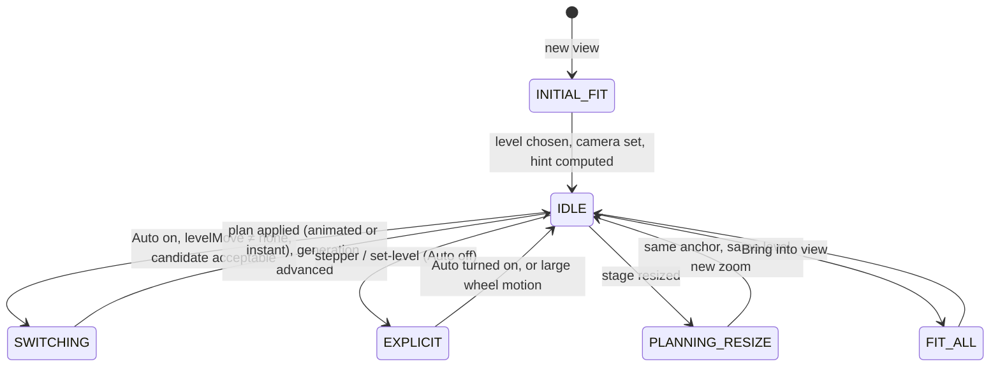

# F09 — Readable semantic zoom and camera transitions

Detailed design · Version 1.0 · 4 October 2026 · Proposed implementation specification

Source: `Competitive_Features_Component_Implementation_Guide.md` §3, §12, §14–§17. Repository evidence observed at commit `8b07b5e`.
Priority **P0** — deliverable independently of the other features. First deliverable: fix initial fit, transitions, anchoring and off-screen disclosure.
GitHub: issue #48 (semantic zoom), related #43, #45, #52.

---

## 1 Purpose, user experience and status

### 1.1 The experience this feature exists for

F09 does not answer a question by itself. It is the property every visual in the product needs in order to be *usable*: whatever you ask, the map you get can be read, and zooming it never loses you.

| User does | The product must |
|---|---|
| Opens a new map | Start at the **finest level whose labels are readable**, whole drawing in view — not cropped at the top-left, not at 5 px text |
| Scrolls out | Aggregate **before** labels become unreadable, land on a drawing whose labels are readable, and keep what the pointer was over under the pointer |
| Scrolls in | Expand to detail without throwing the thing they were looking at off-screen |
| Uses a form that cannot aggregate | Stop drawing labels that are too small to read, **say so**, and keep the shapes, borders and edges that carry the evidence encoding |
| Wants to know what is out of sight | See "N of M elements are off-screen · Bring into view" with a number that equals what is actually off-screen |
| Cannot use a mouse, or prefers reduced motion | Get the same understanding through the outline, keyboard stepper and instant transitions |

```
   Before (confirmed defects)                                         After (target behaviour)
   level change at 6.8 px, next one at 4.6 px                          every switch lands labels at 10.5–11.5 px; one switch per gesture
   L3 "Files": a few nodes drawn as 16 px dashes across the pane       L3 fills the pane; every node's label readable
   "Ownership" zoomed out: 5.8 px text, 36 files at 4.1 px, no change  labels hidden below 9 px with a notice; drawing stays whole; outline available
   overview of 92 files, L1→L0: 2 of 3 nodes, 62 % in view            3 of 3 nodes, 100 % in view
   new view of a large repo cropped at the top-left, 7 px text         starts at the finest level that fits legibly
   stepper to "L6 Detail": whole drawing fitted at an unreadable size  lands readable on the anchor; the rest is announced as off-screen
```

### 1.2 Status — what was fixed, what is still open

This design follows work already merged for issue #48. Observed in this repository:

**Delivered (commits `2aeb7f3`, `1a111dc`):**
- Levels change by label legibility, direction-aware, with hysteresis (`apps/web/src/legibility.ts`, `POLICY`).
- Re-anchoring after a switch, and a pull into view for a drawing that fits (`Canvas.tsx` `settleLevelChange`).
- Labels below 9 px are not drawn (`min-zoomed-font-size`), with a notice; an "N of M elements off-screen / Bring into view" hint counted from real element boxes.
- New views start at the finest level that fits with readable labels.
- Programmatic camera moves are ignored by the level logic (`programmatic`, `lockZoom`).
- **Layout gravity** (`layout.ts`): disconnected or weakly linked nodes drifted thousands of units away, so a fit left every node a few pixels wide (12,566 × 14,319 units for 12 nodes in the regression test).

**Still open** (re-verified in a headless 1920×1080 run of the demo repository):
1. **Stepper to a finer level fits everything unreadably.** At `L6 · Detail` the 43-node drawing is a tall column, labels are hidden and the notice shows, although the stepper was an *explicit* request to see detail.
2. **No per-form detail policy.** Aggregation exists only for one form and is hard-coded by level number in `graph.ts render`; other forms get a boolean (`levelsApply`) and one global label rule.
3. **Initial level is found by cascading re-renders** (a timeout loop), not computed.
4. **Layouts are tall columns for the semantic map**, so the fit zoom is set by height while the width is unused (aspect mismatch).
5. **Label-carried semantics.** Some warnings live only in label text (badge lines, fog counts at L6, `✓` on a suspect). When the label is suppressed they vanish.
6. **No Auto-detail control, no pointer-versus-stepper intent model, no minimap**, no browser tests for resize and for pointer anchoring on the real canvas.
7. **Legacy code**: `nextLevel`/`ENTER`/`LEAVE`/`zoomForLevel` (relative-zoom thresholds) remain in `graph.ts` with their own tests but are no longer used by the canvas.
8. Open disclosures shrink the stage and trigger the off-screen hint (issue #52).

### 1.3 What "done" means for the user

Replaying the reported cases in a real browser shows readable labels or an honest notice at every step; the pointer's subject stays put; nothing flickers; resizing, manual levels and reduced motion keep a usable context; every form declares what it does when it cannot aggregate; and caveats never disappear with labels (F09-A1…A8).

---

## 2 Scope, non-goals and first delivery boundary

### 2.1 In scope

- A **screen-space readability contract** for every drawn label class, measured from the real rendered styles.
- A per-form **`DetailPolicy`**: levels, what aggregates, essential label priorities, fallback when labels cannot be drawn.
- Camera planning: initial fit, level transitions, explicit level selection, anchoring, visibility accounting.
- **Anchor mapping** through aggregation and expansion (merge/split).
- Feedback-loop prevention (transition generation, hysteresis, programmatic-move isolation).
- Off-screen and hidden-label disclosure, accessible alternatives, reduced motion.
- Persistence of the *intent* (level, auto-detail, anchor), not obsolete pan/zoom numbers.
- Real-browser conformance probes.

### 2.2 Non-goals

- A new renderer. Cytoscape stays; changes are policy and planning around it.
- Animated morphing between levels keyed by identity (a hook is specified; the animation is later).
- A minimap in the first slice (listed as an optional follow-up).
- Changing what the forms *show* (that belongs to each form's own design).
- Chart navigation for non-graph surfaces such as flamegraphs (F05): chart zoom is **separate** from semantic levels; this document defines the boundary (§7.9).

### 2.3 First delivery boundary

Per the priority statement: ship F09-A1…A8 for the forms that already use levels (the semantic map), define and enforce `DetailPolicy` for **all** forms (most declare `aggregationSupported: false` plus a fallback), fix the stepper landing, compute the initial level directly, and add the real-browser probes.

---

## 3 Current state in this repository

### 3.1 What exists (observed)

| Capability | Where | What it does | Class |
|---|---|---|---|
| Readability rules as pure functions | `apps/web/src/legibility.ts` | `POLICY {aggregateBelowPx:10, hardMinPx:9, landingMinPx:10.5, targetPx:11.5, expandAbovePx:16}`, `fontPx`, `levelMove`, `zoomAfterSwitch`, `resolveAnchor`, `visibility`, `panFor`, `pullInside` | EXISTING_REUSE |
| Rule tests | `apps/web/test/legibility.test.ts` (7 tests: levels by label size and direction, readable after a switch, property sweep over 40 random runs, hysteresis band, anchor resolution, camera placement, visibility counts) | | EXISTING_REUSE |
| Canvas integration | `apps/web/src/Canvas.tsx` (426 lines) | Zoom events → `levelMove` → `captureAnchor` → `onZoomLevel` → elements replaced → `settleLevelChange` (animate zoom+pan 160 ms, or instant under reduced motion); `quietly()` isolates programmatic moves; `lockZoom` keeps an explicit level; `fitReadable`; `bringIntoView`; label-hidden and off-screen hint | EXISTING_EXTEND |
| Level aggregation | `apps/web/src/graph.ts` `render(view, level, pos, stale)`; `LEVELS` L0 System … L6 Detail; `MAX_LEVEL = 6`, `DEFAULT_LEVEL = 5` | Hard-coded by level number; aggregates only `aggregable` nodes of the semantic map; produces `RenderNode.members` | EXISTING_EXTEND |
| Membership already present | `RenderNode.members` (`graph.ts`), used by `captureAnchor`/`resolveAnchor` | The mapping from a rendered node to the underlying entity ids | EXISTING_REUSE (this *is* the guide's `membershipMap`) |
| Layout | `apps/web/src/arrange.ts`, `layout.ts` (`forceLayout`, `separate`, `layered`, `routeEdges`, …), `layoutmetrics.ts` | Per-form layout choice; zero-overlap tests; **gravity fix** in `forceLayout` | EXISTING_REUSE |
| Level control and announcements | `App.tsx` stepper (`aria-label="Level of detail"`, live region `L5 · All symbols`), keyboard `+`/`−`, text outline `O` (`Outline.tsx`) | | EXISTING_REUSE |
| Which views use levels | `App.tsx` `levelsApply = view has nodes without explicit pos && !terrain && !(matrix drawn as matrix)` | A boolean, not a policy | EXISTING_EXTEND |
| Reduced motion | `Canvas.tsx` `reduceMotion()` → instant `viewport()` | | EXISTING_REUSE |
| Real-browser probes | `apps/web/test/e2e/zoom.test.ts` (2 tests), `e2e/cdp.ts`, `harness.ts` | Wheel sweeps both directions on a map with levels and a form without; asserts readable labels or an honest notice, content in view, truthful off-screen count, monotonic level changes | EXISTING_EXTEND |
| Bounded views | `graph.ts` `boundView` (`MAX_ELEMENTS = 2000`, `MAX_FOREGROUND = 50`) | Deterministic demotion/omission with a stated note | EXISTING_REUSE |
| Legacy relative thresholds | `graph.ts` `ENTER`, `LEAVE`, `nextLevel`, `zoomForLevel` + `graph.test.ts` | No longer used by `Canvas.tsx` | NOT_NEEDED (remove, see WP-02) |

### 3.2 Verified gaps (in this repository, today)

| Gap | Evidence | Guide requirement |
|---|---|---|
| No per-form `DetailPolicy`; one boolean | `App.tsx:413` | F09-A7 "every form declares a detail policy" |
| Aggregation tied to level numbers and one form | `graph.ts render`: `keyOf`, `aggregable`, `level >= 4` | C19 `enumerateDetailCandidates`, `compileDetailLevel` |
| `FONT_UNITS = 11` is assumed for every label class | `legibility.ts` | "Measure actual rendered font rules, not one assumed font size for every form" |
| Stepper uses fit, not readable landing | `Canvas.tsx` `p.level` effect sets `lockZoom`; new elements trigger `fitReadable` when `viewKey`/`fitTick` changes | Explicit selection must stay readable or disclose |
| Initial level by cascade | `Canvas.tsx` effect: `pending = {kind:"fit"}`, `window.setTimeout(onZoomLevel(level-1))` | `chooseInitialLevel` computed, no flicker |
| Expansion rule uses current px | `levelMove` → `finer` when `px > expandAbovePx` | Guide: expand only when the *finer candidate* can support 16 px labels; needs candidate evaluation |
| No transition generation | `animating`/`programmatic` flags only | "retain transition generation and hysteresis state"; "reject late layout results" |
| Layouts recomputed per level change on the main thread | `useMemo(() => arrange(render(...)))` in `App.tsx` | "Prefer cached candidate layouts" |
| Label-carried caveats | `labelText = bd && level < 6 ? label + "\n" + badge` and L6 `detail` lines in `Canvas.tsx`; rank labels `#1 name ✓` in `graph.ts` | "Essential caveats cannot disappear with labels" |
| No persisted intent | Workspaces store a view, not camera intent | C13: persist preference and selection, rebind camera |
| No Auto-detail toggle | Not in `App.tsx` | C21 "expose Auto detail" |
| Probes cover two scenarios | `zoom.test.ts` | F09-A1/A8 replay + resize + reduced motion |

### 3.3 Not verified

- The inventory of which forms use `levelsApply` (only the semantic map is *known* to aggregate); WP-01 audits all sixteen.
- Real label sizes for text with wrapping/ellipsis at `text-max-width: 136px` (a label can be 11 px and still truncated to an unreadable stub).
- Behaviour with a device pixel ratio of 2 and browser text zoom.

---

## 4 Architecture and ownership



### 4.1 Responsibilities

| Component | Responsibility | Functions | Class |
|---|---|---|---|
| C19 | Per-form `DetailPolicy`; meaningful aggregations; essential-label priorities; stable membership mappings | `enumerateDetailCandidates`, `compileDetailLevel`, `resolveContainingGroup` | EXISTING_EXTEND (`graph.ts render`, `RenderNode.members`) + NEW policy declarations |
| C20 | Screen-space readability checks; evaluate candidate font sizes and camera *before* switching | `measureLabels`, `chooseInitialLevel`, `evaluateCandidateCamera`, `applyTransition`, `computeVisibility` | EXISTING_EXTEND (`legibility.ts`, `Canvas.tsx`) |
| C21 | Capture wheel intent, pointer position, selection, explicit level override; expose Auto detail | `captureAnchor`, `resolveAnchor`, `handleZoomIntent` | EXISTING_EXTEND (`Canvas.tsx captureAnchor`, `legibility.ts resolveAnchor`) |
| C13 | Persist preference and selection; never replay obsolete camera against a changed layout | — | NEW persistence fields |
| C16/C18 | Aggregation and label suppression keep required caveats, warning classes and provenance | — | EXISTING_EXTEND (display modes) |
| C01/C17/C32 | Off-screen disclosure, reduced-motion behaviour, actual-browser regression probes, transition churn metrics | — | EXISTING_EXTEND (`e2e/`) |

---

## 5 Reconciliation with existing contracts

| Guide | Repository | Decision |
|---|---|---|
| `C19.compileDetail(ctx,{viewId, level, snapshot}) -> Outcome<{viewSpec, membershipMap, presentationManifest}>` | Client-side pure `render(view, level, pos, stale)` returning `Rendered` with `RenderNode.members`; server returns one `ViewSpec` | **Keep compilation on the client** for the first release: it is pure, cached, tested and avoids a round trip per zoom step. Formalise it as `compileDetailLevel(view, level, policy) -> RenderedLevel` with an explicit `membership: Map<renderId, entityId[]>`. A server-side `C19/compileDetail` is the later option if levels need server-only data (decision D1) |
| `DetailPolicy {levels, essentialLabelMinPx, expandCandidateMinPx, labelFallback, aggregationSupported}` | `POLICY` (global constants), `levelsApply` (boolean) | Introduce `DetailPolicy` as **data on each form definition** (and a `defaultDetailPolicy` for forms that declare nothing, which is `aggregationSupported: false`, fallback `SELECTED_ONLY`); `POLICY` becomes the *default numeric thresholds* inside `DetailPolicy` |
| `SemanticAnchor {entityIds, screenPoint, selectionId?, previousGroupId?}` | `Pending {kind, move, ids, screen}` in `Canvas.tsx`; `resolveAnchor(ids, nodes)` | Rename/extend `Pending` to `SemanticAnchor`; add `selectionId` and `previousGroupId` explicitly |
| `C20.planTransition({currentCamera, viewport, anchor, candidate, policy}) -> {camera, resolvedAnchor, visibleNodeCount, offscreenNodeCount, drawingCoverage, unmetConstraints}` | `zoomAfterSwitch`, `panFor`, `pullInside`, `visibility` (separately) | Compose them into one pure function `planTransition` returning exactly that shape (§7.5) |
| "target 11–12 px; aggregate before 10 px; 9 px hard; expand only when the finer candidate supports 16 px" | `targetPx 11.5`, `aggregateBelowPx 10`, `hardMinPx 9`, `expandAbovePx 16` (current px) | Numbers agree. The **expansion criterion** changes from "current labels are ≥ 16 px" to "current labels ≥ 16 px **and** the finer candidate's essential labels would be ≥ `landingMinPx` at the landing zoom" (§7.4) |

---

## 6 Data model

### 6.1 Types

```typescript
type LabelClass = 'NODE_NAME' | 'GROUP_CAPTION' | 'BADGE' | 'EDGE_RELATION' | 'DETAIL_LINE';

type DetailLevel = {
  n: number; name: string; hint: string;
  /** What a node at this level stands for. null = the form's own elements, unaggregated. */
  aggregation: null | { by: 'SYSTEM' | 'DOMAIN' | 'CONCEPT' | 'FILE' | 'DIRECTORY' | 'ROLE' | string; fallbackBy?: string };
  maxNodes?: number;                           // above this the level is not offered as "readable fit"
  labelClasses: Partial<Record<LabelClass, { essential: boolean; fontUnits: number }>>;
};

type DetailPolicy = {
  formId: string;
  aggregationSupported: boolean;
  levels: DetailLevel[];                       // empty when aggregationSupported is false
  essentialLabelMinPx: number;                 // default 10  (aggregate / suppress below this)
  hardMinPx: number;                           // default 9   (never draw below this)
  targetPx: number;                            // default 11.5
  landingMinPx: number;                         // default 10.5
  expandCandidateMinPx: number;                // default 16
  labelFallback: 'ABBREVIATE' | 'SELECTED_ONLY' | 'HIDE';
  defaultLevel: number | 'AUTO';               // AUTO = chooseInitialLevel
  caveatChannels: Record<string, 'BORDER' | 'ICON' | 'PATTERN' | 'COUNT_BADGE' | 'LABEL_ONLY'>;  // LABEL_ONLY is forbidden (§7.8)
};

type RenderedLevel = {
  level: number; nodes: RenderNode[]; edges: RenderEdge[];
  membership: Map<string, string[]>;           // rendered node id → entity ids it stands for
  bbox: { x1: number; y1: number; x2: number; y2: number };      // in model units, from positions and node sizes
  labelStats: { class: LabelClass; count: number; fontUnits: number; maxTextWidthUnits: number }[];
  caveats: { kind: string; count: number; channel: string }[];
};

type SemanticAnchor = {
  entityIds: string[];                         // ordered: selected/focused first, then those under the pointer
  screenPoint: { x: number; y: number };       // where it must stay on screen
  selectionId?: string; previousGroupId?: string;
  source: 'POINTER' | 'SELECTION' | 'FOCUS' | 'CENTRE';
};

type TransitionPlan = {
  camera: { zoom: number; pan: { x: number; y: number } };
  resolvedAnchor: { renderId: string; entityCount: number } | null;
  visibleNodeCount: number; offscreenNodeCount: number; drawingCoverage: number;   // 0–1
  minEssentialLabelPx: number;
  unmetConstraints: ('COVERAGE_BELOW_TARGET' | 'LABELS_BELOW_LANDING_MIN' | 'ANCHOR_UNRESOLVED' | 'CANDIDATE_TOO_LARGE')[];
};

type ZoomIntent =
  | { kind: 'WHEEL'; deltaY: number; pointer: Point }
  | { kind: 'STEPPER'; direction: 1 | -1 }
  | { kind: 'KEYBOARD'; direction: 1 | -1 }
  | { kind: 'SET_LEVEL'; level: number }
  | { kind: 'AUTO_TOGGLE'; on: boolean }
  | { kind: 'BRING_INTO_VIEW' };
```

### 6.2 Persisted preference (C13)

```typescript
type DetailPreference = {
  repositoryId: string; formId: string;
  autoDetail: boolean;
  explicitLevel?: number;                      // set when a person chose a level; cleared when Auto is turned on
  anchor?: { entityIds: string[]; zoomPx: number };     // what they were looking at, as entities and a *text size*, not pan/zoom numbers
  selection: string[];
};
```

The camera is stored as **what was being looked at and how large the text was**. On restore, the planner rebinds it to the *current* layout: resolve the anchor entities through `membership`, then choose a zoom that lands labels at `zoomPx` (clamped to the readable range) and pan so the anchor is where it was. A stored pan/zoom pair is never replayed against a layout that has changed.

### 6.3 Per-form detail policies (proposed defaults; WP-01 confirms each)

| Form | Layout owner | Aggregation | Essential labels | Fallback | Note |
|---|---|---|---|---|---|
| V1 Semantic map | App `basePositions` (columns) + `arrange` | **Yes**: L0 system → L1 domains → L2 concepts → L3 files → L4 key symbols → L5 all → L6 detail | Node name, group caption | n/a (levels) | Layout must respect viewport aspect (§7.6) |
| V2 Hypothesis graph | Layered (cause → effect) | No | Rank + name | `SELECTED_ONLY` + top-5 by rank | `✓` supported marker needs a non-label channel |
| V3 Failure-space | Layered | No | Name; error class | `ABBREVIATE` | Diamonds carry failure sites by shape |
| V4 Journey | Swim lanes (own positions) | Collapse a lane to a summary node when > N steps | Step name | `ABBREVIATE` | Lane captions are essential |
| V5 Lineage | Centre + writers/readers | Group readers/writers beyond N | Field + names | `ABBREVIATE` | |
| V6 Semantic diff | Before/after columns | No | Name + change word | `SELECTED_ONLY` | Added/removed by border style |
| V7 Archaeology | Timeline + constraints | No | Commit subject (truncated) + date | `ABBREVIATE` | |
| V8 Trust boundary | Zones | Collapse a zone to a count | Gate/state names | `ABBREVIATE` | |
| V9 Runtime overlay | Semantic-map-like | Inherits V1 | Name | Inherits V1 | Overlay halos are non-label |
| V10 Race windows | Lanes | No | Statement ids | `SELECTED_ONLY` | |
| V11 Counterfactual | Current vs ghost | No | Name | `ABBREVIATE` | Ghost = dashed outline |
| V12 Test confidence | Matrix/graph | Matrix is a table (no canvas labels) | Cell glyph + text | n/a | |
| V13 Ownership | Owner columns | **Aggregate by directory/team** (open item in #48) | File name | `ABBREVIATE` → directory roll-up | Import links faint until selected |
| V14 Atlas | Concept cards | Cluster by concept | Concept title | `ABBREVIATE` | |
| V15 Policy | Matrix/graph | Matrix is a table | Rule/route names | `ABBREVIATE` | |
| V16 Terrain | Treemap | Cell-level label fit | File name in cell | Per-cell: hide label when the cell is too small (existing) | Not a graph; no levels |

### 6.4 Why the data lives with the form

The guide requires "every form declares a detail policy" (F09-A7). Putting the policy next to the form's compiler means a new form cannot be added without stating how it behaves when small — and a test enumerates `VISUALS` to enforce it (F09-D1).

---

## 7 Algorithms

### 7.1 Measuring what is actually drawn (`measureLabels`)

Today every label is assumed to be 11 units (`FONT_UNITS`). The stylesheet in `Canvas.tsx` defines different sizes per class (node `font-size: 11`, edge `font-size: 9`, `text-max-width: 136px`, detail lines at L6). `measureLabels(rendered, stylesheet)` computes, **per label class**:

```
px(class)  = fontUnits(class) × zoom × devicePixelRatioIndependent   // CSS pixels, as the guide's thresholds are CSS px
truncated  = textWidthUnits(label) > maxTextWidthUnits               // text-max-width with ellipsis
```

`fontUnits` is read from the same table the stylesheet is built from (single source of truth: the stylesheet is generated from the `DetailPolicy.labelClasses`, so the policy and the pixels cannot drift). A node label that is **truncated** counts as *essential-unreadable* when the retained prefix is shorter than the distinguishing part: two nodes whose truncated texts are identical are a *collision* and the planner prefers a coarser level, a smaller font landing, or appends the disambiguating parent (file name) — never leaves two identical stubs.

Edge relation labels are `essential: false` by default (the relation kind is also carried by line style and arrow), except where a form says otherwise. Decorative and suppressed labels are **explicitly** exempt, and the exemption is a policy field, not an accident of Cytoscape's `min-zoomed-font-size`.

### 7.2 Choosing the initial level (`chooseInitialLevel`)

Replaces the cascade. For a new view:

1. For each level `l` in order from finest to coarsest, compute `RenderedLevel` (cached, §7.7) and its `bbox`.
2. `zFit(l) = min((W − 2·pad)/bboxW, (H − 2·pad)/bboxH)`; cap at 1.4 (as `fitReadable` does).
3. `px(l) = essentialFontUnits(l) × zFit(l)`.
4. Choose the **finest level with `px(l) ≥ targetPx`**; if none reaches the target, the finest with `px(l) ≥ landingMinPx`; if still none, the **coarsest level**, and the planner then applies the fallback label policy and the off-screen disclosure.
5. For forms with `aggregationSupported: false`, the "level" is fixed and step 4 reduces to: fit; if `px < hardMinPx` apply `labelFallback` and show the notice.

This is a pure function of `(RenderedLevel[], viewport)`: no timers, no intermediate renders, no flicker (F09-A6).

### 7.3 Zoom intents and the Auto-detail model

Intent is explicit (`ZoomIntent`):

| Intent | Meaning | Level behaviour |
|---|---|---|
| `WHEEL` / pinch | Continuous camera zoom around the pointer | With **Auto detail on** (default): `levelMove(px, direction)` may change the level (§7.4). With **Auto off**: the camera zooms freely; labels hide below the hard minimum with the notice; level never changes |
| `STEPPER`/`KEYBOARD` (`+`/`−`) | "Show me one level more/less detail" | Sets `explicitLevel` and **lands readable** (§7.5): zoom to `targetPx` anchored at the previous anchor; the rest is off-screen with disclosure; it never "fits the whole drawing unreadably" |
| `SET_LEVEL` (chat or UI) | As stepper, to a specific level | Same landing |
| `AUTO_TOGGLE` | Return control to the wheel | Clears `explicitLevel`; re-evaluates the level from the current zoom |
| `BRING_INTO_VIEW` | Fit everything; labels below the hard minimum are suppressed with a notice | Camera only; level unchanged |

`lockZoom` (today's mechanism that keeps an explicit level from being undone) is replaced by **`explicitLevel` with Auto off until the person turns it back on or moves the wheel by more than a threshold** — one visible state instead of a hidden lock. The UI shows a small "Auto detail" toggle beside the stepper (keyboard `A`).

### 7.4 Level transitions with candidate evaluation

`levelMove(px, direction, level, max, policy)` already decides *whether* to move. F09 adds `evaluateCandidateCamera` so the move is only taken if the destination is acceptable:

```
decide(current, direction):
  move = levelMove(px, direction, level, …)
  if move == none: return none
  candidate  = RenderedLevel(level ± 1)                       // from cache, never computed in the gesture
  plan       = planTransition({ currentCamera, viewport, anchor, candidate, policy })
  coarser:   take it unless plan.minEssentialLabelPx < hardMinPx AND a still-coarser level exists
             (a coarser level that cannot be read either is skipped *to the next coarser*, not stopped at)
  finer:     take it only if  currentPx ≥ expandCandidateMinPx
                         AND plan.minEssentialLabelPx ≥ landingMinPx
             otherwise stay: the person keeps zooming the *camera* in the current level; labels simply get larger
```

The second condition is the guide's *"expand only when the finer candidate can support 16 px labels"* made operational: expanding must never produce a worse reading situation than staying. The thresholds keep their hysteresis band (10 ↔ 16): a switch from either side lands in the middle (10.5–11.5), so one gesture cannot switch twice (the existing property test).

**Dwell.** The 120 ms dwell stays for expansions and for coarsening above the hard minimum; below the hard minimum the switch is immediate — *a stability timer cannot leave essential 4 px text visible while waiting* (guide).

### 7.5 `planTransition` (the single place camera maths lives)

Inputs: current camera, viewport `(W, H)`, `SemanticAnchor`, candidate `RenderedLevel`, `DetailPolicy`, and the transition *kind* (`SWITCH_COARSER`, `SWITCH_FINER`, `EXPLICIT_LEVEL`, `INITIAL_FIT`, `BRING_INTO_VIEW`).

```
1. zFit      = fit zoom of the candidate bbox in the viewport (with padding)
2. zTarget   = zoomForPx(policy.targetPx, essential font units of the candidate)
3. z by kind:
     SWITCH_COARSER   : clamp(zFit, zFloor(landingMinPx), zTarget)       // show all if readable, never above target, never below landing minimum
     SWITCH_FINER     : zTarget                                           // looking into a region
     EXPLICIT_LEVEL   : zTarget                                           // person asked for detail: readable, anchored
     INITIAL_FIT      : zFit (already chosen by chooseInitialLevel)
     BRING_INTO_VIEW  : zFit (labels may be suppressed; disclosed)
4. anchor    = resolveAnchor(anchor.entityIds, candidate.membership) → render node (§7.6)
5. pan       = panFor(anchor model point, anchor.screenPoint, z)
6. if kind == SWITCH_COARSER: pan = pullInside(pan, candidate.bbox, z, W, H, pad)         // a drawing that fits is pulled fully in
7. visibility = visibility(boxes at (z, pan), W, H)  →  visibleNodeCount, offscreenNodeCount, drawingCoverage
8. unmet     = []
     if automatic transition and drawingCoverage < 0.80 and a readable fit would have achieved ≥ 0.80   → COVERAGE_BELOW_TARGET
     if min essential px < landingMinPx                                                              → LABELS_BELOW_LANDING_MIN
     if anchor unresolved                                                                           → ANCHOR_UNRESOLVED
```

**The 80 % rule, stated precisely.** For *automatic* transitions (level switches, initial fit) the plan targets ≥ 80 % of the drawing's area in view **when that is compatible with readable labels and the anchor**. Where it is not (a drawing that needs 7 px to fit entirely), the plan keeps readability and the anchor, and reports `unmetConstraints` plus `offscreenNodeCount`; the UI then shows "N of M elements are off-screen · Bring into view". The guide's separation is kept: coverage tests apply to automatic transitions, **not** to deliberate user panning, and visible-node counts are asserted separately from coverage.

### 7.6 Anchoring through aggregation and expansion

`SemanticAnchor.entityIds` is ordered: the selected/focused element first, then elements under the pointer (nearest within 80 px, else the nearest to the viewport centre, else the selection). `resolveAnchor(ids, nodes)` returns the node of the **new** representation that stands for the most of those ids (a selected or focused id weighs more than an incidental one — the existing weighting `1 + 1/(2+i)`; ties broken by id so the result is deterministic).

| Transition | Rule |
|---|---|
| **Merge** (several nodes → one group) | The group that contains the old anchor's entities |
| **Split** (one group → several nodes) | The descendant that contains the selected or previously focused entity; otherwise the one holding most of the old node's entities; otherwise the first in rendered order |
| **Selection exists** | It dominates the pointer: the selected entity's node is the anchor, even when the pointer is elsewhere |
| **No resolution** (entities no longer present, e.g., a verdict hid them) | `ANCHOR_UNRESOLVED`; fall back to the viewport centre and say so in the transition's `unmetConstraints` |

`previousGroupId` records the group the person came from so that zooming *back out* returns to the same group rather than a neighbour (F09-A5 round trip).

### 7.7 Layout and caching

- **Per-level layouts are pure and cacheable.** `RenderedLevel` is a function of `(view hash, level, policy version)`. Cache them in a small LRU (default 8) keyed by that triple; invalidate on verdicts, overrides or a new view.
- **Pre-compute neighbours.** After a view renders, compute `level±1` in an idle callback so a gesture-time switch finds the candidate ready (C20 "prefer cached candidate layouts"). If a gesture arrives before the candidate exists, the planner computes it synchronously **within a time budget**; beyond the budget the switch is deferred and the camera zoom continues (no frozen frame).
- **Reject late layout results.** Each computation carries a *transition generation*; the commit step compares it with the current one and discards a result computed for an older view or level (guide: "reject late layout results").
- **Aspect-aware layout.** The semantic map's column layout makes a tall drawing whose fit is limited by height, leaving width unused (the open defect behind the unreadable L6). `basePositions` gains a `targetAspect` input (the stage's `W/H`): when wrapping columns it chooses the column count that brings the drawing's aspect near the viewport's, within bounds. The gravity fix already prevents the drift failure; aspect-awareness addresses the stretched-column failure.
- **Cost.** `forceLayout` is O(iterations × n²); at the 2,000-element bound that is large, so layouts above a size threshold run in a **web worker** (WP-07); the threshold is measured, not assumed.

### 7.8 Caveats must not live only in labels (guide: "Essential caveats cannot disappear with labels")

Audit every piece of semantics that is currently conveyed *only by label text*:

| Today | Required non-label channel |
|---|---|
| Badge line under a node name (`bd && level < 6`) | Count badge shape or icon on the node, with the text as the label's second line when drawn |
| Fog count in the L6 detail line | Existing purple fog border/double border **plus** the count in the element's accessible name and the outline |
| `#1 name ✓` (supported suspect) | A glyph/border treatment on the node |
| Hypothesis/inference | Already by **border style** (dashed/dotted/solid) — keep |
| Stale claim | Existing stale class styling — keep |
| Aggregate node hiding warnings of its members | The aggregate carries the **weakest-evidence display mode** among members (`FOG > HYPOTHESIS > INFERENCE > FACT`) and a member-warning count |

Rule enforced by test: a `caveatChannels` entry of `LABEL_ONLY` is invalid; the policy validator rejects it (F09-D2). The always-visible HTML legend and **Evidence status** summary (outside the canvas) stay the second line of defence.

### 7.9 Boundary with chart navigation

A flamegraph, timeline or waterfall (F05) zooms **in data space** (time range, call-tree focus). It must not reuse the L0–L6 stepper, `levelMove`, or `semanticLevels`. The shared pieces are only: `measureLabels` (for text legibility in a chart cell), `computeVisibility` (for "N of M items off-screen"), the reduced-motion rule and the persistence shape. The F05 form declares `aggregationSupported: false` and its own navigation controls.

### 7.10 Feedback-loop prevention

- **Transition generation**: every automatic transition increments it; zoom events fired by the transition itself (animation frames, `viewport()`) are tagged with the generation and ignored by the intent handler (this generalises `programmatic`/`animating`).
- **Hysteresis state**: the band between `aggregateBelowPx` and `expandCandidateMinPx` is the only state; landing sizes sit inside it, so one gesture switches at most once; after a switch the "moving direction" resets only when the wheel changes direction or stops for longer than a debounce.
- **Resize** triggers re-planning with the *same* anchor and level (not a level change unless labels fall below the hard minimum), so a window resize never causes a level flicker.
- **Fit/correction vs user wheel**: camera corrections issued by `planTransition` are never interpreted as a wheel event (the existing bug fixed in `2aeb7f3` becomes structurally impossible).

### 7.11 Reduced motion and instant transitions

When `prefers-reduced-motion: reduce` (or an in-app setting) is on: all transitions use `viewport({zoom, pan})` immediately; there is no easing or fade; the live region announces the level change and the anchor once. The planner is the same; only `applyTransition` differs.

---

## 8 API contracts

F09 is a client-side capability with two small server-visible contracts.

### 8.1 Form definition contract (core ↔ web)

```typescript
// packages/core/src/forms/*.ts  (each form exports its policy)
export const detailPolicy: DetailPolicy = { formId: 'SemanticMap', aggregationSupported: true, levels: [...], ... };
// ViewSpec gains an optional echo so the client does not need a lookup table:
type ViewSpec = { …; detail?: DetailPolicy };
```

`C19/visuals` already lists forms; it gains `detail: { aggregationSupported, levelCount, labelFallback }` per form so the gallery can show "Detail: 7 levels" or "No levels (labels hide when too small)".

### 8.2 Workspace persistence

```typescript
C13/saveWorkspace(ctx, { …, preference?: DetailPreference })       // existing op, additive field
C13/openWorkspace(ctx, { id }) -> ApiResult<{ …, preference?: DetailPreference }>
```

### 8.3 Client module boundaries (pure, unit-testable under node)

```typescript
// apps/web/src/detail.ts           compileDetailLevel(view, level, policy): RenderedLevel;  enumerateDetailCandidates(view, policy)
// apps/web/src/legibility.ts       measureLabels, chooseInitialLevel, evaluateCandidateCamera, planTransition, levelMove, resolveAnchor, visibility (extends the existing file)
// apps/web/src/Canvas.tsx          applies plans; owns generation counters; no policy decisions
```

No new network operations are required for the readability work.

---

## 9 States and lifecycles



Generation counters: `viewGeneration` (new view), `transitionGeneration` (each automatic transition). Late layout results and late animation callbacks compare generations before committing.

---

## 10 Authorization, egress and privacy

F09 sends nothing anywhere. Two constraints carry over:

- **Access policy.** Aggregation must not reveal denied entities: a rendered group's member *count* may include only visible members (existing "counted, never named" convention), and `membership` handed to the client contains visible ids only.
- **Persisted anchors** store entity ids; on restore they are re-filtered by the current access policy (an id the viewer can no longer see is dropped, and the anchor falls back).

---

## 11 Freshness, cancellation, idempotency, recovery

- A new revision or refreshed view invalidates the `RenderedLevel` cache and the stored anchor is **rebound** by entity id (canonical identity from `Registry` keeps ids stable across rename/move).
- Gestures cancel in-flight animations (`c.stop()`); the generation bump discards their completion callbacks.
- A layout computation that exceeds its budget is abandoned, not awaited.
- Reload restores intent (level/auto/anchor), never raw pan/zoom.

---

## 12 Interface specification

### 12.1 Controls and surfaces

1. **Level stepper** (exists): `−`/`+`, current level and name, live region. Gains the **Auto detail** toggle (checkbox button, keyboard `A`, `aria-pressed`).
2. **Hidden-label notice** (exists): "Labels are hidden at this zoom: zoom in, or open the text outline (O)." Improved wording when the cause is Auto-off: "…or turn on Auto detail."
3. **Off-screen hint** (exists): "6 of 18 elements are off-screen · Bring into view". The number is **exactly** the count of nodes whose boxes lie fully outside the stage.
4. **Level change announcement**: polite live region — "Level changed to L3 · Files. 9 nodes. Focus kept on `LedgerService`." Spoken once per change, never during animation frames.
5. **Text outline** (exists, `O`): full-fidelity alternative; always available.
6. **Per-form notice**: for forms without levels the stepper is hidden and the notice explains the label rule.
7. **Optional later**: minimap showing the viewport rectangle over the whole drawing (listed in #48).

### 12.2 Copy rules

- A hidden label is **never silent**: the notice appears whenever any essential label is suppressed.
- "Off-screen" counts are numbers from the real geometry, never estimates.
- Level names come from `DetailPolicy.levels[n].name` and are identical in the stepper, the announcement and the outline.
- Unmet constraints are phrased as consequences, not jargon: "Showing this level at a readable size, so 6 elements are off-screen."

### 12.3 States

New view (fit and level chosen); idle; switching (instant or ≤ 160 ms animation); explicit level (Auto off, shown); labels hidden (notice); off-screen (hint); resizing; reduced motion; outline open.

### 12.4 Accessibility

All of: stepper operable by keyboard with live announcements; Auto detail toggle with `aria-pressed`; the canvas remains a single tab stop with arrow-key element navigation (existing); every element reachable and described in the outline even when its label is not drawn; the animation respects `prefers-reduced-motion`; announcements are rate-limited and not repeated per frame; contrast and caveat channels do not depend on colour alone (high-contrast mode exists and must be covered by the probes).

---

## 13 Performance and bounded work

| Quantity | Proposed budget (to be measured, not assumed) |
|---|---|
| Gesture-time level switch | no layout computation on the main thread during the gesture when the candidate is cached; a miss is deferred rather than blocking |
| Layout compute | `forceLayout` above a size threshold runs in a worker; the threshold comes from measurement of the real 92-file and 2,000-element cases |
| Cache | 8 `RenderedLevel`s per view |
| Long tasks | zero tasks > 50 ms during a wheel sweep on the reference corpora (measured with the browser's performance observer in the probe) |
| Transition churn | recorded: number of level switches per sweep (must equal levels traversed — monotone), animation frames dropped |

---

## 14 Failure modes

| Failure | Behaviour |
|---|---|
| Drawing cannot be read at any level that fits | Choose the coarsest, apply label fallback, show the notice and off-screen count |
| Two nodes' labels collide after truncation | Prefer coarser level or a disambiguating suffix; never two identical stubs |
| Anchor entities vanish after a verdict | `ANCHOR_UNRESOLVED`, centre fallback, stated |
| Candidate layout late or over budget | Switch deferred; camera zoom continues |
| Wheel sweep faster than layout | Generation fence discards stale results; the final state is the last valid plan |
| Window resized to very small | Planner re-fits at the same anchor; labels hide with a notice; level changes only when below the hard minimum |
| Device pixel ratio / browser text zoom differs | Thresholds are in CSS pixels; probes run at DPR 1 and 2 |
| Form without policy | `defaultDetailPolicy`; the form-enumeration test fails the build (F09-D1) |
| Forms with explicit positions (swim lanes) | No aggregation; labels follow the fallback; layout untouched |
| Persisted preference references a removed level | Clamp to the form's levels |

---

## 15 Test plan

### 15.1 Acceptance (from the guide)

| ID | Test | How |
|---|---|---|
| F09-A1 | Replay the reported 10-node, ownership and 92-file cases in a browser | **Deterministic fixtures** reproducing the reported conditions (a seeded generator for a 10-node map, the ownership form over 36 and 92 files, and a 92-file repository graph; the original 92-file repository is private, so the fixture is synthetic with the same size and degree distribution and the report says so), driven by real mouse-wheel events in headless Chrome at a **fixed device metrics override** (1920×1080 DPR 1; also 1280×720 and DPR 2) |
| F09-A2 | Inspect label sizes and camera after each wheel step | After every wheel step record `{level, zoom, pan, minEssentialLabelPx per class, visible/offscreen counts, coverage}` from the page; assert the sequence |
| F09-A3 | Essential text ≥ 9 px or intentionally suppressed/replaced with accessible detail | For every recorded step: either `minEssentialLabelPx ≥ 9` or the hidden-label notice is present **and** the outline lists every element |
| F09-A4 | Automatic transitions achieve ≥ 80 % coverage or disclose unmet constraints; visible-node counts asserted separately | Assert `coverage ≥ 0.8` **or** `unmetConstraints ≠ []` with the off-screen hint present and its number equal to the DOM-measured count |
| F09-A5 | Selected/pointer entity maps correctly through merges/splits | Select a deep entity, zoom out to L0, back to L5 and across each level: the selected entity's node is under the same screen point within a tolerance (proposed 8 px) at every landing; round trip returns to the same group (`previousGroupId`) |
| F09-A6 | Zoom correction does not oscillate levels | Sweep out and in; assert the level sequence is monotone within each direction, with exactly one switch per level boundary crossed |
| F09-A7 | Every form declares a detail policy | Enumerate `VISUALS`; each must export a valid `DetailPolicy` (validator rejects `LABEL_ONLY` caveats) |
| F09-A8 | Resize, manual levels and reduced motion retain usable context | Resize the viewport mid-sweep; choose a level via stepper (lands readable, anchor kept, Auto off visible); emulate `prefers-reduced-motion` and assert instant transitions with announcements |

### 15.2 Design-level checks

| ID | Test |
|---|---|
| F09-D1 | Build fails if a form has no policy (A7 as a unit test, not only browser) |
| F09-D2 | Policy validator: `LABEL_ONLY` caveat channel, thresholds out of order, empty level names rejected |
| F09-D3 | Property tests for `planTransition`: output zoom within `[floor, target]` for coarser; anchor error ≈ 0 before `pullInside`; coverage/visibility consistent with geometry |
| F09-D4 | `chooseInitialLevel` returns the finest readable level over random drawings; never cascades |
| F09-D5 | Expansion refused when the candidate would land below `landingMinPx`; allowed otherwise |
| F09-D6 | Truncation collision handled (two identical truncated labels never both drawn) |
| F09-D7 | Aggregate display mode is the weakest-evidence member's; a refuted member propagates |
| F09-D8 | Stepper landing is readable: stepping to the finest level on a tall drawing lands at `targetPx` with an off-screen disclosure (regression for the open defect in §1.2) |
| F09-D9 | Late layout result (older generation) is discarded |
| F09-D10 | Persisted preference restored against a changed layout rebinds by entity, not by pan/zoom |
| F09-D11 | Layout gravity regression stays (12 linked + unlinked nodes within 2,000 × 2,000 units) |
| F09-D12 | Aspect-aware columns: for a tall input the chosen column count brings the aspect within tolerance of the stage |
| F09-D13 | Keyboard-only: step levels, toggle Auto, open outline, inspect an element whose label is hidden |
| F09-D14 | Access policy: `membership` and counts exclude denied entities |
| F09-D15 | Legacy relative-zoom code removed; no import of `nextLevel` remains |

Mutation controls: lower `hardMinPx` to 4 → A3 fails; replace `resolveAnchor` with "first member" → A5 fails; remove the hysteresis band → A6 fails; allow `LABEL_ONLY` → D2 fails; disable the generation check → D9 fails.

### 15.3 Real-input conformance

Per the guide (release check "Browser conformance"), run the probes on **real maps**: the demo repository, this repository's own index, and one real repository of ≥ 90 files; record revision, level sequence, label px per step, screenshot hashes, browser version and **device metrics override**. A reduced run executes in CI on every web change; the full corpus runs before release. The headless harness uses an explicit `Emulation.setDeviceMetricsOverride` so results do not depend on the window the browser happens to open.

---

## 16 Work packages

| WP | Title | Depends on | Size | Result |
|---|---|---|---|---|
| WP-01 | Audit all 16 forms: layout owner, aggregation, label classes, caveats carried only by labels; fill §6.3 | — | M | Per-form policy table (confirmed) |
| WP-02 | Introduce `DetailPolicy`; validator; policies for all forms; remove legacy relative-zoom code and tests | WP-01 | M | F09-A7, D1, D2, D15 |
| WP-03 | `measureLabels` from the stylesheet source of truth; truncation/collision handling | WP-02 | M | Real label sizes |
| WP-04 | `chooseInitialLevel`; remove the cascade | WP-03 | S | F09-D4, A6 (initial) |
| WP-05 | `planTransition` (single camera function) and `evaluateCandidateCamera`; candidate-based expansion rule | WP-03 | M | F09-A4, D3, D5 |
| WP-06 | Stepper/explicit-level landing: readable, anchored, disclosed; Auto-detail model replacing `lockZoom`; keyboard `A`; announcements | WP-05 | M | F09-D8, A8 |
| WP-07 | `RenderedLevel` cache, neighbour precompute, generations; layout in a worker above the measured threshold | WP-05 | L | F09-D9; perf budgets |
| WP-08 | Aspect-aware `basePositions` | WP-04 | M | F09-D12 |
| WP-09 | Non-label channels for caveats; aggregate display-mode rule | WP-01 | M | F09-D7 |
| WP-10 | Persist `DetailPreference` and rebind on restore | WP-06 | S | F09-D10 |
| WP-11 | Ownership roll-up aggregation by directory/team (from #48 "not done") | WP-02 | M | V13 levels |
| WP-12 | Browser conformance suite: fixtures, fixed device metrics, probe recorder, resize/pointer/reduced-motion cases; CI subset | WP-04, WP-06 | L | F09-A1…A3, A5, A6, A8 |
| WP-13 | Disclosure panels no longer shrink the stage (issue #52) | — | S | Stage stability |
| WP-14 | Ledger items and release-check wiring | all | S | Done criteria |

---

## 17 Migration, rollout and compatibility

- **No data migration.** `ViewSpec.detail` and `DetailPreference` are optional additive fields; clients that do not know them behave as today.
- **Flag** `zoom.v2` switches the canvas from the current integration to the planner-based one; both paths share `legibility.ts`, so the 7 existing unit tests continue to guard the shared rules. The flag can be removed after one release with probes green.
- **Behaviour change** to announce: the stepper now lands readable on the anchor instead of fitting everything (the old behaviour is available as **Bring into view**). The initial level of a new map can be coarser than before (already documented in the #48 comment).
- **Rollback**: the flag restores the previous integration; persisted preferences are ignored by it.

---

## 18 Risks and open decisions

| ID | Decision / risk | Options | Recommendation |
|---|---|---|---|
| D1 | Where level compilation runs | Client (pure, cached) / server `compileDetail` | Client first; server only if a level needs server-only data |
| D2 | Expansion criterion | Current px only / candidate-aware | Candidate-aware (§7.4) |
| D3 | `lockZoom` replacement | Hidden lock / visible Auto toggle | Visible Auto-detail with `explicitLevel` |
| D4 | Layout off the main thread | Always / above a measured size | Above a measured size |
| D5 | Minimap | Now / later | Later (tracked in #48) |
| D6 | Per-class thresholds | One set / per label class | One set of thresholds, per-class *font units* |
| R1 | Thresholds tuned for one display | Probes at DPR 1 and 2 and three viewport sizes; thresholds are policy values |
| R2 | A real 92-file repository cannot be committed | Synthetic fixture with documented parameters; the real case run privately and reported as a measurement |
| R3 | Headless and headed rendering differ | Fixed device metrics; the same probes run in a headed browser before release |
| R4 | Over-aggregation hides rare warnings | Weakest-evidence aggregate mode and member-warning counts; tested (D7) |
| R5 | Aspect-aware layout changes familiar layouts | Flag; layout-quality tests (zero overlap, crossing ceilings) stay green |

---

## 19 Definition of done

F09 is done when, in a real browser at fixed device metrics, the reported cases replay with readable labels or an honest notice at every wheel step; initial fit is a computed, finest-readable choice; level switches land readable and anchored with exactly one switch per boundary; explicit level selection lands readable with off-screen disclosure; every form declares a detail policy and no caveat lives only in a label; reduced motion, resize and manual levels keep context; the legacy relative-zoom code is gone; F09-A1…A8 pass with their mutation controls recorded; and the ledger holds named tests for each item.

## 20 References

- Guide §3, §12 (F09), §14, §16, §17. GitHub issues #48 (with the follow-up comment on the layout-gravity fix), #43, #45, #52.
- Repository: `apps/web/src/{legibility,Canvas,graph,arrange,layout,layoutmetrics,App,Outline,a11y}.ts(x)`, `apps/web/test/{legibility.test.ts,graph.test.ts,layout.test.ts,e2e/zoom.test.ts,e2e/cdp.ts}`, `packages/core/src/{viewspec,visuals}.ts`, `packages/core/src/forms/*`.
- Cytoscape.js: `min-zoomed-font-size`, `text-max-width`, viewport/animation APIs.
- WCAG 2.2 (text size, reduced motion, non-text contrast), `prefers-reduced-motion`.
