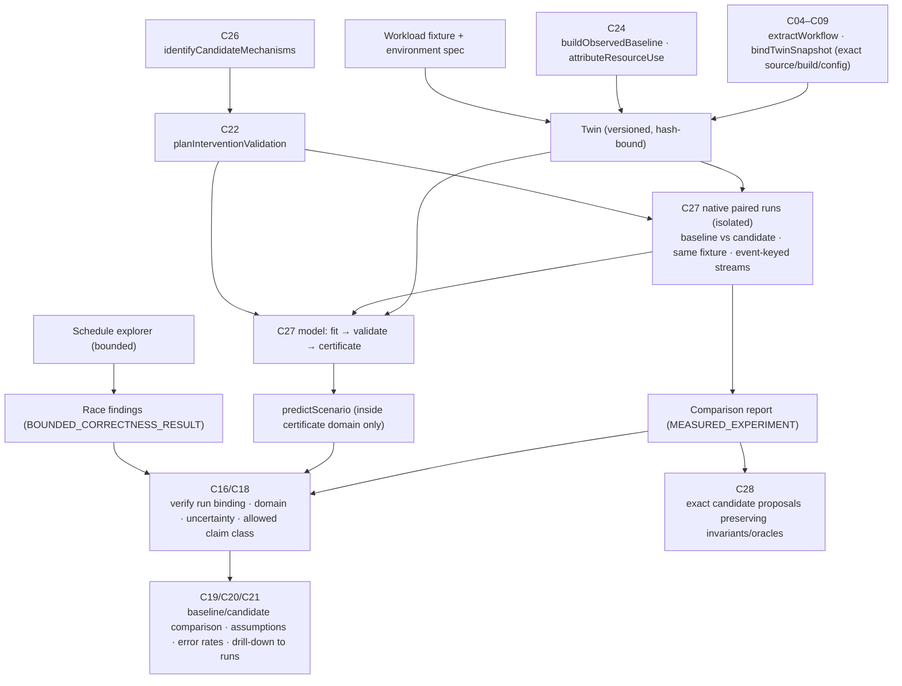

# F10 — Bounded workflow digital twin

Detailed design · Version 1.0 · 4 October 2026 · Proposed implementation specification

Source: `Competitive_Features_Component_Implementation_Guide.md` §3, §13, §14–§17. Repository evidence observed at commit `8b07b5e`.
Priority P3. First deliverable: one workflow, synchronised inputs and paired native experiments.
Builds on, and does not replace, `C27_Reliable_Counterfactual_Simulation_Design.md` (the **C27 design**): that document defines the general reliability gates, fidelity ladder, discrete-event kernel and experiment protocol; this one specifies the **workflow twin** feature that instantiates them for one workflow.

---

## 1 Purpose, user experience and status

### 1.1 The experience this feature exists for

F10 supports the questions about performance and capacity that cannot be answered by reading code or by one profile:

| User asks | Role of F10 |
|---|---|
| "Why is this endpoint slow?" (F05) | After F05 shows *where* time goes, F10 answers "what would change if we changed X?" — by measuring, and only where validated, by predicting |
| "What should we refactor first?" (F06) | Quantifies the effect of a candidate change on the hot workflow before anyone invests in it |
| "Fix this across our services." (F08) | Supplies measured before/after evidence for a performance-motivated change, per repository |

What a person does and sees:

```
Twin  "createPayment"   v3   snapshot a19a978 (payments-api)   workload fixture wl-7c41 (1.0× = 120 req/s, 9 min)   env env-31b0 (4 vCPU, pool 8)
 Structure: api → fraud.check → gateway.authorize (external) → ledger.reserve (DB pool) → events.publish → capture-worker (async)       [6 stations, 2 unresolved calls]
 Evidence behind each station:   ▣ measured (traces + native runs)   ▤ modelled   ▢ unknown          fraud ▣ · gateway ▣ · ledger ▣ · publish ▤ · worker ▢

 Baseline reproduction (gate G2)             observed         model          tolerance     result
   throughput                                118.4 req/s      121.9 req/s    ±10 %         ✓ 3.0 %
   p95 latency                                 410 ms           452 ms        ±15 %         ✓ 10.2 %
   error rate                                  0.8 %            0.7 %         ±0.5 pp       ✓
   saturation onset (load multiplier)          1.55×            1.5×          one load step ✓
 Validation certificate  vc-19  scope: metric p95/throughput · intervention class "pool capacity" 4–16 · load 0.5×–1.6× · env class env-31b0
   held-out interventions: pool 6 and pool 12 — predicted vs measured Δp95: −24 % vs −21 % ✓ · +0 % vs −2 % ✓   80 % interval coverage: 4 of 5 ✓

 Scenario: "pool 12 at 1.4× load"   inside the validated domain → VALIDATED MODEL PREDICTION
     p95 410 → 262 ms  (prediction interval 205–330 ms)   assumption: DB latency does not degrade with concurrency  (checked at pool ≤ 16)
 Scenario: "pool 64 at 2.5× load"   OUTSIDE the validated domain  →  blocked.  [Run a native paired experiment]  [Show as exploratory (not validated)]
 Native paired experiment (8 interleaved pairs, open-loop arrivals, all failures kept):  Δp95 −26 % [−31 %, −20 %]  Δerror rate +0.0 pp   MEASURED EXPERIMENT
 Races: "reserve/commit interleaving"  explored 12 480 schedules (bound reached)  → no violation found within bounds. This does not show the code is race-free.
```

### 1.2 What "done" means for the user

1. The twin's baseline reproduces a **real** workload within **declared** tolerances (F10-A1).
2. Predictions for **held-out interventions** meet predeclared error and interval-coverage criteria (F10-A2).
3. A request outside the validated domain is **blocked or explicitly exploratory** (F10-A3).
4. Failures and timeouts **stay in the population** (F10-A4).
5. Any change to the model, workload, environment or oracle **invalidates** the certificate (F10-A5).
6. Unsupported predictions **never** receive the class `VALIDATED_MODEL_PREDICTION` (F10-A6).
7. Race findings carry a **reproducible schedule** where the runner supports it, with the **bounded exploration disclosed** (F10-A7).

### 1.3 Status

**Proposed implementation specification.** The repository today has: structural counterfactuals (`scenarios.ts`: `REMOVE`, `MAKE_ASYNC`, `SCALE`, assumption states, `CapacityData` supplied by the caller, basis labels), a paired-benchmark comparer (`defect-benchmark.ts`), a bounded schedule-exploration DSL (`defect-schedule.ts`) plus a reviewed Loom fixture crate (`crates/defect-harness`), isolated execution (`defect-isolation.ts`, `defect-local.ts`) and run-manifest schemas (`defect.ts`). It has **no workload fixtures, no executable simulation model, no calibration, no validation certificates and no paired experiment runner with outcome retention**. The C27 design specifies those in general; F10 is its first vertical slice.

---

## 2 Scope, non-goals and first delivery boundary

### 2.1 In scope

- A **twin**: a versioned, hash-bound description of *one workflow* (stations, resources, branches, external dependencies) tied to an exact source/build/config snapshot, baseline evidence, a workload fixture, an environment specification and a model specification.
- **Synchronised inputs**: the model run, the native baseline run and the native candidate run consume the *same* workload fixture and environment specification, with event-keyed random streams.
- **Paired native experiments** with retained outcomes, correctness oracle and dependence-aware comparison.
- A **bounded discrete-event model** (queues, resources, retries, timeouts) fitted and **validated on held-out data**, with scoped certificates.
- **Prediction** only inside a certificate's domain; everything else is measured or labelled exploratory.
- **Race/ordering exploration** with bounded schedule search and reproducible schedules.
- Sensitivity analysis and explicit abstention.

### 2.2 Non-goals

- A general-purpose digital twin of a system or organisation. One workflow, one intervention class first.
- Proving absence of data races or deadlocks. A queue simulation **cannot** (guide §13); bounded schedule exploration reports *within bounds*.
- Production-accuracy claims. Results are valid for the stated workload, environment and domain.
- Automatic extraction of a faithful model from arbitrary code. The model structure comes from the workflow structure plus declared resources; unknown behaviour stays unknown.
- Hardware/microarchitecture simulation or machine replay in the first release.
- Predicting the effect of arbitrary code patches. Code interventions are **measured**, not predicted, until a certificate for that intervention class exists.

### 2.3 First delivery boundary

One workflow (the demo service's payment path is the structural template; a real reference service is required for validation, §15.4), **one intervention class: resource capacity and offered load** (connection-pool size, worker concurrency, arrival-rate multiplier). This class is where queueing models are most credible and where "native paired experiments" are cheap to run for the held-out points needed to validate it. Code-patch interventions are supported **as native paired experiments only** (result class `MEASURED_EXPERIMENT`). Prediction for other classes (batching, async changes, dependency removal, service splitting) is out of scope until each has its own validation evidence.

---

## 3 Current state in this repository

### 3.1 What exists (observed)

| Capability | Where | What it does | Class |
|---|---|---|---|
| Structural/narrative scenarios | `scenarios.ts` (`Scenario`, `ScenarioOp`: `REMOVE`/`MAKE_ASYNC`/`SCALE`; `Assumption` with `UNCHECKED/SUPPORTED/CONTRADICTED`; `Basis = STRUCTURAL \| MEASURED \| INTERPOLATED \| EXTRAPOLATED \| INFERRED`; `CapacityData` with `workloadHash`, points `{concurrency, throughputPerSec, p95Ms, errorRate, runId}`) | A consequence that rests on an unchecked assumption is conditional; capacity beyond measured points is labelled extrapolation | EXISTING_EXTEND (the basis vocabulary is reused; `MEASURED` gains the traceability rule) |
| Paired benchmark comparison | `defect-benchmark.ts` `comparePairedBenchmarks`, `ComparisonPolicy` | Pairs retained; bootstrap resamples **pairs** (not requests); flags duplicate ids, unmatched trials, differing workload/environment/oracle/build hashes, instrumented timings, correctness failures; verdicts `IMPROVED/REGRESSED/NO_MATERIAL_CHANGE/INCONCLUSIVE`; seeded and reproducible | EXISTING_EXTEND (see §3.2: the population of outcomes is not enforced) |
| Bounded schedule exploration | `defect-schedule.ts` (`ScheduleHarness` DSL: `SET`/`AWAIT`/`CHECK`, ≤ 8 tasks, ≤ 64 instructions, safe integers; `exploreSchedules`; `ScheduleReport {status, exploredSchedules, completedSearch, schedule, oracleHash, harnessHash, exclusions}`; `IndependentOracle` with reviewer) | Exhaustive search of a *reviewed finite model* within `maxSchedules`/`maxSteps`; reports the violating schedule or `completedSearch` | EXISTING_REUSE |
| Reviewed Loom fixtures | `crates/defect-harness/src/lib.rs` | Finite concurrency fixtures checked under Loom with a preemption bound | EXISTING_REUSE |
| Isolated execution and run identities | `defect-isolation.ts`, `defect-local.ts`, `packages/schema/src/defect.ts` (`ExperimentSpec`, `RunManifest`, `AdapterCapability`, `ExperimentBudget`) | Container and local adapters; budgets; capability manifests (`supportsReplay`, `modelsWeakMemory`, `maximumBounds`, `knownExclusions`) | EXISTING_EXTEND |
| Span costs and critical path | `defect-performance.ts` (`TimedSpan` with category `CPU/IO/LOCK/POOL/QUEUE/OTHER`, `computeExclusiveCosts`, `reconstructCriticalPath`, `analyzeWaits`) | Demand-versus-wait separation *if* spans are categorised | EXISTING_REUSE |
| Observed runtime evidence | `runtime.ts`, `traceexport.ts` (+ F05 profiles) | Spans, sampling rate, deployment markers, attribution grades | EXISTING_REUSE |
| Workflow structure | `forms/journey.ts` (V4 journey), `forms/race.ts` (V10), `forms/lineage.ts` | Steps across lanes with decision points, async hand-offs, writers/readers of shared state | EXISTING_REUSE (twin structure source) |
| Counterfactual view | `forms/counterfactual.ts` (V11), web `Consequences.tsx` | Current vs ghost, consequences attached | EXISTING_EXTEND (metric items per F05 §7.9) |
| Evaluation harness | `evaluation.ts`, `eval_*` tables | Planted-failure suites, intervals, paired model tests | EXISTING_REUSE |
| Job runner and idempotency | `jobs.ts`, `journal.ts` | Cancel before commit point, idempotent commands | EXISTING_EXTEND |

### 3.2 Verified gaps

| Gap | Evidence | Consequence |
|---|---|---|
| No workload fixture model | No arrival-process or operation-mix type; `CapacityData` only holds already-measured points | NEW `WorkloadSpec` and fixture store |
| No executable simulation | `scenarios.ts` evaluates structure and interpolates caller-supplied points | NEW discrete-event kernel (per C27 §6) |
| No calibration or holdout validation | Not present | NEW fit/validate/certificate pipeline (C27 §7) |
| A caller-provided `MEASURED` is accepted | `Basis` is a plain enum; `CapacityPoint.runId` is a string with no verification | NEW traceability rule: `MEASURED` requires a retrievable run manifest whose `outcomesArtifactHash` is intact |
| The paired comparer does not enforce the outcome population | `BenchmarkTrial.metrics` are caller-computed numbers; `regressionLimits` may omit error/timeout rates | NEW: the runner computes trial metrics from the complete outcomes artifact, and a policy **must** include `errorRate` and `completedWorkRate` limits (§7.6) |
| No load-generator validity checks | Not present | NEW open-loop generation, coordinated-omission and generator-saturation checks |
| No domain/applicability check | Not present | NEW `checkApplicability` (C27 G5) |
| Schedule DSL is a tiny integer language | `defect-schedule.ts` limits | Fine for a reviewed *model* of a critical section; it is not a way to run arbitrary application code |

### 3.3 Not verified

- Run-to-run variance of performance experiments on the target machines (shared hardware, noisy neighbours, thermal effects).
- Whether the demo repository's services are real enough to validate a queueing model (they are a structural template; §15.4 requires a real reference service).
- Span categorisation quality in real traces (the demand-versus-wait separation depends on it).

---

## 4 Architecture and ownership



### 4.1 Responsibilities

| Component | Responsibility | Functions | Class |
|---|---|---|---|
| C04–C09 | Bind workflow structure to exact source/build/configuration snapshots; identify external systems and unresolved behaviour | `extractWorkflow`, `bindTwinSnapshot` | NEW over EXISTING_REUSE (journey/lineage/race forms) |
| C24 | Observed execution paths, service durations, waits and workload populations with coverage | `buildObservedBaseline`, `attributeResourceUse` | EXISTING_EXTEND (F05 provides profiles) |
| C26 | Bottleneck/concurrency hypotheses with explicit invariants and alternative explanations | `identifyCandidateMechanisms` | EXISTING_EXTEND |
| C22 | Informative interventions, holdouts and stopping conditions | `planInterventionValidation` | EXISTING_REUSE (bounded plans) |
| C27 | Workload fixtures, paired native runs, bounded queue/resource models, holdout validation, domain certificates | `runPairedExperiment`, `fitModel`, `validateInterventionClass`, `predictScenario` | NEW slice of the C27 design |
| C16/C18 | Verify run binding, calibration domain, uncertainty, allowed claim class; native measured results and model predictions remain different classes | — | EXISTING_EXTEND |
| C19/C20/C21 | Baseline/candidate comparisons, assumptions, error rates, uncertainty; drill-down to runs | — | NEW (reuses V11 and the F05 metric binding) |
| C28 | Convert supported improvements into exact candidate proposals; preserve invariants/oracles | — | EXISTING_REUSE (F07) |
| C07/C31/C32/C03 | Cap resources, isolate execution, retain manifests, invalidate changed domains, enforce telemetry/egress policy | — | EXISTING_EXTEND |

---

## 5 Reconciliation with existing contracts

| Guide | C27 design / repository | Decision |
|---|---|---|
| `C27.createTwin(ctx,{workflowId, snapshot, baselineEvidenceIds, workloadFixtureHash, environmentHash, modelSpecHash}) -> Outcome<Twin>` | C27 §11: `define`, `captureBaseline`, `buildModel` | `createTwin` is a **composition**: `define` (a `CounterfactualSpec` skeleton for the workflow) + `captureBaseline` + `buildModel`. A `Twin` is the versioned bundle of the resulting identifiers and hashes; it adds no new truth beyond them |
| `C27.runPairedExperiment(ctx,{twinId, interventionSpecHash, repetitions, seedPlanHash, validationPlanHash, budget}) -> Job<Outcome<PairedResult>>` | C27: `prepareRuns`, `executeRuns`, `compareResults`; `defect-experiment` job kind | One job that performs `prepareRuns → executeRuns → compareResults`; the result is a `CounterfactualReport` whose class is `MEASURED_EXPERIMENT` |
| `C27.predictScenario(ctx,{twinId, intervention, workload, certificateId}) -> Outcome<{predictions, uncertainty, assumptions, domainAssessment}>` | C27: `checkApplicability` then model evaluation | `checkApplicability` runs first; the response class is `VALIDATED_MODEL_PREDICTION` only if the verdict is `IN_DOMAIN` |
| Result classes | C27 §1: `NARRATIVE`, `MODEL_PREDICTION`, `VALIDATED_MODEL_PREDICTION`, `MEASURED_EXPERIMENT`, `BOUNDED_CORRECTNESS_RESULT` | Reused verbatim (the guide's `VALIDATED_MODEL_PREDICTION` is already in the C27 design) |
| `RunManifest` (guide) | `RunManifestSchema` (defect v1) | The F07 reconciliation applies: `defect.v2.runManifest` adds `toolchainHash`, `outcomesArtifactHash`, `candidateContentHash`, `role`; F10 adds roles `TWIN_BASELINE`, `TWIN_CANDIDATE`, `MODEL_TRAINING`, `MODEL_HOLDOUT` |
| `ValidationCertificate` | C27 §7 (G3–G5) | Specified concretely in §6.3 |
| `Basis.MEASURED` | `scenarios.ts` | Requires a verifiable `runManifestId`/`profileArtifactId` (F05 §5); the verifier (C16) rejects a measured item without one |

---

## 6 Data model

### 6.1 Identity and the "synchronised inputs" rule

A twin version is identified by `twinHash = H(snapshot, workflowStructureHash, baselineEvidenceIds[], workloadHash, environmentHash, modelSpecHash, oracleHash)`.

**Synchronisation** means: the *same* `workloadHash` (the same fixture bytes, the same event-keyed random streams) and the *same* `environmentHash` are used by (1) the model's training runs, (2) the native baseline runs and (3) the native candidate runs, and a result is only comparable if those hashes match — the existing `comparePairedBenchmarks` already flags a mismatch as a limitation, F10 turns it into a precondition.

### 6.2 Tables (proposed)

```sql
create table twins(
  twin_id text primary key, workflow_id text not null, name text not null, created_by text not null, created_at text not null
);
create table twin_versions(
  twin_id text not null, version integer not null, twin_hash text not null,
  revision text not null, snapshot_json text not null,            -- source/build/config/dependency-lock/data-state hashes
  structure_json text not null, structure_hash text not null,     -- stations, resources, branches, externals, unresolved list
  baseline_evidence_json text not null,                           -- trace windows, profile ids, runtime envelope ids
  workload_hash text not null, environment_hash text not null, model_spec_hash text not null, oracle_hash text not null,
  state text not null,                                            -- DRAFT | BASELINED | FITTED | VALIDATED | STALE | RETIRED
  primary key(twin_id, version)
);

create table workload_fixtures(
  workload_hash text primary key, spec_json text not null,        -- arrival model, operation mix, payload and key distributions, duration, warm-up
  fixture_ref text not null,                                       -- handle to the synthetic request stream artifact
  derived_from_json text,                                          -- trace windows summarised (distributions only, never payloads)
  streams_json text not null, created_at text not null            -- named stream definitions for event-keyed draws
);
create table environment_specs(
  environment_hash text primary key, spec_json text not null,     -- platform, runtime/compiler versions, resource limits, isolation profile, clock model, cache policy, reset policy, permitted network targets
  created_at text not null
);

create table model_artifacts(
  model_id text primary key, twin_id text not null, twin_version integer not null,
  model_spec_hash text not null, adapter_id text not null, adapter_version text not null,
  parent_model_id text, fit_hash text,                             -- fit_hash identifies the parameter set; a refit is a new model
  parameters_json text not null, state text not null, created_at text not null
);
create table calibration_runs(                                     -- full model-selection history, never only the winner
  calibration_id text primary key, model_id text not null,
  training_dataset_ids_json text not null, structure_candidates_json text not null, chosen_structure text not null,
  fit_metrics_json text not null, policy_id text not null, created_at text not null
);

create table validation_certificates(
  certificate_id text primary key, twin_id text not null, twin_version integer not null, model_id text not null,
  scope_json text not null,                                        -- §6.3
  binding_hash text not null,                                      -- hash of everything the certificate rests on
  holdout_report_json text not null, intervention_report_json text not null,
  state text not null,                                             -- VALID | STALE | REVOKED
  issued_at text not null, issued_by text not null, invalidated_by text, invalidated_at text, invalidation_reason text
);

create table twin_experiments(
  plan_id text primary key, twin_id text not null, twin_version integer not null,
  intervention_hash text not null, validation_plan_hash text not null, seed_plan_hash text not null,
  state text not null, generation integer not null, created_at text not null
);
create table twin_run_cells(                                       -- links to RunManifest rows in the defect tables
  plan_id text not null, cell_id text not null, pair_id text not null, role text not null,   -- TWIN_BASELINE | TWIN_CANDIDATE | MODEL_TRAINING | MODEL_HOLDOUT
  run_manifest_id text not null, order_index integer not null, comparable integer not null, incomparable_reason text,
  primary key(plan_id, cell_id)
);
create table twin_reports(
  report_id text primary key, plan_id text, kind text not null,    -- PAIRED | PREDICTION | SENSITIVITY | RACE
  result_class text not null, content_json text not null, certificate_id text, created_at text not null
);
create table schedule_explorations(
  exploration_id text primary key, twin_id text not null, harness_hash text not null, oracle_hash text not null,
  bounds_json text not null, status text not null, explored integer not null, completed integer not null,
  schedule_artifact_hash text, created_at text not null
);
```

### 6.3 The validation certificate (scope is part of its identity)

```typescript
type ValidationCertificate = {
  certificateId: string; twinId: string; twinVersion: number; modelId: string;
  scope: {
    metrics: { id: 'throughput' | 'p50' | 'p95' | 'p99' | 'errorRate' | 'utilisation'; unit: string }[];   // only these metrics are certified
    interventionClass: 'POOL_CAPACITY' | 'WORKER_CONCURRENCY' | 'OFFERED_LOAD';                              // only these classes
    ranges: { parameter: string; min: number; max: number }[];                                               // tested range of each parameter (not an extrapolation)
    workload: { arrivalModel: string; rateMultiplier: { min: number; max: number }; mixTolerance: number };
    environmentClass: { environmentHash: string; allowedDifferences: string[] };
    assumptionsChecked: { id: string; statement: string; checkedRange: [number, number]; evidenceIds: string[] }[];
  };
  bindingHash: string;                       // H(twinHash, modelSpecHash, fitHash, workloadHash(es), environmentHash, oracleHash, source/build hashes, policy ids)
  validation: {
    g2BaselineReproduction: GateResult; g3Holdout: GateResult; g4InterventionValidation: GateResult;
    heldOutInterventions: { parameter: string; value: number; predictedDelta: Interval; measuredDelta: Interval; directionAgrees: boolean; withinTolerance: boolean }[];
    intervalCoverage: { nominal: number; observed: number; trials: number };
  };
  state: 'VALID' | 'STALE' | 'REVOKED';
};
```

The certificate certifies **a metric, an intervention class and a range actually tested** — nothing else. "Pool capacity 4–16" does not cover pool 64; "p95" does not cover p99 unless p99 was in the validated set.

---

## 7 Algorithms and rules

### 7.1 Twin structure and boundaries

`extractWorkflow(entryEntity)`:

1. Start from the workflow's entry operation (an `entry` in the existing entry-point model) and follow the static graph (`calls`, `async-flow`) to a bounded depth, using the journey form's structure: **stations** are steps in call order; **branches** are decision points (existing failure-site diamonds); **async hand-offs** are queue/topic joins already resolved by the worker; **resources** are discovered from lock, pool and transaction facts (`RawLock`, `RawTx`, `uses_transaction`) plus **declared** resources (a connection pool size comes from configuration, read from `artifacts.ts`/config files with a graded join, never guessed).
2. **External systems** (calls leaving the repository: gateway, third-party APIs) become *boundary stations*: their behaviour is not modelled from code but from observed latency/error distributions or from a declared recorded-response adapter; **each declares matching keys and behaviour for unmatched requests** (C27: "a recorded-response adapter declares matching keys and behaviour for unmatched/changed requests; missing responses yield a gap, not automatic success").
3. **Unresolved behaviour** (dynamic dispatch, unresolved calls) is listed in `structure_json.unresolved`; each unresolved item is marked `MATERIAL` or `NOT_MATERIAL` by whether it lies on the observed critical path. A twin with `MATERIAL` unresolved stations has a **restricted domain** (the certificate scope records it) or is refused.
4. The structure is hashed (`structure_hash`); a change in the underlying code (reverse-dependency impact from `computeImpact` touching any station entity) marks the twin `STALE`.

### 7.2 Observed baseline (C24)

`buildObservedBaseline(workflow, evidenceWindow)` from traces and profiles (F05):

- **Arrival process**: per-operation arrival timestamps → rate per interval; test for stationarity (rate drift, burstiness); fit candidate arrival models (homogeneous Poisson, piecewise-constant rate, MMPP-style bursty) and **keep the fit diagnostics**; if the series is non-stationary the fixture records a *piecewise* model rather than assuming a single rate. Trace **sampling rate** (existing `samplingRate`) is carried; unsampled counts are estimated with the sampling correction and labelled `ESTIMATED`.
- **Stage demand versus waiting.** For each station, compute exclusive cost (`computeExclusiveCosts`) and split it using span **categories** (`CPU`, `IO`, `LOCK`, `POOL`, `QUEUE`). Service demand = the non-waiting part; waiting is *not* sampled as service time (C27 §6: "Do not sample total stage latency including queue wait as service time and then add another modeled queue wait"). Where waits are not instrumented and cannot be separated, the station is `BLACK_BOX` and the model for it is end-to-end with **restricted intervention applicability** (it cannot be used to predict capacity changes of a resource it hides).
- **Joint structure.** Service demands are stored as **request records** (operation, payload size bucket, key class, per-stage demands, outcome), so the model can **resample whole requests** and preserve correlations (size ↔ demand, key skew ↔ contention). Independent marginal distributions are an explicit, labelled fallback only.
- **Outcomes** (success, error class, timeout, retry count) per request, with censoring flags.
- **Coverage**: how much of the window is covered by traces, which instances, which revision (exact attribution grades from the runtime join).

### 7.3 Workload fixture and environment specification

The **workload fixture** (`WorkloadSpec`) is built from the observed baseline as *summaries* (distributions, mix, key skew, arrival model, durations, warm-up) plus a deterministic **synthetic request stream** generator keyed by named streams. It never stores production payloads: privacy by construction. Properties:

- `workloadHash` covers spec, generator version and stream definitions.
- **Event-keyed random streams**: draws are keyed by `(stream, requestId, purpose)`, not consumed in sequence — "the same seed does not guarantee equivalent random choices when random calls are consumed in different orders" (C27). A candidate that changes the number of internal calls still sees the same arrivals and request attributes.
- **Open-loop arrivals** for capacity questions: the generator emits requests on schedule regardless of response times. A closed-loop mode exists but is labelled, because it lowers offered load as the system slows (C27 §8).
- Load multipliers (`0.5×`, `1×`, `1.4×`) are fixture parameters, so "raise load" is a *specified exogenous arrival process*, not a multiplication of observed latency.

The **environment specification** pins platform, runtime/compiler versions, resource limits (CPU cores, memory, pool sizes *as configuration*), isolation profile, clock model, cache and reset policy, and permitted network targets (none by default). `environmentHash` is part of every manifest; a native run and the model's assumed resource set must correspond (the model's CPU `servers = cores`, etc., read from this spec).

### 7.4 The model (bounded discrete-event, C27 §6)

A **typed model specification** (`workflow.twin.model.v1`, JSON, no executable code from users or models): stations with resource demands and service-time sources, resources with capacity and queue policy, routing with branch probabilities *conditioned on request attributes*, timeouts and retries with explicit semantics, external-dependency behaviour, caches (hit probability by key class), faults. It runs on the TypeScript discrete-event kernel with the C27 invariants (monotonic simulated time, deterministic tie ordering with a versioned comparator, no negative capacities, ownership-consistent release, bounded queues/events/runtime, RNG algorithm and comparator pinned in the manifest).

**Structure candidates** (kept in `calibration_runs.structure_candidates_json`): (a) service times fixed, (b) service times inflated by a contention function of concurrency (fitted), (c) with and without cache-hit dependence, (d) with and without retry amplification. The selection among them is part of the recorded history; **the data used to choose a structure cannot be the untouched holdout** (C27 §7).

**Uncertainty.** Parameter uncertainty is propagated by sampling parameters from their fitted distributions; structural uncertainty by running alternative plausible structures and reporting sign reversals; run-to-run variance by repeated simulation replications. These are reported separately — not collapsed into one number.

### 7.5 Calibration and validation gates (C27 §7 applied)

| Gate | What F10 does | Outcome if not met |
|---|---|---|
| G0 | Twin spec concrete: intervention class, oracle, metrics, authority | `INVALID_SCENARIO` |
| G1 | Snapshot, config, workload, environment hashes all present | `BASELINE_INCOMPLETE` |
| G2 | **Baseline reproduction**: repeated isolated *native* baseline runs match the observed production-like workload within tolerance, **and** the model matches the native baseline (throughput ≤ 10 %, p95 ≤ 15 %, saturation onset within one predefined load step, error-rate within an absolute tolerance — the C27 proposed initial policy; the *declared* values live in the validation plan and are what F10-A1 checks) | `BASELINE_MISMATCH` |
| G3 | **Holdout**: independent unfit workload slices and load points | `MODEL_UNVALIDATED` |
| G4 | **Intervention validation**: predicted vs measured *change* for known real interventions in the class | `INTERVENTION_UNVALIDATED` |
| G5 | **Applicability**: requested change and workload inside the certificate's ranges; material assumptions checked | `OUT_OF_DOMAIN` / `INSUFFICIENT_EVIDENCE` |
| G6 | Correctness oracle and obligations | `CORRECTNESS_FAILURE` |
| G7 | Comparison precision (uncertainty, materiality) | `INCONCLUSIVE` |
| G8 | Display/export authorised, evidence intact | `WITHHELD/REDACTED` |

**The G4 protocol (F10-A2).** To validate the class `POOL_CAPACITY`: choose a set of parameter values spanning the range (e.g., pool ∈ {4, 6, 8, 12, 16}) and load multipliers; run **native** paired experiments at each; **fit the model on a subset** (e.g., {4, 8, 16}) and **predict the held-out** values ({6, 12}) *before* looking at their measured results (predictions are written to an immutable record with a timestamp and hash, then compared); compute, per held-out point, the predicted and measured **change** relative to the baseline pool, the **direction agreement**, the **magnitude error**, and whether the measured interval lies inside the prediction interval. Predeclared acceptance (proposed, to be fixed in the validation plan before data collection): direction agrees in all points where the measured effect exceeds the noise floor; magnitude error ≤ the declared tolerance; **interval coverage** at least the declared fraction at the nominal level (e.g., ≥ 80 % of held-out measured deltas inside the 90 % prediction intervals) over at least *k* held-out points (minimum count declared). A certificate is issued **only** if all hold; a failing gate yields a report, not a certificate.

**Leakage rule.** Anything used to select the model structure, tune parameters or choose tolerances counts as *training*. The held-out interventions and load points are chosen **before** fitting and are never revised after seeing results; a revision creates a new twin version with a fresh holdout.

### 7.6 Paired native experiments (C27 §8, with the F10-specific rules)

`runPairedExperiment`:

1. **Freeze** snapshot, config, data state, workload, environment and oracle manifests.
2. **Prepare** separate isolated baseline and candidate instances (the same environment spec), with the **reset policy** (governed state restored; warm/cold cache policy applied identically).
3. **Randomise or interleave** run order across pairs (baseline, candidate, baseline, …) to expose time-dependent drift; record `order_index`.
4. **Open-loop load** from the fixture; before accepting a run, check the **load generator**: achieved offered rate within tolerance of the scheduled rate (generator saturation) and no coordinated omission (the generator records intended send times, and latency is measured from the *intended* time).
5. **Correctness and race instrumentation run separately** from representative performance runs (instrumented timings are not representative — already flagged by `comparePairedBenchmarks`).
6. **Collect all outcomes**: every request's result, including errors, timeouts, cancellations, partial/incomplete runs, into an `outcomesArtifact` hashed in the run manifest. Trial metrics are **computed from that artifact by the runner**, not supplied by a caller.
7. **Reject incomparable pairs** by predeclared conditions (hash mismatch, generator saturation, environment fault) **retaining the reason and raw evidence**; rejection counts are reported (the pairing function never silently drops).
8. **Compare** with the paired bootstrap over pairs (existing method), reporting the effect, interval, and materiality verdict.

**Population rules (F10-A4).**

- `ComparisonPolicy.regressionLimits` **must** include `errorRate` and `completedWorkRate` (the share of offered requests that completed with a correct result); a policy lacking them is rejected at plan time.
- Latency is reported **both** over successful requests and over **all offered requests with failures and timeouts treated as their observed outcome (censored at the timeout)**; the headline uses the all-requests definition declared in the metric spec.
- A candidate that is "faster" because it completes less work is flagged: `completedWorkRate` regression blocks `IMPROVED`.
- Candidate/baseline error-rate differences larger than the declared threshold make the comparison `NOT_COMPARABLE` for latency claims (same reasoning as F05 §7.6).

**Tail estimates.** A p99 needs enough independent blocks; the report states the effective sample size and refuses a tail verdict below a declared minimum (it says "insufficient blocks for p99").

### 7.7 Prediction and the applicability check (F10-A3, A6)

`predictScenario(twin, intervention, workload, certificate)`:

1. `checkApplicability`: verify the certificate is `VALID` and its `bindingHash` matches the **current** twin hash (model, workload, environment, oracle, source/build); the intervention class is certified; every parameter lies inside its certified range; workload multiplier inside the certified span; environment hash equal or an allowed difference; each material assumption has `checkedRange` covering the request.
2. Verdicts: `IN_DOMAIN` → run the model, return class **`VALIDATED_MODEL_PREDICTION`** with the interval and the certificate id; `OUT_OF_DOMAIN` → **blocked** (default) with the violated ranges and a recommendation (a native experiment, with an estimated cost); the caller may explicitly request `exploratory: true`, in which case the result is class **`MODEL_PREDICTION`**, is stamped "not validated for this regime", and **cannot** be exported as validated.
3. A request with **no certificate at all** can only produce `MODEL_PREDICTION` (or `NARRATIVE` if no executable backend applies).
4. **Enforcement** is in two places so a UI bug cannot promote a result: the service sets the class from the applicability verdict; and C16 re-derives the allowed class from `(certificate state, binding hash match, domain verdict)` at display/export and rejects a mismatch (F10-A6).

### 7.8 Sensitivity analysis and abstention

For each material assumption (key skew, service-time tail, retry behaviour, external-dependency degradation with concurrency, cache hit rate) the model is re-run across a declared range; the report lists which assumptions can **reverse the sign** of the predicted effect. A conclusion that flips within a plausible range is reported as **fragile**. Budget exhaustion returns a partial report with unrun cells listed; unresolved cells are never marked passing. Where an unobserved dependency is material, the affected claim is **abstained** with the reason (C27 §9).

### 7.9 Race and ordering exploration (F10-A7)

The twin identifies **candidate race windows** from the workflow's structure: writers of the same state not both inside one transaction/lock (existing lineage and race forms), lock-order cycles (existing detectors), async hand-offs with shared state.

For each candidate, a **reviewed finite model** of the critical section is expressed in the existing schedule DSL (≤ 8 tasks, ≤ 64 instructions, integer state — a deliberately small language) with an **independent oracle** (reviewed by a named person). The explorer enumerates interleavings within `maxSchedules`/`maxSteps`:

- **Violation found** → the report contains the **exact schedule** (ordered task steps) and the resulting state; the schedule artifact is hashed (`scheduleArtifactHash`) so it can be **replayed** deterministically, and it is attached to the finding. Replay of the same schedule on the native code is possible only where an adapter supports replay (`AdapterCapability.supportsReplay`); the report says whether it does.
- **No violation within bounds** → result class `BOUNDED_CORRECTNESS_RESULT`: "no violation among N schedules; search complete/incomplete; bounds B; model reviewed by R; not a proof for the code". `completedSearch: false` is always displayed as such.
- **Adapters** for real code (Loom fixtures for Rust, the Go race detector, stress with instrumentation) are separate adapters with their own capability manifests, `knownExclusions` and a statement of whether they model weak memory; none of them upgrades a bounded result into "race-free".
- **A queue simulation never speaks to races.** The twin UI keeps the performance model and the race exploration visibly separate (different result classes, different panels).

---

## 8 API contracts

```typescript
C27/createTwin(ctx, { workflowId, snapshot: { repositoryId, revision }, baselineEvidenceIds: string[],
                      workloadFixtureHash?: string, environmentHash?: string, modelSpecHash?: string })
  -> ApiResult<Twin>                                                           // mutating; composition of define + captureBaseline (+ buildModel when a model spec is given)

C27/buildFixture(ctx, { twinId, fromEvidence: { windowIds: string[] }, arrival: 'AUTO'|ArrivalModel, multipliers: number[] }) -> ApiResult<JobView>      // mutating
C27/fitModel(ctx, { twinId, trainingDatasetIds: string[], structureCandidates: string[], policyId }) -> ApiResult<JobView>                                // job; mutating
C27/validateInterventionClass(ctx, { twinId, modelId, interventionClass, heldOut: { parameter: string; values: number[]; loadMultipliers: number[] }[], tolerancePolicyId })
  -> ApiResult<JobView>                                                        // runs predictions-before-measurement protocol; issues or refuses a certificate
C27/runPairedExperiment(ctx, { twinId, interventionSpecHash, repetitions, seedPlanHash, validationPlanHash, budget }) -> ApiResult<JobView>                // job kind 'defect-experiment'; mutating
C27/predictScenario(ctx, { twinId, intervention, workload, certificateId?, exploratory?: boolean })
  -> ApiResult<{ resultClass: 'VALIDATED_MODEL_PREDICTION' | 'MODEL_PREDICTION' | 'NARRATIVE';
                 predictions: MetricPrediction[]; uncertainty: UncertaintyBreakdown; assumptions: AssumptionStatus[];
                 domainAssessment: { verdict: 'IN_DOMAIN'|'OUT_OF_DOMAIN'|'INSUFFICIENT_EVIDENCE'; violatedRanges: string[]; certificateId?: string } }>
C27/checkApplicability(ctx, { twinId, certificateId, request }) -> ApiResult<ApplicabilityDecision>
C27/sensitivity(ctx, { twinId, scenario, assumptionRanges }) -> ApiResult<JobView>
C27/exploreSchedules(ctx, { twinId, harnessHandle, oracleHandle, bounds: { maxSchedules: number; maxSteps: number } }) -> ApiResult<JobView>
C27/getTwin / C27/listTwins / C27/getReport / C27/getCertificate(ctx, { id }) -> ApiResult<…>
C27/invalidate(ctx, { twinId, expectedVersion, reason, evidenceIds }) -> ApiResult<CommitReceipt>   // mutating; marks twin and dependent certificates stale
C27/cancel(ctx, { planId, expectedGeneration }) -> ApiResult<CommitReceipt>                          // mutating
C19/compileTwinView(ctx, { reportId | twinId, view: 'STRUCTURE'|'BASELINE_FIT'|'COMPARISON'|'CERTIFICATE'|'SENSITIVITY'|'RACE' }) -> ApiResult<{ viewSpec: ViewSpec; presentationManifest: PresentationManifest }>
```

Errors: `INSUFFICIENT_EVIDENCE` is a *normal* answer for G1/G3/G4/G5 failures (with the gate named); `EVIDENCE_STALE` when a certificate's binding no longer matches; `BUDGET_EXCEEDED` for experiment budgets (partial report returned); `FORBIDDEN` when the execution grant or telemetry scope is missing; `VERSION_CONFLICT` for concurrent twin edits.

---

## 9 States and lifecycles

```mermaid
stateDiagram-v2
    [*] --> DRAFT
    DRAFT --> BASELINED: G1 baseline identity complete
    BASELINED --> FITTED: model fitted on training data
    FITTED --> VALIDATED: G2, G3, G4 pass; certificate issued
    FITTED --> FITTED: refit (new model version, certificate not carried)
    VALIDATED --> STALE: code, model, workload, environment or oracle changed
    STALE --> BASELINED: re-baseline
    VALIDATED --> RETIRED
    BASELINED --> RETIRED
```



Certificate: `VALID → STALE` (binding mismatch, automatically) `| REVOKED` (manual or evidence withdrawn). Experiments: `PLANNED → RUNNING → COMPARED | BUDGET_STOPPED | CANCELLED | FAILED`. Race explorations: `RUNNING → SUCCEEDED | PROPERTY_FAILED | BUDGET_STOPPED | INCONCLUSIVE | CANCELLED` (the existing `ScheduleReport.status` vocabulary).

---

## 10 Authorization, egress and privacy

- **Execution grants.** Every native run needs an execution grant bound to the twin version and the isolation profile; running candidate code is *untrusted native execution* and follows the F07 audited-isolation requirement. `permittedNetworkTargets` defaults to none; a dependency fixture (recorded-response adapter or a local stub) replaces real external calls.
- **Production data.** Baselines are derived from traces, but the fixture stores **summaries and synthetic generators**, never payloads, user identifiers or secrets; label allowlisting from F05 §10 applies to the evidence feeding the baseline.
- **No egress.** Model fitting and simulation are local. A hosted model may be used to *narrate* a result (C15) only with IDs and numbers after redaction.
- **Access.** Reports show only stations and code the viewer may see; hidden stations are aggregated into an anonymous "other" with their time share so the numbers stay true.
- **Cost controls.** Per-twin budgets (wall time, CPU, runs), quotas per tenant; load generation never targets non-isolated systems (the generator refuses targets outside `permittedNetworkTargets`).
- **Retention.** Outcome artifacts and run manifests follow deletion propagation; certificates reference hashes so deleting raw artifacts does not silently preserve a "valid" certificate (a certificate whose evidence artifacts are gone becomes `STALE`).

---

## 11 Freshness, cancellation, idempotency, recovery (F10-A5)

- **Invalidation (F10-A5).** `bindingHash` includes the model spec, fit, workload(s), environment, oracle and source/build hashes. Any change produces a new hash; `checkApplicability` and the verifier compare the *current* twin hash to the certificate's; mismatch marks it `STALE` immediately. Triggers also include: reverse-dependency impact touching any station entity (`computeImpact`), a changed deployment marker in the observed baseline, a policy change, a retired adapter version.
- **Cancellation and generations.** Each plan carries a `generation`; `cancel` bumps it; late run results are dropped (same fence as F07). Leased resources are released; partial reports list unrun cells.
- **Recovery.** `recoverInterruptedRuns` (C27 §12): durable leases and manifests; a run is atomic — interrupted runs are re-run, never resumed mid-way; the prior manifest is marked `INFRA_FAILED`.
- **Idempotency.** Plans deduplicate on `(twinHash, interventionHash, validationPlanHash, seedPlanHash)`; reports on `(planId, comparisonPolicyId)`.

---

## 12 Interface specification

### 12.1 Surfaces (a "Twin" workspace; reuses V11 and the F05 metric binding)

1. **Structure** — the workflow drawn with the existing journey layout; each station shows an **evidence glyph and word** (measured / modelled / unknown), resources (pool size, cores) and unresolved boundaries. Material unresolved items are flagged.
2. **Baseline fit** — a table of observed vs model vs tolerance for each metric with the gate result and a chart overlay; a "model matches the native baseline" and "native baseline matches production-like observation" distinction.
3. **Scenario builder** — pick an intervention class (the first release lists only certified classes plus "code patch — measure only"), parameters with their **certified range shown as a slider track**, workload multiplier, and a live **domain indicator** (in/out of domain with the violated range named). Buttons: *Predict* (enabled only in domain, or "exploratory" with an explicit confirmation), *Run native paired experiment* (shows a cost estimate and budget).
4. **Comparison** — baseline vs candidate: effect with interval, error rates, completed-work rate, resource utilisation, tradeoffs, the **result class badge**, and drill-down to each run manifest and the outcome list.
5. **Certificate** — scope (metrics, class, ranges, environment class), assumptions checked and their ranges, holdout and intervention validation tables, history of refits, state (valid/stale/revoked) with the reason.
6. **Sensitivity** — assumption ranges and sign reversals ("fragile: result reverses if DB latency degrades more than 12 % per added connection").
7. **Races** — the reviewed model, the oracle and reviewer, the bounds and `completedSearch`, the violating schedule as a **step player** (task, step, state) with Replay; separated visually and verbally from performance results.

### 12.2 Copy rules

- Every number carries its **class**: `MEASURED EXPERIMENT`, `VALIDATED MODEL PREDICTION`, `MODEL PREDICTION (not validated)`, `BOUNDED CORRECTNESS RESULT`, `NARRATIVE`.
- Predictions say "predicted under these assumptions", never "will".
- Intervals are named: *prediction interval* (model) vs *confidence interval across runs* (benchmark); they are never interchanged.
- Out-of-domain: "This request is outside what the model was validated for: pool 64 (validated 4–16)."
- Race results: "No violation found in N schedules within bounds B. This does not show the code is race-free."
- Failures are visible in every latency table: success-only and all-requests columns side by side.

### 12.3 States

No twin; baseline incomplete (which gate); fitting; validating (predictions locked, awaiting held-out runs); validated (certificate scope); stale (reason, "re-baseline"); running experiment (per-pair progress, rejected pairs counted); budget stopped (unrun cells); out-of-domain; exploratory.

### 12.4 Accessibility

All charts have table equivalents (observed/model/tolerance, per-run results, sensitivity ranges). Result class and domain status are text and glyph. The schedule step player is a list with keyboard stepping and announcements ("Task B step 3: set balance = 90"). Sliders show certified ranges as text and use `aria-valuemin/max`; out-of-range entry is announced. Nothing relies on colour alone; reduced motion disables animated replays.

---

## 13 Performance and bounded work

| Quantity | Bound |
|---|---|
| Model events per simulation | Event budget; exhaustion → partial, never "passed" |
| Replications | Declared per metric; tail metrics require a minimum |
| Native pairs | Declared minimum (≥ 3 as the comparer already requires; higher for tails); order interleaved |
| Schedule search | `maxSchedules`, `maxSteps` (existing bounds), reported |
| Concurrent runs | Capped by isolated-run resources; one twin experiment per environment at a time (noise control) |
| Fixture size | Generator + summaries only; stream artifacts capped |

Proposed budgets are to be set from measurement on the reference service: simulation throughput (events/second), native run wall time per pair, number of pairs needed for a stable p95 (from observed run-to-run variance).

---

## 14 Failure modes

| Failure | Behaviour |
|---|---|
| Baseline not reproducible natively (high run-to-run variance) | G2 `BASELINE_MISMATCH`; report variance; no certificate |
| Model matches mean but not tail | Gate on p95 and saturation onset, not only mean; failure reported |
| Load generator saturates | Run flagged incomparable with reason; counted; plan may be re-run on a stronger generator |
| Coordinated omission detected | Run rejected; latency measured from intended time |
| Candidate drops requests | `completedWorkRate` regression blocks `IMPROVED` |
| External dependency behaviour unknown for changed request counts | Gap; recorded-response adapter's unmatched policy applies; claim abstained |
| Station is a black box | Domain restricted; capacity predictions for hidden resources refused |
| Holdout points revised after seeing results | Detected by the immutable predictions record; certificate refused; new twin version needed |
| Workload fixture drifts from production | Observed-vs-fixture comparison on refresh; certificate `STALE` when the drift exceeds tolerance |
| Isolation unavailable | Native runs refuse (never local fallback) |
| Schedule search budget exhausted | `BUDGET_STOPPED`, `completedSearch: false`, displayed |
| Race model not reviewed | Exploration refuses without a named reviewer on the oracle |
| Code changed under a validated twin | `STALE` via impact analysis |

---

## 15 Test plan

### 15.1 Acceptance (from the guide)

| ID | Test | Fixture |
|---|---|---|
| F10-A1 | Baseline reproduces the selected real workload within a declared tolerance | Reference service (§15.4) under a real load generator; record the production-like workload; native baseline runs and model baseline compared on throughput, p95, error rate and saturation onset against the **declared** tolerances; assert gate G2 passes and that deliberately perturbing the model (halving a service time) fails it |
| F10-A2 | Holdout interventions meet predeclared error/coverage criteria | The G4 protocol on pool sizes and load points: predictions recorded and hashed **before** held-out runs; assert direction agreement, magnitude error and interval coverage criteria; a model with a deliberately wrong structure (constant service time under heavy contention) must **fail** G4 |
| F10-A3 | Out-of-domain request is blocked or explicitly exploratory | Request pool 64 and 2.5× load against a certificate for 4–16 and ≤ 1.6×: assert `OUT_OF_DOMAIN`, blocked by default, and the exploratory path yields class `MODEL_PREDICTION` with the banner and **no** exportable "validated" class |
| F10-A4 | Failures/timeouts stay in the population | A candidate configured to time out 15 % of requests while the survivors are faster: assert the all-requests latency is worse or `NOT_COMPARABLE`, `completedWorkRate` regression is reported, the success-only latency is shown separately, and a policy omitting `errorRate`/`completedWorkRate` is rejected |
| F10-A5 | Changed model/workload/environment/oracle invalidates the certificate | Change each of the four (and the source of a station) in turn: assert certificate `STALE` and that `predictScenario` refuses `VALIDATED_MODEL_PREDICTION` afterwards |
| F10-A6 | Unsupported predictions never receive `VALIDATED_MODEL_PREDICTION` | Attempt to obtain the class by (i) no certificate, (ii) a stale certificate, (iii) an uncertified metric (p99), (iv) an uncertified class (batching), (v) tampering with the stored `result_class`: assert service and C16 both refuse; mutation: remove the C16 re-derivation → test (v) fails |
| F10-A7 | Race findings include reproducible schedules where supported, with bounded exploration disclosed | Reviewed model of a lost-update critical section: assert the violating schedule is returned, replays to the same state from its hash, and the bounds and `completedSearch` appear; a corrected model returns `BOUNDED_CORRECTNESS_RESULT` with the "not a proof" wording; an unreviewed oracle is refused |

### 15.2 Design-level checks

| ID | Test |
|---|---|
| F10-D1 | Event-keyed streams: changing the number of internal draws leaves arrivals and request attributes unchanged |
| F10-D2 | DES kernel invariants (monotonic time, deterministic ties, ownership-consistent release, bounded queues) by property tests |
| F10-D3 | Demand/wait separation: a model that samples total latency as service time **and** models a queue is detected by a double-counting check on the fixture |
| F10-D4 | Request-record resampling preserves the size↔demand correlation (statistical test) |
| F10-D5 | Holdout leakage: predictions written after seeing held-out results are refused (timestamp/hash order) |
| F10-D6 | Open-loop generator holds the offered rate when responses slow; a closed-loop run is labelled |
| F10-D7 | Pair rejection retains reason and raw evidence; counts are reported |
| F10-D8 | Instrumented runs are excluded from performance comparisons |
| F10-D9 | Tail verdict refused below the declared independent-block minimum |
| F10-D10 | Sensitivity analysis reports a sign reversal when one is engineered |
| F10-D11 | Production payloads never appear in fixtures or reports (scan) |
| F10-D12 | Keyboard-only: build a scenario, see the domain indicator, run a prediction and an experiment, step through a schedule |

Mutation controls: allow `MEASURED` without a manifest → A6 fails; drop failures from trial metrics → A4 fails; skip the binding-hash comparison → A5 fails; widen the domain check → A3 fails; let held-out values influence fitting → D5 fails.

### 15.3 Evaluation methodology

Report, as **measurements with their conditions**, never as promises: model error distributions on holdout points, interval coverage achieved versus nominal, run-to-run variance of native experiments, the number of pairs needed for a stable p95, and the fraction of scenario requests that fall inside certified domains in practice. Record corpus/fixture hashes, runtime and kernel versions, machine description and seeds.

### 15.4 Real-input requirement

The guide's rule (real inputs, not only self-authored fixtures) needs a **real reference service**: a small but genuine HTTP service with a database connection pool, a worker queue and an external dependency stub, run under a real load generator on dedicated hardware. The demo `payments-app` is a *structural* template (it has no runnable service); WP-01 builds or adopts the reference service, and at least one **independently developed open-source service** is added to show the method is not tailored to one author's code. Both are recorded with commit hashes, load profiles and environment hashes.

---

## 16 Work packages

| WP | Title | Depends on | Size | Result |
|---|---|---|---|---|
| WP-00 | **Prerequisites:** F05 profiles/traces, F07 audited isolation and `defect.v2` manifests available | F05, F07 | — | Gate |
| WP-01 | Reference service(s) with a pool, queue and dependency stub; real load generator; variance study | WP-00 | L | Measurement base; real inputs |
| WP-02 | Twin model: structure extraction, resources, unresolved list, snapshot binding, hashes, tables | WP-00 | L | `C27/createTwin` |
| WP-03 | Observed baseline: arrival fits, demand/wait split, request records, outcomes | WP-02 | L | Baseline evidence |
| WP-04 | Workload fixture generator with event-keyed streams; environment spec | WP-03 | M | Synchronised inputs |
| WP-05 | Paired experiment runner: interleaving, open-loop generator, saturation/omission checks, outcomes artifact, trial metrics from outcomes, policy validation | WP-01, WP-04 | L | F10-A4, D6–D9 |
| WP-06 | Discrete-event kernel (TypeScript) with invariants; model spec schema; replications | WP-04 | L | Executable model |
| WP-07 | Fitting, structure candidates, calibration history; G2/G3 evaluation | WP-05, WP-06 | L | F10-A1 |
| WP-08 | G4 protocol: locked predictions, held-out interventions, coverage, certificate issuance and binding hash | WP-07 | L | F10-A2, A5 |
| WP-09 | Applicability check, class enforcement in service and C16, exploratory path | WP-08 | M | F10-A3, A6 |
| WP-10 | Sensitivity and abstention | WP-08 | M | Fragility reporting |
| WP-11 | Schedule exploration integration: candidate race windows, reviewed model/oracle flow, replay artifacts | WP-00 | M | F10-A7 |
| WP-12 | Twin workspace UI: structure, baseline fit, scenario builder with domain indicator, comparison, certificate, sensitivity, races; a11y | WP-09, WP-11 | L | Interface in §12 |
| WP-13 | Acceptance suite, mutation controls, real-input demonstration, evaluation report, ledger items | all | M | F10-A1…A7 green |

---

## 17 Migration, rollout and compatibility

- Additive migrations; `scenarios.ts` behaviour is unchanged (its structural results remain `STRUCTURAL`/`INFERRED`). The `MEASURED` traceability rule is introduced with a **compatibility window**: existing caller-supplied `CapacityData` is accepted but displayed as `UNVERIFIED MEASUREMENT` until a manifest is attached.
- Flags: `twin.enabled` → `twin.native` (paired experiments only; measured results) → `twin.model` (prediction; requires a certificate) → `twin.races`.
- **Staging principle:** measured experiments ship first because they need no model validation; prediction is released only when at least one certificate has been issued on real data.
- Rollback: disabling a flag hides the surface; records remain; no certificate is deleted.

---

## 18 Risks and open decisions

| ID | Decision / risk | Options | Recommendation |
|---|---|---|---|
| D1 | First intervention class | Capacity/load / batching / async | Capacity and offered load |
| D2 | Kernel language | TypeScript / Rust | TypeScript first (C27); profile before any Rust port |
| D3 | Prediction before measurement | Allow / require certificate | Require a certificate; measure first |
| D4 | Tolerances | Fixed / per-twin predeclared | Per-twin, predeclared in the validation plan before data collection |
| D5 | Arrival model | Poisson / fitted / replay | Fitted with diagnostics; piecewise when non-stationary |
| D6 | Black-box stations | Refuse / restricted domain | Restricted domain, stated |
| R1 | Overclaiming | Result classes, enforcement in two places, wording rules |
| R2 | Noisy hardware makes experiments unrepeatable | Variance study first; interleaving; dedicated hardware; abstain when noise exceeds the effect |
| R3 | Narrow certificates feel useless | Show the certified range and the cheapest experiment to extend it |
| R4 | Cost of experiments | Budgets, cost estimates before running, pair-count planning from measured variance |
| R5 | Model misspecification hides in the baseline fit | G4 on *changes*, not only baselines; structural alternatives; sensitivity |
| R6 | Races treated as a performance topic | Separate class and panel; explicit non-claims |

---

## 19 Definition of done

F10 is done when, on a real service under a real load generator, the twin's baseline reproduces the workload within declared tolerances; held-out interventions in one class meet predeclared error and coverage criteria and yield a scoped certificate; requests outside the domain are blocked or exploratory; native paired experiments keep every failure and timeout in the population and compare only comparable pairs; changing any bound input invalidates the certificate; no unsupported prediction can carry the validated class; race findings carry reproducible schedules with their bounds; F10-A1…A7 pass with their mutation controls recorded; the evaluation report states measured error and coverage with their conditions; and the ledger holds named tests for each item.

## 20 References

- Guide §3, §13 (F10), §14, §15, §16, §17.
- `C27_Reliable_Counterfactual_Simulation_Design.md` (fidelity ladder, kernel invariants, gates G0–G8, experiment protocol, entities, API); `Code_Intelligence_Defect_Performance_and_PR_Design.md`.
- Repository: `packages/core/src/{scenarios,defect-benchmark,defect-schedule,defect-isolation,defect-local,defect-performance,runtime,traceexport}.ts`, `packages/schema/src/defect.ts`, `crates/defect-harness/src/lib.rs`, `packages/core/src/forms/{journey,race,lineage,counterfactual}.ts`.
- Background: queueing-network models and discrete-event simulation; coordinated omission in load testing; paired-bootstrap comparison; model-checking with bounded schedules (Loom).
